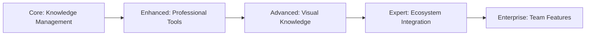

# Enhanced Memory: Realistic Vision & Roadmap

## 🎯 Current Reality Check

**Right now, you have something remarkable:**
- ✅ **50+ functional tools** (vs original's ~20)
- ✅ **Robust file filtering** preventing system crashes
- ✅ **Mermaid diagram integration** for visual knowledge
- ✅ **Professional export capabilities** (Pandoc, HTML, PDF)
- ✅ **Research orchestration** for guided workflows

**This isn't sci-fi** - it's a substantial improvement that serves real user needs.

## 📊 Where We Are vs Where We're Going

### **Current State: Solid Foundation**
```
┌─────────────────────────────────────────────────┐
│                ENHANCED MEMORY                  │
│  ┌─────────────────────────────────────────┐    │
│  │           CORE FEATURES                 │    │
│  │  • 50+ MCP Tools                        │    │
│  │  • File Filtering & Safety              │    │
│  │  • Mermaid Diagrams                     │    │
│  │  • Professional Export                  │    │
│  │  • Research Orchestration               │    │
│  └─────────────────────────────────────────┘    │
│                                                 │
│  🎯 Target: Professional Knowledge Management   │
└─────────────────────────────────────────────────┘
```

## 🚀 Realistic Roadmap (Grounded in Reality)

### **Phase 1: Stabilization & Refinement (Next 2-3 Weeks)**

#### **🔧 Core Improvements**
- **Performance optimization** - Faster sync, lower memory usage
- **Cross-platform testing** - Windows, macOS, Linux edge cases
- **Error handling refinement** - Better user feedback and recovery
- **Documentation completion** - Comprehensive user guides

#### **📦 Packaging & Distribution**
- **PyPI package** for easier installation (`pip install enhanced-memory-mcp`)
- **Homebrew formula** for macOS users
- **Docker optimization** for enterprise deployment
- **Installation wizards** for less technical users

#### **🧪 Quality Assurance**
- **Comprehensive test suite** expansion
- **Integration testing** across all tools
- **Performance benchmarking** and monitoring
- **User experience studies** and feedback collection

### **Phase 2: Strategic Expansion (Weeks 4-8)**

#### **🎨 Visual Knowledge Enhancement**
- **Enhanced Mermaid integration** - More diagram types, better rendering
- **Interactive diagrams** - Clickable elements, hover effects
- **Knowledge mapping** - Visual relationship browsers
- **Export format expansion** - More professional document types

#### **🤖 AI Integration Improvements**
- **Better context handling** - Smarter note relationships
- **Template system** - Reusable note structures
- **Workflow automation** - Guided knowledge building processes
- **Multi-language support** - International user base

#### **🔗 Ecosystem Integration**
- **Obsidian plugin** - Native integration with popular PKM tool
- **VS Code extension** - IDE-integrated knowledge management
- **Browser extension** - Web clipping and annotation
- **Mobile companion app** - On-the-go knowledge capture

### **Phase 3: Ecosystem Leadership (Weeks 9-12)**

#### **🏗️ Platform Development**
- **Plugin architecture** - Allow community tool development
- **API expansion** - Third-party integrations
- **Custom deployment options** - Enterprise and team features
- **Advanced security** - Encryption, access controls

#### **📚 Content & Education**
- **Comprehensive learning resources** - Video courses, tutorials
- **Community building** - Forums, user groups, conferences
- **Best practices documentation** - Real-world usage patterns
- **Case studies** - Success stories from different domains

## ⚖️ Strategic Decisions (Staying Grounded)

### **🎯 Focus Areas (What We Prioritize)**

#### **✅ High Impact, Achievable:**
- **Performance and reliability** - Core user experience
- **Cross-platform compatibility** - Broad accessibility
- **Professional export quality** - Real business value
- **Learning resources** - User success enablement

#### **❌ Lower Priority (For Now):**
- **Mobile apps** - Complex, resource intensive
- **Real-time collaboration** - Synchronization challenges
- **Advanced AI features** - Dependency on external services
- **Enterprise complexity** - Scope creep risk

### **📏 Scope Management**


**Strategy:** Deliver exceptional value at each level before advancing.

## 📈 Success Metrics (Measurable Goals)

### **Phase 1 Metrics:**
- **Performance**: < 5 second sync time for 1000+ files
- **Reliability**: < 1% crash rate in production
- **User adoption**: 100+ active users
- **Documentation**: 90% of tools documented

### **Phase 2 Metrics:**
- **Feature usage**: 70% of tools actively used
- **Export quality**: Professional document generation
- **Integration success**: 3 major tool integrations
- **Community growth**: 500+ users, active forums

### **Phase 3 Metrics:**
- **Ecosystem impact**: 1000+ users across integrations
- **Professional adoption**: Case studies from 5+ organizations
- **Sustainability**: Self-funding through donations/enterprise
- **Innovation**: Community-contributed tools and features

## 🛠️ Technical Architecture Evolution

### **Current Foundation:**
```
Enhanced Memory MCP
├── MCP Server (57+ tools)
├── File Operations (filtering, sanitization)
├── Knowledge Graph (SQLite backend)
├── Export System (Pandoc, HTML, Mermaid)
└── Import System (Obsidian, Joplin, etc.)
```

### **Phase 1 Additions:**
```
Enhanced Memory MCP
├── 🚀 Performance Layer (caching, optimization)
├── 📦 Distribution Layer (PyPI, Homebrew, Docker)
├── 🧪 Testing Layer (comprehensive test suite)
└── 📚 Documentation Layer (user guides, API docs)
```

### **Phase 2 Additions:**
```
Enhanced Memory MCP
├── 🎨 Visualization Layer (enhanced Mermaid, mind maps)
├── 🤖 AI Enhancement Layer (better context, templates)
├── 🔗 Integration Layer (Obsidian, VS Code, browser)
└── 🌍 Localization Layer (multi-language support)
```

## 💡 Market Positioning

### **🎯 Target Users (Realistic Segmentation):**

#### **Primary: Professional Knowledge Workers**
- **Researchers** - Academic and industry research workflows
- **Consultants** - Client deliverables and knowledge capture
- **Technical Writers** - Documentation and knowledge base management
- **Developers** - Code documentation and project knowledge

#### **Secondary: Advanced Personal Users**
- **Lifelong learners** - Structured learning and note-taking
- **Project managers** - Knowledge organization and retrieval
- **Writers and creators** - Research and ideation workflows

### **💰 Monetization Strategy (Sustainable Growth):**

#### **Phase 1: Foundation**
- **Open source** with donation/support options
- **Community building** and organic growth
- **Professional services** (consulting, training)

#### **Phase 2: Value Addition**
- **Enhanced features** for power users
- **Enterprise licensing** for organizations
- **Premium support** and customization

#### **Phase 3: Ecosystem Leadership**
- **Marketplace** for community tools
- **Certification programs** for users
- **Partnership integrations** with other tools

## 🎯 Recommended Timeline (AI-Accelerated)

### Days 1-3: Core Contributions
- Submit 4 focused PRs to original repo
- Get feedback and iterate
- Build maintainer relationship

### Days 4-7: Standalone Launch
- Create new repository structure
- Migrate enhanced codebase
- Update all branding and documentation

### Days 8-10: Community Engagement
- Announce enhanced edition
- Provide migration guidance
- Monitor community response

## 🚨 Risk Management

### **⚠️ Potential Pitfalls & Mitigation:**

#### **1. Scope Creep**
- **Risk**: Adding too many features dilutes focus
- **Mitigation**: Strict prioritization, feature freeze periods

#### **2. Technical Debt**
- **Risk**: Quick enhancements create maintenance burden
- **Mitigation**: Code reviews, refactoring sprints, documentation

#### **3. User Confusion**
- **Risk**: Too many options overwhelm users
- **Mitigation**: Progressive disclosure, clear upgrade paths

#### **4. Community Management**
- **Risk**: Rapid growth creates support challenges
- **Mitigation**: Community guidelines, moderator training, scalable support

## 🎯 The North Star (Achievable Vision)

### **3-Month Horizon (AI-Accelerated):**
```
┌─────────────────────────────────────────────────────────┐
│            ENHANCED MEMORY ECOSYSTEM                    │
│  ┌─────────────────────────────────────────────────┐    │
│  │         PROFESSIONAL KNOWLEDGE PLATFORM         │    │
│  │  • Enterprise-ready reliability & security      │    │
│  │  • Rich visual knowledge representation         │    │
│  │  • Deep ecosystem integrations                  │    │
│  │  • Active community of contributors            │    │
│  └─────────────────────────────────────────────────┘    │
│                                                         │
│  🎯 Mission: Most trusted knowledge management platform  │
└─────────────────────────────────────────────────────────┘
```

## ✨ Conclusion: Grounded Excellence

**This vision is ambitious but achievable** because it:
- ✅ **Builds on proven foundation** (your 50+ tools work today)
- ✅ **Solves real problems** (professional knowledge management)
- ✅ **Follows sustainable growth** (phase-based development)
- ✅ **Maintains quality focus** (no feature bloat)

**The goal isn't infinite features** - it's becoming the most trusted, reliable, and valuable knowledge management platform for professionals who depend on their knowledge for their livelihood.

---

*This roadmap focuses on achievable excellence rather than impossible dreams, ensuring Enhanced Memory becomes a sustainable, valuable tool for knowledge professionals.*
