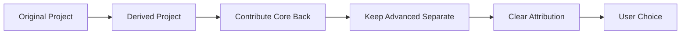
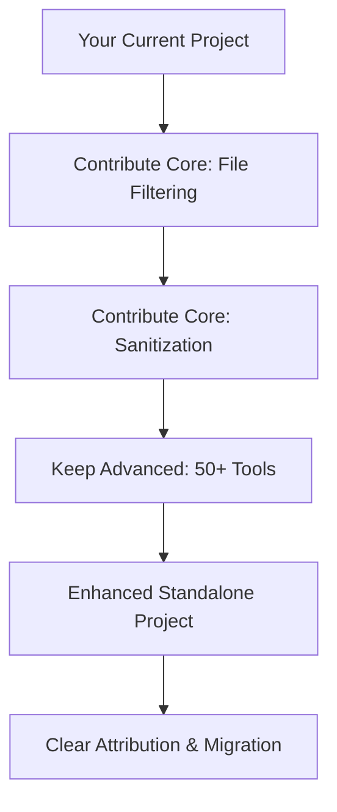

# Ethical Paths: Contributing vs Splitting Off

## 🎯 The Contribution Spectrum

Open source development exists on a spectrum between **pure contribution** and **complete independence**. Understanding where you fall on this spectrum is crucial for ethical development practices.

```
Pure Contribution ←─────────────────┬─────────────────→ Complete Independence
(Submit PRs only)                   Hybrid              (New standalone project)
                                 (Derived project)
```

## 📊 Decision Framework

### When to Contribute (Left Side)
**✅ Submit PRs when:**

- **Incremental improvements** (bug fixes, small features)
- **Universal benefits** (security, performance, accessibility)
- **Maintainer bandwidth** allows review of your changes
- **Your changes align** with project roadmap
- **Community consensus** supports your direction

**🚨 Red Flags for Pure Contribution:**
- Massive feature additions (50+ new capabilities)
- Fundamental architectural changes
- Direction conflicts with maintainer vision
- PR would overwhelm maintainers

### When to Go Independent (Right Side)
**✅ Create standalone when:**

- **Major new capabilities** that extend scope significantly
- **Different target audience** (professional vs casual users)
- **Conflicting visions** with original maintainers
- **Original project stagnation** (no development for years)
- **Innovation too large** for reasonable PR review

## 🤝 The Hybrid Approach (Sweet Spot)

### **Derived Project Strategy**
This is often the most ethical path for significant enhancements:



### **Implementation Steps:**

1. **Contribute Back Core Improvements**
   ```bash
   # Example: File filtering, sanitization, UTF-8 fixes
   git checkout -b feature/file-filtering
   # Make focused changes
   # Submit individual PRs
   ```

2. **Maintain Derived Project**
   ```bash
   # Keep massive toolkit features
   # Brand as "Enhanced Edition"
   # Clear attribution to original
   ```

3. **Provide User Choice**
   - Original project: Basic features
   - Derived project: Advanced capabilities
   - Clear migration path between them

## ⚖️ Ethical Considerations by Scale

### **Small Changes (< 10% enhancement)**
```
┌─────────────────────────────────────┐
│           SUBMIT PRs                │
│   • Bug fixes                       │
│   • Performance improvements        │
│   • Accessibility enhancements     │
│   • Documentation updates          │
└─────────────────────────────────────┘
```
**Ethical Imperative:** Contribute back - benefits everyone with minimal disruption

### **Medium Changes (10-50% enhancement)**
```
┌─────────────────────────────────────┐
│         HYBRID APPROACH             │
│   • Core improvements → PRs         │
│   • Major features → Derived project │
│   • Clear separation of concerns    │
└─────────────────────────────────────┘
```
**Ethical Balance:** Contribute what fits, maintain what extends scope

### **Large Changes (> 50% enhancement)**
```
┌─────────────────────────────────────┐
│       STANDALONE PROJECT            │
│   • Fundamental new capabilities    │
│   • Different target audience       │
│   • Independent roadmap             │
└─────────────────────────────────────┘
```
**Ethical Justification:** Original scope exceeded, new project warranted

## 🏛️ Legal & Attribution Requirements

### **Regardless of Path:**

#### **1. License Compliance**
- ✅ **Same license** as original (AGPL-3.0 compatibility)
- ✅ **No additional restrictions** beyond original terms
- ✅ **Proper copyright notices** maintained

#### **2. Attribution Standards**
- ✅ **README prominently states**: "Enhanced edition of [Original Project]"
- ✅ **Documentation references** original repository
- ✅ **Code comments** credit significant original algorithms
- ✅ **Package descriptions** clarify enhancement nature

#### **3. Transparency Requirements**
- ✅ **Clear feature comparison** (original vs enhanced)
- ✅ **Migration guides** for users switching versions
- ✅ **Changelog** shows contribution history

## 📈 Success Metrics for Each Path

### **Pure Contribution Success**
- **PR acceptance rate** > 80%
- **Maintainer engagement** (comments, collaboration)
- **Community adoption** of improvements
- **Long-term maintenance** by original project

### **Hybrid Approach Success**
- **Core PRs accepted** and merged
- **Derived project adoption** by target users
- **Positive maintainer relationship** maintained
- **Clear user understanding** of differences

### **Standalone Project Success**
- **Independent sustainability** (users, contributors)
- **Original project respect** maintained
- **Innovation preservation** (features not possible in original)
- **Community recognition** of value-add

## 🚨 Common Ethical Pitfalls

### **❌ Anti-Patterns to Avoid:**

1. **"Surprise Project"** - Creating standalone without attempting contribution
2. **"Claim Washing"** - Presenting derived project as completely original work
3. **"Abandonment"** - Leaving original contributors out of success story
4. **"Scope Creep"** - Gradually taking over original project direction

### **✅ Best Practices:**

1. **Start with Contribution** - Always attempt PRs first
2. **Document Attempts** - Keep records of contribution efforts
3. **Communicate Clearly** - Explain your enhancement rationale
4. **Maintain Relationships** - Keep original maintainers informed

## 🎯 Basic Memory Specific Analysis

### **Current Situation:**
- **Original**: Active development, LLM PRs, v15 planned
- **Your Project**: 50+ major enhancements, massive scope expansion
- **Overlap**: File filtering (.gitignore honoring) already discussed

### **Recommended Path:**


**Strategy:**
1. **Week 1**: Submit file filtering PR (addresses .gitignore issue)
2. **Week 2**: Submit other core improvement PRs
3. **Week 3-4**: Launch "Enhanced Memory MCP" as standalone
4. **Week 5+**: Community engagement and migration support

## 🏆 The Ethical Win-Win

### **For Original Project:**
- Gets valuable core improvements
- Maintains focus on core mission
- Benefits from enhanced ecosystem

### **For Your Project:**
- Preserves innovation and advanced features
- Gets proper recognition for enhancements
- Serves users needing advanced capabilities

### **For Community:**
- Choice between original and enhanced
- Both projects benefit from improvements
- Clear understanding of feature differences

---

**Conclusion:** The hybrid approach maximizes ethical compliance while preserving innovation. Start with contribution attempts, document the process, and maintain transparency throughout your enhancement journey.

*This guide ensures your development practices benefit both the original project and your innovations while maintaining the highest ethical standards.*


