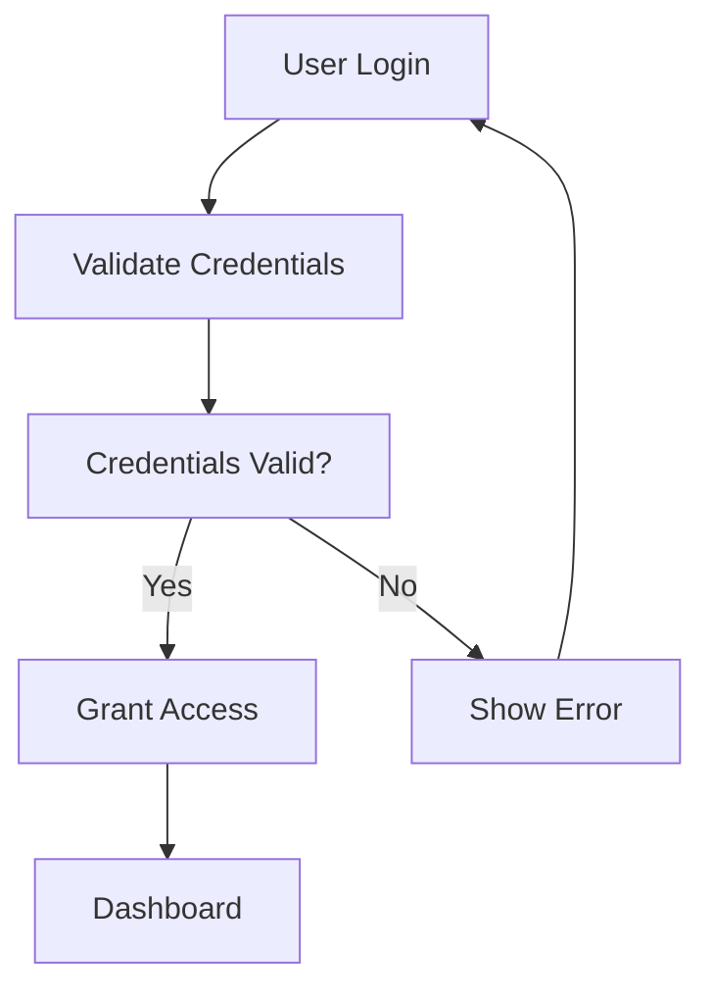

[](https://www.gnu.org/licenses/agpl-3.0)
[](https://badge.fury.io/py/basic-memory)
[](https://www.python.org/downloads/)
[](https://github.com/basicmachines-co/basic-memory/actions)
[](https://github.com/astral-sh/ruff)


[](https://smithery.ai/server/@basicmachines-co/basic-memory)

# Advanced Memory

**🚀 Independent Knowledge Management System with Enhanced Capabilities**

Advanced Memory lets you build persistent knowledge through natural conversations with Large Language Models (LLMs) like
Claude, while keeping everything in simple Markdown files on your computer. It uses the Model Context Protocol (MCP) to
enable any compatible LLM to read and write to your local knowledge base.

**Advanced Memory is an independent project derived from [Basic Memory](https://github.com/basicmachines-co/basic-memory) with significant enhancements and improvements. While inspired by the original work, it has evolved into a standalone solution with its own development roadmap and community.**

## 📊 Project Status

[](https://github.com/advanced-memory/advanced-memory/actions)
[](https://codecov.io/gh/advanced-memory/advanced-memory)
[](https://badge.fury.io/py/advanced-memory)
[](https://www.python.org/downloads/)
[](https://www.gnu.org/licenses/agpl-3.0)
[](https://github.com/astral-sh/ruff)


**Release Status:** 🚧 **1.0.0 Beta** - Feature complete, under active development and testing

📋 **[Product Requirements Document](PRD-1.0.0.md)** | 📝 **[Changelog](CHANGELOG.md)** | 🏗️ **[Development Status](https://github.com/advanced-memory/advanced-memory/projects)**

**Advanced Memory enhances the original concept with:**
- 🛡️ **Safer File Operations** - Prevents choking on node_modules, build artifacts, and large directories through intelligent filtering
- 🎨 **Mermaid diagram support** - Visual diagrams that render in HTML exports
- 🐧 **Pandoc export engine** - FREE CLI-based export to PDF, Word, HTML, and 40+ formats
- 📚 **Extended import/export** - Joplin, Docsify, Notion, Evernote, and enhanced HTML tools
- 🔍 **Enhanced search** - Better handling of special characters
- 📊 **Professional document generation** - Templates, TOC, syntax highlighting
- 📖 **PDF book creation** - Complete books with title pages and chapters
- ✏️ **FREE Notepad++ editing** - Professional markdown editing with syntax highlighting

- Website: https://basicmemory.com
- Company: https://basicmachines.co
- Documentation: https://memory.basicmachines.co
- Discord: https://discord.gg/tyvKNccgqN
- YouTube: https://www.youtube.com/@basicmachines-co

## Pick up your conversation right where you left off

- AI assistants can load context from local files in a new conversation
- Notes are saved locally as Markdown files in real time
- No project knowledge or special prompting required

https://github.com/user-attachments/assets/a55d8238-8dd0-454a-be4c-8860dbbd0ddc

## Quick Start

```bash
# Install with uv (recommended)
uv tool install advanced-memory

# or with Homebrew
brew tap advanced-memory/advanced-memory
brew install advanced-memory

# Configure Claude Desktop (edit ~/Library/Application Support/Claude/claude_desktop_config.json)
# Add this to your config:
{
  "mcpServers": {
    "advanced-memory": {
      "command": "uvx",
      "args": [
        "advanced-memory",
        "mcp"
      ]
    }
  }
}
# Now in Claude Desktop, you can:
# - Write notes with "Create a note about coffee brewing methods"
# - Read notes with "What do I know about pour over coffee?"
# - Search with "Find information about Ethiopian beans"

```

You can view shared context via files in `~/advanced-memory` (default directory location).

### Alternative Installation via Smithery

## Enhanced Version with Mermaid Diagrams & Extended Tools

This derived project includes significant enhancements including:
- **Mermaid diagram support** - Add visual diagrams to your notes that render in HTML exports
- **Typora integration** - Rich editing with round-trip workflow
- **Extended import/export** - Joplin, Docsify, and enhanced HTML export tools
- **Enhanced search** - Better handling of special characters and filename sanitization

### Installation Options

#### Standard Installation (Original)
You can use [Smithery](https://smithery.ai/server/@advanced-memory/advanced-memory) to automatically configure Advanced Memory for Claude Desktop:

```bash
npx -y @smithery/cli install @advanced-memory/advanced-memory --client claude
```

#### Enhanced Installation (This Derived Project)
To install this enhanced version with Mermaid diagrams and extended tools:

**Manual Installation (Latest Enhanced Version):**
Edit `~/Library/Application Support/Claude/claude_desktop_config.json` and add:

```json
{
  "mcpServers": {
    "advanced-memory": {
      "command": "uvx",
      "args": [
        "advanced-memory",
        "mcp"
      ]
    }
  }
}
```

**Alternative - Local Installation:**
```bash
# Clone this enhanced repository
git clone https://github.com/advanced-memory/advanced-memory.git
cd advanced-memory

# Install locally
pip install -e .

# Configure Claude Desktop to use local installation
# Edit ~/Library/Application Support/Claude/claude_desktop_config.json
{
  "mcpServers": {
    "advanced-memory": {
      "command": "python",
      "args": [
        "-m",
        "basic_memory.mcp.server"
      ]
    }
  }
}
```

**Smithery Installation:**
For Smithery users, you can install from this derived project:

```bash
npx -y @smithery/cli install @advanced-memory/advanced-memory --client claude
```

This installs and configures Advanced Memory without requiring manual edits to the Claude Desktop configuration file.

### Add to Cursor

Once you have installed Advanced Memory revisit this page for the 1-click installer for Cursor:

[](https://cursor.com/install-mcp?name=advanced-memory&config=eyJjb21tYW5kIjoidXZ4IiwiYXJncyI6WyJhZHZhbmNlZC1tZW1vcnkiLCJtY3AiXX0=)


### Glama.ai

<a href="https://glama.ai/mcp/servers/o90kttu9ym">
  
</a>

## Why Advanced Memory?

Most LLM interactions are ephemeral - you ask a question, get an answer, and everything is forgotten. Each conversation
starts fresh, without the context or knowledge from previous ones. Current workarounds have limitations:

- Chat histories capture conversations but aren't structured knowledge
- RAG systems can query documents but don't let LLMs write back
- Vector databases require complex setups and often live in the cloud
- Knowledge graphs typically need specialized tools to maintain

Advanced Memory addresses these problems with a simple approach: structured Markdown files that both humans and LLMs can
read
and write to. The key advantages:

- **Local-first:** All knowledge stays in files you control
- **Bi-directional:** Both you and the LLM read and write to the same files
- **Structured yet simple:** Uses familiar Markdown with semantic patterns
- **Traversable knowledge graph:** LLMs can follow links between topics
- **Standard formats:** Works with existing editors like Obsidian
- **Smart file filtering:** Automatically ignores common development directories (node_modules, __pycache__, etc.)
- **Lightweight infrastructure:** Just local files indexed in a local SQLite database

With Advanced Memory, you can:

- Have conversations that build on previous knowledge
- Create structured notes during natural conversations
- Have conversations with LLMs that remember what you've discussed before
- Navigate your knowledge graph semantically
- Keep everything local and under your control
- Use familiar tools like Obsidian to view and edit notes
- Build a personal knowledge base that grows over time
- Create visual diagrams with Mermaid for better knowledge representation

## File Filtering

Advanced Memory automatically ignores common development directories and files to improve performance and reduce noise. This is particularly important for:
- Node.js projects with large `node_modules` directories
- Projects with frequent build artifacts
- Development environments with log files that change often

### Ignored Patterns

#### Development Dependencies
- **Node.js**: `node_modules`
- **Python**: `__pycache__`, `.pytest_cache`, `.tox`, `venv`, `.venv`

#### Build Outputs
- `dist`, `build`, `target`, `out`, `.next`, `.nuxt`
- `*.o`, `*.obj`, `*.exe`, `*.dll`, `*.so`, `*.dylib`

#### Package Managers
- `vendor`, `packages`, `bower_components`
- `.gradle`, `.cargo`, `coverage`

#### Logs and Temporary Files
- `*.log`, `logs/`, `*.log.*`, `*.tmp`, `*.temp`
- `npm-debug.log*`, `yarn-debug.log*`, `yarn-error.log*`

#### IDE and Editor Files
- `.vscode/`, `.idea/`, `*.sublime-*`
- `.project`, `.classpath`, `.settings/`

#### System Files
- `.DS_Store`, `Thumbs.db`
- `desktop.ini`, `$RECYCLE.BIN/`

### Performance Impact
Filtering these files provides significant benefits:
- **Faster sync times** (especially initial sync)
- **Lower memory usage** (avoids processing large dependency trees)
- **Reduced disk I/O** (fewer files to watch and process)
- **Cleaner knowledge base** (focuses on source content, not build artifacts)

To customize these patterns, modify the `IGNORE_PATTERNS` set in the source code.

## Enhanced File Operations

**Advanced Memory significantly improves file handling performance and reliability:**

### Intelligent File Filtering
- **Automatic exclusion** of development dependencies (node_modules, __pycache__, etc.)
- **Build artifact filtering** (dist/, build/, target/, .next/, etc.)
- **Package manager directories** (vendor/, packages/, bower_components/)
- **Log file exclusion** (*.log, logs/, npm-debug.log*, etc.)
- **IDE file filtering** (.vscode/, .idea/, *.sublime-*)

### Performance Benefits
- **Faster sync times** - Especially important for initial project sync
- **Reduced memory usage** - Avoids processing large dependency trees
- **Lower disk I/O** - Fewer files to watch and process
- **Improved reliability** - Prevents timeouts on large codebases

### Developer-Friendly
- **Transparent operation** - Works automatically without configuration
- **Comprehensive coverage** - Handles all major development frameworks
- **Extensible patterns** - Easy to add custom exclusions
- **Cross-platform** - Works on Windows, macOS, and Linux

These enhancements were originally developed to address performance and reliability issues when working in development environments with large dependency trees, and have evolved into a comprehensive knowledge management solution.

## Mermaid Diagram Support

Advanced Memory supports Mermaid diagrams for creating visual representations of your knowledge. Add Mermaid code blocks to any note and they'll render automatically in HTML exports.

### Supported Diagram Types
- **Flowcharts** - Process flows, decision trees, workflows
- **Sequence diagrams** - API interactions, user journeys
- **Gantt charts** - Project timelines, task dependencies
- **Mind maps** - Knowledge organization, brainstorming
- **Entity relationship diagrams** - Data models, system architecture
- **State diagrams** - Process states, user flows
- **Pie charts** - Data visualization
- **And many more...**

### Example Usage

Add this to any note:

````markdown

````

Then export to HTML to see the rendered diagram:

```bash
await export_html_notes.fn(export_path="/path/to/html-export")
```

### Export Options

#### 🐧 **Recommended: Pandoc (FREE & Open Source)**
For professional document export, use the `export_pandoc` tool which provides:
- 40+ output formats (PDF, HTML, DOCX, LaTeX, EPUB, etc.)
- Batch processing of all notes
- Custom templates and styling
- Table of contents and syntax highlighting
- Completely automated CLI processing

```bash
# Export all notes as PDF
await export_pandoc.fn(export_path="/exports", format_type="pdf")

# Export as Word document with TOC
await export_pandoc.fn(export_path="/exports", format_type="docx", toc=True)
```

#### ✏️ **FREE Markdown Editing with Notepad++**
✅ **Completely FREE & Open Source Alternative**

Advanced Memory provides Notepad++ integration for professional markdown editing:
- Round-trip editing workflow (export → edit in Notepad++ → import back)
- Syntax highlighting for markdown
- Plugin ecosystem (MarkdownViewer, PreviewHTML, etc.)
- Lightweight and fast code editor
- Professional editing features

**Note:** Notepad++ is completely free and open source - no licensing costs!

See the [Mermaid Diagrams Guide](docs/mermaid-diagrams.md) for detailed documentation and examples.

## How It Works in Practice

Let's say you're exploring coffee brewing methods and want to capture your knowledge. Here's how it works:

1. Start by chatting normally:

```
I've been experimenting with different coffee brewing methods. Key things I've learned:

- Pour over gives more clarity in flavor than French press
- Water temperature is critical - around 205°F seems best
- Freshly ground beans make a huge difference
```

... continue conversation.

2. Ask the LLM to help structure this knowledge:

```
"Let's write a note about coffee brewing methods."
```

LLM creates a new Markdown file on your system (which you can see instantly in Obsidian or your editor):

```markdown
---
title: Coffee Brewing Methods
permalink: coffee-brewing-methods
tags:
- coffee
- brewing
---

# Coffee Brewing Methods

## Observations

- [method] Pour over provides more clarity and highlights subtle flavors
- [technique] Water temperature at 205°F (96°C) extracts optimal compounds
- [principle] Freshly ground beans preserve aromatics and flavor

## Relations

- relates_to [[Coffee Bean Origins]]
- requires [[Proper Grinding Technique]]
- affects [[Flavor Extraction]]
```

The note embeds semantic content and links to other topics via simple Markdown formatting.

3. You see this file on your computer in real time in the current project directory (default `~/$HOME/basic-memory`).

- Realtime sync is enabled by default starting with v0.12.0
- Project switching during conversations is supported starting with v0.13.0

4. In a chat with the LLM, you can reference a topic:

```
Look at `coffee-brewing-methods` for context about pour over coffee
```

The LLM can now build rich context from the knowledge graph. For example:

```
Following relation 'relates_to [[Coffee Bean Origins]]':
- Found information about Ethiopian Yirgacheffe
- Notes on Colombian beans' nutty profile
- Altitude effects on bean characteristics

Following relation 'requires [[Proper Grinding Technique]]':
- Burr vs. blade grinder comparisons
- Grind size recommendations for different methods
- Impact of consistent particle size on extraction
```

Each related document can lead to more context, building a rich semantic understanding of your knowledge base.

This creates a two-way flow where:

- Humans write and edit Markdown files
- LLMs read and write through the MCP protocol
- Sync keeps everything consistent
- All knowledge stays in local files.

## Technical Implementation

Under the hood, Advanced Memory:

1. Stores everything in Markdown files
2. Uses a SQLite database for searching and indexing
3. Extracts semantic meaning from simple Markdown patterns
    - Files become `Entity` objects
    - Each `Entity` can have `Observations`, or facts associated with it
    - `Relations` connect entities together to form the knowledge graph
4. Maintains the local knowledge graph derived from the files
5. Provides bidirectional synchronization between files and the knowledge graph
6. Implements the Model Context Protocol (MCP) for AI integration
7. Exposes tools that let AI assistants traverse and manipulate the knowledge graph
8. Uses memory:// URLs to reference entities across tools and conversations

The file format is just Markdown with some simple markup:

Each Markdown file has:

### Frontmatter

```markdown
title: <Entity title>
type: <The type of Entity> (e.g. note)
permalink: <a uri slug>

- <optional metadata> (such as tags)
```

### Observations

Observations are facts about a topic.
They can be added by creating a Markdown list with a special format that can reference a `category`, `tags` using a
"#" character, and an optional `context`.

Observation Markdown format:

```markdown
- [category] content #tag (optional context)
```

Examples of observations:

```markdown
- [method] Pour over extracts more floral notes than French press
- [tip] Grind size should be medium-fine for pour over #brewing
- [preference] Ethiopian beans have bright, fruity flavors (especially from Yirgacheffe)
- [fact] Lighter roasts generally contain more caffeine than dark roasts
- [experiment] Tried 1:15 coffee-to-water ratio with good results
- [resource] James Hoffman's V60 technique on YouTube is excellent
- [question] Does water temperature affect extraction of different compounds differently?
- [note] My favorite local shop uses a 30-second bloom time
```

### Relations

Relations are links to other topics. They define how entities connect in the knowledge graph.

Markdown format:

```markdown
- relation_type [[WikiLink]] (optional context)
```

Examples of relations:

```markdown
- pairs_well_with [[Chocolate Desserts]]
- grown_in [[Ethiopia]]
- contrasts_with [[Tea Brewing Methods]]
- requires [[Burr Grinder]]
- improves_with [[Fresh Beans]]
- relates_to [[Morning Routine]]
- inspired_by [[Japanese Coffee Culture]]
- documented_in [[Coffee Journal]]
```

## Using with VS Code
For one-click installation, click one of the install buttons below...

[](https://insiders.vscode.dev/redirect/mcp/install?name=advanced-memory&config=%7B%22command%22%3A%22uvx%22%2C%22args%22%3A%5B%22advanced-memory%22%2C%22mcp%22%5D%7D) [](https://insiders.vscode.dev/redirect/mcp/install?name=advanced-memory&config=%7B%22command%22%3A%22uvx%22%2C%22args%22%3A%5B%22advanced-memory%22%2C%22mcp%22%5D%7D&quality=insiders)

You can use Advanced Memory with VS Code to easily retrieve and store information while coding. Click the installation buttons above for one-click setup, or follow the manual installation instructions below.

### Manual Installation

Add the following JSON block to your User Settings (JSON) file in VS Code. You can do this by pressing `Ctrl + Shift + P` and typing `Preferences: Open User Settings (JSON)`.

```json
{
  "mcp": {
    "servers": {
      "advanced-memory": {
        "command": "uvx",
        "args": ["advanced-memory", "mcp"]
      }
    }
  }
}
```

Optionally, you can add it to a file called `.vscode/mcp.json` in your workspace. This will allow you to share the configuration with others.

```json
{
  "servers": {
    "advanced-memory": {
      "command": "uvx",
      "args": ["advanced-memory", "mcp"]
    }
  }
}
```

## Using with Claude Desktop

Advanced Memory is built using the MCP (Model Context Protocol) and works with the Claude desktop app (https://claude.ai/):

1. Configure Claude Desktop to use Advanced Memory:

Edit your MCP configuration file (usually located at `~/Library/Application Support/Claude/claude_desktop_config.json`
for OS X):

```json
{
  "mcpServers": {
    "advanced-memory": {
      "command": "uvx",
      "args": [
        "advanced-memory",
        "mcp"
      ]
    }
  }
}
```

If you want to use a specific project (see [Multiple Projects](docs/User%20Guide.md#multiple-projects)), update your
Claude Desktop
config:

```json
{
  "mcpServers": {
    "advanced-memory": {
      "command": "uvx",
      "args": [
        "advanced-memory",
        "--project",
        "your-project-name",
        "mcp"
      ]
    }
  }
}
```

2. Sync your knowledge:

Advanced Memory will sync the files in your project in real time if you make manual edits.

3. In Claude Desktop, the LLM can now use these tools:

```
write_note(title, content, folder, tags) - Create or update notes
read_note(identifier, page, page_size) - Read notes by title or permalink
edit_note(identifier, operation, content) - Edit notes incrementally (append, prepend, find/replace)
move_note(identifier, destination_path) - Move notes with database consistency
view_note(identifier) - Display notes as formatted artifacts for better readability
build_context(url, depth, timeframe) - Navigate knowledge graph via memory:// URLs
search_notes(query, page, page_size) - Search across your knowledge base
recent_activity(type, depth, timeframe) - Find recently updated information
canvas(nodes, edges, title, folder) - Generate knowledge visualizations
list_memory_projects() - List all available projects with status
switch_project(project_name) - Switch to different project context
get_current_project() - Show current project and statistics
create_memory_project(name, path, set_default) - Create new projects
delete_project(name) - Delete projects from configuration
set_default_project(name) - Set default project
sync_status() - Check file synchronization status

# Core Tools
write_note(title, content, folder, tags) - Create new notes with metadata
read_note(identifier, page, page_size, project) - Read notes by title/permalink
edit_note(identifier, content) - Update existing note content
delete_note(identifier) - Remove notes from knowledge base
search_notes(query, page, page_size, search_type, types, entity_types, after_date, project) - Full-text search with filters
list_directory(path, project) - Browse folder structure
recent_activity(timeframe, project) - View recent content changes

# System & Status Tools
sync_status(project) - Check file synchronization progress
status(level, focus) - Comprehensive system status and diagnostics
help(level, topic) - Detailed help and system information

# Import Tools
load_obsidian_vault(path, folder, convert_links) - Import Obsidian vaults
load_obsidian_canvas(path, folder) - Import Obsidian canvas files
load_joplin_vault(path, folder) - Import Joplin exports
load_notion_export(path, folder, preserve_hierarchy) - Import Notion HTML/Markdown exports
load_evernote_export(path, folder, preserve_notebooks) - Import Evernote ENEX exports

# Search Tools
search_obsidian_vault(path, query, type) - Search Obsidian vaults externally
search_joplin_vault(path, query, type) - Search Joplin exports externally
search_notion_vault(path, query, file_type) - Search Notion exports externally
search_evernote_vault(path, query, file_type) - Search Evernote ENEX/HTML exports

# Export Tools
export_pandoc(path, format, folder) - Export notes to multiple formats (PDF, HTML, DOCX, etc.) using Pandoc
make_pdf_book(title, folder, tag_filter) - Create professional PDF books with title page and TOC from notes 📖

# Archive Tools
export_to_archive(path, include_projects, exclude_projects, exclude_tags, since_date) - Create complete backup archive of entire Basic Memory system 📦
import_from_archive(path, restore_mode, backup_existing, dry_run) - Restore complete Basic Memory system from backup archive 📦

# Knowledge Operations
knowledge_operations(operation, filters, action, dry_run) - Swiss Army Knife for bulk operations, tag management, and content validation 🛠️

# Research Tools
research_orchestrator(operation, topic, topic_type, research_type) - AI-guided research planning and workflow orchestration 🧠
export_html_notes(path, folder) - Export notes to HTML with Mermaid support
export_joplin_notes(path, folder) - Export notes to Joplin format
export_notion_compatible(path, query, folder_filter) - Export notes to Notion-compatible format
export_evernote_compatible(path, query, folder_filter) - Export notes to Evernote ENEX format
export_docsify_enhanced(path, folder, enable_pagination, enable_toc, enable_theme_toggle) - Export notes to enhanced Docsify documentation site with advanced plugins 🚀

# Rich Editing Tools (FREE & Open Source)
edit_in_notepadpp(note_id, workspace) - Export note for Notepad++ editing ✅ FREE & Open Source
import_from_notepadpp(note_id, workspace) - Import edited note from Notepad++ ✅ FREE & Open Source
typora_control(operation, format, output_path, text) - Swiss Army Knife for Typora control via json_rpc plugin 🛠️

# Project Management
list_memory_projects() - View all configured projects
switch_project(name) - Change active project context
create_memory_project(name, path, set_default) - Create new project workspace
delete_project(name) - Remove project configuration
get_current_project() - Display current project information
set_default_project(name) - Set default project for new sessions
```

5. Example prompts to try:

```
"Create a note about our project architecture decisions"
"Find information about JWT authentication in my notes"
"Create a canvas visualization of my project components"
"Read my notes on the authentication system"
"What have I been working on in the past week?"
"Switch to my work-notes project"
"List all my available projects"
"Edit my coffee brewing note to add a new technique"
"Move my old meeting notes to the archive folder"
```

## Futher info

See the [Documentation](https://memory.advanced-memory.com/) for more info, including:

- [Complete User Guide](https://memory.advanced-memory.com/docs/user-guide)
- [CLI tools](https://memory.advanced-memory.com/docs/cli-reference)
- [Managing multiple Projects](https://memory.advanced-memory.com/docs/cli-reference#project)
- [Importing data from OpenAI/Claude Projects](https://memory.advanced-memory.com/docs/cli-reference#import)

## Installation Options

### Stable Release
```bash
pip install advanced-memory
```

### Beta/Pre-releases
```bash
pip install advanced-memory --pre
```

### Development Builds
Development versions are automatically published on every commit to main with versions like `0.12.4.dev26+468a22f`:
```bash
pip install advanced-memory --pre --force-reinstall
```

### Docker

Run Advanced Memory in a container with volume mounting for your Obsidian vault:

```bash
# Clone and start with Docker Compose
git clone https://github.com/advanced-memory/advanced-memory.git
cd advanced-memory

# Edit docker-compose.yml to point to your Obsidian vault
# Then start the container
docker-compose up -d
```

Or use Docker directly:
```bash
docker run -d \
  --name advanced-memory-server \
  -v /path/to/your/obsidian-vault:/data/knowledge:rw \
  -v advanced-memory-config:/root/.basic-memory:rw \
  ghcr.io/advanced-memory/advanced-memory:latest
```

See [Docker Setup Guide](docs/Docker.md) for detailed configuration options, multiple project setup, and integration examples.

## Acknowledgments

Advanced Memory is an independent project derived from the foundational work of [Basic Memory](https://github.com/basicmachines-co/basic-memory) created by Basic Machines. We extend our gratitude to the original authors for their pioneering work in building persistent knowledge systems through natural conversations with Large Language Models. While Advanced Memory has evolved into a standalone solution with its own development roadmap, we acknowledge the important role that Basic Memory played in inspiring this enhanced implementation.

## License

AGPL-3.0

Contributions are welcome. See the [Contributing](CONTRIBUTING.md) guide for info about setting up the project locally
and submitting PRs.

## Star History

<a href="https://www.star-history.com/#advanced-memory/advanced-memory&Date">
 <picture>
   <source media="(prefers-color-scheme: dark)" srcset="https://api.star-history.com/svg?repos=advanced-memory/advanced-memory&type=Date&theme=dark" />
   <source media="(prefers-color-scheme: light)" srcset="https://api.star-history.com/svg?repos=advanced-memory/advanced-memory&type=Date" />
   
 </picture>
</a>

Built with ♥️ by the Advanced Memory community, inspired by the original work by Basic Machines
