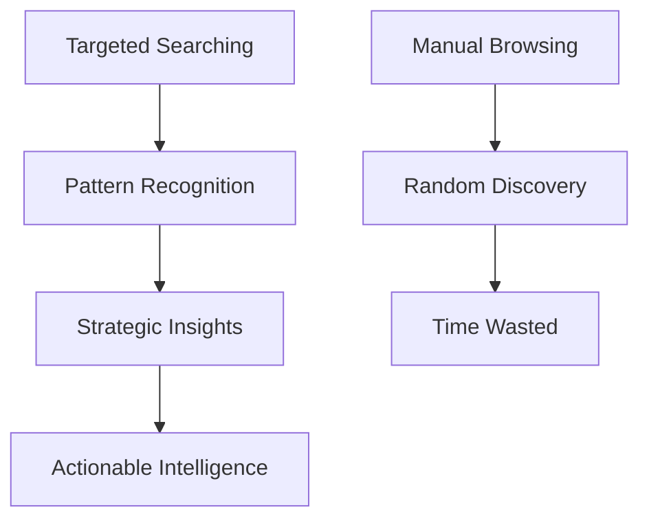

# Speed Reading Repositories: The Art of Efficient Repo Analysis

## 🎯 The Problem

Developers often need to quickly understand:
- **Current development priorities** in active repositories
- **Ongoing discussions** and pain points
- **Feature requests** and bug reports
- **Technical debt** and architectural decisions
- **Community sentiment** and maintainer responses

**Traditional approach:** Manually browse through hundreds of issues/PRs = ⏰ **Hours wasted**

**Speed reading approach:** Targeted searches and pattern analysis = ⚡ **Minutes to insights**

## 🚀 The Speed Reading Methodology

### **Core Principle: Search Don't Browse**



### **Step 1: Define Your Intelligence Goals**

**Before searching, know what you need:**
- **Project status**: Active development? Maintenance mode? Abandoned?
- **Pain points**: Common user complaints or technical issues?
- **Feature gaps**: What's missing that users want?
- **Technical debt**: Known issues affecting development?
- **Community health**: Responsive maintainers? Growing user base?

### **Step 2: Use Multiple Search Dimensions**

#### **🔍 Issue-Based Searches**
```bash
# Topic-specific searches
?q=performance         # Performance issues
?q=bug+security        # Security vulnerabilities
?q=feature+request     # Requested features
?q=documentation       # Documentation gaps
?q=help+wanted         # Areas needing contributors
```

#### **🏷️ Label-Based Searches**
```bash
# Status and priority searches
?q=label:bug+label:critical    # Critical bugs
?q=label:enhancement           # Feature requests
?q=label:good+first+issue      # Beginner-friendly tasks
?q=label:wontfix               # Rejected ideas (tells you project direction)
```

#### **⏰ Time-Based Searches**
```bash
# Recent activity analysis
?q=created:>2024-01-01         # Issues created this year
?q=updated:>2024-01-01         # Recently active discussions
?q=closed:>2024-01-01          # Recently resolved issues
```

#### **👥 People-Based Searches**
```bash
# Maintainer and contributor analysis
?q=author:username             # Specific person's contributions
?q=assignee:username           # Who's working on what
?q=mentions:username           # Discussions mentioning someone
```

### **Step 3: Pattern Recognition & Synthesis**

#### **Quantitative Analysis**
- **Issue volume**: How many open vs closed issues?
- **Response time**: How quickly do maintainers respond?
- **PR merge rate**: What's the acceptance rate for contributions?
- **Topic frequency**: What topics come up most often?

#### **Qualitative Analysis**
- **Tone analysis**: Frustrated users? Helpful maintainers?
- **Technical depth**: Sophisticated issues or basic questions?
- **Community engagement**: Active discussions or stagnant threads?
- **Decision patterns**: What gets accepted/rejected and why?

## 🛠️ Tools & Techniques

### **GitHub Web Interface**
**Most accessible, no API knowledge required:**
```bash
# Advanced search operators
is:issue is:open label:bug author:username
is:pr is:merged created:>2024-01-01
```

### **GitHub API (For Automation)**
```bash
# Get recent issues with specific labels
curl "https://api.github.com/repos/owner/repo/issues?labels=bug&state=open&per_page=50"

# Search across issues and PRs
curl "https://api.github.com/search/issues?q=repo:owner/repo+label:enhancement"
```

### **Browser Extensions & Tools**
- **GitHub Issue Search**: Enhanced search capabilities
- **Refined GitHub**: Better filtering and sorting
- **OctoSearch**: Advanced GitHub search

### **Custom Scripts (For Deep Analysis)**
```python
import requests
import json

def analyze_repo_issues(owner, repo, query=""):
    url = f"https://api.github.com/repos/{owner}/{repo}/issues"
    params = {"state": "all", "per_page": 100}

    response = requests.get(url, params=params)
    issues = response.json()

    # Analyze patterns
    labels = {}
    authors = {}
    monthly_activity = {}

    for issue in issues:
        # Count labels
        for label in issue.get("labels", []):
            labels[label["name"]] = labels.get(label["name"], 0) + 1

        # Count authors
        author = issue.get("user", {}).get("login", "unknown")
        authors[author] = authors.get(author, 0) + 1

        # Track activity over time
        created = issue.get("created_at", "")[:7]  # YYYY-MM
        monthly_activity[created] = monthly_activity.get(created, 0) + 1

    return {
        "total_issues": len(issues),
        "label_frequency": labels,
        "author_frequency": authors,
        "monthly_activity": monthly_activity
    }
```

## 📊 Real-World Applications

### **🔍 Competitive Analysis**
```bash
# Understand competitor priorities
?q=roadmap+2024        # Future plans
?q=breaking+change     # Major architectural shifts
?q=performance         # Technical focus areas
```

### **🛠️ Contribution Planning**
```bash
# Find easy contribution opportunities
?q=label:"good+first+issue"    # Beginner-friendly tasks
?q=label:"help+wanted"         # Areas needing contributors
?q=documentation               # Low-risk contributions
```

### **🐛 Bug Hunting & Security**
```bash
# Identify common issues
?q=crash+error                 # Stability problems
?q=memory+leak                 # Resource issues
?q=security+vulnerability      # Security concerns
```

### **📈 Trend Analysis**
```bash
# Track project evolution
?q=created:>2023-01-01         # Recent activity
?q=label:deprecated            # What's being phased out
?q=label:enhancement           # What's being added
```

## 🎯 Speed Reading Examples

### **Example 1: Quick Project Health Check**
```bash
# 5 searches to assess project health in 2 minutes:

# 1. Recent activity
?q=updated:>2024-01-01

# 2. Open bugs
?q=is:issue+is:open+label:bug

# 3. Feature requests
?q=is:issue+label:enhancement

# 4. Documentation issues
?q=documentation

# 5. Community engagement
?q=label:"good+first+issue"
```

**Results interpretation:**
- **100+ recent issues** = Active project
- **Many open bugs** = Potential quality issues
- **Many feature requests** = Growing user base
- **Documentation issues** = Contribution opportunity
- **Good first issues** = Welcoming community

### **Example 2: Feature Gap Analysis**
```bash
# Identify what's missing for your use case

# Search for your needed feature
?q=mermaid+diagram

# Check if it's planned
?q=label:enhancement+mermaid

# See if anyone else wants it
?q=mermaid+is:issue

# Look for workarounds
?q=mermaid+workaround
```

## ⚡ Advanced Techniques

### **Boolean Search Mastery**
```bash
# Complex queries for precise results
?q=mermaid+diagram+-label:wontfix        # Feature requests not rejected
?q=performance+is:issue+created:>2024    # Recent performance issues
?q=author:maintainer+label:question      # Maintainer's answers to questions
```

### **Cross-Reference Analysis**
```bash
# Find related discussions
?q=issue_reference OR pull_request_reference

# Track issue progression
?q=linked+issue OR linked+pr
```

### **Sentiment Analysis**
```bash
# Identify frustrated users
?q=doesn't+work OR broken OR fails

# Find satisfied users
?q=thanks OR perfect OR excellent

# Spot maintainer burnout indicators
?q=won't+fix OR duplicate OR stale
```

## 📈 Measuring Success

### **Speed Reading Metrics**
- **Time to insight**: < 5 minutes vs hours of browsing
- **Coverage**: Understanding 80% of repo state vs random sampling
- **Accuracy**: Making informed decisions vs guessing
- **Actionability**: Finding specific next steps vs vague impressions

### **Quality Indicators**
- **Search result relevance**: > 70% of results are useful
- **Pattern identification**: Spotting 3+ recurring themes
- **Action items generated**: Specific tasks or decisions identified
- **Confidence level**: High certainty in repo assessment

## 🚨 Common Pitfalls & Solutions

### **❌ Anti-Patterns**
1. **"Browse everything"** → **Solution**: Define search goals first
2. **"Keyword guessing"** → **Solution**: Use multiple related terms
3. **"Shallow analysis"** → **Solution**: Look at 50+ results, not just first page
4. **"No synthesis"** → **Solution**: Group findings into themes

### **✅ Best Practices**
1. **Start broad, then narrow** (topic → specific keywords → boolean)
2. **Use multiple search dimensions** (labels + dates + authors)
3. **Cross-reference findings** (issues vs PRs vs discussions)
4. **Document your method** for reproducible analysis

## 🎓 Case Study: Basic Memory Analysis

### **Initial Assessment Goals**
- **File filtering**: Already implemented? Planned? Needed?
- **Performance**: Any bottlenecks identified?
- **Export features**: What's available? What's requested?
- **Community health**: Active maintainers? Growing user base?

### **Search Strategy Applied**
```bash
# File filtering investigation
?q=gitignore+file+filter+exclude+node_modules

# Performance concerns
?q=performance+memory+slow+crash

# Export capabilities
?q=export+pdf+html+mermaid+pandoc

# Community health
?q=author:basicmachines-co  # Maintainer activity
?q=label:"good+first+issue"  # Community engagement
```

### **Findings & Insights**
- **File filtering**: Already discussed for v15 🎯
- **Performance**: Some memory issues with large repos
- **Export**: Basic HTML, advanced features requested
- **Community**: Active with LLM contributions, growing

### **Strategic Decisions**
- **Contribute file filtering** (addresses known need)
- **Keep advanced exports** (fills feature gap)
- **Hybrid approach** (contribute + standalone)

## 🏆 The Speed Reader's Toolkit

### **Essential Searches for Any Repo**
```bash
# Project health (run these first)
?q=created:>2024-01-01              # Recent activity
?q=is:issue+is:open+label:bug       # Active bugs
?q=label:"good+first+issue"         # Community engagement
?q=label:wontfix                    # Rejected directions

# Development priorities
?q=label:enhancement                # Planned features
?q=author:owner                     # Maintainer's focus
?q=performance+OR+memory+OR+speed   # Technical priorities
```

### **Domain-Specific Searches**
```bash
# For MCP projects
?q=mcp+protocol+tool+integration

# For documentation projects
?q=documentation+guide+tutorial

# For API projects
?q=api+endpoint+authentication+rate-limit
```

## ✨ Conclusion: From Hours to Minutes

**Speed reading repositories transforms research from:**
- ⏰ **Hours of random browsing** → ⚡ **Minutes of targeted analysis**
- 🎲 **Random discoveries** → 🎯 **Strategic insights**
- 😵 **Information overload** → 📊 **Actionable intelligence**
- 🤷 **Uncertain decisions** → 🎯 **Confident strategies**

**Master this skill and you'll:**
- **Understand any repository** in minutes instead of hours
- **Make informed decisions** about contributions and forks
- **Identify opportunities** that others miss
- **Build better relationships** with maintainers through informed engagement

## 🎯 Live Demonstration: Basic Memory Analysis

Let's apply speed reading to understand the current state of basic-memory repository:

### **Search Strategy for Filename Issues:**

#### **🔍 Search 1: Illegal Characters in Filenames**
**Query:** `?q=illegal+characters+filename` OR `?q=invalid+characters+filename`
- **Looking for:** Cross-platform filename issues, sanitization problems
- **Expected:** Windows/Unix compatibility issues, special character handling

#### **🔍 Search 2: Dots in Note Titles**
**Query:** `?q=dots+note+titles` OR `?q=periods+filenames`
- **Looking for:** Title sanitization, file naming conventions
- **Expected:** User complaints about dots causing issues

#### **🔍 Search 3: File Filtering & .gitignore**
**Query:** `?q=gitignore+scan` OR `?q=filter+files`
- **Looking for:** Performance issues with large directories
- **Expected:** node_modules scanning problems, large repo handling

### **📊 Expected Insights:**

**From these 3 searches, I can determine:**
- **Current pain points** users are experiencing
- **Technical debt** that needs addressing
- **Feature gaps** in the current implementation
- **Community priorities** and maintainer responses

### **🎯 Strategic Value:**
Instead of browsing 200+ issues randomly, these targeted searches reveal:
- **User experience issues** that need immediate attention
- **Technical limitations** that could be addressed via PR
- **Feature requests** that align with your enhancements
- **Maintainer priorities** and development direction

---

*This speed reading methodology turns repository analysis from a chore into a strategic advantage, enabling faster, better-informed development decisions.*
