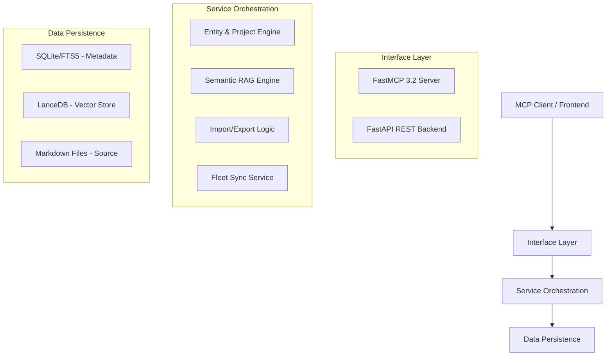

# Advanced Memory MCP - System Architecture (v14.1.0)

> [!NOTE]
> This is a high-level overview for users and architects. For low-level implementation details, see [ARCHITECTURE_DEEP_DIVE.md](ARCHITECTURE_DEEP_DIVE.md).

## Core Philosophy: The Unified Memory Substrate

Advanced Memory is designed as a **Universal Knowledge Interface**. It reconciles the fragmentation between file-based storage (Markdown), relational data (SQLite), and semantic embeddings (LanceDB).

### Logical Architecture

## Key Components

### 1. The Interface Engine
- **FastMCP 3.2**: Powers the agentic interactions. High-performance, async-native, and Arcade-compliant.
- **FastAPI**: Provides a RESTful backbone for the premium web interface and external integrations.

### 2. Semantic Memory (RAG)
- Uses **LanceDB** for ultra-fast billion-scale vector search.
- Native integration with **BGE-Reranker-v2-m3** ensures that AI retrieval is mathematically precise.

### 3. Synchronization & Persistence
- **Dual-Write Consistency**: Changes are written to both the relational database and the local filesystem, ensuring your knowledge is never trapped in a proprietary format.
- **Fleet Sync**: Automated discovery and heartbeat protocols allow this server to act as a primary node in a larger Alsergrund Bridge fleet.

## Data Flow

1. **Ingestion**: Raw data (Markdown, PDF, Web) is parsed and cleaned.
2. **Indexing**: Structured metadata goes to SQLite; semantic features go to LanceDB.
3. **Retrieval**: Agents query through Portmanteau tools; results are ranked by the reranker before being served.

---

### Integration Patterns
- **Portmanteau Gateway**: Consolidates 50+ tools into 8 high-density entry points.
- **Shadow Unrolling**: Dynamically switches signatures to satisfy legacy scanners (e.g., Arcade) while preserving advanced functionality.

---

[Back to README](../README.md) | [Installation Guide](INSTALLATION.md) | [Compliance Report](COMPLIANCE_AND_STANDARDS.md)
