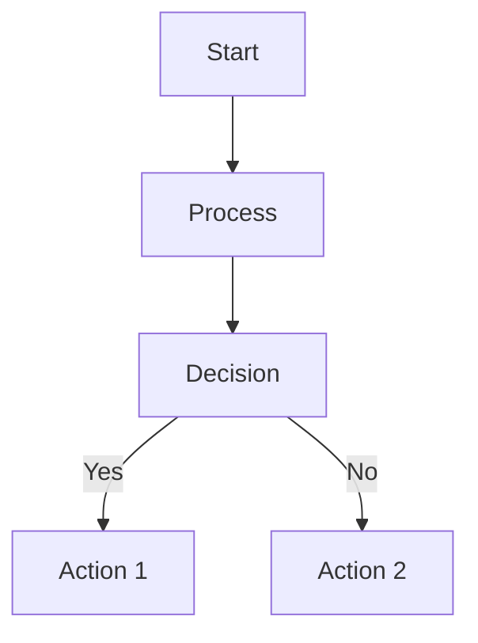
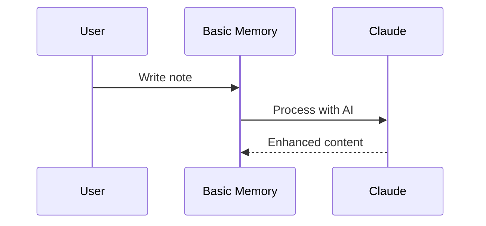
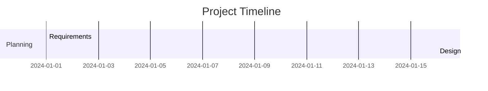
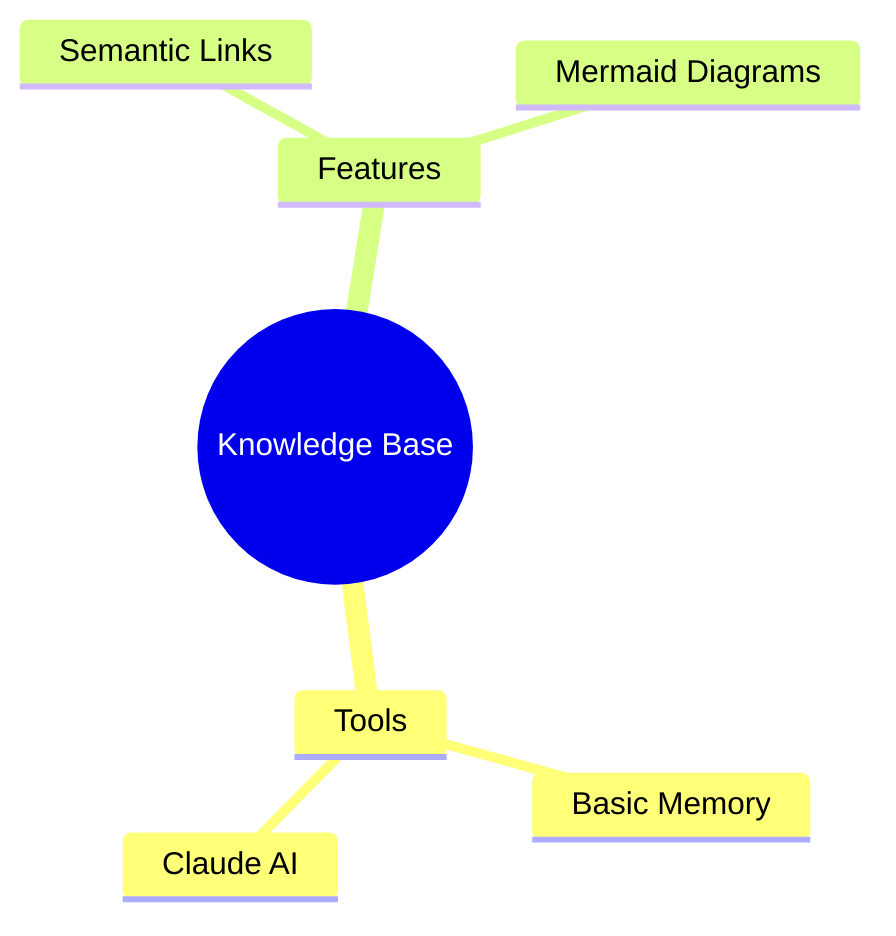
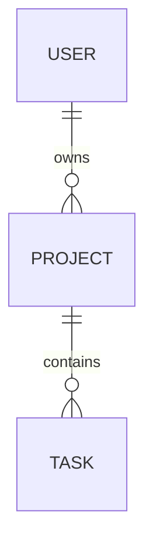

# Basic Memory Enhanced Components Guide

## Overview

This document provides comprehensive documentation for all the enhanced components added to Basic Memory, including integrations with external tools, rich editing capabilities, and advanced export features.

## Table of Contents

1. [Rich Editing Integration](#rich-editing-integration)
   - [Typora Integration](#typora-integration)
2. [Note Taker Integrations](#note-taker-integrations)
   - [Obsidian](#obsidian)
   - [Joplin](#joplin)
   - [Notion](#notion)
   - [Evernote](#evernote)
3. [Export Capabilities](#export-capabilities)
   - [HTML Export with Mermaid](#html-export-with-mermaid)
   - [Docsify Documentation Sites](#docsify-documentation-sites)
4. [Search & Discovery](#search--discovery)
5. [System Tools](#system-tools)
6. [Mermaid Diagrams](#mermaid-diagrams)
7. [Complete Tool Reference](#complete-tool-reference)

---

## Rich Editing Integration

### Typora Integration

Typora provides professional rich-text editing for markdown files with a WYSIWYG interface.

#### Core Features

**Round-trip editing workflow:**
- Export notes from Basic Memory for editing in Typora
- Edit with full visual formatting (tables, math, images)
- Import changes back while preserving metadata

#### Tools

**`edit_in_typora(identifier, workspace)`**
- Exports note to temporary Typora workspace
- Opens in Typora for professional editing
- Creates backup of original content

**`import_from_typora(identifier, workspace)`**
- Imports edited content back to Basic Memory
- Preserves all metadata and relationships
- Cleans up temporary files

#### Workflow Example

```python
# Export for editing
edit_in_typora("Meeting Notes", workspace="weekly-meetings")

# Edit in Typora with:
# - Visual table editing
# - Live preview
# - Professional formatting
# - Image insertion

# Import changes back
import_from_typora("Meeting Notes", workspace="weekly-meetings")
```

#### Benefits

- **Professional output**: WYSIWYG editing experience
- **Complex formatting**: Tables, math, advanced typography
- **Visual feedback**: Immediate preview of changes
- **Metadata preservation**: All Basic Memory properties maintained

---

## Note Taker Integrations

### Obsidian

**Primary Format**: Markdown files with wikilinks
**Secondary**: Canvas files (visual note boards)

#### Import Capabilities

**`load_obsidian_vault(path, folder, convert_links)`**
- Imports entire vault structure
- Converts `[[WikiLinks]]` to Basic Memory entity links
- Preserves frontmatter metadata
- Handles attachments and images

**`load_obsidian_canvas(path, folder)`**
- Imports visual canvas files
- Converts nodes to structured notes
- Preserves connections as relationships

#### Export Options

**Standard markdown export** compatible with Obsidian
**HTML export** with live Mermaid diagrams

#### Search Integration

**`search_obsidian_vault(path, query, file_type)`**
- Searches through external vaults
- Supports markdown and canvas files
- Filters by content type and metadata

#### Migration Strategy

```python
# Complete vault migration
load_obsidian_vault("my-vault", folder="obsidian-archive")

# Verify import
search_notes("obsidian-archive")

# Create enhanced versions
export_html_notes("obsidian-site")  # With Mermaid diagrams
```

### Joplin

**Primary Format**: JSON metadata + Markdown content
**Features**: Cross-platform, encrypted, web clipper

#### Import Capabilities

**`load_joplin_vault(path, folder)`**
- Imports Joplin exports with full metadata
- Preserves notebook hierarchy as folders
- Handles tags and note properties
- Supports rich content and attachments

#### Export Capabilities

**`export_joplin_notes(path, folder)`**
- Generates Joplin-compatible JSON + Markdown pairs
- Preserves folder structure as notebooks
- Includes metadata and relationships

#### Search Integration

**`search_joplin_vault(path, query, file_type)`**
- Searches metadata and content
- Filters by notebook and tags
- Supports both JSON and markdown files

#### Use Cases

- **Mobile access**: Export to Joplin for offline reading
- **Team sharing**: Cross-platform note distribution
- **Backup strategy**: Encrypted cloud synchronization

### Notion

**Primary Format**: HTML exports (comprehensive)
**Features**: Block-based editor, databases, collaboration

#### Import Capabilities

**`load_notion_export(path, preserve_hierarchy)`**
- Parses complex Notion HTML structure
- Converts blocks to clean markdown
- Preserves page hierarchy
- Handles databases and rich content

#### Export Capabilities

**`export_notion_compatible(path, notebook_name)`**
- Generates Notion-importable markdown
- Preserves entity relationships as links
- Includes frontmatter metadata

#### Content Conversion

**Notion blocks → Markdown:**
- Text blocks → Paragraphs
- Headings → Markdown headers
- Tables → Markdown tables
- Lists → Bullet/numbered lists
- Callouts → Blockquotes

#### Workflow

```python
# Import from Notion
load_notion_export("notion-export.zip", preserve_hierarchy=True)

# Enhance with AI
# Add semantic links, Mermaid diagrams

# Export enhanced version
export_notion_compatible("enhanced-notion/", notebook_name="Knowledge Base")
```

### Evernote

**Primary Format**: ENEX XML (Evernote's native export)
**Features**: Legacy notes, rich media, cross-platform

#### Import Capabilities

**`load_evernote_export(path, preserve_notebooks, include_attachments)`**
- Parses ENEX XML structure
- Converts HTML to clean markdown
- Preserves notebooks, tags, dates
- Extracts base64-encoded attachments

#### Export Capabilities

**`export_evernote_compatible(path, notebook_name)`**
- Generates valid ENEX XML
- Compatible with Evernote import
- Preserves metadata and relationships

#### Content Conversion

**Evernote HTML → Markdown:**
- Rich text → Standard formatting
- Lists/tables → Markdown equivalents
- Embedded images → File references
- Attachments → Extracted media files

#### Migration Use Cases

- **Legacy data access**: Import years of accumulated notes
- **Mobile continuity**: Use Evernote for capture, Basic Memory for processing
- **Cross-platform sync**: Maintain access across devices

---

## Export Capabilities

### HTML Export with Mermaid

**`export_html_notes(path, folder)`**
- Generates standalone HTML pages
- **Automatically renders Mermaid diagrams live**
- Includes navigation and styling
- Self-contained (no server required)

#### Features

- **Live diagram rendering**: Interactive flowcharts, mind maps, ER diagrams
- **Responsive design**: Works on all devices
- **Clean styling**: Professional presentation
- **Offline viewing**: No internet required

#### Use Cases

- **Documentation websites**: Standalone knowledge bases
- **Presentation materials**: Interactive diagrams
- **Sharing content**: Professional HTML output
- **Archival purposes**: Long-term preservation

### Docsify Documentation Sites

**`export_docsify(path, folder)`**
- Creates full Docsify documentation sites
- Generates navigation sidebar
- Includes search functionality
- Requires web server for full features

#### Generated Structure

```
docsify-site/
├── index.html          # Main Docsify page
├── _sidebar.md         # Navigation sidebar
├── README.md           # Homepage content
├── notes/
│   ├── note1.md
│   ├── note2.md
│   └── ...
└── .nojekyll          # GitHub Pages compatibility
```

#### Features

- **Full-text search**: Built-in search functionality
- **Responsive design**: Mobile-friendly interface
- **Theme support**: Multiple visual themes
- **Plugin ecosystem**: Extensible functionality

---

## Search & Discovery

### Core Search

**`search_notes(query, page, page_size, search_type, types, entity_types, after_date, project)`**
- Full-text search across all content
- Advanced filtering by type, date, project
- Boolean operators (AND, OR, NOT)
- Pagination support

#### Search Types

- `"text"`: Full content search (default)
- `"title"`: Title-only search
- `"permalink"`: Path-based search

#### Filtering Options

- **Content types**: notes, entities, observations
- **Entity categories**: person, project, concept
- **Date ranges**: relative ("7d") or absolute
- **Project scope**: Specific project or all projects

### External Vault Search

**Obsidian**: `search_obsidian_vault(path, query, file_type)`
**Joplin**: `search_joplin_vault(path, query, file_type)`
**Notion**: `search_notion_vault(path, query, file_type)`
**Evernote**: `search_evernote_vault(path, query, file_type)`

#### Features

- **Multiple file types**: Support for native formats
- **Content parsing**: Handles complex structures
- **Metadata filtering**: Tags, notebooks, dates
- **Context preservation**: Surrounding content in results

### Activity Tracking

**`recent_activity(timeframe, project)`**
- Shows recent content changes
- Filters by time period
- Tracks creation and modification dates

---

## System Tools

### Status Monitoring

**`status(level, focus)`** - Comprehensive system diagnostics

#### Status Levels

- **`"basic"`**: Core system status and sync information
- **`"intermediate"`**: Tool availability and configuration
- **`"advanced"`**: Performance metrics and resources
- **`"diagnostic"`**: Detailed troubleshooting information

#### Focus Areas

- **`"sync"`**: Synchronization status and progress
- **`"tools"`**: Tool availability and function
- **`"system"`**: System resources and performance
- **`"projects"`**: Project configuration and paths

### Synchronization

**`sync_status(project)`** - File synchronization monitoring

- **Current status**: Processing, completed, failed
- **Progress tracking**: Files processed vs total
- **Error reporting**: Detailed failure information
- **Project-specific**: Individual project status

### Help System

**`help(level, topic)`** - Multilevel documentation

#### Help Levels

- **`"basic"`**: Quick overview and getting started
- **`"intermediate"`**: Detailed tool descriptions
- **`"advanced"`**: Technical architecture details
- **`"expert"`**: Development and troubleshooting

#### Topic-Specific Help

- **`"semantic-net"`**: Knowledge graph and relationships
- **`"claude"`**: AI integration and interaction
- **`"tools"`**: Complete command reference
- **`"import"`**: Data import capabilities
- **`"export"`**: Data export capabilities
- **`"typora"`**: Rich editing integration
- **`"obsidian"`**: Obsidian vault integration
- **`"joplin"`**: Joplin export integration
- **`"notion"`**: Notion export integration
- **`"evernote"`**: Evernote ENEX integration
- **`"mermaid"`**: Diagram and visualization support

---

## Mermaid Diagrams

### Supported Types

#### Flowcharts


#### Sequence Diagrams


#### Gantt Charts


#### Mind Maps


#### ER Diagrams


### Integration

- **Automatic rendering** in HTML exports
- **CDN integration** for live diagrams
- **No configuration required**
- **Syntax highlighting** in markdown

### Use Cases

- **Knowledge mapping**: Visual relationship representation
- **Project planning**: Timeline and dependency visualization
- **System architecture**: Component interaction diagrams
- **Process documentation**: Workflow and procedure diagrams

---

## Complete Tool Reference

### Content Management (4 tools)
- `write_note()` - Create new notes with metadata
- `read_note()` - Read notes by title/permalink
- `edit_note()` - Update existing content
- `delete_note()` - Remove notes

### Search & Discovery (6 tools)
- `search_notes()` - Full-text search with filters
- `search_obsidian_vault()` - Search Obsidian exports
- `search_joplin_vault()` - Search Joplin exports
- `search_notion_vault()` - Search Notion exports
- `search_evernote_vault()` - Search Evernote exports
- `recent_activity()` - View recent changes

### Import Tools (4 tools)
- `load_obsidian_vault()` - Import Obsidian vaults
- `load_obsidian_canvas()` - Import Obsidian canvas files
- `load_joplin_vault()` - Import Joplin exports
- `load_notion_export()` - Import Notion HTML/Markdown
- `load_evernote_export()` - Import Evernote ENEX

### Export Tools (5 tools)
- `export_html_notes()` - HTML with Mermaid diagrams
- `export_docsify()` - Docsify documentation sites
- `export_joplin_notes()` - Joplin-compatible format
- `export_notion_compatible()` - Notion-compatible markdown
- `export_evernote_compatible()` - Evernote ENEX format

### Rich Editing (2 tools)
- `edit_in_typora()` - Export for Typora editing
- `import_from_typora()` - Import edited content

### Project Management (5 tools)
- `list_memory_projects()` - View all projects
- `switch_project()` - Change active project
- `create_memory_project()` - Create new project
- `delete_project()` - Remove project
- `get_current_project()` - Show current project

### System & Status (3 tools)
- `sync_status()` - Synchronization monitoring
- `status()` - Comprehensive diagnostics
- `help()` - Documentation and guidance

### Organization (3 tools)
- `list_directory()` - Browse folder structure
- `move_note()` - Move between folders
- `view_note()` - Alternative note reading

**Total: 31 tools** across 7 major categories

---

## Integration Workflows

### Complete Migration Workflow

1. **Import from source application**
   ```python
   # Choose appropriate importer
   load_obsidian_vault("vault/")
   # OR
   load_notion_export("export.zip")
   # OR
   load_evernote_export("notes.enex")
   ```

2. **Enhance content**
   - Add semantic links
   - Create Mermaid diagrams
   - Use AI assistance for content improvement

3. **Professional editing**
   ```python
   edit_in_typora("important-note")
   # Edit in Typora
   import_from_typora("important-note")
   ```

4. **Export enhanced versions**
   ```python
   export_html_notes("enhanced-site/")      # With diagrams
   export_docsify("documentation-site/")    # Full docs site
   export_joplin_notes("mobile-sync/")      # For mobile access
   ```

### Multi-Tool Ecosystem

Basic Memory serves as the **central knowledge hub**:

- **Obsidian/Joplin**: Daily note capture and linking
- **Notion**: Team collaboration and databases
- **Evernote**: Legacy access and mobile reading
- **Typora**: Professional content editing
- **Basic Memory**: AI-enhanced processing and relationships
- **HTML/Docsify**: Professional presentation and sharing

### Best Practices

1. **Choose primary tool** for content creation
2. **Use Basic Memory** for enhancement and AI features
3. **Export to secondary tools** for specific use cases
4. **Maintain sync** through regular export/import cycles
5. **Leverage strengths** of each tool in the ecosystem

---

## Technical Architecture

### Data Flow

```
External Tools → Import Tools → Basic Memory → Enhancement → Export Tools → External Tools
      ↓              ↓             ↓             ↓             ↓              ↓
   Raw Data → Processing → Storage → AI Enhancement → Formatting → Distribution
```

### Integration Points

- **File system**: Direct file access for imports/exports
- **MCP protocol**: Claude Desktop integration
- **Database**: SQLite for metadata and relationships
- **Search engine**: Full-text indexing and querying
- **Template system**: Structured export generation

### Performance Considerations

- **Batch processing**: Large imports handled efficiently
- **Memory management**: Streaming for large files
- **Caching**: Search results and metadata caching
- **Async operations**: Non-blocking I/O for all tools

### Security & Safety

- **Path validation**: Prevents directory traversal attacks
- **Input sanitization**: Safe filename generation
- **Permission checking**: File access validation
- **Error isolation**: Failures don't compromise system

---

## Getting Started

### Quick Start Checklist

- [ ] Install Basic Memory and dependencies
- [ ] Configure project workspace
- [ ] Import existing notes from preferred tool
- [ ] Explore semantic networking features
- [ ] Try Mermaid diagram creation
- [ ] Set up Typora integration
- [ ] Export to HTML or Docsify
- [ ] Configure Claude Desktop integration

### Learning Path

1. **Basic usage**: Core note operations
2. **Import/Export**: Data migration workflows
3. **Rich editing**: Typora integration
4. **Visual features**: Mermaid diagrams
5. **Advanced search**: Filtering and discovery
6. **System management**: Status and configuration
7. **Ecosystem integration**: Multi-tool workflows

### Resources

- **Tool reference**: Complete command documentation
- **Status monitoring**: System health and diagnostics
- **Help system**: Contextual guidance and examples
- **Integration guides**: Detailed workflow documentation

This enhanced Basic Memory provides a comprehensive knowledge management ecosystem that combines the best features of modern note-taking tools with AI-powered enhancement and professional presentation capabilities.
