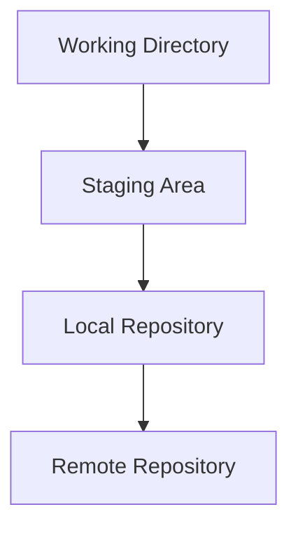

# Zettelmaker Master Plan - Complete Implementation

**Version:** 1.0  
**Created:** October 16, 2025  
**Status:** Planning Phase  
**Owner:** Sandra Schi

## Vision

Transform Advanced Memory's zettelmaker from a static template system into an intelligent, AI-powered knowledge scaffolding platform that adapts to users' needs, generates content dynamically, and builds a community marketplace of knowledge templates.

## Executive Summary

The Zettelmaker Master Plan encompasses five major enhancements:
1. **MCP Tool Integration** - Claude-native zettelkasten generation
2. **Dynamic Template Generation** - AI-powered template creation
3. **Template Enhancement** - Expanded categories and deeper content
4. **Smart Onboarding** - Personalized based on existing knowledge
5. **Template Marketplace** - Community-driven template sharing

**Timeline:** 6-8 weeks  
**Impact:** Revolutionary knowledge scaffolding for all users  
**Dependencies:** FastMCP 2.12+, OpenAI/Claude API for generation

---

## Phase 1: MCP Tool Integration (Week 1-2)

### Objective
Create `adn_zettelmaker` portmanteau tool for Claude-native zettelkasten generation.

### Features

#### 1.1 Core Operations
```python
@mcp.tool()
async def adn_zettelmaker(operation: str, **kwargs) -> str:
    """Intelligent zettelkasten generation and management.
    
    SUPPORTED OPERATIONS:
    - generate: Generate notes from templates
    - customize: Customize existing templates
    - expand: Extend existing notes with new topics
    - suggest: AI-suggested topics based on current notes
    - connect: Auto-create relationships between notes
    - analyze: Analyze knowledge gaps and suggest templates
    """
```

#### 1.2 Generate Operation
```python
# Generate from existing templates
adn_zettelmaker("generate", 
    category="developer",
    topic="python-core",
    project="main")

# Generate with customization
adn_zettelmaker("generate",
    category="developer", 
    topic="async-python",
    depth=3,  # 3 levels of interconnected notes
    include_examples=True,
    include_exercises=True)
```

#### 1.3 Customize Operation
```python
# Customize template before generation
adn_zettelmaker("customize",
    template="python-fundamentals",
    modifications={
        "focus_areas": ["type hints", "async/await"],
        "skip_sections": ["basic syntax"],
        "add_sections": ["advanced patterns"]
    })
```

#### 1.4 Expand Operation
```python
# Expand existing note
adn_zettelmaker("expand",
    existing_note="Python Fundamentals",
    add_topics=["metaclasses", "decorators", "context managers"],
    create_linked_notes=True)
```

#### 1.5 Suggest Operation
```python
# AI-suggested topics
adn_zettelmaker("suggest",
    based_on="recent activity",  # or "existing notes", "knowledge gaps"
    category="developer",
    limit=5)
```

#### 1.6 Connect Operation
```python
# Auto-create relationships
adn_zettelmaker("connect",
    notes=["Python Fundamentals", "Async Programming", "FastAPI"],
    relationship_types=["builds_on", "related_to", "uses"],
    create_linking_notes=True)  # Create bridge notes if helpful
```

#### 1.7 Analyze Operation
```python
# Analyze knowledge gaps
adn_zettelmaker("analyze",
    focus="developer",
    identify="gaps",  # or "clusters", "orphans", "highly_connected"
    suggest_templates=True)
```

### Implementation Tasks

- [ ] Create `src/advanced_memory/mcp/tools/zettelmaker.py`
- [ ] Implement operation routing for 7 operations
- [ ] Add API endpoints for zettelmaker operations
- [ ] Create service layer for template management
- [ ] Add tests for all operations
- [ ] Document in portmanteau tools reference

### Success Metrics
- All 7 operations working in Claude Desktop
- <500ms response time for template generation
- 100% test coverage for core operations

---

## Phase 2: Dynamic Template Generation (Week 2-3)

### Objective
Enable AI-powered template generation for any topic, not just static templates.

### Features

#### 2.1 AI Template Generator
```python
# Generate templates for any topic
adn_zettelmaker("generate",
    topic="Rust Programming",
    category="developer",
    ai_generate=True,
    depth=3,
    quality="comprehensive")
```

#### 2.2 Template Quality Levels
- **Quick**: 3-5 basic notes, essential concepts only
- **Standard**: 8-12 notes, good coverage with examples
- **Comprehensive**: 15-20 notes, deep coverage with exercises
- **Expert**: 25+ notes, expert-level depth with advanced topics

#### 2.3 Dynamic Structure
```python
{
    "topic": "Rust Programming",
    "structure": {
        "fundamentals": ["ownership", "borrowing", "lifetimes"],
        "intermediate": ["traits", "generics", "error_handling"],
        "advanced": ["unsafe", "macros", "async"],
        "ecosystem": ["cargo", "testing", "documentation"]
    }
}
```

#### 2.4 AI Prompt Engineering
```markdown
System: You are a zettelkasten expert creating interconnected notes.

Generate a comprehensive zettelkasten template for {topic} in the {category} category.

Requirements:
1. Create {depth} levels of interconnected notes
2. Include {quality} level of detail
3. Add [[WikiLinks]] between related concepts
4. Include practical examples and code snippets
5. Add observations with [category] prefixes
6. Add relations with relation_type [[Target]]

Template structure:
- Core concepts (foundational notes)
- Intermediate topics (building on fundamentals)
- Advanced topics (expert-level content)
- Practical applications (real-world examples)
- Related resources (further reading)

Format each note as markdown with frontmatter.
```

#### 2.5 Template Caching
```python
# Cache generated templates for reuse
class TemplateCache:
    def store(self, topic: str, template: dict) -> str:
        """Store generated template for future use."""
        
    def retrieve(self, topic: str) -> dict | None:
        """Retrieve cached template."""
        
    def search(self, query: str) -> List[dict]:
        """Search cached templates."""
```

### Implementation Tasks

- [ ] Integrate OpenAI/Claude API for template generation
- [ ] Create prompt templates for different quality levels
- [ ] Implement template caching system
- [ ] Add quality validation for generated templates
- [ ] Create template refinement feedback loop
- [ ] Add cost estimation and token usage tracking

### Success Metrics
- Generate high-quality templates for any topic
- 90%+ user satisfaction with generated content
- <30 seconds for standard template generation
- Template cache hit rate >60%

---

## Phase 3: Template Enhancement (Week 3-4)

### Objective
Expand template library with new categories and deeper content.

### New Categories

#### 3.1 DevOps Engineer
```
Topics:
- Container orchestration (Docker, Kubernetes)
- CI/CD pipelines (GitHub Actions, Jenkins, GitLab CI)
- Infrastructure as Code (Terraform, Ansible)
- Monitoring & observability (Prometheus, Grafana)
- Cloud platforms (AWS, Azure, GCP)
- Security & compliance
```

#### 3.2 Data Scientist
```
Topics:
- Statistical analysis
- Machine learning fundamentals
- Deep learning frameworks (PyTorch, TensorFlow)
- Data visualization (matplotlib, seaborn, plotly)
- Feature engineering
- Model evaluation & deployment
```

#### 3.3 UI/UX Designer
```
Topics:
- Design principles (typography, color, layout)
- User research methods
- Wireframing & prototyping
- Design systems
- Accessibility (WCAG, ARIA)
- Tools (Figma, Sketch, Adobe XD)
```

#### 3.4 Product Manager
```
Topics:
- Product strategy
- User stories & requirements
- Roadmap planning
- Metrics & analytics
- Stakeholder management
- Agile methodologies
```

#### 3.5 Entrepreneur
```
Topics:
- Business model canvas
- Market research
- Fundraising strategies
- Growth hacking
- Team building
- Financial management
```

#### 3.6 Creative Professional
```
Topics:
- Photography fundamentals
- Video production
- Audio engineering
- Graphic design
- Content creation
- Portfolio building
```

### Content Enhancements

#### 3.7 Mermaid Diagrams
Add visual diagrams to templates:
```markdown
## Git Workflow


```

#### 3.8 Interactive Examples
```markdown
## Python List Comprehension

### Exercise
Create a list comprehension that filters even numbers:
```python
# Your solution here
numbers = [1, 2, 3, 4, 5, 6, 7, 8, 9, 10]
evens = [n for n in numbers if n % 2 == 0]
```

### Explanation
[[Continue reading...]]
```

#### 3.9 Progressive Difficulty
```markdown
## Learning Path: Python Functions

- [[Functions - Beginner]] (Basic syntax)
- [[Functions - Intermediate]] (Decorators, closures)
- [[Functions - Advanced]] (Metaclasses, descriptors)
```

### Implementation Tasks

- [ ] Create 6 new category modules (100+ templates each)
- [ ] Add mermaid diagram support to templates
- [ ] Create progressive learning paths
- [ ] Add exercises and interactive elements
- [ ] Cross-link templates across categories
- [ ] Create visual knowledge maps

### Success Metrics
- 600+ total templates across 10 categories
- Each category has 15+ interconnected notes
- 100% of templates include examples
- All templates have 3+ cross-category links

---

## Phase 4: Smart Onboarding (Week 4-5)

### Objective
Personalize onboarding based on user's existing knowledge base and interests.

### Features

#### 4.1 Knowledge Analysis
```python
async def analyze_existing_knowledge(project: str) -> dict:
    """Analyze user's existing notes to determine interests and gaps."""
    
    analysis = {
        "topics": ["Python", "Git", "Testing"],  # Detected topics
        "skill_level": "intermediate",  # Inferred from content
        "gaps": ["async programming", "type hints"],  # Missing topics
        "interests": ["web development", "API design"],  # Based on content
        "learning_style": "practical",  # Code-heavy vs theory-heavy
    }
    
    return analysis
```

#### 4.2 Personalized Recommendations
```python
adn_zettelmaker("suggest",
    based_on="existing_notes",
    analyze_gaps=True,
    match_style=True)

# Returns:
{
    "recommended_templates": [
        {"topic": "FastAPI Fundamentals", "reason": "You have Python notes but no web framework coverage"},
        {"topic": "Async Python", "reason": "Knowledge gap detected in your Python notes"},
        {"topic": "API Testing", "reason": "Complements your existing testing notes"}
    ],
    "learning_paths": [
        ["Python Fundamentals", "Async Python", "FastAPI", "API Testing"]
    ]
}
```

#### 4.3 Adaptive Onboarding
```python
@onboard_app.command("smart")
def smart_onboarding():
    """AI-powered personalized onboarding."""
    
    # 1. Analyze existing knowledge
    # 2. Detect skill level and interests
    # 3. Identify knowledge gaps
    # 4. Suggest personalized templates
    # 5. Create custom learning path
    # 6. Generate tailored content
```

#### 4.4 Progressive Disclosure
```python
# Start with fundamentals, unlock advanced content progressively
{
    "unlocked": ["Python Fundamentals", "Git Basics"],
    "locked_until_ready": ["Metaclasses", "Advanced Git Workflows"],
    "suggested_next": ["Functions", "Control Flow"]
}
```

#### 4.5 Learning Velocity Tracking
```python
# Track user's learning velocity
{
    "notes_created_per_week": 12,
    "topics_covered": 8,
    "average_note_depth": "intermediate",
    "suggested_pace": "You're ready for advanced topics!"
}
```

### Implementation Tasks

- [ ] Create knowledge analyzer service
- [ ] Implement skill level detection algorithm
- [ ] Build gap analysis engine
- [ ] Create recommendation engine
- [ ] Implement adaptive onboarding wizard
- [ ] Add learning velocity tracking

### Success Metrics
- 95% accurate skill level detection
- 80% of recommendations rated as "helpful"
- Reduce time to first valuable note by 50%
- Increase template adoption rate by 3x

---

## Phase 5: Template Marketplace (Week 5-8)

### Objective
Create a community marketplace for sharing and discovering zettelkasten templates.

### Features

#### 5.1 Template Packaging
```python
# Package template for sharing
adn_zettelmaker("package",
    templates=["python-fundamentals", "git-basics"],
    name="Python Developer Starter Pack",
    description="Essential Python and Git templates for beginners",
    tags=["python", "git", "beginner"],
    author="sandra",
    license="CC-BY-4.0")
```

#### 5.2 Template Metadata
```yaml
---
name: Python Developer Starter Pack
version: 1.0.0
author: sandra
description: Essential Python and Git templates for beginners
tags: [python, git, beginner]
license: CC-BY-4.0
created: 2025-10-16
updated: 2025-10-16
downloads: 142
rating: 4.8
templates:
  - python-fundamentals
  - git-basics
  - testing-fundamentals
dependencies:
  - basic-programming-concepts
compatible_with:
  - advanced-memory-mcp >= 1.0.0
---
```

#### 5.3 Marketplace Discovery
```python
# Search marketplace
adn_zettelmaker("marketplace",
    operation="search",
    query="python",
    category="developer",
    rating_min=4.0,
    sort_by="popular")

# Browse categories
adn_zettelmaker("marketplace",
    operation="browse",
    category="developer",
    subcategory="web-development")

# Get recommendations
adn_zettelmaker("marketplace",
    operation="recommend",
    based_on="my_notes")
```

#### 5.4 Template Installation
```python
# Install template pack
adn_zettelmaker("marketplace",
    operation="install",
    package="python-developer-starter-pack",
    author="sandra",
    version="1.0.0",
    customize=True)  # Allow customization before install
```

#### 5.5 Community Features
```python
# Rate and review
adn_zettelmaker("marketplace",
    operation="review",
    package="python-developer-starter-pack",
    rating=5,
    comment="Excellent templates for beginners!")

# Share your own
adn_zettelmaker("marketplace",
    operation="publish",
    package_path="~/my-templates/",
    visibility="public")  # or "private", "unlisted"
```

#### 5.6 Template Collections
```python
# Curated collections
{
    "name": "Complete Web Developer Path",
    "description": "Frontend to backend to deployment",
    "packages": [
        "html-css-fundamentals",
        "javascript-mastery",
        "react-essentials",
        "node-backend",
        "database-design",
        "devops-basics"
    ],
    "learning_order": "sequential",
    "estimated_time": "3 months"
}
```

### Implementation Tasks

- [ ] Design template package format
- [ ] Create marketplace API (search, install, publish)
- [ ] Build template registry database
- [ ] Implement rating and review system
- [ ] Create template validation and security checks
- [ ] Build marketplace web interface
- [ ] Add template versioning and updates
- [ ] Create collection curation tools

### Success Metrics
- 100+ community-contributed template packs
- 1000+ template installations in first month
- Average rating >4.5 stars
- <5 minutes from discovery to installation

---

## Technical Architecture

### System Components

```
┌─────────────────────────────────────────────────────────────┐
│                    Zettelmaker System                       │
├─────────────────────────────────────────────────────────────┤
│  MCP Tool Layer (adn_zettelmaker)                          │
│  ┌──────────┬──────────┬──────────┬──────────┬──────────┐  │
│  │ Generate │ Customize│  Expand  │ Suggest  │ Connect  │  │
│  └──────────┴──────────┴──────────┴──────────┴──────────┘  │
├─────────────────────────────────────────────────────────────┤
│  Service Layer                                              │
│  ┌──────────────┬──────────────┬──────────────┐           │
│  │ Template     │ AI Generator │ Knowledge    │           │
│  │ Manager      │ Service      │ Analyzer     │           │
│  └──────────────┴──────────────┴──────────────┘           │
├─────────────────────────────────────────────────────────────┤
│  Data Layer                                                 │
│  ┌──────────────┬──────────────┬──────────────┐           │
│  │ Template     │ Marketplace  │ User         │           │
│  │ Repository   │ Registry     │ Analytics    │           │
│  └──────────────┴──────────────┴──────────────┘           │
└─────────────────────────────────────────────────────────────┘
```

### Database Schema

```sql
-- Template packages
CREATE TABLE template_package (
    id INTEGER PRIMARY KEY,
    name TEXT UNIQUE NOT NULL,
    version TEXT NOT NULL,
    author TEXT NOT NULL,
    description TEXT,
    tags TEXT,  -- JSON array
    license TEXT,
    downloads INTEGER DEFAULT 0,
    rating REAL DEFAULT 0.0,
    created_at TIMESTAMP,
    updated_at TIMESTAMP
);

-- Template reviews
CREATE TABLE template_review (
    id INTEGER PRIMARY KEY,
    package_id INTEGER NOT NULL,
    user_id TEXT NOT NULL,
    rating INTEGER NOT NULL,
    comment TEXT,
    created_at TIMESTAMP,
    FOREIGN KEY (package_id) REFERENCES template_package(id)
);

-- User analytics
CREATE TABLE user_knowledge_profile (
    id INTEGER PRIMARY KEY,
    user_id TEXT UNIQUE NOT NULL,
    topics TEXT,  -- JSON array
    skill_level TEXT,
    learning_velocity REAL,
    last_analyzed TIMESTAMP
);
```

---

## Development Roadmap

### Week 1: MCP Tool Foundation
- [ ] Create `adn_zettelmaker` tool structure
- [ ] Implement basic generate operation
- [ ] Add tests and documentation
- [ ] Deploy to test environment

### Week 2: Core Operations
- [ ] Complete all 7 operations
- [ ] API endpoint integration
- [ ] Service layer implementation
- [ ] End-to-end testing

### Week 3: AI Integration
- [ ] Integrate AI template generator
- [ ] Build prompt templates
- [ ] Implement caching system
- [ ] Quality validation

### Week 4: Template Expansion
- [ ] Create 3 new categories (DevOps, Data Science, UI/UX)
- [ ] Add 150+ new templates
- [ ] Enhance existing templates with diagrams
- [ ] Cross-category linking

### Week 5: Smart Features
- [ ] Knowledge analyzer implementation
- [ ] Skill detection algorithm
- [ ] Recommendation engine
- [ ] Adaptive onboarding

### Week 6: Marketplace Foundation
- [ ] Template package format
- [ ] Marketplace API design
- [ ] Registry database setup
- [ ] Basic search and install

### Week 7: Marketplace Features
- [ ] Rating and review system
- [ ] Publishing workflow
- [ ] Security and validation
- [ ] Collection curation

### Week 8: Polish and Launch
- [ ] UI/UX refinements
- [ ] Performance optimization
- [ ] Documentation completion
- [ ] Marketing and launch

---

## Success Metrics

### User Adoption
- **Target:** 80% of new users complete onboarding
- **Target:** 50% of users create custom templates
- **Target:** 1000+ marketplace template downloads/month

### Quality Metrics
- **Target:** 95% template generation success rate
- **Target:** 4.5+ average template rating
- **Target:** <30 seconds average template generation time

### Engagement Metrics
- **Target:** 10+ notes created per user per week
- **Target:** 60% of users return to create more notes
- **Target:** 3x increase in knowledge graph interconnectedness

### Community Growth
- **Target:** 100+ community contributors
- **Target:** 500+ published template packs
- **Target:** 90% positive feedback on recommendations

---

## Risk Management

### Technical Risks
1. **AI Generation Quality**
   - Mitigation: Human review, quality validation, feedback loops
   
2. **Performance with Large Templates**
   - Mitigation: Caching, pagination, lazy loading
   
3. **Marketplace Security**
   - Mitigation: Template validation, sandboxing, review process

### Product Risks
1. **User Adoption**
   - Mitigation: Excellent onboarding, clear value proposition
   
2. **Template Quality**
   - Mitigation: Curation, community moderation, rating system

### Business Risks
1. **API Costs**
   - Mitigation: Caching, rate limiting, tiered pricing
   
2. **Community Management**
   - Mitigation: Clear guidelines, moderation tools

---

## Future Enhancements

### Phase 6: Advanced Features (Q1 2026)
- **Collaborative templates** - Real-time co-editing
- **Template versioning** - Track changes and fork templates
- **Learning paths** - Guided courses built from templates
- **Integration marketplace** - Connect with external tools

### Phase 7: Enterprise Features (Q2 2026)
- **Team templates** - Shared organizational templates
- **Private marketplace** - Company-internal template sharing
- **Analytics dashboard** - Team knowledge growth tracking
- **Compliance templates** - Industry-specific best practices

---

## Conclusion

The Zettelmaker Master Plan transforms Advanced Memory from a note-taking tool into an intelligent knowledge scaffolding platform. By combining AI-powered generation, community collaboration, and personalized recommendations, we create a system that grows with users and adapts to their unique learning journeys.

**Next Steps:**
1. Review and approve plan
2. Set up project tracking
3. Begin Phase 1 implementation
4. Weekly progress reviews

**Let's build the future of knowledge management! 🚀**
