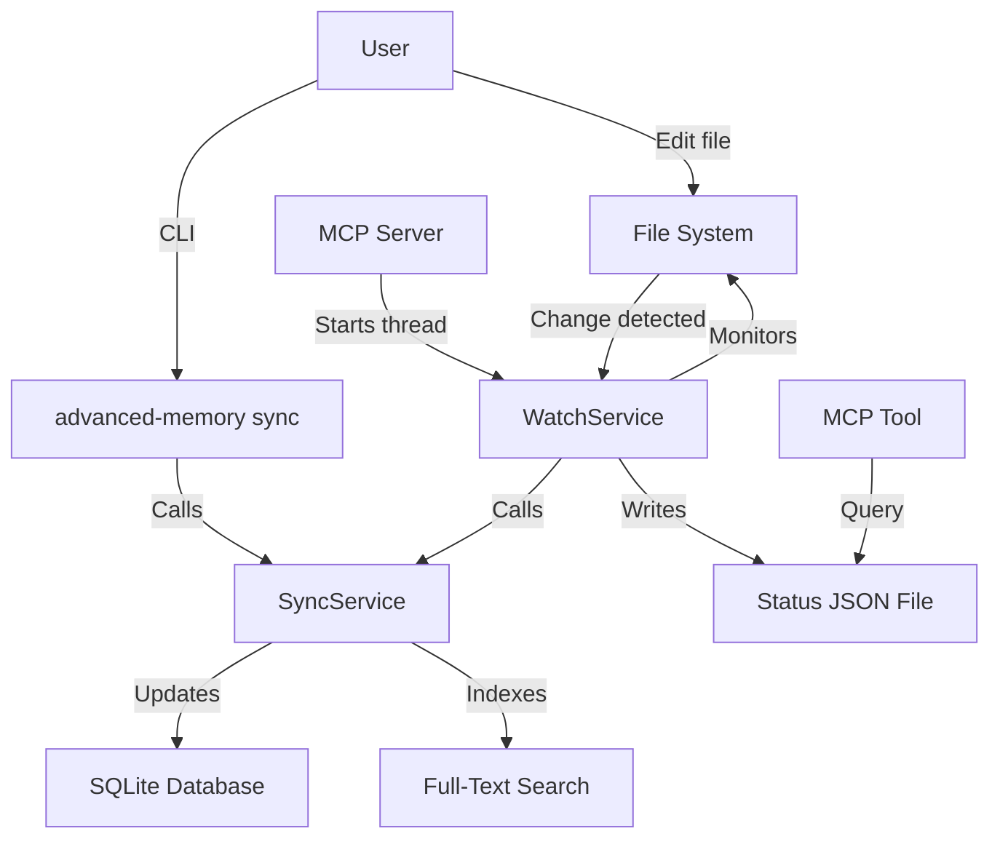

# Sync Architecture Explained

**How sync and file watching work in Advanced Memory**

---

## TL;DR

**Sync is NOT a separate app** - it's a service that can be:
1. **Manually triggered** via CLI (`advanced-memory sync`)
2. **Auto-triggered** by file watcher (if enabled)
3. **Queried** via MCP tool (`adn_project status`)

**File watcher** runs as a background thread within the MCP server process (not a separate app).

---

## Architecture Diagram



---

## Components

### 1. SyncService (`src/advanced_memory/sync/sync_service.py`)

**Purpose**: Core sync logic (does the actual work)

**What it does**:
- Scans markdown files in project directory
- Compares file checksums with database
- Detects new/modified/moved/deleted files
- Parses markdown (YAML frontmatter, wikilinks, observations)
- Updates database (entities, relations, observations)
- Rebuilds full-text search index

**Called by**:
- CLI `sync` command (manual sync)
- `WatchService` (auto-sync on file changes)

**Not a separate process** - just a Python class/service

---

### 2. WatchService (`src/advanced_memory/sync/watch_service.py`)

**Purpose**: File watching and auto-sync

**What it does**:
- Uses `watchfiles` library to monitor project directories
- Detects file changes (add, modify, delete, move)
- Calls `SyncService` to process changes
- Writes status to JSON file (`~/.advanced-memory/watch_status.json`)
- Runs as async task in background

**Lifecycle**:
```python
# When MCP server starts (if sync_changes: true in config):
1. MCP server starts
2. Checks config.sync_changes
3. If enabled:
   a. Creates WatchService instance
   b. Starts as background thread (daemon)
   c. WatchService.run() loops forever
4. MCP server continues (serves tools)
```

**Status tracking**:
- Writes status to `~/.advanced-memory/watch_status.json`
- Contains:
  - `running: bool` (is watch service running?)
  - `start_time: datetime`
  - `pid: int` (process ID)
  - `synced_files: int` (total files synced)
  - `recent_events: list[WatchEvent]` (last 100 events)
  - `error_count: int`

**Not a separate process** - runs in MCP server process as background thread

---

### 3. CLI Sync Command (`src/advanced_memory/cli/commands/sync.py`)

**Purpose**: Manual sync trigger

**Usage**:
```bash
advanced-memory sync
advanced-memory sync --verbose
```

**What it does**:
1. Gets project from config
2. Creates `SyncService` instance
3. Calls `sync_service.sync(directory)`
4. Displays results (summary or detailed)

**Returns immediately** (not a background service)

---

### 4. Status Query (`adn_project` MCP tool)

**Purpose**: Check sync status

**Usage** (via MCP):
```python
await adn_project.fn("status")
```

**Usage** (via CLI):
```bash
advanced-memory status
advanced-memory project info  # More detailed
```

**What it does**:
- Scans files (like sync) but doesn't update database
- Shows what **would** change if you ran sync
- Reads `watch_status.json` for watch service status

**Returns immediately** (just a query, no sync)

---

## How "Import Repo" Works

### Via Sync Command

**Steps**:
1. Create project pointing to repo:
   ```bash
   advanced-memory project add my-repo /path/to/repo
   ```

2. Sync to import:
   ```bash
   advanced-memory sync
   ```

3. Result:
   - All markdown files in repo indexed
   - Database populated with entities
   - Search index built
   - Repo becomes your "knowledge base"

### Via File Watcher (Auto-Import)

**Steps**:
1. Enable file watching in config:
   ```toml
   sync_changes = true
   ```

2. Point project at repo:
   ```bash
   advanced-memory project add my-repo /path/to/repo
   ```

3. Start MCP server:
   ```bash
   advanced-memory mcp
   ```

4. Result:
   - Initial sync on startup (imports all files)
   - Watch service starts monitoring
   - Future changes auto-synced (new files, edits, deletes)

---

## Configuration

### Config File (`~/.advanced-memory/config.toml`)

```toml
[projects.my-repo]
name = "my-repo"
path = "/path/to/repo"
default = true

[app]
sync_changes = true      # Enable file watcher
sync_delay = 1000       # Debounce delay (ms)
```

### Environment Variable

```bash
export ADVANCED_MEMORY_PROJECT=my-repo
```

---

## Sync vs. Watch: When Each Runs

### Manual Sync (`advanced-memory sync`)

**When**:
- User explicitly runs command
- After import commands (prompted)
- When watch service is disabled
- For on-demand full re-scan

**Use cases**:
- One-time import of large repo
- Manual control over when sync happens
- Troubleshooting (force re-sync)
- CI/CD pipelines

---

### Auto-Sync (WatchService)

**When**:
- MCP server running
- `sync_changes = true` in config
- File changes detected in project directory

**Use cases**:
- Interactive note-taking
- Development workflow (edit in editor, auto-indexed)
- Real-time knowledge base updates
- "Magic" experience (no manual sync needed)

---

## Process Architecture

### Option 1: CLI Only (No Watcher)

```
User runs: advanced-memory sync
  |
  v
[Python Process]
  ├─ CLI Entry Point (cli/main.py)
  ├─ Sync Command (cli/commands/sync.py)
  └─ SyncService (sync/sync_service.py)
       ├─ Scans files
       ├─ Updates database
       └─ Exits
```

**Result**: Process exits after sync completes

---

### Option 2: MCP Server with Watcher

```
User runs: advanced-memory mcp
  |
  v
[Python Process - MCP Server]
  ├─ Main Thread (MCP server)
  │   ├─ Serves MCP tools
  │   ├─ Handles tool calls
  │   └─ Stays alive (long-running)
  │
  └─ Background Thread (File Watcher)
      ├─ WatchService.run()
      ├─ Monitors file changes (loop)
      ├─ Calls SyncService on changes
      └─ Writes watch_status.json
```

**Result**: Process stays alive, auto-syncing changes

---

### Option 3: MCP Server without Watcher

```
User runs: advanced-memory mcp
  |
  v
[Python Process - MCP Server]
  └─ Main Thread (MCP server)
      ├─ Serves MCP tools
      ├─ Handles tool calls
      └─ Stays alive (long-running)

Note: No background thread (sync_changes = false)
```

**Result**: Process stays alive, but no auto-sync (manual sync only)

---

## Status Query Architecture

### How Status is Retrieved

**Step 1: WatchService writes status**
```python
# In WatchService.run()
self.status_path = Path.home() / ".advanced-memory" / "watch_status.json"
self.status_path.write_text(WatchServiceState.model_dump_json(self.state))
```

**Step 2: MCP tool reads status**
```python
# In adn_project or project info resource
status_path = Path.home() / ".advanced-memory" / "watch_status.json"
if status_path.exists():
    status = json.loads(status_path.read_text())
else:
    status = {"running": False}
```

**Step 3: Status returned to user**
```json
{
  "running": true,
  "start_time": "2025-10-17T10:30:00Z",
  "pid": 12345,
  "synced_files": 42,
  "error_count": 0,
  "recent_events": [
    {"path": "notes/new-note.md", "action": "new", "status": "success"},
    {"path": "notes/old-note.md", "action": "modified", "status": "success"}
  ]
}
```

---

## Common Misconceptions

### ❌ Misconception 1: Sync is a separate background app

**Reality**:
- Sync is a **service** (Python class)
- Called by CLI command or file watcher
- Not a separate process

---

### ❌ Misconception 2: Sync runs continuously

**Reality**:
- **Manual sync** (`advanced-memory sync`) runs once, then exits
- **Auto-sync** (via WatchService) runs continuously only when MCP server is running

---

### ❌ Misconception 3: Status is queried from a running service

**Reality**:
- Status is **not** queried from a running service
- Status is **read** from a JSON file written by WatchService
- If MCP server isn't running, status shows `running: false`

---

### ❌ Misconception 4: Multiple sync processes can run simultaneously

**Reality**:
- **Database locking** prevents multiple simultaneous syncs
- SQLite database is locked during write operations
- If sync is already running, second sync waits or fails

---

## Threading Architecture

### MCP Server Startup (`mcp.py`)

```python
def run_file_sync():
    """Run file sync in a separate thread with its own event loop."""
    loop = asyncio.new_event_loop()
    asyncio.set_event_loop(loop)
    try:
        loop.run_until_complete(initialize_file_sync(app_config))
    finally:
        loop.close()

if app_config.sync_changes:
    # Start the sync thread
    sync_thread = threading.Thread(target=run_file_sync, daemon=True)
    sync_thread.start()

# Now run the MCP server (blocks main thread)
mcp_server.run(transport="stdio")
```

**Why threading?**:
- **Main thread**: MCP server (stdio transport blocks)
- **Background thread**: File watcher (async loop, monitors files)
- Both run in **same Python process**

**Daemon thread**:
- Dies when main thread (MCP server) exits
- No cleanup needed (automatic)

---

## Example: Full Workflow

### Scenario: User edits a note in Obsidian

**Setup**:
- MCP server running (`advanced-memory mcp`)
- File watcher enabled (`sync_changes = true`)
- Obsidian vault is an Advanced Memory project

**Sequence**:
1. **User edits** `notes/python.md` in Obsidian
2. **Obsidian saves** file to disk
3. **Watchfiles** detects change (via inotify/FSEvents/ReadDirectoryChanges)
4. **WatchService** receives event: `Change.modified, "notes/python.md"`
5. **WatchService** calls `SyncService.sync_file("notes/python.md")`
6. **SyncService**:
   - Reads file content
   - Parses markdown
   - Computes checksum
   - Updates entity in database
   - Updates search index
7. **WatchService** writes status to `watch_status.json`
8. **Console output**: `[yellow]EDIT[/yellow] notes/python.md`
9. **User queries** via MCP: `adn_project("status")`
10. **Response**: Shows `notes/python.md` modified, status `running: true`

**Total latency**: ~100-500ms (file change → database updated)

---

## Performance Characteristics

### Manual Sync

**Speed**:
- Depends on number of files
- 1000 files: ~5-10 seconds (full scan)
- Incremental (checksum-based): only changed files processed

**Resource usage**:
- CPU: Moderate (during scan)
- Memory: Low-moderate (loads files into memory)
- Disk I/O: High (reads all files)

**Use case**: Large initial import, periodic full re-scans

---

### Auto-Sync (File Watcher)

**Speed**:
- Per-file: ~50-200ms (file change → database updated)
- Debounced: 1000ms delay (configurable)
- Batch processing: Groups rapid changes

**Resource usage**:
- CPU: Very low (idle most of time)
- Memory: Low (only changed files loaded)
- Disk I/O: Low (only changed files read)

**Use case**: Interactive note-taking, real-time updates

---

## Debugging Sync Issues

### Check if Watcher is Running

```bash
# Via CLI
advanced-memory project info

# Check status file
cat ~/.advanced-memory/watch_status.json
```

**Expected output**:
```json
{
  "running": true,
  "start_time": "2025-10-17T10:30:00Z",
  "pid": 12345,
  "synced_files": 42
}
```

---

### Check for Database Lock

**Symptom**: Sync hangs or fails with "database is locked"

**Cause**: Multiple processes trying to sync simultaneously

**Solution**:
1. Kill all `advanced-memory` processes
2. Run sync again

```bash
# Linux/macOS
pkill -f advanced-memory

# Windows
taskkill /F /IM python.exe /FI "WINDOWTITLE eq advanced-memory*"
```

---

### Force Full Re-Sync

```bash
# Stop MCP server
# (Ctrl+C or kill process)

# Run manual sync
advanced-memory sync --verbose

# Restart MCP server
advanced-memory mcp
```

---

## Comparison with Other Systems

### Obsidian

**No sync needed**:
- Obsidian reads files directly from disk
- No database (uses file system as database)
- No indexing delay

**Trade-off**:
- Slower search (must scan files)
- No relational queries
- Limited programmatic access

---

### Notion

**Always synced**:
- Cloud-based (database in cloud)
- Changes reflected immediately
- No local files

**Trade-off**:
- Requires internet
- Data not owned locally
- No local-first

---

### Advanced Memory

**Hybrid approach**:
- Local files (source of truth)
- Local database (fast queries)
- Sync required (files → database)
- Best of both worlds (local-first + fast search)

---

## Future Enhancements

### Planned Improvements

1. **Incremental sync** (only changed files)
   - Already implemented via checksums
   - Could be faster with better caching

2. **Parallel sync** (multiple files simultaneously)
   - Currently sequential
   - Could use `asyncio.gather()` for parallelism

3. **Smarter file watching** (ignore patterns)
   - Already filters `.git`, `node_modules`, etc.
   - Could be more configurable

4. **Conflict resolution** (database vs. file conflicts)
   - Currently file always wins
   - Could detect conflicts and prompt user

5. **Bi-directional sync** (database → files)
   - Currently one-way (files → database)
   - Would enable programmatic note creation

---

## Summary

### Key Points

1. **Sync is a service** (not a separate app)
   - Called by CLI or file watcher
   - Updates database from files

2. **WatchService is a background thread** (not a separate process)
   - Runs in MCP server process
   - Monitors files, calls sync on changes

3. **Status is stored in JSON file** (not queried from running service)
   - Written by WatchService
   - Read by MCP tools/CLI

4. **"Import repo"** = point project at repo + sync
   - Not a special command
   - Just regular sync pointed at repo directory

5. **Two modes**:
   - **Manual**: `advanced-memory sync` (one-time)
   - **Auto**: File watcher (continuous, when MCP running)

---

## See Also

- **Sync Service**: `src/advanced_memory/sync/sync_service.py`
- **Watch Service**: `src/advanced_memory/sync/watch_service.py`
- **Sync Command**: `src/advanced_memory/cli/commands/sync.py`
- **MCP Server**: `src/advanced_memory/cli/commands/mcp.py`
- **Initialization**: `src/advanced_memory/services/initialization.py`

---

*Created: 2025-10-17*
*Purpose: Clarify sync architecture and correct misconceptions*
