# Knowledge Domain Mapping

This note demonstrates how to use Mermaid diagrams for mapping knowledge domains, research areas, and concept relationships.

## Machine Learning Knowledge Map


## Research Workflow


## Concept Dependencies


## Learning Progress Tracker


## Research Paper Relationship

```mermaid
erDiagram
    PAPER ||--o{ CITATION : cites
    PAPER ||--o{ AUTHOR : written_by
    AUTHOR ||--o{ INSTITUTION : affiliated_with
    PAPER ||--o{ KEYWORD : tagged_with
    PAPER ||--o{ METHOD : uses
    METHOD ||--o{ DATASET : evaluated_on
    PAPER ||--|{ RESULT : produces

    PAPER {{
        string paper_id
        string title
        string abstract
        date publication_date
        string venue
    }}

    AUTHOR {{
        string author_id
        string name
        string email
    }}

    INSTITUTION {{
        string institution_id
        string name
        string country
    }}

    KEYWORD {{
        string keyword_id
        string term
    }}

    METHOD {{
        string method_id
        string name
        string category
    }}

    DATASET {{
        string dataset_id
        string name
        string domain
        int size
    }}

    RESULT {{
        string result_id
        string metric_name
        float metric_value
        string comparison
    }}
```

## Knowledge Acquisition States

```mermaid
stateDiagram-v2
    [*] --> Unaware
    Unaware --> Aware : Discovery
    Aware --> Interested : Relevance
    Interested --> Learning : Time/Need
    Learning --> Practicing : Theory→Application
    Practicing --> Proficient : Experience
    Proficient --> Expert : Deep Understanding

    Learning --> Forgotten : No Practice
    Forgotten --> Unaware

    Practicing --> Stuck : Difficulties
    Stuck --> Learning : Additional Study
    Stuck --> Expert : Breakthrough

    note right of Expert : Mastery Level
    note left of Unaware : Starting Point
```



## Research Impact Assessment


## Collaboration Network


---

*This example shows how Mermaid diagrams can enhance knowledge documentation and research organization.*
*Perfect for mapping complex domains, tracking learning progress, and visualizing relationships.*
