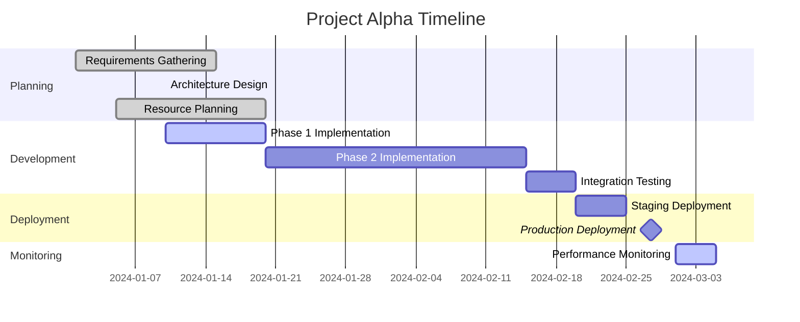
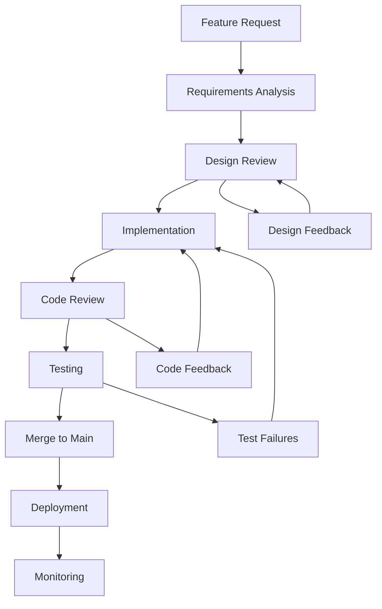
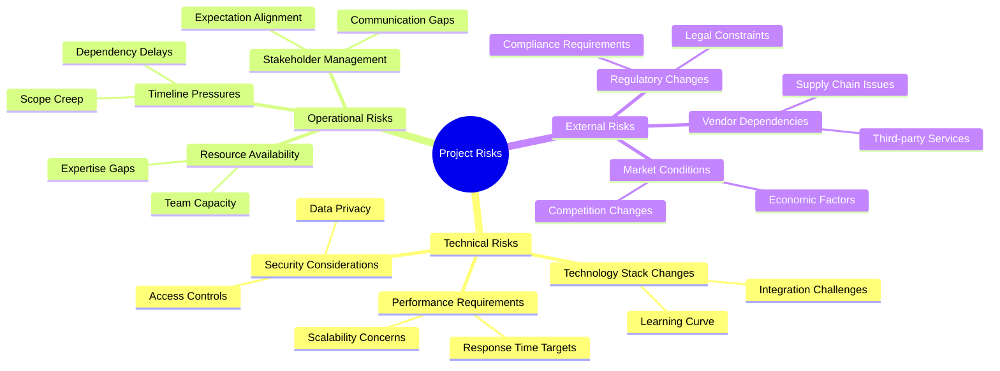
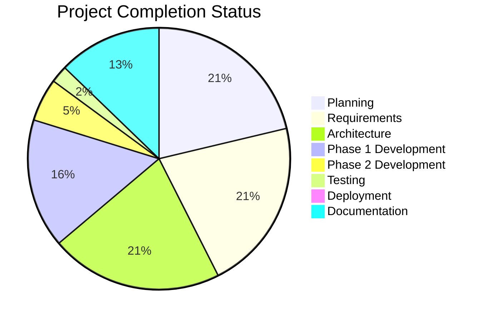
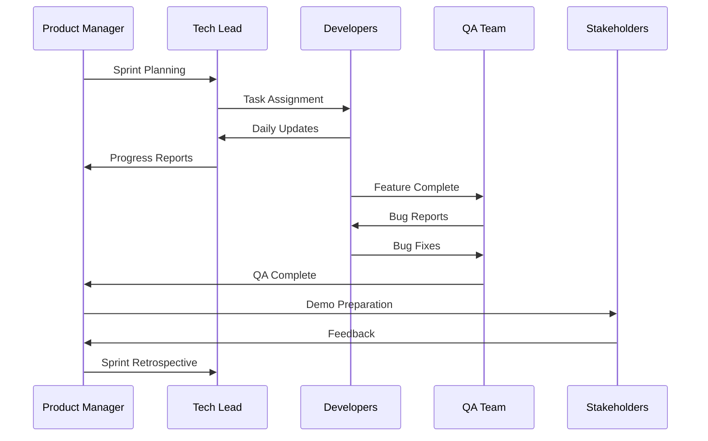

# Project Alpha Planning

This note demonstrates how to use Mermaid diagrams for project planning and documentation.

## Project Overview

Project Alpha is a comprehensive initiative to modernize our data processing pipeline. This document outlines the planning, execution, and monitoring phases.

## Project Timeline



## Development Workflow



## Risk Assessment



## Team Structure

```mermaid
erDiagram
    PROJECT ||--o{ TEAM : contains
    TEAM ||--|{ MEMBER : consists_of
    MEMBER ||--o{ SKILL : possesses
    PROJECT ||--|{ MILESTONE : tracks
    MILESTONE ||--o{ TASK : breaks_down

    PROJECT {{
        string project_id
        string name
        date start_date
        date end_date
        string status
    }}

    TEAM {{
        string team_id
        string name
        string focus_area
    }}

    MEMBER {{
        string member_id
        string name
        string role
        string expertise
    }}

    SKILL {{
        string skill_id
        string name
        string proficiency_level
    }}
```

## Current Status



## Communication Flow



---

*This example demonstrates various Mermaid diagram types for comprehensive project documentation.*
*Generated for Basic Memory Mermaid integration testing.*
