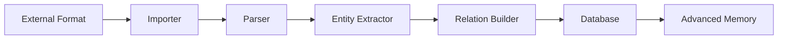

# Advanced Memory Integrations

**Purpose**: Documentation for all import/export integrations and third-party tool support
**Location**: `docs/integrations/`
**Status**: Mix of implemented features and future plans

---

## Table of Contents

1. [Overview](#overview)
2. [Import/Export Matrix](#importexport-matrix)
3. [Implemented Integrations](#implemented-integrations)
4. [Planned Integrations](#planned-integrations)
5. [Editor Integrations](#editor-integrations)
6. [Visualization Tools](#visualization-tools)
7. [Integration Categories](#integration-categories)

---

## Overview

Advanced Memory supports importing from and exporting to various knowledge management systems, note-taking apps, and document formats. This directory contains guides for all integrations.

### Integration Philosophy

**Local-first**: All integrations work with local files (no cloud API dependencies)

**Format-based**: Import/export via standard formats (Markdown, JSON, XML, HTML)

**Bidirectional**: Where possible, support both import and export

**Lossless**: Preserve as much metadata and structure as possible

---

## Import/Export Matrix

### Knowledge Management Systems

| System | Import | Export | Format | Status | Guide |
|--------|--------|--------|--------|--------|-------|
| **Obsidian** | ✅ | ✅ | Markdown + Canvas | **Implemented** | [obsidian-integration-guide.md](./obsidian-integration-guide.md) |
| **Notion** | ⏳ | ⏳ | HTML/Markdown | **Planned** | [notion-integration-plan.md](./notion-integration-plan.md) |
| **Evernote** | ⏳ | ⏳ | ENEX (XML) | **Planned** | [evernote-integration-plan.md](./evernote-integration-plan.md) |
| **Joplin** | ✅ | ⏳ | Markdown + JSON | **Partial** | *(needs doc)* |
| **Roam Research** | ⏳ | ⏳ | JSON/Markdown | **Planned** | *(needs doc)* |
| **Logseq** | ⏳ | ⏳ | Markdown | **Planned** | *(needs doc)* |

---

### AI Chat Systems

| System | Import | Export | Format | Status | Guide |
|--------|--------|--------|--------|--------|-------|
| **Claude (Conversations)** | ✅ | ❌ | JSON | **Implemented** | *(needs doc)* |
| **Claude (Projects)** | ✅ | ❌ | JSON | **Implemented** | *(needs doc)* |
| **ChatGPT** | ✅ | ❌ | JSON | **Implemented** | *(needs doc)* |
| **Cursor IDE** | ⏳ | ❌ | JSON/SQLite | **Proposed** | [cursor-memory-import.md](./cursor-memory-import.md) |
| **Memory JSON** | ✅ | ✅ | JSON | **Implemented** | *(needs doc)* |

---

### Document Conversion

| Tool | Purpose | Format Support | Status | Guide |
|------|---------|----------------|--------|-------|
| **Pandoc** | Universal converter | MD→PDF/DOCX/HTML/etc | **Implemented** | [pandoc-integration-guide.md](./pandoc-integration-guide.md) |
| **Mermaid** | Diagram rendering | Mermaid→SVG/PNG | **Implemented** | [mermaid-integration-plan.md](./mermaid-integration-plan.md) |

---

### Markdown Editors

| Editor | Integration Type | Features | Status | Guide |
|--------|------------------|----------|--------|-------|
| **Typora** | File-based | WYSIWYG editing | **Compatible** | [typora-integration-guide.md](./typora-integration-guide.md) |
| **Obsidian** | Vault-based | Graph view, canvas | **Implemented** | [obsidian-integration-guide.md](./obsidian-integration-guide.md) |
| **Notepad++** | File-based | Syntax highlighting | **Compatible** | [notepadpp-integration-guide.md](./notepadpp-integration-guide.md) |
| **VS Code** | Folder-based | Extensions | **Compatible** | *(needs doc)* |

---

## Implemented Integrations

### ✅ Fully Working

#### 1. Obsidian Integration

**What works**:
- ✅ Import Obsidian vaults (load_obsidian_vault)
- ✅ Search Obsidian vaults (search_obsidian_vault)
- ✅ Export to Obsidian canvas format
- ✅ Wikilink compatibility
- ✅ Bidirectional sync (file-based)

**Commands**:
```bash
# Via MCP tool
load_obsidian_vault(vault_path)
search_obsidian_vault(query, vault_path)

# Via CLI (set project to Obsidian vault)
advanced-memory project create obsidian /path/to/vault
advanced-memory sync
```

**Guide**: [obsidian-integration-guide.md](./obsidian-integration-guide.md)

---

#### 2. Claude Conversations Import

**What works**:
- ✅ Import Claude conversation exports (JSON)
- ✅ Preserve conversation structure
- ✅ Extract key concepts and insights
- ✅ Create knowledge graph from conversations

**Commands**:
```bash
advanced-memory import claude conversations
```

**Implementation**: `src/advanced_memory/importers/claude_conversations_importer.py`

**Guide**: *(needs creation)*

---

#### 3. Claude Projects Import

**What works**:
- ✅ Import Claude project exports (JSON)
- ✅ Preserve project structure and metadata
- ✅ Extract documents and conversations
- ✅ Link related content

**Commands**:
```bash
advanced-memory import claude projects
```

**Implementation**: `src/advanced_memory/importers/claude_projects_importer.py`

**Guide**: *(needs creation)*

---

#### 4. ChatGPT Import

**What works**:
- ✅ Import ChatGPT conversation exports (JSON)
- ✅ Extract conversations and topics
- ✅ Create entities from chat history

**Commands**:
```bash
advanced-memory import chatgpt
```

**Implementation**: `src/advanced_memory/importers/chatgpt_importer.py`

**Guide**: *(needs creation)*

---

#### 5. Memory JSON Import/Export

**What works**:
- ✅ Import memory.json format
- ✅ Export to memory.json format
- ✅ Bidirectional compatibility

**Commands**:
```bash
advanced-memory import memory-json
advanced-memory export memory-json
```

**Implementation**: `src/advanced_memory/importers/memory_json_importer.py`

**Guide**: *(needs creation)*

---

#### 6. Pandoc Integration

**What works**:
- ✅ Convert markdown notes to PDF
- ✅ Convert markdown notes to DOCX
- ✅ Convert markdown notes to HTML
- ✅ Batch conversion support
- ✅ Template customization

**Requirements**: Pandoc installed separately

**Guide**: [pandoc-integration-guide.md](./pandoc-integration-guide.md)

---

#### 7. Mermaid Diagrams

**What works**:
- ✅ Render Mermaid diagrams in notes
- ✅ Support all Mermaid diagram types
- ✅ Include in PDF exports (via Pandoc)

**Guide**: [mermaid-integration-plan.md](./mermaid-integration-plan.md)

---

## Planned Integrations

### ⏳ Future Plans

#### 1. Notion Integration

**Status**: Planned (design phase)

**Planned features**:
- Import Notion HTML/Markdown exports
- Convert Notion databases to entities
- Preserve page hierarchy
- Export to Notion-compatible markdown

**Guide**: [notion-integration-plan.md](./notion-integration-plan.md)

**Effort**: ~20 hours (Notion HTML parsing complex)

---

#### 2. Evernote Integration

**Status**: Planned (design phase)

**Planned features**:
- Import Evernote ENEX format
- Convert tags to Advanced Memory tags
- Preserve notebooks as folders
- Handle attachments

**Guide**: [evernote-integration-plan.md](./evernote-integration-plan.md)

**Effort**: ~15 hours (ENEX XML parsing)

---

#### 3. Joplin Export

**Status**: Partial (import works, export needed)

**Implemented**:
- ✅ Search Joplin vaults (search_joplin_vault)
- ✅ Import Joplin markdown notes

**Planned**:
- ⏳ Export to Joplin format
- ⏳ Preserve Joplin metadata

**Effort**: ~8 hours

---

#### 4. Roam Research Integration

**Status**: Planned

**Planned features**:
- Import Roam JSON exports
- Convert block references
- Preserve daily notes structure
- Handle Roam-specific syntax

**Effort**: ~12 hours

---

#### 5. Logseq Integration

**Status**: Planned

**Planned features**:
- Import Logseq markdown files
- Convert block references
- Preserve page properties
- Handle Logseq query syntax

**Effort**: ~10 hours

---

## Editor Integrations

### Compatible Editors

#### Typora

**Integration level**: File-based compatibility

**What works**:
- ✅ Edit Advanced Memory notes in Typora
- ✅ WYSIWYG markdown editing
- ✅ Image handling
- ✅ Export to PDF/DOCX via Typora

**Guides**:
- [typora-integration-guide.md](./typora-integration-guide.md)
- [typora-automation-via-plugins.md](./typora-automation-via-plugins.md)

---

#### Notepad++

**Integration level**: Basic text editing

**What works**:
- ✅ Syntax highlighting for markdown
- ✅ Plugin support for markdown preview
- ✅ Multi-file editing

**Guide**: [notepadpp-integration-guide.md](./notepadpp-integration-guide.md)

---

#### VS Code

**Integration level**: Full IDE integration

**What works**:
- ✅ Markdown editing with preview
- ✅ Git integration
- ✅ Extension ecosystem
- ✅ Folder-based workflow

**Guide**: *(needs creation)*

---

## Visualization Tools

### Mermaid Diagrams

**Status**: Implemented

**What works**:
- ✅ Mermaid syntax in markdown notes
- ✅ Rendered in Obsidian, Typora, GitHub
- ✅ Included in PDF exports (Pandoc)
- ✅ Multiple diagram types supported

**Guides**:
- [mermaid-diagrams.md](./mermaid-diagrams.md)
- [mermaid-integration-plan.md](./mermaid-integration-plan.md)

---

### Docsify

**Status**: Planned

**What works**:
- ⏳ Web-based documentation site
- ⏳ Plugin enhancements

**Guide**: [docsify-plugin-enhancement-guide.md](./docsify-plugin-enhancement-guide.md)

---

## Integration Categories

### Category 1: Knowledge Base Systems

**Import knowledge from**:
- Obsidian (✅ implemented)
- Notion (⏳ planned)
- Evernote (⏳ planned)
- Roam Research (⏳ planned)
- Logseq (⏳ planned)

**Purpose**: Migrate existing knowledge bases

**Priority**: High (user onboarding)

---

### Category 2: AI Chat History

**Import conversations from**:
- Claude Conversations (✅ implemented)
- Claude Projects (✅ implemented)
- ChatGPT (✅ implemented)
- Cursor IDE Memories (⏳ proposed)

**Purpose**: Preserve AI-assisted learning

**Priority**: High (knowledge capture)

---

### Category 3: Document Conversion

**Convert to**:
- PDF (✅ via Pandoc)
- DOCX (✅ via Pandoc)
- HTML (✅ via Pandoc)
- Presentation formats (⏳ planned)

**Purpose**: Professional document creation

**Priority**: Medium (publishing)

---

### Category 4: Editors

**Edit notes with**:
- Typora (✅ compatible)
- Obsidian (✅ compatible)
- VS Code (✅ compatible)
- Notepad++ (✅ compatible)

**Purpose**: Flexible editing options

**Priority**: Medium (user preference)

---

### Category 5: Visualization

**Visualize with**:
- Mermaid diagrams (✅ implemented)
- Obsidian graph view (✅ compatible)
- Docsify (⏳ planned)

**Purpose**: Visual knowledge exploration

**Priority**: Medium (user experience)

---

## Implementation Status

### By Completion Level

**Fully Implemented** (7):
1. ✅ Obsidian vault import/export
2. ✅ Claude conversations import
3. ✅ Claude projects import
4. ✅ ChatGPT import
5. ✅ Memory JSON import/export
6. ✅ Pandoc document conversion
7. ✅ Mermaid diagram support

**Partially Implemented** (2):
1. ⚠️ Joplin (import only, export planned)
2. ⚠️ Typora (file compatibility, automation planned)

**Planned** (5):
1. ⏳ Notion integration
2. ⏳ Evernote integration
3. ⏳ Roam Research integration
4. ⏳ Logseq integration
5. ⏳ Docsify plugin

---

## Quick Integration Guide

### Import From Other Systems

#### From Obsidian

```bash
# Option 1: Via MCP tool (recommended)
load_obsidian_vault("/path/to/obsidian/vault")

# Option 2: Via project
advanced-memory project create obsidian /path/to/vault
advanced-memory sync
```

**Result**: All Obsidian notes imported, wikilinks preserved

---

#### From Claude

```bash
# Import Claude conversation history
advanced-memory import claude conversations

# Import Claude project exports
advanced-memory import claude projects
```

**Result**: Conversations converted to knowledge notes

---

#### From ChatGPT

```bash
# Import ChatGPT export (conversations.json)
advanced-memory import chatgpt
```

**Result**: Chat history converted to entities

---

#### From Memory JSON

```bash
# Import memory.json format
advanced-memory import memory-json /path/to/memory.json
```

**Result**: JSON memory data imported

---

### Export to Other Systems

#### To Obsidian

```bash
# Option 1: Point Obsidian at Advanced Memory folder
# (Obsidian vault = Advanced Memory project folder)

# Option 2: Create canvas visualization
canvas(nodes, edges, title="My Knowledge Graph")
```

**Result**: Canvas file viewable in Obsidian

---

#### To PDF/DOCX (via Pandoc)

```bash
# Export single note
pandoc note.md -o note.pdf

# Export with template
pandoc note.md --template=custom -o note.pdf
```

**Guide**: [pandoc-integration-guide.md](./pandoc-integration-guide.md)

---

#### To Memory JSON

```bash
# Export to memory.json format
advanced-memory export memory-json
```

**Result**: JSON file with all entities

---

## Document Organization

### Integration Guides (Implemented)

| Guide | Topics Covered | Lines | Status |
|-------|----------------|-------|--------|
| **obsidian-integration-guide.md** | Import, export, canvas, workflow | 739 | ✅ Complete |
| **pandoc-integration-guide.md** | PDF/DOCX conversion, templates | 300+ | ✅ Complete |
| **mermaid-diagrams.md** | Diagram syntax, examples | 200+ | ✅ Complete |
| **mermaid-integration-plan.md** | Implementation details | 150+ | ✅ Complete |
| **typora-integration-guide.md** | File editing, preview | 250+ | ✅ Complete |
| **notepadpp-integration-guide.md** | Basic editing, plugins | 150+ | ✅ Complete |

---

### Integration Plans (Future)

| Plan | Focus | Complexity | Effort | Status |
|------|-------|------------|--------|--------|
| **notion-integration-plan.md** | HTML/Markdown import | High | ~20h | 📋 Design |
| **evernote-integration-plan.md** | ENEX XML import | Medium | ~15h | 📋 Design |
| **docsify-plugin-enhancement-guide.md** | Web docs | Medium | ~12h | 📋 Design |
| **typora-automation-via-plugins.md** | Automation | Low | ~8h | 📋 Design |

---

## Integration Architecture

### Import Pipeline



**Steps**:
1. **Read** external format (JSON, XML, HTML, Markdown)
2. **Parse** structure and content
3. **Extract** entities (notes, concepts)
4. **Build** relations (links, references)
5. **Store** in Advanced Memory database
6. **Index** for search

---

### Export Pipeline


**Steps**:
1. **Query** entities from database
2. **Serialize** to intermediate format
3. **Convert** to target format (PDF, JSON, etc.)
4. **Write** files
5. **Validate** output

---

## Integration by Use Case

### Use Case 1: Migrate from Obsidian

**Goal**: Move existing Obsidian vault to Advanced Memory

**Steps**:
1. Create project pointing to Obsidian vault
2. Sync to import all notes
3. Use both tools simultaneously (file-based)

**Guides**:
- [obsidian-integration-guide.md](./obsidian-integration-guide.md)

---

### Use Case 2: Capture AI Conversations

**Goal**: Import Claude/ChatGPT conversations as knowledge

**Steps**:
1. Export conversations from Claude/ChatGPT
2. Import via Advanced Memory CLI
3. Browse and search conversation history

**Commands**:
```bash
advanced-memory import claude conversations
advanced-memory import chatgpt
```

**Guides**: *(need creation)*

---

### Use Case 3: Professional Document Export

**Goal**: Convert notes to PDF/DOCX for sharing

**Steps**:
1. Write notes in markdown
2. Export via Pandoc
3. Customize with templates

**Guide**: [pandoc-integration-guide.md](./pandoc-integration-guide.md)

---

### Use Case 4: Visual Note Taking

**Goal**: Use Obsidian's canvas with Advanced Memory

**Steps**:
1. Create canvas via Advanced Memory
2. View in Obsidian
3. Edit visually in Obsidian

**Guide**: [obsidian-integration-guide.md](./obsidian-integration-guide.md)

---

## Missing Documentation (To Be Created)

### High Priority

1. **Claude Import Guide** (claude-conversations-import.md)
   - How to export from Claude
   - Import command usage
   - What gets imported
   - Example workflows

2. **ChatGPT Import Guide** (chatgpt-import.md)
   - Export from ChatGPT
   - Import process
   - Conversation organization

3. **Memory JSON Format** (memory-json-format.md)
   - JSON schema
   - Import/export examples
   - Use cases

4. **Joplin Integration Guide** (joplin-integration-guide.md)
   - Import Joplin notes
   - Search functionality
   - Export (when implemented)

---

### Medium Priority

5. **VS Code Integration** (vscode-integration.md)
   - Extensions for markdown
   - Workspace setup
   - Git integration

6. **Import/Export CLI Reference** (import-export-cli.md)
   - All import commands
   - All export commands
   - Format specifications

---

### Low Priority

7. **Roam Research Integration** (roam-integration-plan.md)
8. **Logseq Integration** (logseq-integration-plan.md)
9. **Bear Notes Integration** (bear-integration-plan.md)
10. **Apple Notes Integration** (apple-notes-integration-plan.md)

---

## Integration Principles

### 1. Local-First

**All integrations work with local files**:
- ✅ No cloud API dependencies
- ✅ Works offline
- ✅ User owns all data
- ✅ No API keys required (mostly)

**Exception**: Future cloud sync (optional)

---

### 2. Format-Based

**Use standard formats**:
- ✅ Markdown (universal)
- ✅ JSON (structured data)
- ✅ XML (ENEX for Evernote)
- ✅ HTML (Notion exports)

**Avoid**: Proprietary binary formats

---

### 3. Lossless (Where Possible)

**Preserve**:
- ✅ Content (text, code, images)
- ✅ Metadata (dates, tags, authors)
- ✅ Structure (hierarchy, folders)
- ✅ Relations (wikilinks, references)

**Trade-offs**:
- ⚠️ Some formatting may differ (CSS, styling)
- ⚠️ App-specific features may not transfer (Notion databases → simpler structure)

---

### 4. Bidirectional (Goal)

**Support both**:
- Import → Advanced Memory
- Export → Other systems

**Current state**:
- ✅ Obsidian: Bidirectional (file-based)
- ✅ Memory JSON: Bidirectional
- ⚠️ Pandoc: Export only
- ⚠️ AI chats: Import only (can't export back to AI)

---

## Technical Details

### Importer Base Class

**Location**: `src/advanced_memory/importers/base.py`

```python
class Importer:
    """Base class for all importers"""

    async def import_file(self, file_path: str) -> list[Entity]:
        """Import single file → entities"""

    async def import_directory(self, dir_path: str) -> list[Entity]:
        """Import directory → entities"""

    async def extract_entities(self, content: str) -> list[Entity]:
        """Parse content → entities"""
```

**Implemented importers**:
- `ChatGPTImporter`
- `ClaudeConversationsImporter`
- `ClaudeProjectsImporter`
- `MemoryJsonImporter`

---

### Import Commands

**CLI location**: `src/advanced_memory/cli/commands/import_*.py`

**Available commands**:
```bash
advanced-memory import claude conversations
advanced-memory import claude projects
advanced-memory import chatgpt
advanced-memory import memory-json <file>
```

**MCP tools**:
```python
load_obsidian_vault(vault_path)
search_obsidian_vault(query, vault_path)
search_joplin_vault(query, vault_path)
```

---

### Export Formats

**Current export capabilities**:

| Format | Command | Output | Status |
|--------|---------|--------|--------|
| **Canvas** | `canvas(...)` | .canvas file | ✅ |
| **Memory JSON** | `export memory-json` | .json file | ✅ |
| **PDF** | Via Pandoc | .pdf file | ✅ |
| **DOCX** | Via Pandoc | .docx file | ✅ |
| **HTML** | Via Pandoc | .html file | ✅ |

---

## Future Roadmap

### Phase 1: Complete AI Import Docs (1 week)

- [ ] Create `claude-import.md`
- [ ] Create `chatgpt-import.md`
- [ ] Create `memory-json-format.md`
- [ ] Add usage examples
- [ ] Document common issues

---

### Phase 2: Implement Notion Integration (2-3 weeks)

- [ ] Design Notion HTML parser
- [ ] Implement import (Notion → Advanced Memory)
- [ ] Implement export (Advanced Memory → Notion markdown)
- [ ] Test with real Notion exports
- [ ] Document workflows

---

### Phase 3: Implement Evernote Integration (2 weeks)

- [ ] Design ENEX parser
- [ ] Implement import (ENEX → Advanced Memory)
- [ ] Implement export (Advanced Memory → ENEX)
- [ ] Handle attachments
- [ ] Document workflows

---

### Phase 4: Joplin Export (1 week)

- [ ] Complete Joplin export functionality
- [ ] Create comprehensive Joplin guide
- [ ] Test bidirectional workflow

---

### Phase 5: Modern PKM Tools (3-4 weeks)

- [ ] Roam Research integration
- [ ] Logseq integration
- [ ] Bear Notes integration (macOS)
- [ ] Comprehensive comparison guide

---

## Quick Reference

### Import Commands

```bash
# AI Chat History
advanced-memory import claude conversations
advanced-memory import claude projects
advanced-memory import chatgpt

# Knowledge Bases
advanced-memory project create obsidian /path/to/vault
advanced-memory sync

# Data Formats
advanced-memory import memory-json /path/to/file.json
```

---

### Export Commands

```bash
# Export to Memory JSON
advanced-memory export memory-json

# Export to PDF (via Pandoc)
pandoc note.md -o note.pdf

# Export to Canvas (via MCP tool)
canvas(nodes, edges, title="Graph")
```

---

### File Formats Supported

**Import**:
- ✅ Markdown (`.md`)
- ✅ JSON (`.json`)
- ✅ Canvas (`.canvas`)
- ⏳ ENEX (`.enex`) - planned
- ⏳ HTML (Notion) - planned

**Export**:
- ✅ Markdown (`.md`)
- ✅ JSON (`.json`)
- ✅ Canvas (`.canvas`)
- ✅ PDF (via Pandoc)
- ✅ DOCX (via Pandoc)
- ✅ HTML (via Pandoc)

---

## See Also

### Related Documentation

- **User Guide**: [docs/user-guide/](../user-guide/)
- **CLI Reference**: [docs/guides/](../guides/)
- **MCP Tools**: [docs/guides/knowledge-operations-guide.md](../guides/knowledge-operations-guide.md)

### Related Code

- **Importers**: `src/advanced_memory/importers/`
- **CLI Import Commands**: `src/advanced_memory/cli/commands/import_*.py`
- **MCP Tools**: `src/advanced_memory/mcp/tools/`

### External Resources

- **Obsidian**: https://obsidian.md/
- **Notion**: https://notion.so/
- **Pandoc**: https://pandoc.org/
- **Mermaid**: https://mermaid.js.org/

---

## Contributing

### Adding New Integration

**Process**:
1. Create integration plan document (`.md` in this directory)
2. Design importer/exporter architecture
3. Implement in `src/advanced_memory/importers/`
4. Add CLI command in `src/advanced_memory/cli/commands/`
5. Add tests in `tests/importers/`
6. Update this README
7. Create user guide

**Template**: See existing plans (Notion, Evernote) as examples

---

### Integration Checklist

New integration must have:
- [ ] Design document (plan or guide)
- [ ] Importer class (if import supported)
- [ ] Exporter function (if export supported)
- [ ] CLI command
- [ ] Tests (import + export)
- [ ] Documentation (this README + dedicated guide)
- [ ] Usage examples

---

## Summary

### What This Directory Contains

**10 integration guides** covering:
- 7 implemented integrations (Obsidian, Claude, ChatGPT, Pandoc, Mermaid, etc.)
- 5 planned integrations (Notion, Evernote, Roam, Logseq, Docsify)
- Editor compatibility (Typora, Notepad++, VS Code)
- Document conversion (PDF, DOCX, HTML)

### Key Integrations

**Most important**:
1. **Obsidian** - Full bidirectional integration (file-based)
2. **Pandoc** - Professional document export
3. **Claude/ChatGPT** - AI conversation import

**Coming soon**:
1. **Notion** - Import from popular tool
2. **Evernote** - Legacy data migration
3. **Joplin** - Complete bidirectional support

### Integration Status

- ✅ **Implemented**: 7 integrations working
- ⚠️ **Partial**: 2 integrations (import only)
- ⏳ **Planned**: 5 integrations (design phase)

---

**Created**: October 17, 2025
**Purpose**: Central index for all integrations
**Status**: Comprehensive catalog with implementation status
**Maintainer**: Advanced Memory MCP Team
