# Mermaid Diagrams in Basic Memory

Basic Memory now supports Mermaid diagrams, allowing you to create and view various types of diagrams directly in your notes. This guide explains how to use Mermaid diagrams effectively within the Basic Memory ecosystem.

## Overview

[Mermaid](https://mermaid.js.org/) is a JavaScript-based diagramming tool that renders Markdown-inspired text definitions to create diagrams. It's perfectly suited for Basic Memory because:

- **Text-based**: Diagrams are stored as plain text in your notes
- **Version controllable**: Full git history of diagram changes
- **Portable**: Works across all platforms without special software
- **Integrated**: Renders automatically in HTML exports

## Quick Start

### Basic Flowchart

Add this to any note:

````markdown
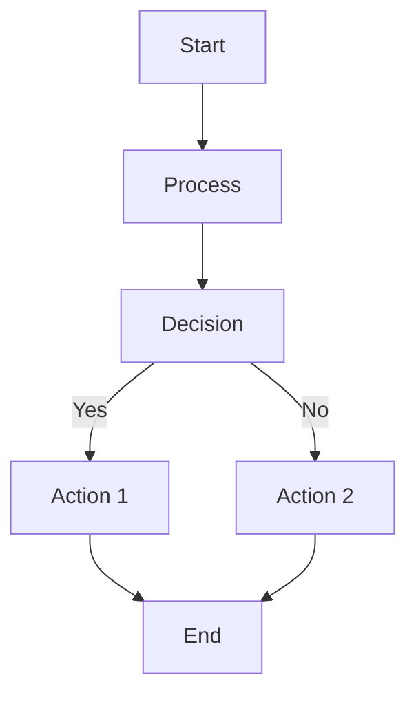
````

### Export to HTML

Use the HTML export tool to see your diagrams rendered:

```bash
# Export notes with Mermaid diagrams
await export_html_notes.fn(export_path="/path/to/html-export")
```

The exported HTML files will automatically render all Mermaid diagrams.

## Supported Diagram Types

### 1. Flowcharts

Perfect for process documentation, decision trees, and workflows.

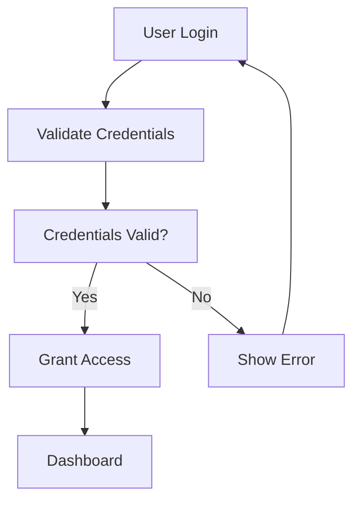

### 2. Sequence Diagrams

Great for API interactions, user workflows, and system communications.

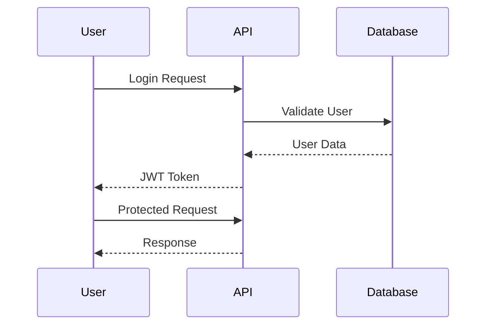

### 3. Gantt Charts

Ideal for project timelines and task dependencies.

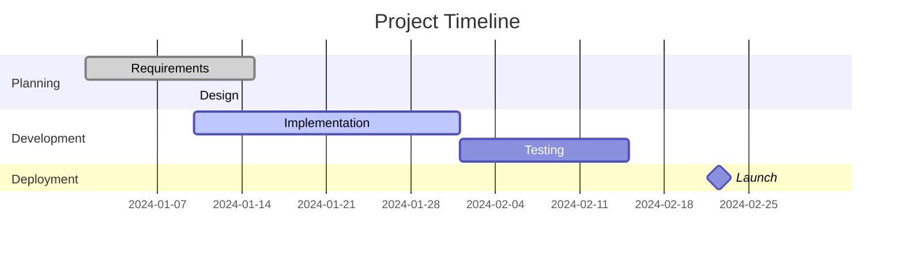

### 4. Mind Maps

Excellent for brainstorming, knowledge organization, and concept mapping.

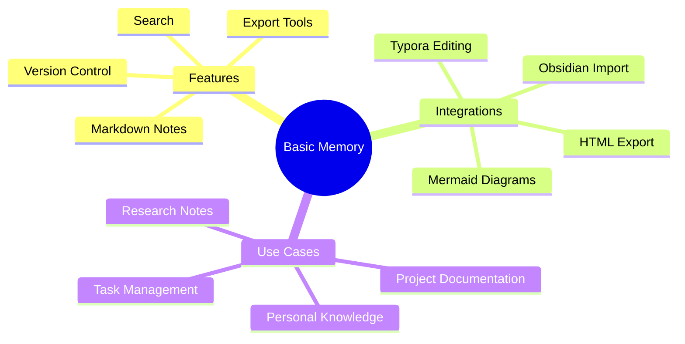

### 5. Entity Relationship Diagrams

Useful for data modeling and system architecture.

```mermaid
erDiagram
    CUSTOMER ||--o{ ORDER : places
    ORDER ||--|{ LINE-ITEM : contains
    CUSTOMER {{
        string name
        string custNumber
        string sector
    }}
    ORDER {{
        int orderNumber
        string deliveryAddress
    }}
    LINE-ITEM {{
        string productCode
        int quantity
        float pricePerUnit
    }}
```

### 6. State Diagrams

Good for representing system states, user journeys, and process flows.

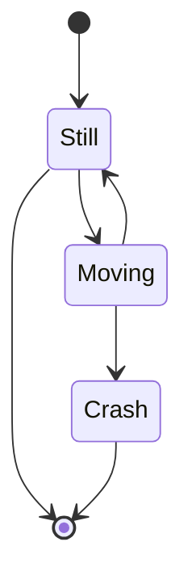

### 7. Pie Charts

Simple data visualization within notes.

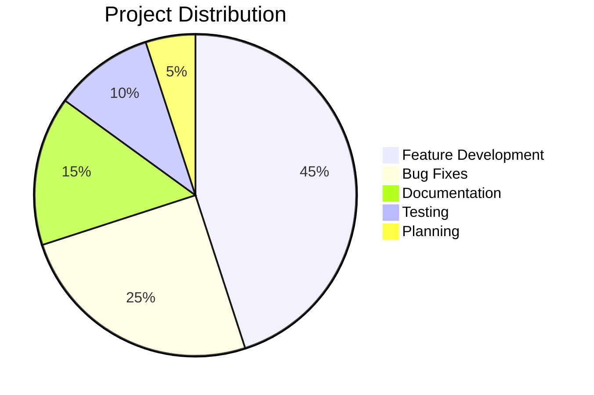

## Diagram Templates

### Project Planning Template

````markdown
# Project Alpha Planning

## Project Overview
[Project description here]

## Workflow Diagram
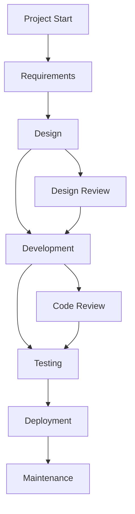
````

### Knowledge Map Template

````markdown
# Knowledge Domain Map

## Overview
[Description of the knowledge domain]

## Concept Relationships
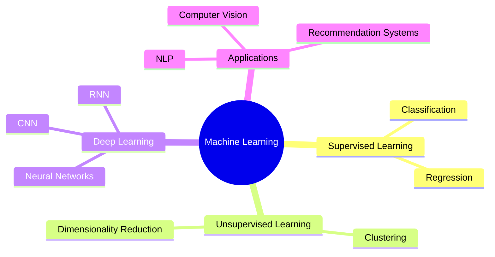
````

### API Documentation Template

````markdown
# User Authentication API

## Authentication Flow
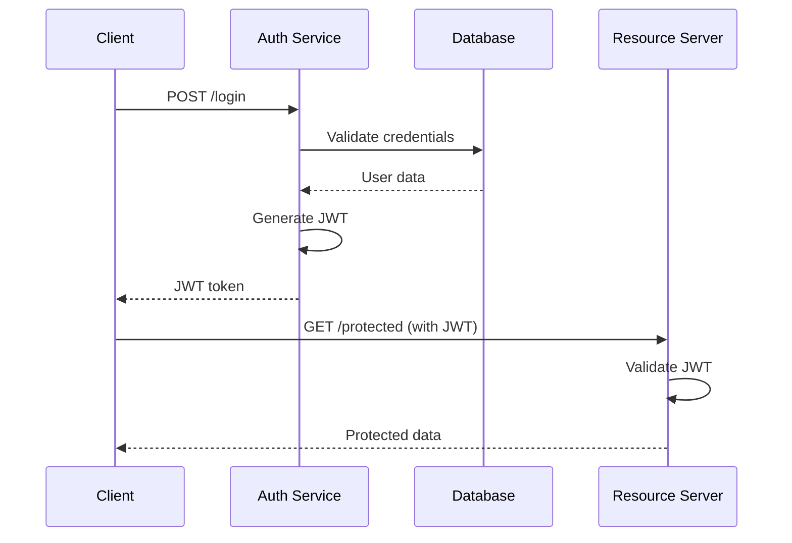
````

## Best Practices

### 1. Keep Diagrams Simple
- Focus on clarity over complexity
- Use descriptive labels
- Avoid overly dense diagrams

### 2. Use Consistent Naming
- Use consistent terminology across diagrams
- Follow naming conventions
- Include units where relevant

### 3. Version Control Friendly
- Store diagrams in dedicated notes
- Use meaningful filenames
- Include diagram descriptions

### 4. Accessibility
- Use high contrast colors when possible
- Include text descriptions
- Ensure diagrams make sense when read aloud

## Integration with Typora

Since Basic Memory integrates with Typora, you can:

1. **Edit diagrams visually** in Typora's live preview
2. **Use Typora's themes** for consistent styling
3. **Export diagrams** to various formats through Typora
4. **Get real-time feedback** on diagram syntax

### Typora Workflow

1. Export note to Typora using `edit_in_typora`
2. Edit diagram in Typora's live preview
3. Save changes and import back with `import_from_typora`
4. Export to HTML to see final rendered result

## Troubleshooting

### Diagrams Not Rendering

**HTML Export Issues:**
- Ensure you're using the latest HTML export tool
- Check browser console for JavaScript errors
- Verify internet connection for CDN resources

**Syntax Errors:**
- Use online Mermaid editor to validate syntax
- Check for missing semicolons or brackets
- Ensure proper indentation

### Performance Issues

**Large Diagrams:**
- Break complex diagrams into smaller ones
- Use subgraphs to organize content
- Consider using external diagram tools for very large diagrams

**Loading Issues:**
- Diagrams load asynchronously - wait for page to fully load
- Check network connectivity for CDN resources
- Try refreshing the page

## Advanced Usage

### Custom Styling

You can customize diagram appearance using Mermaid's configuration:

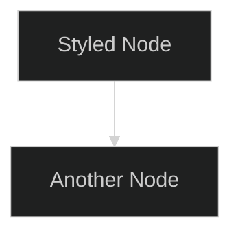

### Interactive Diagrams

Some diagram types support interactivity:

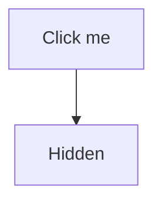

### Integration with Note Links

Combine Mermaid with Basic Memory's linking:

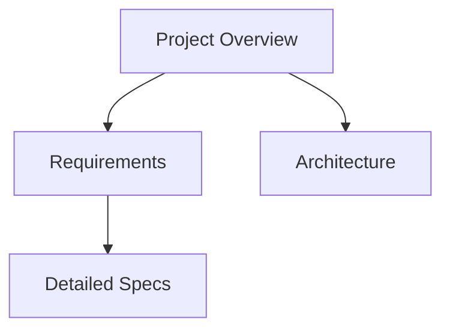

## Examples Gallery

### Decision Tree
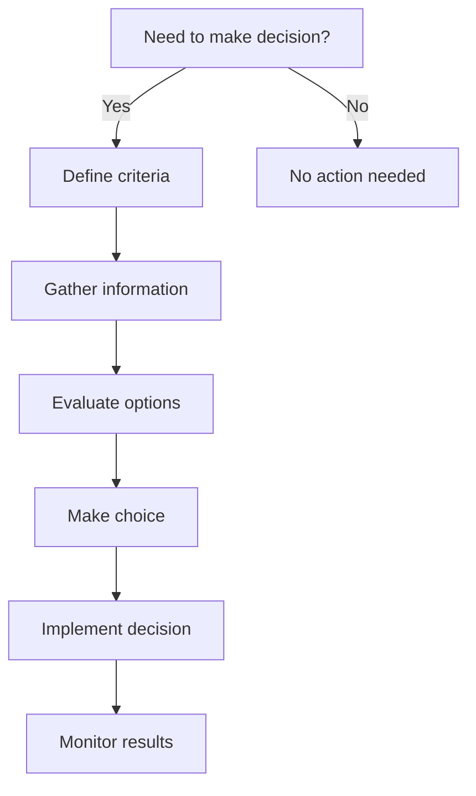

### User Journey
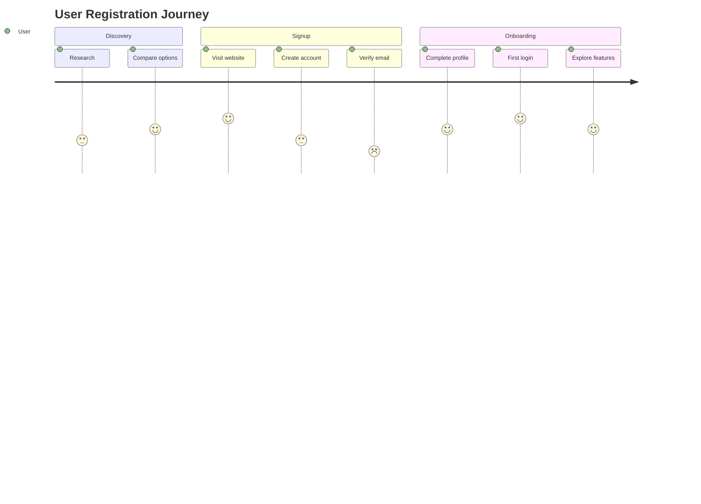

### Git Flow
```mermaid
gitgraph
    commit id: "Initial commit"
    branch develop
    checkout develop
    commit id: "Add feature structure"
    branch feature/login
    checkout feature/login
    commit id: "Implement login form"
    commit id: "Add validation"
    checkout develop
    merge feature/login
    checkout main
    merge develop
    release id: "v1.0.0"
```

## Resources

- [Mermaid Documentation](https://mermaid.js.org/)
- [Mermaid Live Editor](https://mermaid.live/)
- [Typora Mermaid Support](https://support.typora.io/Mermaid/)
- [Mermaid Configuration](https://mermaid.js.org/config/)

## Contributing

Found useful diagram templates or have improvements? Consider:

1. Adding templates to the Basic Memory documentation
2. Sharing diagram patterns with the community
3. Contributing to Mermaid's development

---

*Last updated: [Current Date]*
*Basic Memory Version: 0.14.x*
