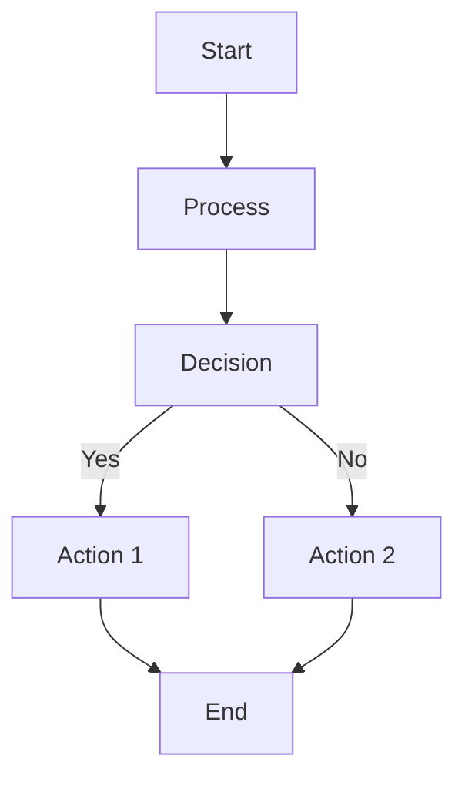
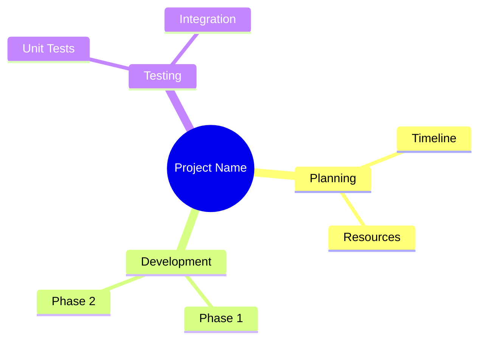

# Mermaid Diagram Integration Plan for Basic Memory

## Executive Summary

This document outlines a comprehensive plan for integrating Mermaid diagram support into Basic Memory. Mermaid is a JavaScript-based diagramming tool that renders text-based diagram definitions, making it an ideal fit for Basic Memory's markdown-based architecture.

**Timeline:** 3 phases over 2-3 months
**Risk Level:** Low (leverages existing infrastructure)
**Business Value:** High (visual thinking support in text-based system)

## Current State Analysis

### Basic Memory Architecture
- Markdown-based knowledge management system
- HTML export capabilities already exist
- Typora integration provides rich editing
- Plain text storage enables full version control
- MCP-based tool system for extensibility

### Mermaid Technology Fit
- **Text-based definitions** → Perfect for git/version control
- **JavaScript rendering** → Integrates with existing HTML export
- **Markdown-native** → Works seamlessly with existing notes
- **Lightweight** → No heavy dependencies or binary formats

### Existing Integration Points
- HTML export tool (`export_html_notes`)
- Typora editing integration (`edit_in_typora`)
- Markdown processing infrastructure
- MCP tool system for new capabilities

## Phase 1: Content-Based Integration (Week 1-2)

### Objectives
- Enable Mermaid diagram storage in regular notes
- Provide rendering capability in HTML exports
- Create documentation and templates
- Minimal code changes, maximum immediate value

### Implementation Tasks

#### 1.1 HTML Export Enhancement
**Status:** Pending
**Priority:** High
**Effort:** 2-3 hours

**Requirements:**
- Detect Mermaid code blocks in notes
- Inject Mermaid.js library into HTML exports
- Auto-render diagrams on page load
- Handle multiple diagrams per note

**Technical Details:**
```html
<!-- Inject into HTML export -->
<script src="https://cdn.jsdelivr.net/npm/mermaid@10/dist/mermaid.min.js"></script>
<script>
  mermaid.initialize({{startOnLoad: true}});
</script>
```

**Files to modify:**
- `src/basic_memory/mcp/tools/export_html_notes.py`

#### 1.2 Documentation and Templates
**Status:** Pending
**Priority:** High
**Effort:** 4-6 hours

**Deliverables:**
- Mermaid usage guide in docs/
- Diagram templates for common use cases
- Example diagrams in template format
- Integration documentation for users

**Template Examples:**
```markdown
## Flowchart Template


## Mind Map Template


#### 1.3 Typora Integration Documentation
**Status:** Pending
**Priority:** Medium
**Effort:** 2 hours

**Content:**
- How to edit Mermaid diagrams in Typora
- Typora's Mermaid preview capabilities
- Export options for diagrams
- Troubleshooting common issues

#### 1.4 Example Content Creation
**Status:** Pending
**Priority:** Medium
**Effort:** 3-4 hours

**Deliverables:**
- Sample notes with embedded diagrams
- Demonstration of different diagram types
- Use case examples for knowledge work

### Phase 1 Success Criteria
- [ ] HTML exports render Mermaid diagrams automatically
- [ ] Documentation provides clear usage instructions
- [ ] Templates available for common diagram types
- [ ] Typora integration documented
- [ ] Example diagrams created and tested

### Phase 1 Testing
- Manual testing of HTML export with Mermaid blocks
- Validation in multiple browsers
- Typora editing workflow verification
- Documentation accuracy review

## Phase 2: Generation Tools (Week 3-6)

### Objectives
- Auto-generate diagrams from note content and relationships
- Create CLI tools for diagram generation
- Enhance search and discovery of diagrams
- Add diagram management features

### Implementation Tasks

#### 2.1 Content Analysis Engine
**Status:** Future
**Priority:** Medium
**Effort:** 2-3 weeks

**Capabilities:**
- Parse note relationships and links
- Extract task dependencies
- Analyze folder hierarchies
- Identify concept relationships

#### 2.2 Diagram Generation Tools
**Status:** Future
**Priority:** Medium
**Effort:** 1-2 weeks

**Tools to create:**
- `generate_mindmap` - Create mind maps from folder structures
- `generate_flowchart` - Generate flowcharts from task lists
- `generate_timeline` - Create Gantt charts from dated content
- `generate_relationships` - ER diagrams from note links

#### 2.3 Diagram Collection Management
**Status:** Future
**Priority:** Low
**Effort:** 1 week

**Features:**
- Special diagram note types
- Diagram templates library
- Version tracking for diagrams
- Search and categorization

#### 2.4 Integration with Existing Tools
**Status:** Future
**Priority:** Medium
**Effort:** 3-5 days

**Enhancements:**
- Export tools include diagram generation options
- Search tools can find diagrams by type/content
- Import tools handle diagram metadata

### Phase 2 Success Criteria
- [ ] CLI tools can generate diagrams from content
- [ ] Diagram search and discovery works
- [ ] Templates library is populated
- [ ] Integration with existing workflows

## Phase 3: Enhanced Integration (Week 7-12)

### Objectives
- Interactive diagram editing capabilities
- Advanced visualization features
- Collaborative diagram workflows
- Performance optimizations

### Implementation Tasks

#### 3.1 Interactive Diagram Editor
**Status:** Future
**Priority:** Low
**Effort:** 3-4 weeks

**Features:**
- Web-based Mermaid editor integration
- Real-time preview in note viewing
- Drag-and-drop diagram construction
- Template-based diagram creation

#### 3.2 Advanced Visualization
**Status:** Future
**Priority:** Low
**Effort:** 2-3 weeks

**Capabilities:**
- Custom diagram themes and styling
- Interactive diagrams with hover effects
- Diagram export to multiple formats
- Batch processing for large diagram sets

#### 3.3 Collaborative Features
**Status:** Future
**Priority:** Low
**Effort:** 1-2 weeks

**Features:**
- Diagram commenting and annotation
- Version comparison for diagrams
- Shared diagram templates
- Diagram usage analytics

#### 3.4 Performance Optimization
**Status:** Future
**Priority:** Medium
**Effort:** 1 week

**Improvements:**
- Lazy loading for large diagram collections
- Caching for frequently used diagrams
- Optimized rendering for complex diagrams
- Memory usage optimization

### Phase 3 Success Criteria
- [ ] Interactive editing works in web interface
- [ ] Advanced visualization features available
- [ ] Performance acceptable for large diagram sets
- [ ] Collaborative workflows functional

## Technical Architecture

### Rendering Architecture

```
Note Content (Markdown + Mermaid)
    ↓
HTML Export Tool
    ↓
Mermaid.js Library Injection
    ↓
Rendered Diagrams in HTML
```

### Storage Architecture

```
Basic Memory Note
├── Frontmatter (YAML)
├── Content (Markdown)
│   └── Mermaid Code Blocks
├── Metadata
└── Relationships
```

### Tool Integration

```
MCP Tools Ecosystem
├── export_html_notes (enhanced)
├── export_docsify (enhanced)
├── edit_in_typora (enhanced)
├── generate_mindmap (new)
├── generate_flowchart (new)
└── diagram_manager (new)
```

## Risk Assessment

### Technical Risks
- **Low:** Mermaid rendering conflicts with existing HTML
- **Low:** Browser compatibility issues
- **Medium:** Performance with complex diagrams
- **Low:** Mermaid library version conflicts

### Mitigation Strategies
- Comprehensive testing across browsers
- Graceful fallback for unsupported diagrams
- Lazy loading for performance
- Version pinning for stability

### Business Risks
- **Low:** User adoption - optional feature
- **Low:** Maintenance overhead - text-based
- **Medium:** Feature complexity - start simple
- **Low:** Third-party dependency - CDN hosted

## Success Metrics

### Phase 1 Metrics (Immediate)
- HTML exports successfully render Mermaid diagrams
- Documentation page views and user feedback
- Template downloads and usage
- Typora integration adoption

### Phase 2 Metrics (3 months)
- CLI tool usage statistics
- Generated diagram count
- Search/discovery feature usage
- Template library growth

### Phase 3 Metrics (6 months)
- Interactive editor usage
- Advanced feature adoption
- Performance metrics
- Collaborative workflow usage

## Resource Requirements

### Phase 1 Resources
- **Development:** 1 developer × 2 weeks
- **Testing:** 2-3 hours manual testing
- **Documentation:** 4-6 hours writing
- **Design:** 2 hours for templates/examples

### Phase 2 Resources
- **Development:** 1-2 developers × 4-6 weeks
- **Testing:** 1 week comprehensive testing
- **Documentation:** 1 week user guides
- **Design:** 1 week for advanced features

### Phase 3 Resources
- **Development:** 2 developers × 6-8 weeks
- **Testing:** 2 weeks integration testing
- **Documentation:** 2 weeks comprehensive docs
- **Design:** 2 weeks UX/UI work

## Dependencies and Prerequisites

### Phase 1 Dependencies
- ✅ HTML export tool (already exists)
- ✅ MCP tool system (already exists)
- ✅ Basic markdown processing (already exists)
- ✅ Documentation infrastructure (already exists)

### Phase 2 Dependencies
- ✅ Phase 1 completion
- ✅ Content analysis capabilities
- ✅ CLI tool framework (exists)
- ✅ Search infrastructure (exists)

### Phase 3 Dependencies
- ✅ Phase 2 completion
- ✅ Web interface capabilities
- ✅ Real-time collaboration features
- ✅ Advanced visualization libraries

## Migration and Compatibility

### Backward Compatibility
- ✅ Existing notes continue to work unchanged
- ✅ No database schema changes required
- ✅ All existing tools remain functional
- ✅ Optional feature - no breaking changes

### Forward Compatibility
- Mermaid syntax is stable and backward compatible
- HTML export enhancements are additive
- New tools are opt-in features
- Version control preserves all diagram history

## Conclusion and Recommendations

### Phase 1 Recommendation: **Proceed Immediately**
- Low risk, high immediate value
- Builds on existing infrastructure
- Provides quick wins for users
- Sets foundation for future phases

### Overall Assessment: **Strong Go Recommendation**
- **Technical Fit:** Excellent (text-based, markdown-native)
- **Business Value:** High (visual thinking enhancement)
- **Implementation Risk:** Low (incremental approach)
- **Maintenance Cost:** Low (CDN-based, text-only)
- **User Demand:** Expected to be high

### Next Steps
1. Begin Phase 1 implementation immediately
2. Create detailed task breakdown and timeline
3. Set up monitoring for success metrics
4. Plan Phase 2 based on Phase 1 feedback

---

*This plan is living document and will be updated as implementation progresses.*
*Last updated: [Current Date]*
