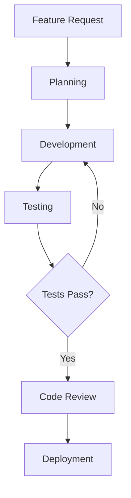

# Memory Writing Guide
## Creating Notes and Organizing Your Knowledge Base

## ✍️ Creating Your First Notes

### Basic Note Creation

Ask Claude to create notes during conversations:

```
You: "Create a note about Python list comprehensions"
Claude: ✓ Created note: "Python List Comprehensions"

Content:
# Python List Comprehensions

## Basic Syntax
```python
[expression for item in iterable if condition]
```

## Examples
- `[x**2 for x in range(10)]` → `[0, 1, 4, 9, 16, ...]`
- `[x for x in range(20) if x % 2 == 0]` → even numbers

## When to Use
- Transforming data
- Filtering collections
- Creating new lists from existing ones

## Related Concepts
- [[Generator Expressions]]
- [[Map and Filter Functions]]
```

Behind the scenes, this creates a Markdown file with proper formatting.

### Adding Context and Details

```
You: "Add more details to my list comprehensions note about nested comprehensions"
Claude: ✓ Updated note: "Python List Comprehensions"

Added section:
## Nested Comprehensions
```python
# Matrix creation
matrix = [[i*j for j in range(3)] for i in range(3)]
# Result: [[0, 0, 0], [0, 1, 2], [0, 2, 4]]

# Flattening nested lists
nested = [[1, 2], [3, 4], [5, 6]]
flat = [item for sublist in nested for item in sublist]
# Result: [1, 2, 3, 4, 5, 6]
```
```

## 📁 Organizing Your Content

### Folder Structure

Create logical organization:

```
You: "Create a note about React hooks in my frontend development folder"
Claude: ✓ Created note in frontend-development/react-hooks.md
```

**Recommended structure**:
```
knowledge-base/
├── development/
│   ├── python/
│   ├── javascript/
│   └── tools/
├── research/
│   ├── ai/
│   └── philosophy/
├── cooking/
│   ├── techniques/
│   └── recipes/
└── personal/
    ├── goals/
    └── journal/
```

### Tags for Cross-Cutting Themes

```
You: "Tag my React hooks note with 'javascript', 'frontend', and 'react'"
Claude: ✓ Tagged note with: javascript, frontend, react
```

**Tagging strategy**:
- **Broad categories**: `javascript`, `python`, `cooking`
- **Techniques**: `async`, `testing`, `optimization`
- **Domains**: `web-dev`, `data-science`, `philosophy`
- **Status**: `draft`, `review`, `complete`

## 🔗 Building Knowledge Connections

### Wikilinks Between Notes

Create connections automatically:

```
You: "Create a note about async programming that links to my decorators note"
Claude: ✓ Created note: "Async Programming Patterns"

The note includes:
# Async Programming Patterns

## Core Concepts
- [[Python Decorators]] - Using decorators with async functions
- [[Event Loops]] - How Python handles concurrency
- [[Coroutines]] - The building blocks of async code

## Key Patterns
1. **Async Context Managers**
2. **Async Generators**
3. **Task Groups** (Python 3.11+)
```

### Bidirectional Linking

Links work both ways:
- Note A links to Note B → Note B can show "linked from Note A"
- Connections are automatically discovered and maintained
- Use this for related concepts, prerequisites, or follow-ups

## 📝 Note Templates

### Using Built-in Templates

```
You: "Create a meeting notes template"
Claude: ✓ Created template: "Meeting Notes"

Template structure:
# Meeting: [Title]

**Date:** [Date]
**Attendees:** [List]
**Location:** [Physical/Virtual]

## Agenda
- [ ] Item 1
- [ ] Item 2

## Discussion
### Topic 1
[Notes]

### Topic 2
[Notes]

## Action Items
- [ ] [Person]: [Task] - [Due Date]

## Next Meeting
[Date/Time]
```

### Custom Templates

Create templates for recurring content:

```
You: "Create a book review template"
Claude: ✓ Created template: "Book Review"

Includes sections for:
- Basic info (title, author, genre)
- Initial impressions
- Key takeaways
- Favorite quotes
- Rating and recommendations
```

## 🎨 Advanced Note Types

### Project Notes

```
You: "Create a project tracking note for my web app"
Claude: ✓ Created note: "Web App Development"

Structure:
# Web App Development Project

## Overview
[Project description and goals]

## Current Status
🟡 **In Progress** - MVP development phase

## Milestones
- [x] Project setup (Week 1)
- [ ] Core features (Week 2-3)
- [ ] Testing (Week 4)
- [ ] Deployment (Week 5)

## Technologies
- [[React]] - Frontend framework
- [[FastAPI]] - Backend API
- [[PostgreSQL]] - Database

## Key Decisions
- [Decision and rationale]

## Next Steps
[Immediate priorities]
```

### Research Notes

```
You: "Create a research note about quantum computing"
Claude: ✓ Created note: "Quantum Computing Research"

Includes:
- Key concepts and definitions
- Current state of the field
- Major breakthroughs
- Open questions and challenges
- Related papers and resources
- Personal thoughts and connections
```

### Recipe Notes

```
You: "Create a recipe note for homemade pizza dough"
Claude: ✓ Created note in cooking/recipes/pizza-dough.md

Recipe format:
# Homemade Pizza Dough

**Prep Time:** 15 minutes + 2 hours rising
**Cook Time:** 12-15 minutes
**Servings:** 4 personal pizzas

## Ingredients
- 500g bread flour (or all-purpose)
- 325ml warm water
- 7g active dry yeast
- 2 tsp salt
- 2 tbsp olive oil

## Instructions
1. [Step-by-step directions]
2. [Tips and variations]
3. [Storage instructions]

## Related Recipes
- [[Margherita Pizza]]
- [[Deep Dish Pizza]]
- [[Calzone]]
```

## 🔄 Iterative Refinement

### Starting Simple

Begin with basic notes and expand:

```
# Initial note
You: "Create a note about Docker basics"
Claude: ✓ Basic Docker concepts covered

# Later additions
You: "Add Docker Compose examples to my Docker note"
You: "Link my Docker note to containerization concepts"
You: "Add troubleshooting section to Docker note"
```

### Regular Review and Updates

```
You: "Review my notes from last month and suggest updates"
Claude: Found 23 notes from last month. Suggestions:

1. **Python Async Note** - Add Python 3.11 task groups
2. **React Hooks Note** - Include new hooks from React 18
3. **Cooking Techniques** - Add sous-vide method
4. **Philosophy Reading** - Connect to existentialism concepts

Which would you like me to update?
```

## 🏷️ Metadata and Frontmatter

### Automatic Metadata

Notes automatically include:
```yaml
---
created: 2024-01-15T10:30:00Z
modified: 2024-01-15T14:45:00Z
tags: [python, tutorial, beginners]
links: [[Python Basics]], [[Functions]]
---
```

### Custom Frontmatter

Add custom metadata:

```
You: "Add frontmatter to my project note with priority: high and status: active"
Claude: ✓ Added frontmatter:

---
priority: high
status: active
start_date: 2024-01-01
deadline: 2024-03-01
team: [alice, bob, charlie]
---
```

## 📊 Content Quality Guidelines

### Note Structure

**Good note structure**:
- Clear, descriptive title
- Logical sections with headers
- Code examples where relevant
- Wikilinks to related concepts
- Actionable information

**Avoid**:
- Vague titles like "Notes" or "Stuff"
- Walls of unstructured text
- Missing connections to other notes
- Outdated information

### Content Principles

**One idea per note**: Keep notes focused
- Good: "Python List Comprehensions"
- Bad: "Python Stuff" (too broad)

**Descriptive titles**: Make notes findable
- Good: "JWT Token Authentication in FastAPI"
- Bad: "Auth Stuff"

**Progressive disclosure**: Start simple, add complexity
- Basic explanation first
- Advanced concepts in separate sections
- Links to deeper dives

## 🛠️ Advanced Writing Features

### Code Blocks and Syntax Highlighting

```
You: "Add a code example to my algorithms note"
Claude: ✓ Added syntax-highlighted code:

```python
def binary_search(arr, target):
    left, right = 0, len(arr) - 1
    while left <= right:
        mid = (left + right) // 2
        if arr[mid] == target:
            return mid
        elif arr[mid] < target:
            left = mid + 1
        else:
            right = mid - 1
    return -1
```
```

### Tables and Structured Data

```
You: "Create a comparison table of Python web frameworks"
Claude: ✓ Created comparison table:

| Framework | Async Support | ORM Included | Learning Curve |
|-----------|---------------|--------------|----------------|
| FastAPI   | ✅ Native     | ❌ Optional  | Medium         |
| Django    | ❌ Limited    | ✅ Built-in  | High           |
| Flask     | ⚠️ Extensions | ❌ Optional  | Low            |
| Starlette | ✅ Native     | ❌ None      | High           |
```

### Mermaid Diagrams

```
You: "Add a flowchart to my development workflow note"
Claude: ✓ Added Mermaid diagram:


```

## 🔄 Version History and Backups

### Automatic Backups

Advanced Memory automatically:
- Saves versions on every edit
- Maintains backup copies
- Preserves content integrity

### Manual Backups

```
You: "Export all my development notes as a backup"
Claude: ✓ Exported 47 notes to development-notes-backup.zip
```

## 💡 Best Practices

### Daily Habits

1. **Create notes immediately** - Capture ideas while fresh
2. **Link as you go** - Connect new notes to existing ones
3. **Review weekly** - Update and refine old notes
4. **Tag consistently** - Use standardized tag names

### Quality Standards

1. **Be specific** - "Python async/await syntax" vs "Python stuff"
2. **Include examples** - Code, diagrams, or concrete examples
3. **Add context** - Why this matters, when to use it
4. **Link liberally** - Connect to prerequisites and related concepts

### Organization Philosophy

1. **Bottom-up linking** - Let connections emerge naturally
2. **Progressive refinement** - Start simple, add complexity over time
3. **Personal context** - Include why topics matter to you
4. **Living documents** - Update notes as your understanding evolves

## 🆘 Troubleshooting

### "Note creation failed"

**Causes**:
- File permission issues
- Invalid folder paths
- Disk space full

**Solutions**:
```bash
# Check permissions
ls -la ~/.advanced-memory/

# Verify disk space
df -h

# Restart sync
advanced-memory sync --force
```

### Notes not appearing in search

**Causes**:
- Sync not running
- Database indexing issues
- File encoding problems

**Solutions**:
```bash
# Force reindex
advanced-memory reindex

# Check sync status
advanced-memory status

# Restart MCP server
# (Restart Claude Desktop)
```

### Broken wikilinks

**Causes**:
- Note titles changed
- Typos in link syntax
- Case sensitivity issues

**Solutions**:
```
You: "Find and fix broken links in my notes"
Claude: Found 3 broken links. Fixed:
- [[pyhton-basics]] → [[Python Basics]]
- [[async programing]] → [[Async Programming]]
- [[react-hooks-guide]] → [[React Hooks]]
```

## 🎯 Next Steps

Now that you know how to create and organize content:

- [Memory Access Guide](memory-access.md) - Learn to read and search your notes
- [Zettelkasten System](../zettelkasten/) - Build an advanced knowledge system
- [Integrations](../integrations/) - Connect with other tools

---

**Ready to create your knowledge empire?** Start with one note today - the journey of a thousand insights begins with a single `[[Note Link]]`!

*Write now, connect later, discover forever! ✍️🔗*
