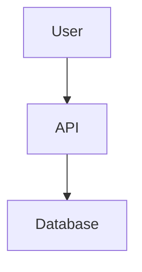
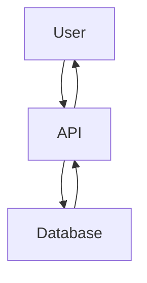
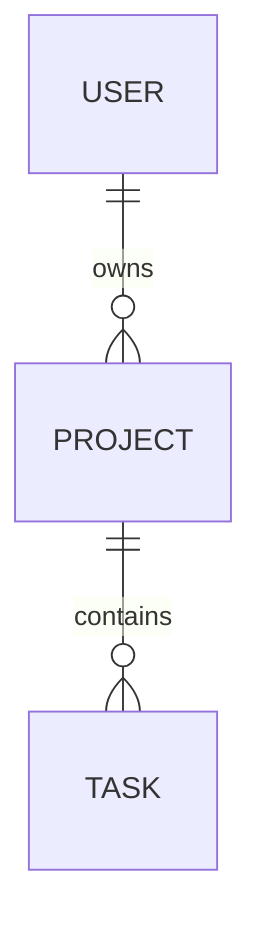
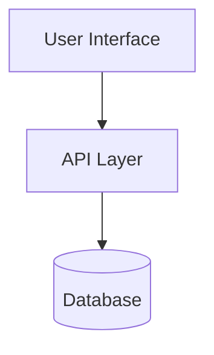

# Viewing Mermaid Diagrams in Advanced Memory

**UPDATE**: We now have `view_note_rendered` - see rendered diagrams directly in Claude! 🎉

**TL;DR**: 
- **NEW**: Use `view_note_rendered("Note Name")` for rendered diagrams in Claude ✅
- **OLD**: `view_note` shows code blocks only
- **EXPORT**: HTML exports also render diagrams

---

## The Situation

### What Happens When You Use `view_note`

When Claude views a note with Mermaid:

```markdown
# System Architecture


```

**Claude sees this as**:
- Markdown artifact ✅
- Code block with "mermaid" language tag ✅
- **Rendered diagram? ❌ NO**

### Why Not?

**Mermaid rendering requires**:
- JavaScript (Mermaid.js library)
- Browser/HTML environment
- CDN or local Mermaid files

**Claude artifacts are**:
- Static markdown rendering
- No JavaScript execution
- Can't load external libraries

---

## How to See Rendered Diagrams

### Method 1: New Rendering Tool (Best for Claude!) ✨

**Use `view_note_rendered`**:

```python
# See rendered Mermaid diagrams directly in Claude!
view_note_rendered("System Architecture")

# With theme options
view_note_rendered("Database Schema", theme="dark")
```

**What you get**:
1. ✅ HTML artifact in Claude
2. ✅ Mermaid diagrams render beautifully
3. ✅ Professional styling
4. ✅ Interactive viewing
5. ✅ No export needed!

**Requirements**: Internet connection (Mermaid.js CDN)

**See full guide**: `docs/user-guide/viewing-rendered-notes.md`

### Method 2: Export to HTML

**Use Advanced Memory's HTML export**:

```python
# Export notes to HTML with Mermaid rendering
adn_export("html", export_path="site/", source_folder="/")
```

**What happens**:
1. ✅ Creates HTML files with Mermaid.js CDN
2. ✅ Automatically renders all diagrams
3. ✅ Searchable website with TOC
4. ✅ Open `index.html` in browser

**Result**: Beautiful rendered diagrams!

### Method 3: View in Obsidian/Typora

**Export to Obsidian format**:
```python
# These apps have native Mermaid support
# Just save .md files with Mermaid syntax
```

**Viewers with native Mermaid**:
- Obsidian ✅
- Typora ✅
- GitHub (preview) ✅
- VS Code (with extension) ✅
- Claude Desktop ❌ NO

### Method 4: Use Mermaid Live Editor

**For quick testing**:
1. Copy Mermaid code
2. Visit: https://mermaid.live/
3. See rendered diagram
4. Export as PNG/SVG if needed

---

## Workarounds in Claude

### Option A: Describe the Diagram

When viewing in Claude, the code itself is still readable:

```markdown
# System Flow

The following Mermaid diagram shows:
- User connects to API
- API queries Database
- Results return to User



**Mental Model**: Triangle pattern with bidirectional flows
```

### Option B: Use ASCII Art

For simple diagrams, ASCII works in Claude:

```markdown
# System Flow

```
User
  |
  v
 API
  |
  v
Database
```
```

### Option C: Request Export

**Ask Claude**:
> "Export this project to HTML so I can see the Mermaid diagrams rendered"

Claude can run:
```python
adn_export("html", export_path="rendered/", source_folder="my-notes")
```

Then you view in browser.

---

## Best Practices

### When Writing Notes with Mermaid

**Always include text description**:

```markdown
# Database Schema

This diagram shows the relationship between Users, Projects, and Tasks:
- One User has many Projects
- One Project has many Tasks
- Tasks belong to exactly one Project



**Why?**
- ✅ Readable in Claude (text)
- ✅ Rendered in HTML (diagram)
- ✅ Accessible to all viewers
- ✅ Searchable text content

### For Skills Export

**Include both**:

```markdown
---
name: system-architecture
description: Understanding our system architecture
---

# System Architecture

**Overview**: Three-tier architecture with user interface, API layer, and database.

**Diagram** (renders in HTML):


**Components**:
1. **User Interface**: Web/mobile frontend
2. **API Layer**: REST endpoints
3. **Database**: PostgreSQL storage
```

---

## Summary Table

| Viewing Method | Mermaid Renders? | Use Case |
|----------------|------------------|----------|
| **`view_note_rendered`** | ✅ **YES (NEW!)** | **Best for Claude - instant rendered diagrams** |
| `view_note` in Claude | ❌ NO (code only) | Quick text reference |
| Export to HTML | ✅ YES | Sharing, multiple notes, offline |
| Obsidian | ✅ YES | Personal knowledge base |
| Typora | ✅ YES | WYSIWYG editing |
| GitHub preview | ✅ YES | Documentation |
| VS Code + extension | ✅ YES | Development |

---

## Future Possibilities

### Potential Enhancement (v1.2+)

**Static diagram rendering**:
- Pre-render Mermaid to PNG/SVG
- Embed as images in notes
- Claude sees rendered image

**Effort**: 20+ hours

**Priority**: Medium (wait for demand)

---

## Recommendation

**For now**:
1. ✅ **Write Mermaid in notes** (future-proof, portable)
2. ✅ **Include text descriptions** (Claude can read these)
3. ✅ **Export to HTML** when you need to see diagrams
4. ✅ **Don't worry** - the content is still valuable as code

**When you need visuals**:
```python
# Quick command
adn_export("html", export_path="diagrams/")
# Open diagrams/index.html in browser
```

**The workflow**:
- Work in Claude: Read/write content (Mermaid as code)
- Export when done: View rendered diagrams (HTML)
- Best of both: Flexible editing + visual output

