# Viewing Notes with Rendered Mermaid Diagrams

**NEW TOOL**: `view_note_rendered` - See beautiful Mermaid diagrams right in Claude!

---

## The Magic ✨

Instead of seeing Mermaid as code blocks:

````markdown

````

You get **rendered diagrams** in an interactive HTML artifact!

---

## How to Use

### Basic Usage

```python
# Just use the new tool
view_note_rendered("System Architecture")
```

**What happens**:
1. ✅ Reads the note
2. ✅ Converts markdown → HTML
3. ✅ Injects Mermaid.js from CDN
4. ✅ Returns HTML artifact
5. ✅ Claude displays with **rendered diagrams**!

### With Theme Options

```python
# Dark theme for Mermaid diagrams
view_note_rendered("Database Schema", theme="dark")

# Available themes: "default", "dark", "forest", "neutral", "base"
```

### Example

**Your note** (`notes/architecture.md`):
```markdown
# System Architecture

Our system has three main components:

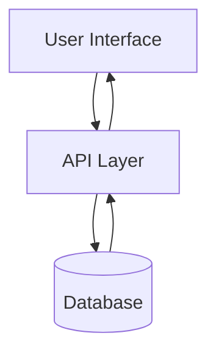

## Components

- **UI**: React frontend
- **API**: FastAPI backend  
- **DB**: PostgreSQL database
```

**Command**:
```python
view_note_rendered("System Architecture")
```

**Result in Claude**:
- ✅ Full formatted HTML
- ✅ **Diagram renders beautifully** (not code!)
- ✅ Professional styling
- ✅ Interactive (where Mermaid supports it)

---

## Comparison

### `view_note` (Regular)

**Returns**: Markdown artifact

```markdown
# System Architecture

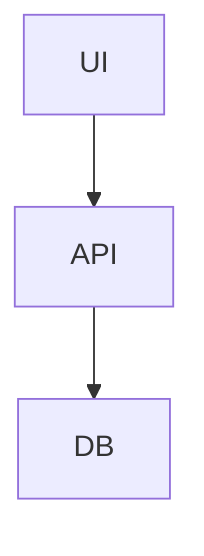
```

**Diagrams**: Code blocks (not rendered)

### `view_note_rendered` (New!)

**Returns**: HTML artifact with Mermaid.js

**Diagrams**: ✅ **RENDERED!** Actual visual flowcharts, sequence diagrams, etc.

---

## Supported Mermaid Types

All standard Mermaid diagrams work:

### Flowcharts
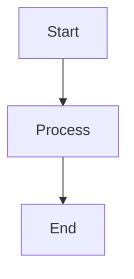

### Sequence Diagrams
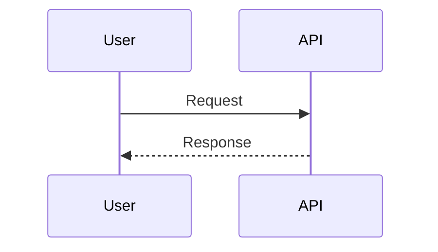

### Gantt Charts
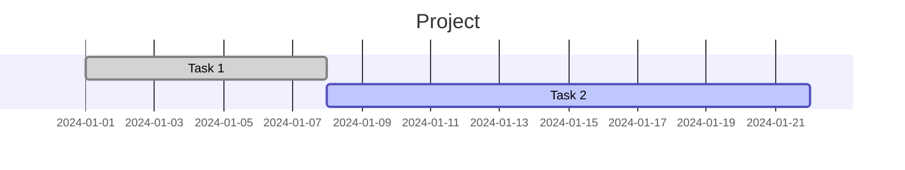

### Mind Maps
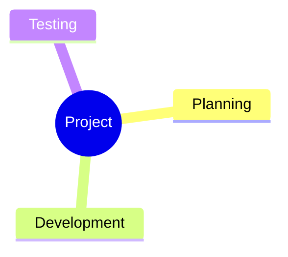

### ER Diagrams
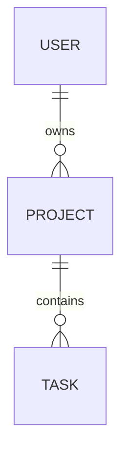

### Class Diagrams
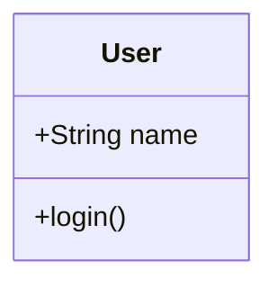

### State Diagrams
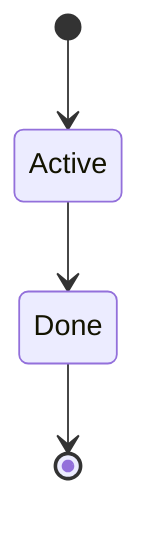

---

## Technical Details

### How It Works

1. **Reads note content** (same as `view_note`)
2. **Converts markdown → HTML** (Python markdown library)
3. **Injects Mermaid.js** from CDN (https://cdn.jsdelivr.net/npm/mermaid@10)
4. **JavaScript processing**: Converts `<code class="language-mermaid">` to `<div class="mermaid">`
5. **Mermaid renders**: Diagrams appear as SVG graphics
6. **Returns HTML artifact**: Claude displays the result

### Requirements

- ✅ **Internet connection** (for Mermaid.js CDN)
- ✅ **Claude Desktop** (or any interface supporting HTML artifacts)
- ✅ **No special setup** (works out of the box)

### Styling

**Automatic features**:
- Clean, readable typography
- GitHub-style markdown rendering
- Syntax highlighting for code
- Responsive tables
- Professional diagram styling

---

## Use Cases

### 1. Technical Documentation

```python
# View architecture docs with diagrams
view_note_rendered("API Documentation")
```

**Perfect for**:
- System architecture diagrams
- API flow sequences
- Database schemas
- Process workflows

### 2. Project Planning

```python
# See project timelines rendered
view_note_rendered("Project Timeline", theme="forest")
```

**Perfect for**:
- Gantt charts
- Task dependencies
- Milestone tracking

### 3. Knowledge Visualization

```python
# View mind maps and concept relationships
view_note_rendered("Machine Learning Concepts")
```

**Perfect for**:
- Mind maps
- Concept hierarchies
- Knowledge graphs

### 4. Skills with Diagrams

```python
# View Claude Skills with visual aids
view_note_rendered("deployment-workflow")
```

**Perfect for**:
- Skills instructions with flowcharts
- Step-by-step visual guides
- Process documentation

---

## Tips & Tricks

### 1. Theme Selection

**Choose theme based on content**:
- `default` - Standard, colorful
- `dark` - Dark mode (light text on dark)
- `forest` - Green/natural theme
- `neutral` - Grayscale, professional
- `base` - Minimal, clean

### 2. Combining with Text

**Always include text descriptions**:

```markdown
# System Flow

**Overview**: User requests flow through API to database and back.

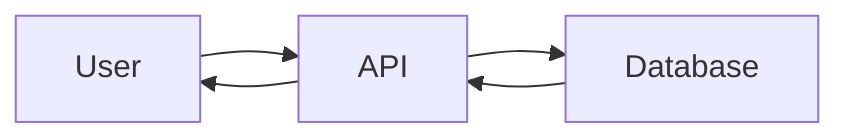

**Key points**:
- Stateless API layer
- Direct database access
- Round-trip architecture
```

**Why?**
- Text is searchable
- Diagram is visual
- Both together = clarity

### 3. Complex Diagrams

**For large diagrams**:
- Break into multiple smaller diagrams
- Use subgraphs for organization
- Keep labels concise

### 4. Testing Diagrams

**Before viewing in Claude**:
1. Test syntax at https://mermaid.live/
2. Copy working code to note
3. View with `view_note_rendered`

---

## Troubleshooting

### Diagram Not Rendering

**Symptoms**: Empty space or code block instead of diagram

**Fixes**:
1. **Check syntax**: Use https://mermaid.live/ to validate
2. **Internet connection**: Mermaid.js loads from CDN
3. **Code block format**: Must be `` ```mermaid `` (with backticks and "mermaid" language tag)

### Slow Loading

**Symptoms**: Delay before diagram appears

**Why**: CDN loading + diagram rendering time

**Normal**: 1-3 seconds for complex diagrams

### Theme Not Applied

**Symptoms**: Diagram appears in default theme

**Fix**: Check theme spelling (must be one of: `default`, `dark`, `forest`, `neutral`, `base`)

---

## Comparison Matrix

| Feature | `view_note` | `view_note_rendered` | Export HTML |
|---------|-------------|---------------------|-------------|
| Mermaid Rendering | ❌ Code only | ✅ Rendered | ✅ Rendered |
| Artifact Type | Markdown | HTML | File |
| Internet Required | No | Yes (CDN) | No (offline) |
| Speed | Instant | 1-3s | Minutes |
| Multiple Notes | No | No | Yes |
| Styling | Basic | Professional | Professional |
| Best For | Quick read | Visual content | Sharing/archiving |

---

## When to Use Each Tool

### Use `view_note` when:
- ✅ Quick text content check
- ✅ No diagrams in note
- ✅ Offline environment
- ✅ Speed is priority

### Use `view_note_rendered` when:
- ✅ **Visualizing diagrams** (main use case!)
- ✅ Rich formatted content
- ✅ Professional presentation needed
- ✅ Online and have 1-3 seconds

### Use Export HTML when:
- ✅ Sharing with others
- ✅ Multiple notes to view
- ✅ Offline viewing needed
- ✅ Creating documentation site

---

## Advanced Usage

### Custom Styling

**Future enhancement**: Custom CSS themes

**Current**: Use Mermaid's built-in themes

### Batch Viewing

**Not currently supported**: One note at a time

**Workaround**: Use `adn_export("html", ...)` for multiple notes

### Integration with Skills

**Skills can include Mermaid**:

```markdown
---
name: deployment-process
description: How to deploy our application
---

# Deployment Process

Follow this workflow:

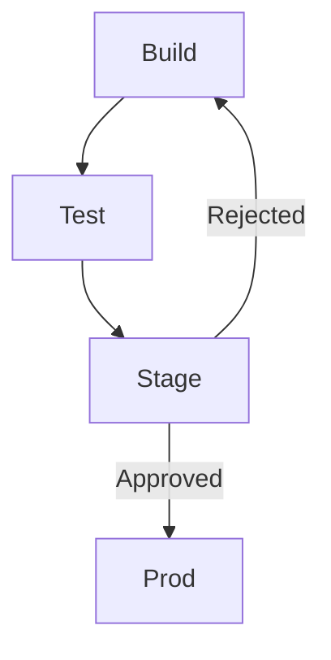

1. Build application
2. Run tests
3. Deploy to staging
4. Get approval
5. Deploy to production
```

**View with**:
```python
view_note_rendered("deployment-process")
```

---

## Summary

**New capability**: See beautiful rendered Mermaid diagrams directly in Claude!

**How**: `view_note_rendered("Your Note Name")`

**Result**: Interactive HTML artifact with live diagram rendering

**Requirements**: Internet connection (for Mermaid.js CDN)

**Tool count**: 11 tools total (stays under Cursor's 50-tool limit)

**Status**: ✅ Available now in both standard and MCPB versions!

🎉 **Enjoy your beautifully rendered diagrams!**


