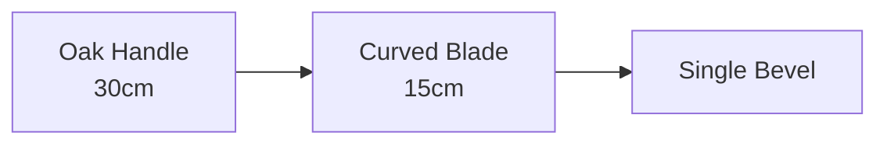

# Visual Content in Zettelkasten/Skills - Analysis

**Question**: Should we support lightweight graphical content (line drawings, diagrams, visual depictions)?

---

## Current State

### What We Already Have ✅

**Mermaid diagrams** (text-to-graphic):
```markdown


**Advantages**:
- ✅ Text-based (version control friendly)
- ✅ Renders in viewers (Obsidian, GitHub, our exports)
- ✅ Flowcharts, sequence diagrams, mind maps
- ✅ No external files needed

**Current export support**:
- HTML exports: Mermaid renders via JS
- Obsidian: Native Mermaid support
- GitHub: Native rendering

---

## Proposed: Lightweight Graphics

### Use Cases

**Valid knowledge scenarios**:
1. **Tool identification**: "Japanese hatchet" - show shape/features
2. **Concept visualization**: "Byzantine architecture" - show arch types
3. **Process diagrams**: Already covered by Mermaid
4. **Spatial relationships**: "Room layout" - quick sketch

**Skills-specific**:
- Visual context for instructions
- "What it should look like" reference
- Quick recognition aids

### Format Options

#### 1. ASCII Art (Ultra-lightweight)

```markdown
Japanese Hatchet (nata):

    handle
      |
      |
   /===\  <- blade
  /     \
 /       \
```

**Pros**:
- ✅ Text-based (zero infrastructure)
- ✅ Works everywhere (even plain text)
- ✅ Version control friendly
- ✅ No dependencies

**Cons**:
- ❌ Limited detail
- ❌ Crude appearance
- ❌ Time-consuming to create

#### 2. Inline SVG (Lightweight Vector)

```markdown
<svg width="100" height="100">
  <path d="M10,10 L90,90" stroke="black"/>
  <circle cx="50" cy="50" r="40"/>
</svg>
```

**Pros**:
- ✅ Scalable (vector)
- ✅ Text-based (version control OK)
- ✅ Renders in HTML/modern viewers
- ✅ Small file size

**Cons**:
- ❌ Requires SVG knowledge
- ❌ Not all viewers support inline SVG
- ❌ Can be verbose

#### 3. Base64 Embedded Images

```markdown

```

**Pros**:
- ✅ Self-contained (no external files)
- ✅ Works in most markdown renderers
- ✅ Supports photos/detailed images

**Cons**:
- ❌ Not human-readable
- ❌ Version control unfriendly (binary blob)
- ❌ Large file sizes
- ❌ Bloats markdown files

#### 4. External Image References

```markdown

```

**Pros**:
- ✅ Clean markdown
- ✅ Efficient storage
- ✅ Easy to update images
- ✅ Supports any image format

**Cons**:
- ❌ External dependency
- ❌ Breaks portability
- ❌ File management overhead
- ❌ Links can break

#### 5. Unicode/Emoji (Super-lightweight)

```markdown
Japanese hatchet 🪓
Byzantine arch ⛪
Network topology 🕸️
```

**Pros**:
- ✅ Zero infrastructure
- ✅ Works everywhere
- ✅ Version control friendly
- ✅ Quick visual markers

**Cons**:
- ❌ Very limited detail
- ❌ Not actual depictions
- ❌ Limited vocabulary

---

## Decision Framework

### Is This Feature Creep? 🤔

**NO, if**:
- ✅ Uses existing markdown capabilities
- ✅ Enhances knowledge without new infrastructure
- ✅ Remains text-based (version control friendly)
- ✅ Doesn't break current workflows

**YES, if**:
- ❌ Requires custom rendering engine
- ❌ Needs image management system
- ❌ Breaks portability
- ❌ Adds significant complexity

### Recommended Approach

#### Tier 1: Already Supported (Use Now!)

1. **Mermaid diagrams** - Complex visual structures
2. **External images** - Markdown already supports this
3. **Unicode/Emoji** - Quick visual markers

**Action**: Document best practices, no code needed

#### Tier 2: Low-Hanging Fruit

1. **ASCII art** - Works now, just encourage it
2. **SVG inline** - HTML exports already handle it

**Action**: Add examples to templates

#### Tier 3: Future Enhancement (v1.2+)

1. **Image asset management**:
   - Central `images/` directory
   - Relative path resolution
   - Export bundles images with content

2. **Drawing tool integration**:
   - Excalidraw support (like Obsidian)
   - SVG sketching
   - Diagram editor

**Action**: Plan for future if demand exists

---

## Recommendation

### For v1.0 (Current)

**Support what works today**:

```markdown
# Japanese Hatchet (Nata)

Traditional woodworking tool from Japan.

## Visual Reference

### Mermaid (Structure)


### ASCII (Quick Sketch)
```
     Handle
        |
        |
     /===\    <- Blade (curved)
    /     \
   /       \
  +---------+
```

### External Image (Detailed)


## Key Features
- Single-bevel blade (like chisel)
- 🪓 Curved cutting edge
- Oak or ash handle
```

**This works NOW** with zero new code!

### For Skills Export

**Claude Skills support markdown images**:
```yaml
---
name: japanese-woodworking-tools
description: Guide to traditional Japanese woodworking tools
---

# Japanese Woodworking Tools

## Nata (Hatchet)


Used for rough shaping and splitting.

### Key Features
- Single-bevel blade
- Curved edge for control
- 🪓 Weight: 400-600g
```

**If bundling images**:
- Export creates `skills/japanese-woodworking-tools/` directory
- Copies referenced images
- Skills can include `/images/` subdirectory

---

## Implementation Plan

### Phase 1: Documentation (v1.0.1) - Now

1. **Best practices doc**:
   - When to use Mermaid vs. ASCII vs. images
   - How to reference images
   - Examples in templates

2. **Template updates**:
   - Add visual examples
   - Show Mermaid patterns
   - Include ASCII art examples

**Effort**: 2 hours documentation

### Phase 2: Export Enhancement (v1.1)

1. **Image bundling** in exports:
   - `adn_export("claude_skills", ...)` copies referenced images
   - `adn_export("html", ...)` bundles images in output
   - Relative path resolution

2. **Image validation**:
   - Check referenced images exist
   - Warn about broken links
   - Option to embed vs. link

**Effort**: 8 hours development

### Phase 3: Drawing Tools (v1.2+) - Optional

Only if users request:
- Excalidraw integration
- SVG sketch pad
- Diagram templates

**Effort**: 40+ hours (major feature)

---

## Conclusion

**Is this feature creep?**

**NO** - for Tiers 1-2 (works today + minor enhancements)

**YES** - for Tier 3 (custom drawing tools)

**Recommendation**:
1. ✅ **Document** what works now (Mermaid, images, ASCII)
2. ✅ **Add examples** to templates
3. ✅ **Enhance exports** to bundle images (v1.1)
4. ⏸️ **Hold off** on custom drawing tools (wait for demand)

**For your use case** (Japanese hatchet in skill):
```markdown
# Skill: Japanese Hatchet


Quick ASCII reference:
```
Handle--> |
          |
      /===\  <- Curved blade
     /     \
```

This works TODAY! Just add the image file.
```

**Next step**: Create best practices doc?
