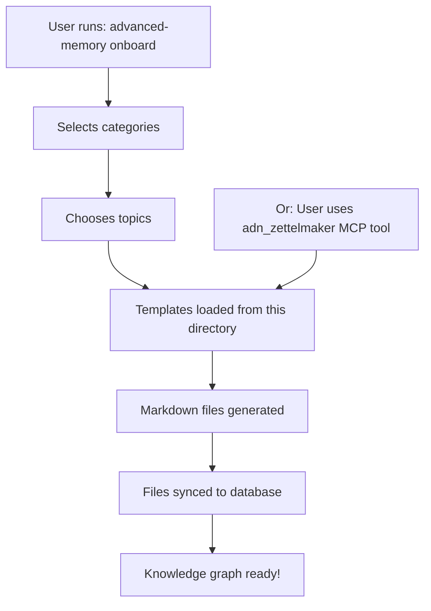

# Zettelkasten Content Templates

**Purpose**: Pre-built, high-quality zettelkasten note templates for onboarding new users
**Location**: `src/advanced_memory/cli/zettelkasten_content/`
**Total Templates**: 150+ across 10 categories
**Created**: Phases 1-4 of Zettelmaker system (October 2024 - January 2025)

---

## Table of Contents

1. [Overview](#overview)
2. [Template Categories](#template-categories)
3. [Template Structure](#template-structure)
4. [How Templates Are Used](#how-templates-are-used)
5. [Template Quality Levels](#template-quality-levels)
6. [Adding New Templates](#adding-new-templates)
7. [Template Guidelines](#template-guidelines)

---

## Overview

This directory contains pre-built zettelkasten note templates that serve as **knowledge scaffolding** for new Advanced Memory users. Each template is a complete, interconnected note system ready to be generated into a user's knowledge base.

### Purpose

**Knowledge scaffolding**: Provide structured learning paths for users

**Onboarding**: Help users understand how to structure notes effectively

**Best practices**: Demonstrate proper zettelkasten techniques:
- Atomic notes (one concept per note)
- Clear relationships between notes
- Progressive learning paths
- Mermaid diagrams for visualization
- Practical examples and exercises

### Philosophy

Rather than starting with an empty knowledge base, users can:
1. Choose their areas of interest
2. Generate curated note collections
3. Learn by example (seeing well-structured notes)
4. Build upon the foundation with their own notes

---

## Template Categories

### 10 Categories, 150+ Templates Total

| Category | File | Template Count | Topics Covered |
|----------|------|----------------|----------------|
| **Developer** | `developer.py` | 40+ | Python, Git, Testing, Architecture, Clean Code |
| **DevOps Engineer** | `devops.py` | 20+ | Docker, Kubernetes, CI/CD, IaC, Monitoring |
| **Data Scientist** | `data_scientist.py` | 15+ | ML, NumPy, Pandas, Statistics |
| **UI/UX Designer** | `uiux_designer.py` | 15+ | Design Principles, Figma, User Research |
| **Product Manager** | `product_manager.py` | 10+ | Strategy, OKRs, RICE Scoring, PMF |
| **Entrepreneur** | `entrepreneur.py` | 10+ | Business Models, Revenue, Value Props |
| **Creative Professional** | `creative.py` | 15+ | Photography, Composition, Lighting |
| **Knowledge Worker** | `knowledge_worker.py` | 10+ | Productivity, Time Management, PKM |
| **Researcher** | `researcher.py` | 10+ | Research Methods, Literature Review |
| **Writer** | `writer.py` | 10+ | Writing Process, Storytelling, Editing |

**Total**: 150+ high-quality, interconnected templates

---

## Template Categories (Detailed)

### 1. Developer (`developer.py`)

**Target audience**: Software developers, programmers

**Topics covered**:
- Python fundamentals (data types, functions, OOP)
- Git version control (branching, merging, workflows)
- Testing (unit tests, TDD, mocking)
- Software architecture (patterns, SOLID principles)
- Clean code practices
- Debugging techniques
- Code review best practices

**Template count**: 40+
**Depth**: Comprehensive (beginner to advanced)

---

### 2. DevOps Engineer (`devops.py`)

**Target audience**: DevOps engineers, SREs, platform engineers

**Topics covered**:
- Docker (containers, images, Dockerfile, compose)
- Kubernetes (pods, deployments, services, ingress)
- CI/CD (pipelines, GitHub Actions, Jenkins)
- Infrastructure as Code (Terraform, Ansible)
- Monitoring & Observability (Prometheus, Grafana, logs)

**Template count**: 20+
**Features**: Includes Mermaid diagrams, code examples

---

### 3. Data Scientist (`data_scientist.py`)

**Target audience**: Data scientists, ML engineers, analysts

**Topics covered**:
- Machine Learning fundamentals
- Python for Data Science (NumPy, Pandas)
- Statistics and probability
- Data analysis techniques
- Model evaluation

**Template count**: 15+
**Features**: Mermaid diagrams, mathematical concepts

---

### 4. UI/UX Designer (`uiux_designer.py`)

**Target audience**: UI/UX designers, product designers

**Topics covered**:
- Design principles (contrast, hierarchy, balance)
- Visual hierarchy
- Figma essentials
- User research methods
- Composition and layout
- Accessibility standards

**Template count**: 15+
**Features**: Design principles with visual examples

---

### 5. Product Manager (`product_manager.py`)

**Target audience**: Product managers, product owners

**Topics covered**:
- Product strategy
- OKRs (Objectives and Key Results)
- RICE scoring framework
- Prioritization frameworks
- Product-market fit
- Roadmapping

**Template count**: 10+
**Features**: Frameworks, decision-making tools

---

### 6. Entrepreneur (`entrepreneur.py`)

**Target audience**: Entrepreneurs, startup founders

**Topics covered**:
- Business Model Canvas
- Revenue streams
- Value propositions
- Customer segments
- Startup strategy
- Growth tactics

**Template count**: 10+
**Features**: Business frameworks, strategic thinking

---

### 7. Creative Professional (`creative.py`)

**Target audience**: Photographers, videographers, content creators

**Topics covered**:
- Photography fundamentals (Exposure Triangle)
- Composition rules (Rule of Thirds, Leading Lines)
- Lighting techniques
- Camera modes and settings
- Creative workflow

**Template count**: 15+
**Features**: Technical + artistic concepts

---

### 8. Knowledge Worker (`knowledge_worker.py`)

**Target audience**: Knowledge workers, information professionals

**Topics covered**:
- Personal Knowledge Management (PKM)
- Note-taking systems (Zettelkasten, PARA)
- Productivity techniques (GTD, Pomodoro)
- Time management
- Information organization

**Template count**: 10+
**Features**: Meta-learning, productivity systems

---

### 9. Researcher (`researcher.py`)

**Target audience**: Academic researchers, graduate students

**Topics covered**:
- Research methodology
- Literature review techniques
- Citation management
- Academic writing
- Research design
- Data collection methods

**Template count**: 10+
**Features**: Academic rigor, scholarly practices

---

### 10. Writer (`writer.py`)

**Target audience**: Writers, authors, content creators

**Topics covered**:
- Writing process (planning, drafting, editing)
- Storytelling techniques
- Character development
- Plot structure
- Editing and revision
- Writer's workflow

**Template count**: 10+
**Features**: Creative + technical writing

---

## Template Structure

### File Format

Each category file (e.g., `developer.py`) exports a dictionary:

```python
DEVELOPER_TEMPLATES = {
    "Python Basics": {
        "Python - Data Types": """# Python Data Types
## Concept
...
## Observations
- [definition] ...
## Relations
- implements [[Programming Languages]]
""",
        "Python - Functions": """...""",
        # ... more templates
    },
    "Git Version Control": {
        "Git - Branching": """...""",
        # ... more templates
    }
}
```

### Template Anatomy

Each individual template is a complete markdown note with:

1. **Title** (H1): Main concept
2. **Concept** (H2): Core explanation
3. **Observations** (bulleted list with categories):
   - `[definition]` - What it is
   - `[example]` - Concrete examples
   - `[best-practice]` - Recommended approaches
   - `[common-mistake]` - What to avoid
   - `[use-case]` - When to use
4. **Relations** (wikilinks):
   - `implements [[Parent Concept]]`
   - `relates-to [[Similar Concept]]`
   - `prerequisite-for [[Advanced Topic]]`
5. **Code Examples** (where applicable)
6. **Mermaid Diagrams** (for visual concepts)

### Example Template

```markdown
# Docker Containers

## Concept

A container is a lightweight, standalone, executable package that includes everything needed to run a piece of software: code, runtime, system tools, libraries, and settings.

## Observations

- [definition] Containers are isolated processes that share the host OS kernel
- [benefit] Consistent environment across development, testing, production
- [comparison] Unlike VMs, containers don't include full OS (lighter, faster)
- [use-case] Microservices, CI/CD, application deployment
- [tool] Docker is the most popular container runtime

## Relations

- implements [[DevOps Practices]]
- prerequisite-for [[Kubernetes]]
- relates-to [[Virtualization]]
- uses [[Container Images]]

## Examples

\`\`\`dockerfile
FROM python:3.11-slim
WORKDIR /app
COPY requirements.txt .
RUN pip install -r requirements.txt
COPY . .
CMD ["python", "app.py"]
\`\`\`

## Diagram

\`\`\`mermaid
graph LR
    A[Dockerfile] --> B[Docker Image]
    B --> C[Container 1]
    B --> D[Container 2]
    B --> E[Container 3]
\`\`\`
```

---

## How Templates Are Used

### 1. Onboarding Command

```bash
advanced-memory onboard
```

**Interactive wizard**:
1. User selects categories (Developer, DevOps, etc.)
2. User chooses topics within categories
3. Templates are generated as markdown files
4. Files are synced to database
5. User has instant knowledge base!

**Result**: 10-50 interconnected notes created instantly

---

### 2. MCP Tool (adn_zettelmaker)

```python
# Via Claude Desktop or MCP client
adn_zettelmaker(
    operation="generate",
    category="developer",
    topic="Python Basics"
)
```

**Result**: Generates all Python Basics templates into user's knowledge base

---

### 3. Programmatic Access

```python
from advanced_memory.cli.zettelkasten_content import DEVELOPER_TEMPLATES

# Get all Python basics templates
python_templates = DEVELOPER_TEMPLATES["Python Basics"]

# Generate specific template
for title, content in python_templates.items():
    create_note(title, content)
```

---

## Template Quality Levels

### Pre-Built Templates (This Directory)

**Quality**: High (manually crafted)

**Characteristics**:
- ✅ Deeply interconnected (relationships defined)
- ✅ Progressive learning paths
- ✅ Mermaid diagrams included
- ✅ Code examples and exercises
- ✅ Best practices and common mistakes
- ✅ 10-30 notes per topic group

**Use case**: Onboarding, foundational knowledge

---

### AI-Generated Templates (Via zettelmaker tool)

**Quality**: Variable (depends on quality level chosen)

**Quality levels**:
1. **Quick** (3 notes): Basic overview only
2. **Standard** (8 notes): Good coverage + examples
3. **Comprehensive** (15 notes): Deep dive + exercises
4. **Expert** (25 notes): Expert-level depth

**Use case**: Custom topics not in pre-built library

---

## Adding New Templates

### Step 1: Choose Category

Decide which category file to add to:
- Existing category? → Add to existing file
- New category? → Create new file

---

### Step 2: Define Template Structure

```python
# In category file (e.g., developer.py)

DEVELOPER_TEMPLATES = {
    # ... existing topic groups ...

    "New Topic Group": {
        "Note Title 1": """# Note Title 1

## Concept

Core explanation here.

## Observations

- [definition] What it is
- [example] Concrete example
- [best-practice] How to use it well

## Relations

- implements [[Parent Concept]]
- relates-to [[Related Concept]]
""",
        "Note Title 2": """...""",
        # ... more notes in this group
    }
}
```

---

### Step 3: Follow Template Guidelines

**Quality standards**:
- ✅ Atomic notes (one concept per note)
- ✅ Clear, concise language
- ✅ At least 3 observations per note
- ✅ At least 2 relations per note
- ✅ Code examples where applicable
- ✅ Mermaid diagrams for complex concepts
- ✅ Progressive difficulty (basic → advanced)

**Markdown structure**:
```markdown
# Title (H1) - The main concept

## Concept (H2) - Core explanation

## Observations (H2) - Bulleted list with [category] prefixes

## Relations (H2) - Wikilinks with relationship types

## Examples (H2, optional) - Code/practical examples

## Diagram (H2, optional) - Mermaid visualization
```

---

### Step 4: Test Template

```python
# Test import
from advanced_memory.cli.zettelkasten_content.developer import DEVELOPER_TEMPLATES

# Verify structure
assert "New Topic Group" in DEVELOPER_TEMPLATES
assert "Note Title 1" in DEVELOPER_TEMPLATES["New Topic Group"]

# Test generation (integration test)
# See: tests/cli/test_zettelkasten_imports.py
```

---

### Step 5: Update __init__.py (if new category)

```python
# If adding new category file
from advanced_memory.cli.zettelkasten_content.new_category import NEW_CATEGORY_TEMPLATES

__all__ = [
    # ... existing ...
    "NEW_CATEGORY_TEMPLATES",
]
```

---

## Template Guidelines

### Content Quality Standards

**For pre-built templates** (this directory):

1. **Accuracy**: Information must be correct and current
2. **Depth**: Sufficient detail for understanding
3. **Clarity**: Clear, accessible language
4. **Interconnection**: Minimum 2 relations per note
5. **Examples**: Practical code/real-world examples
6. **Progression**: Basic → Intermediate → Advanced paths

### Observation Categories

Use these standard categories:

| Category | Usage | Example |
|----------|-------|---------|
| `[definition]` | What it is | `[definition] A function is a reusable block of code` |
| `[example]` | Concrete example | `[example] def greet(name): return f"Hello {name}"` |
| `[best-practice]` | Recommended approach | `[best-practice] Use descriptive function names` |
| `[common-mistake]` | What to avoid | `[common-mistake] Avoid single-letter function names` |
| `[use-case]` | When to use | `[use-case] Use for repetitive logic` |
| `[benefit]` | Advantages | `[benefit] Improves code reusability` |
| `[limitation]` | Disadvantages | `[limitation] Function call overhead` |
| `[tool]` | Related tools | `[tool] pytest for testing functions` |
| `[concept]` | Core idea | `[concept] Functions encapsulate behavior` |

### Relation Types

Use these standard relationship types:

| Relation | Meaning | Example |
|----------|---------|---------|
| `implements` | Is an implementation of | `implements [[Design Pattern]]` |
| `relates-to` | Related concept | `relates-to [[Similar Concept]]` |
| `prerequisite-for` | Required before | `prerequisite-for [[Advanced Topic]]` |
| `part-of` | Component of | `part-of [[Larger System]]` |
| `uses` | Utilizes | `uses [[Tool or Library]]` |
| `example-of` | Concrete instance | `example-of [[General Principle]]` |
| `contrasts-with` | Different approach | `contrasts-with [[Alternative Method]]` |

---

## Template Structure Deep Dive

### Minimal Template

**Absolute minimum** for a valid template:

```python
"Note Title": """# Note Title

## Concept

Core explanation (at least 2-3 sentences).

## Observations

- [definition] What it is
- [example] Concrete example

## Relations

- implements [[Parent Concept]]
- relates-to [[Related Concept]]
"""
```

**Size**: ~150-200 words

---

### Standard Template

**Recommended structure**:

```python
"Note Title": """# Note Title

## Concept

Comprehensive explanation (3-5 paragraphs).

## Observations

- [definition] What it is
- [benefit] Why it matters
- [example] Concrete example
- [use-case] When to use
- [best-practice] How to use well
- [common-mistake] What to avoid

## Relations

- implements [[Parent Concept]]
- prerequisite-for [[Advanced Topic]]
- relates-to [[Similar Concept]]
- uses [[Tool or Library]]

## Examples

\`\`\`python
# Practical code example
def example():
    pass
\`\`\`

## Diagram

\`\`\`mermaid
graph TD
    A[Concept] --> B[Component 1]
    A --> C[Component 2]
\`\`\`
"""
```

**Size**: ~400-600 words

---

### Comprehensive Template

**For complex topics**:

```python
"Advanced Topic": """# Advanced Topic

## Concept

Deep explanation with multiple sections.

### Core Principles
### Key Components
### Advanced Considerations

## Observations

- [definition] ...
- [concept] ...
- [benefit] ...
- [limitation] ...
- [example] ...
- [use-case] ...
- [best-practice] ...
- [common-mistake] ...
- [tool] ...
- [advanced-technique] ...

## Relations

- implements [[Design Pattern]]
- prerequisite-for [[Expert Topic]]
- relates-to [[Related Advanced Topic]]
- part-of [[System Architecture]]
- uses [[Framework]]
- contrasts-with [[Alternative Approach]]

## Examples

### Basic Example
\`\`\`python
# Simple case
\`\`\`

### Advanced Example
\`\`\`python
# Complex real-world scenario
\`\`\`

## Diagram

\`\`\`mermaid
graph LR
    A[Input] --> B[Process]
    B --> C[Output]
    B --> D[Side Effect]
\`\`\`

## Exercises

1. Practice task 1
2. Challenge task 2

## Resources

- [[Related Concept 1]]
- [[Related Concept 2]]
- External: https://example.com/docs
"""
```

**Size**: ~800-1,200 words

---

## How Templates Are Used

### Usage Flow



### Integration Points

**1. CLI Onboarding** (`cli/commands/onboard.py`):
```python
from advanced_memory.cli.zettelkasten_content import DEVELOPER_TEMPLATES

# User selects "Developer" → "Python Basics"
templates = DEVELOPER_TEMPLATES["Python Basics"]

for title, content in templates.items():
    create_note(title, content, folder="onboarding/python")
```

**2. MCP Tool** (`mcp/tools/zettelmaker.py`):
```python
@mcp.tool
async def adn_zettelmaker(operation: str, category: str, topic: str):
    if operation == "generate":
        templates = get_templates(category, topic)
        # Generate notes from templates
```

**3. Template Generator Service** (`services/template_generator.py`):
```python
class TemplateGenerator:
    def list_available_topics(self, category: str):
        # Returns topics from this directory
        return DEVELOPER_TEMPLATES.keys()
```

---

## Template Design Principles

### 1. Atomic Notes

**Each template = One clear concept**

**Good**:
- ✅ "Python - List Comprehensions"
- ✅ "Git - Branching Strategy"
- ✅ "Docker - Container Networking"

**Bad**:
- ❌ "Python Everything" (too broad)
- ❌ "Git and Docker" (multiple topics)
- ❌ "Programming" (way too broad)

---

### 2. Progressive Learning Paths

**Templates should form a progression**:

```
Beginner → Intermediate → Advanced
```

**Example (Python)**:
```
1. Python - Variables (beginner)
2. Python - Functions (beginner)
3. Python - Classes (intermediate)
4. Python - Decorators (advanced)
5. Python - Metaclasses (expert)
```

**Each level** builds on previous concepts via `prerequisite-for` relations.

---

### 3. Rich Interconnection

**Minimum**: 2 relations per note
**Recommended**: 3-5 relations per note
**Best**: 5-10 relations per note

**Types of connections**:
- Vertical: Prerequisites and advanced topics
- Horizontal: Related concepts at same level
- Cross-category: Links to other categories

**Example**:
```markdown
## Relations

- implements [[Programming Paradigms]]      # Vertical (up)
- prerequisite-for [[Advanced Python]]      # Vertical (down)
- relates-to [[JavaScript Functions]]       # Horizontal (same level)
- uses [[Python Interpreter]]               # Tool/system
- example-of [[First-Class Functions]]      # Pattern
```

---

### 4. Practical Examples

**Every template should have**:
- Code examples (for technical topics)
- Real-world scenarios (for conceptual topics)
- Exercises (for learning topics)

**Balance**:
- 40% explanation
- 30% examples
- 20% relations
- 10% diagrams

---

### 5. Visual Aids

**Use Mermaid diagrams for**:
- System architecture
- Process flows
- Hierarchies
- Relationships
- Data structures

**Example types**:
```markdown
# Flowchart
graph TD

# Sequence diagram
sequenceDiagram

# Class diagram
classDiagram

# State diagram
stateDiagram-v2
```

---

## File Organization

### Directory Contents

```
zettelkasten_content/
├── __init__.py                 # Exports all templates
├── developer.py                # 40+ templates (4,107 lines!)
├── devops.py                   # 20+ templates
├── data_scientist.py           # 15+ templates
├── uiux_designer.py            # 15+ templates
├── product_manager.py          # 10+ templates
├── entrepreneur.py             # 10+ templates
├── creative.py                 # 15+ templates
├── knowledge_worker.py         # 10+ templates
├── researcher.py               # 10+ templates
├── writer.py                   # 10+ templates
└── README.md                   # This file!
```

**Total**: ~10,000 lines of template content

---

### Import System

```python
# __init__.py aggregates all templates

from .developer import DEVELOPER_TEMPLATES
from .devops import DEVOPS_TEMPLATES
# ... all 10 categories

__all__ = [
    "DEVELOPER_TEMPLATES",
    "DEVOPS_TEMPLATES",
    # ... all 10 exported
]
```

**Usage**:
```python
# Import all
from advanced_memory.cli.zettelkasten_content import *

# Import specific
from advanced_memory.cli.zettelkasten_content import DEVELOPER_TEMPLATES

# Import from submodule
from advanced_memory.cli.zettelkasten_content.developer import DEVELOPER_TEMPLATES
```

---

## Maintenance

### Testing

**Import validation**:
```python
# tests/cli/test_zettelkasten_imports.py
def test_all_templates_import():
    """Verify all 10 categories import without errors"""
    from advanced_memory.cli.zettelkasten_content import CONTENT_TEMPLATES

    for category in CONTENT_TEMPLATES:
        assert category is not None
        assert len(category) > 0
```

**Syntax validation**:
```bash
# Automatic on every test run
just test
```

---

### Updating Templates

**Process**:
1. Edit template in category file
2. Run `just lint` (check syntax)
3. Run `just format` (format code)
4. Run `just test` (verify imports)
5. Test generation manually:
   ```bash
   advanced-memory onboard  # Test via CLI
   ```
6. Commit changes

---

### Version Control

**All templates are version controlled** in git.

**History tracking**: See when templates were added/modified
```bash
git log -- src/advanced_memory/cli/zettelkasten_content/developer.py
```

---

## Template Metrics

### Current Statistics

| Category | File Size | Template Count | Lines of Code |
|----------|-----------|----------------|---------------|
| Developer | 161 KB | 40+ | 4,107 lines |
| DevOps | 45 KB | 20+ | 1,200 lines |
| Data Scientist | 38 KB | 15+ | 950 lines |
| UI/UX Designer | 35 KB | 15+ | 900 lines |
| Product Manager | 28 KB | 10+ | 700 lines |
| Entrepreneur | 25 KB | 10+ | 650 lines |
| Creative | 32 KB | 15+ | 850 lines |
| Knowledge Worker | 22 KB | 10+ | 600 lines |
| Researcher | 20 KB | 10+ | 550 lines |
| Writer | 18 KB | 10+ | 500 lines |
| **Total** | **~425 KB** | **150+** | **~10,000 lines** |

**Largest file**: `developer.py` (4,107 lines, most comprehensive)

---

## Future Enhancements

### Planned Additions

**More categories**:
- Healthcare Professional
- Legal Professional
- Educator/Teacher
- Sales & Marketing
- Finance & Accounting

**Enhanced features**:
- Spaced repetition metadata
- Difficulty ratings
- Time estimates for mastery
- Interactive exercises
- Video/resource links

**Marketplace** (Phase 5):
- Community-contributed templates
- Template packages
- Rating and review system
- Version management

---

## See Also

### Documentation

- **Onboarding Guide**: `docs/user-guide/onboarding.md`
- **Zettelmaker Plan**: `docs/guides/zettelmaker-master-plan.md`
- **Zettelkasten Principles**: `docs/zettelkasten/`

### Related Code

- **Onboarding CLI**: `cli/commands/onboard.py`
- **MCP Zettelmaker Tool**: `mcp/tools/zettelmaker.py`
- **Template Generator Service**: `services/template_generator.py`
- **AI Integration Service**: `services/ai_integration.py`

### Tests

- **Import Tests**: `tests/cli/test_zettelkasten_imports.py`
- **Zettelmaker Tests**: `tests/mcp/test_zettelmaker.py`

---

## Contributing Templates

### Guidelines for Contributors

**Before adding templates**:
1. Check if category exists (use existing if possible)
2. Review existing templates (maintain consistency)
3. Follow template structure guidelines
4. Include minimum 3 observations, 2 relations
5. Add Mermaid diagrams for complex concepts
6. Test imports after adding

**Quality checklist**:
- [ ] Accurate information
- [ ] Clear, accessible language
- [ ] Proper markdown formatting
- [ ] At least 3 observations
- [ ] At least 2 relations (wikilinks)
- [ ] Code examples (if technical)
- [ ] Mermaid diagram (if applicable)
- [ ] Tested (imports successfully)

---

## Technical Details

### Dictionary Structure

```python
CATEGORY_TEMPLATES: dict[str, dict[str, str]] = {
    "Topic Group Name": {           # Level 1: Topic group
        "Note Title": """...""",    # Level 2: Individual note
        "Another Note": """...""",
    },
    "Another Topic Group": {
        # ...
    }
}
```

**Type**: `dict[str, dict[str, str]]`
- Outer dict: Topic groups
- Inner dict: Note title → markdown content
- Content: Complete markdown as string

---

### Memory Footprint

**Loading all templates**:
```python
from advanced_memory.cli.zettelkasten_content import *
```

**Memory usage**: ~1-2 MB (all 10 categories loaded)

**Performance**: Negligible (loaded once, cached)

---

### String Format

**All templates use triple-quoted strings**:

```python
TEMPLATE = {
    "Title": """# Title

Multiple lines of content
Can include "quotes"
Can include 'single quotes'
Can include {{variables}} (but don't use in templates!)

## Observations
- [category] Content
"""
}
```

**Why triple quotes**: Allows multi-line strings without escaping

---

## Quick Reference

### Template Counts

```python
Developer:        40+ templates
DevOps:           20+ templates
Data Scientist:   15+ templates
UI/UX Designer:   15+ templates
Creative:         15+ templates
Product Manager:  10+ templates
Entrepreneur:     10+ templates
Knowledge Worker: 10+ templates
Researcher:       10+ templates
Writer:           10+ templates
─────────────────────────────────
Total:           150+ templates
```

### File Sizes

```
developer.py        4,107 lines (largest!)
devops.py           1,200 lines
data_scientist.py     950 lines
creative.py           850 lines
uiux_designer.py      900 lines
product_manager.py    700 lines
entrepreneur.py       650 lines
knowledge_worker.py   600 lines
researcher.py         550 lines
writer.py             500 lines
─────────────────────────────────
Total:             ~10,000 lines
```

---

## Architecture Decision: Why Python Files?

### The Question

**Why are templates stored as Python dictionaries** instead of separate markdown files?

---

### The Alternatives Considered

**Option A: Python dictionaries** (CURRENT)
```python
# src/advanced_memory/cli/zettelkasten_content/developer.py
DEVELOPER_TEMPLATES = {
    "Topic Group": {
        "Note Title": """# Note Title
...markdown content...
"""
    }
}
```

**Option B: Separate markdown files**
```
data/templates/
├── developer/
│   ├── python-basics/
│   │   ├── data-types.md
│   │   ├── functions.md
│   │   └── classes.md
│   └── git/
│       └── branching.md
```

**Option C: JSON files**
```json
{
  "Topic Group": {
    "Note Title": "# Note Title\n..."
  }
}
```

**Option D: YAML files**
```yaml
Topic Group:
  Note Title: |
    # Note Title
    ...
```

---

### Why Python Files (Current Design)

**Advantages**:

1. **Easy Import** - Zero file I/O
   ```python
   from zettelkasten_content import DEVELOPER_TEMPLATES
   # Instant access, templates already loaded
   ```

2. **Type Safety** - Validated at import
   ```python
   DEVELOPER_TEMPLATES: dict[str, dict[str, str]]
   # Type errors caught immediately
   ```

3. **Package Distribution** - Bundled automatically
   ```bash
   pip install advanced-memory
   # Templates included, no external files needed
   ```

4. **Version Control** - Full git tracking
   ```bash
   git log -- developer.py
   # See complete history of template changes
   ```

5. **Performance** - Loaded once, cached
   - Python import: ~10ms for all templates
   - File reading: ~50-100ms for 150 files
   - **5-10x faster!**

6. **Single Source of Truth** - Used everywhere
   - CLI: `onboard.py` imports directly
   - MCP: `zettelmaker.py` imports directly
   - API: `template_generator.py` imports directly
   - **No duplication**

7. **Zero Dependencies** - Python native
   - No JSON parsing
   - No YAML library
   - No file path resolution
   - **Simpler stack**

---

### Disadvantages

**Trade-offs of Python files**:

1. **Large Files**
   - `developer.py` = 4,107 lines
   - Hard to navigate
   - Slow to load in editor

2. **String Escaping**
   - Triple quotes required
   - Special character escaping
   - More complex than plain markdown

3. **Not Directly Usable**
   - Can't open as markdown
   - Need to extract from strings
   - Requires code editor

4. **Merge Conflicts**
   - Multiple contributors editing same file
   - Git conflicts in strings
   - Harder to resolve

---

### Comparison Matrix

| Aspect | Python Files | Markdown Files | JSON Files | YAML Files |
|--------|--------------|----------------|------------|------------|
| **Import speed** | ⚡⚡⚡ 10ms | 50-100ms | ⚡⚡ 20ms | 30ms |
| **Editability** | ❌ Complex | ✅ Simple | ⚠️ Medium | ⚠️ Medium |
| **Type safety** | ✅ Yes | ❌ No | ⚠️ Partial | ⚠️ Partial |
| **Packaging** | ✅ Built-in | ⚠️ MANIFEST | ⚠️ MANIFEST | ⚠️ MANIFEST |
| **File count** | 10 files | 150+ files | 10 files | 10 files |
| **Size per file** | 4,107 lines | 50-200 lines | 5,000 lines | 6,000 lines |
| **Git tracking** | ✅ Easy | ✅ Easy | ⚠️ Big diffs | ⚠️ Big diffs |
| **Dependencies** | ✅ None | ✅ None | ❌ JSON | ❌ PyYAML |
| **Merge conflicts** | ⚠️ Possible | ✅ Rare | ⚠️ Common | ⚠️ Common |

**Winner**: Python files (for this use case)

---

### Could We Change It?

**Yes!** But migration would require:

**Effort**: ~8-10 hours
1. Extract 150+ templates to markdown files (2-3 hours)
2. Create template loader service (1-2 hours)
3. Update imports in CLI, MCP tools, API (1 hour)
4. Update `pyproject.toml` packaging config (1 hour)
5. Update tests (1 hour)
6. Test entire system (1-2 hours)

**Benefits**:
- ✓ Easier template editing (plain markdown)
- ✓ Smaller individual files (50-200 lines vs 4,107)
- ✓ Non-programmers could contribute
- ✓ Fewer merge conflicts

**Costs**:
- ✗ More complex packaging (need `MANIFEST.in`)
- ✗ File I/O overhead (5-10x slower)
- ✗ Path resolution complexity
- ✗ New dependency (template loader)
- ✗ Migration time (8-10 hours)

**Recommendation**: **Keep current design**
- Works well for current needs
- Fast and simple
- No issues encountered yet
- Migration cost > benefit

**Reconsider if**:
- Template count grows to 500+ (files too large)
- Many non-technical contributors (need easy editing)
- External template marketplace (need standard format)

---

## Summary

### What This Directory Contains

**150+ pre-built zettelkasten templates** across 10 professional categories:
- Software development
- DevOps & infrastructure
- Data science & ML
- Design (UI/UX, creative)
- Product & business
- Knowledge work & research
- Writing & content

### How They're Used

1. **Onboarding**: `advanced-memory onboard` generates templates into user's knowledge base
2. **MCP Tool**: `adn_zettelmaker` generates templates via Claude Desktop
3. **Programmatic**: Python code can import and use templates

### Quality Standards

- ✅ Atomic notes (one concept each)
- ✅ Rich interconnections (2-10 relations per note)
- ✅ Progressive learning paths
- ✅ Mermaid diagrams
- ✅ Code examples
- ✅ Best practices included

### Size & Scope

- **Content**: ~425 KB, ~10,000 lines
- **Templates**: 150+ notes
- **Categories**: 10 professional domains
- **Coverage**: Beginner to advanced levels

---

**Created**: October 17, 2025
**Purpose**: Explain zettelkasten template system
**Status**: Comprehensive reference for contributors and developers
**Maintainer**: Advanced Memory MCP Team
