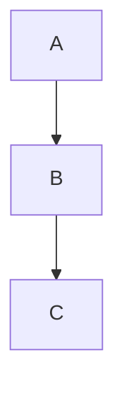

# Zettelkasten Templates

**Pre-built knowledge templates** for Advanced Memory onboarding

---

## Overview

This directory contains **60 high-quality zettelkasten templates** across **12 professional categories**. Each template is a complete, interconnected note demonstrating best practices for knowledge management.

**Recent Update**:
- Added 10 comprehensive system design, data science, and product templates
- **NEW**: Complete AI knowledge base with 7 professional templates covering history, existential risk, key figures, controversies, and societal impact

See [TEMPLATES_CREATED.md](../TEMPLATES_CREATED.md) and [AI_TEMPLATES_CREATED.md](../AI_TEMPLATES_CREATED.md) for details.

---

## Categories

### Developer ⭐ NEW: System Design Templates
**18 templates** across 11 topic groups

**New Professional Templates**:
- 🏗️ **Distributed Systems** - CAP theorem, consistency models, distributed patterns
- 🔧 **Microservices Architecture** - Service design, communication patterns, deployment
- 📡 **Event-Driven Architecture** - Event sourcing, CQRS, sagas, message queues

**Existing Templates**:
- Async Programming, CI/CD, Clean Code, Databases
- Debugging & Performance, Docker, Git, OOP
- Python Core, Web APIs

[Browse Developer templates →](./developer/)

---

### DevOps ⭐ NEW: Observability
**7 templates** across 5 topic groups

**New Professional Template**:
- 📊 **Distributed Tracing** - OpenTelemetry, Jaeger, trace analysis, performance monitoring

**Existing Templates**:
- CI/CD, Containers (Docker, Kubernetes), Infrastructure as Code, Monitoring

[Browse DevOps templates →](./devops/)

---

### Data Scientist ⭐ NEW: MLOps
**3 templates** across 2 topic groups

**New Professional Template**:
- 🚀 **Model Deployment** - FastAPI serving, batch prediction, versioning, monitoring, A/B testing

**Existing Templates**:
- Machine Learning, Python for Data Science

[Browse Data Scientist templates →](./data-scientist/)

---

### UI/UX Designer ⭐ NEW: Design Systems
**4 templates** across 3 topic groups

**New Professional Template**:
- 🎨 **Component Library** - Atomic design, design tokens, React components, Storybook

**Existing Templates**:
- Design Principles, Figma, User Research

[Browse UI/UX Designer templates →](./uiux-designer/)

---

### Product Manager ⭐ NEW: Metrics
**2 templates** across 2 topic groups

**New Professional Template**:
- 📈 **Product Analytics** - North Star Metric, AARRR framework, retention, funnel analysis

**Existing Templates**:
- Product Strategy

[Browse Product Manager templates →](./product-manager/)

---

### Entrepreneur ⭐ NEW: Growth
**2 templates** across 2 topic groups

**New Professional Template**:
- 🚀 **Growth Hacking** - Viral loops, K-factor, SEO growth, onboarding optimization, pricing

**Existing Templates**:
- Business Models

[Browse Entrepreneur templates →](./entrepreneur/)

---

### Knowledge Worker ⭐ NEW: Second Brain
**3 templates** across 2 topic groups

**New Professional Template**:
- 🧠 **Building a Second Brain** - CODE method, PARA system, progressive summarization

**Existing Templates**:
- Personal Knowledge Management, Time Management

[Browse Knowledge Worker templates →](./knowledge-worker/)

---

### Researcher ⭐ NEW: Research Methods
**8 templates** across 6 topic groups

**New Professional Template**:
- 📚 **Systematic Literature Review** - PICO framework, PRISMA, screening, meta-analysis

**Existing Templates**:
- Critical Thinking, Data Analysis, Literature Review
- Note-Taking, Zettelkasten Method, Academic Writing

[Browse Researcher templates →](./researcher/)

---

### Creative
**1 templates** across 1 topic groups

**Templates**:
- Photography Fundamentals

[Browse Creative templates →](./creative/)

---

### Writer
**3 templates** across 2 topic groups

**Templates**:
- Story Structure, Character Development, Show Don't Tell

[Browse Writer templates →](./writer/)

---

### AI ⭐ NEW: Comprehensive AI Knowledge Base
**7 templates** across 5 topic groups

**Professional Templates**:
- 🕰️ **AI History Timeline** - From Turing to ChatGPT, hype cycles, breakthroughs
- ⚠️ **AI Existential Risk** - Great filter, instrumental convergence, human replacement scenarios
- 👥 **AI Pioneers & Founders** - Cassandras vs Pollyannas, key researchers, company founders
- ⚖️ **AI Controversies** - Copyright wars, deepfakes, labor displacement, artistic debates
- 🌍 **AI Societal Transformation** - Economic, political, social, cultural impacts
- 💼 **AI Business Landscape** - Companies, business models, competitive dynamics, market trends
- 🛡️ **AI Ethics & Alignment** - Alignment problem, ethical frameworks, safety approaches

[Browse AI templates →](./ai/)

---

### Philosophy ⭐ NEW: Mind & Knowledge
**2 templates** across 2 topic groups

**Professional Templates**:
- 🧠 **Philosophy of Mind** - Mind-body problem, consciousness theories, hard problem, qualia, AI consciousness
- 📚 **Theory of Knowledge** - Epistemology, JTB, Gettier problem, skepticism, rationalism vs empiricism

[Browse Philosophy templates →](./philosophy/)

---

## Template Quality Levels

### ⭐⭐⭐⭐⭐ Professional (NEW)
- 1000+ lines of comprehensive content
- Production-ready code examples
- Mermaid diagrams
- Best practices and pitfalls
- Cross-referenced concepts

### ⭐⭐⭐ Standard (EXISTING)
- 100-200 lines of quality content
- Basic code examples
- Core concepts covered
- Related concept links

---

## How to Use

### Generate Templates

**Via CLI**:
```bash
advanced-memory onboard
```

**Via MCP**:
```python
adn_zettelmaker("generate", category="developer", topic="distributed-systems")
```

---

### Customize Templates

1. **Copy template** to user-templates/
2. **Modify** for your needs
3. **Generate** from custom template

```bash
cp zettelkasten/templates/developer/system-design/microservices-architecture.md \
   zettelkasten/user-templates/my-microservices-notes.md
```

---

## Template Structure

### Professional Templates (NEW)
```markdown
# Topic Title

Introduction with context

## Core Concepts

### Subsection with Mermaid Diagram


### Production Code Example
```python
class ProductionExample:
    """Complete implementation with error handling"""

    def __init__(self, config):
        self.config = config

    def execute(self):
        # Full implementation
        pass
```

## Best Practices
## Common Pitfalls
## Related Concepts
```

### Standard Templates (EXISTING)
```markdown
# Topic Title

## Concept
Core explanation

## Observations
- [definition] Key point
- [example] Code example
- [best-practice] Recommendation

## Relations
- implements [[Related Concept]]
- prerequisite-for [[Advanced Topic]]
```

---

## Statistics

- **Total templates**: 60 (+19 new professional templates)
- **Categories**: 12 (including new AI and Philosophy categories)
- **Topic groups**: 40
- **Average per category**: 5 templates
- **Quality distribution**: 19 professional, 41 standard

**New Content Added**: ~16,500+ lines of code and documentation

---

## Featured Professional Templates

### 🏆 Top 5 Comprehensive Templates

1. **Distributed Systems** - Complete distributed computing guide
2. **Model Deployment** - End-to-end ML deployment
3. **Product Analytics** - Comprehensive metrics framework
4. **Growth Hacking** - Complete growth strategies
5. **Systematic Literature Review** - Academic research methodology

### 💻 Most Code-Heavy Templates

1. **Microservices Architecture** - 15+ code examples
2. **Event-Driven Architecture** - 12+ implementations
3. **Distributed Tracing** - 10+ code samples
4. **Model Deployment** - 20+ code patterns

### 🎨 Most Visual Templates

1. **Component Library** - Design tokens + React components
2. **Building a Second Brain** - PARA + CODE frameworks
3. **Product Analytics** - Metrics dashboards
4. **Growth Hacking** - Viral loop diagrams

---

## See Also

- **New Templates Documentation**: [../TEMPLATES_CREATED.md](../TEMPLATES_CREATED.md)
- **Main README**: [../README.md](../README.md)
- **Inbox**: [../inbox/README.md](../inbox/README.md)
- **User Templates**: [../user-templates/README.md](../user-templates/README.md)
- **Source Code**: Original templates in `src/advanced_memory/cli/zettelkasten_content/`

---

**Last Updated**: October 18, 2025
**Format**: Individual markdown files
**Quality**: Professional + Standard
**Total Size**: 21,500+ lines of content

**Latest Additions**:
- Comprehensive AI knowledge base (7 templates, 6,000+ lines)
- Philosophy category (2 templates, 1,500+ lines)
