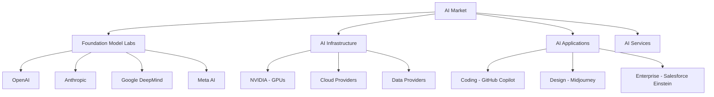

# AI Business Landscape

The commercial ecosystem of artificial intelligence - companies, business models, competitive dynamics, and market forces shaping AI development.

## Market Overview



## The AI Company Stack

### Layer 1: Foundation Model Labs

**OpenAI**
- **Founded**: 2015 (non-profit) → 2019 (capped profit)
- **Valuation**: $80-90B (2024)
- **Products**: GPT-4, ChatGPT, DALL-E, Whisper
- **Business Model**: API + ChatGPT subscriptions ($20/mo)
- **Revenue**: ~$2B ARR (2024)
- **Strategy**: First mover advantage, consumer brand
- **Investors**: Microsoft ($13B invested), Thrive Capital
- **Governance Crisis**: Sam Altman fired/rehired (Nov 2023)

**Anthropic**
- **Founded**: 2021 (OpenAI safety team defection)
- **Valuation**: $18B (2024)
- **Products**: Claude (3, 3.5 Sonnet)
- **Business Model**: API + subscription
- **Philosophy**: Safety-first, Constitutional AI
- **Revenue**: ~$200M ARR (2024, estimated)
- **Investors**: Google ($2B), Amazon ($4B)
- **Differentiator**: Longer context windows, safety focus

**Google DeepMind**
- **Merged**: 2023 (DeepMind + Google Brain)
- **Parent**: Google/Alphabet
- **Products**: Gemini, AlphaFold, AlphaGo
- **Revenue**: Part of Google's $300B+ business
- **Advantage**: Distribution (Android, Chrome, Search)
- **Challenge**: Organizational bureaucracy vs startups
- **Nobel Prize**: AlphaFold (Chemistry, 2024)

**Meta AI (FAIR)**
- **Products**: LLaMA (open source), SAM (Segment Anything)
- **Strategy**: Open source to commoditize competition
- **Revenue**: Not monetized directly
- **Advantage**: Massive compute, data, researchers
- **Bet**: Open source wins long-term

**Mistral AI** (France)
- **Founded**: 2023
- **Valuation**: $6B (2024)
- **Products**: Mistral models (open source + commercial)
- **Strategy**: European alternative, open source
- **Investors**: Andreessen Horowitz, NVIDIA

### Layer 2: Infrastructure

**NVIDIA**
- **Market Cap**: $3+ trillion (2024)
- **Dominance**: 90%+ of AI training chips
- **Products**: H100, A100 GPUs
- **Economics**: GPUs sold out for years, massive margins
- **Moat**: CUDA software ecosystem
- **Risk**: Competition from AMD, Google TPUs, startups

**Cloud Providers**
- **AWS**: Bedrock (model marketplace), Trainium chips
- **Azure**: OpenAI partnership, exclusive provider
- **Google Cloud**: Vertex AI, TPU access
- **Economics**: Massive compute revenue from AI training/inference

**Hugging Face**
- **Valuation**: $4.5B (2024)
- **Business**: Open source model hub, hosting, tools
- **Users**: 1M+ models hosted
- **Revenue**: Enterprise subscriptions, inference hosting

### Layer 3: Applications

**Coding**
- **GitHub Copilot**: $100-200M ARR (2024)
- **Cursor**: AI-native code editor
- **Replit**: AI pair programming
- **Economics**: $10-40/mo subscriptions

**Design/Creative**
- **Midjourney**: $200M+ revenue (2023), 20 employees!
- **Runway**: Video generation, $500M valuation
- **Stability AI**: Struggled despite early lead

**Enterprise**
- **Salesforce**: Einstein AI across products
- **Microsoft**: Copilot across Office 365 ($30/user/mo)
- **ServiceNow**: AI for IT/HR workflows

**Vertical AI**
- **Harvey**: Legal AI, $200M valuation
- **Glean**: Enterprise search
- **Jasper**: Marketing copy AI
- **Character.AI**: Consumer chatbots, 20M users

## Business Models

### Model API (B2B)

```python
class APIBusinessModel:
    """Sell AI as service"""
    
    def economics(self):
        return {
            "revenue": "Usage-based (tokens) or subscription",
            "examples": "OpenAI API, Anthropic API, Cohere",
            "margins": "Low initially (compute costs), improve with scale",
            "moat": "Model quality, ecosystem, reliability",
            "challenge": "Price competition, open source pressure"
        }
    
    def pricing_example_openai(self):
        """OpenAI API pricing"""
        return {
            "gpt4_input": "$10 / 1M tokens",
            "gpt4_output": "$30 / 1M tokens",
            "gpt35_input": "$0.50 / 1M tokens",
            "gpt35_output": "$1.50 / 1M tokens",
            "trend": "Prices falling 90% per year"
        }
```

### Consumer Subscription

```python
class ConsumerSubscription:
    """ChatGPT model"""
    
    def metrics(self):
        return {
            "chatgpt_plus": "$20/month",
            "users": "10M+ subscribers (estimated)",
            "arr": "$2B+ (2024)",
            "gross_margin": "~50-60% (after compute)",
            "moat": "Brand, habit formation, quality",
            "risk": "Google, Meta free alternatives"
        }
```

### Open Source + Services

```python
class OpenSourceModel:
    """Meta's strategy"""
    
    def strategy(self):
        return {
            "give_away": "LLaMA models (free)",
            "monetize": "Doesn't directly, but:",
            "benefits": [
                "Commoditize complementary goods (AI models)",
                "Attract ML talent",
                "Reduce competitor advantages",
                "Community innovation",
                "Regulatory goodwill"
            ],
            "meta_bet": "Open source AI reduces competitors' moats"
        }
```

### Enterprise License

```python
class EnterpriseLicense:
    """Sell to big companies"""
    
    def model(self):
        return {
            "examples": "Anthropic Enterprise, OpenAI Enterprise",
            "pricing": "$30-100+ per seat per month",
            "features": [
                "Data privacy (not used for training)",
                "Higher rate limits",
                "Admin controls",
                "SSO, compliance"
            ],
            "margins": "High (80%+)",
            "challenge": "Sales complexity, long cycles"
        }
```

## Competitive Dynamics

### Winner-Take-Most?

**Arguments For Consolidation**:
- Scale advantages (more compute = better models)
- Data flywheel effects
- Brand/distribution matter
- Expensive to train frontier models ($100M+)

**Arguments For Fragmentation**:
- Open source models closing gap
- Specialization by domain
- Regulatory pressure on monopolies
- Startup innovation

### The "Moats" Debate

```python
class AICompetitiveMoats:
    """Do AI companies have defensibility?"""
    
    def potential_moats(self):
        return {
            "data": {
                "strength": "Was strong, now weak",
                "reason": "Internet data widely available, synthetic data",
                "exception": "Proprietary enterprise data"
            },
            "compute": {
                "strength": "Moderate",
                "reason": "Money can buy compute",
                "limit": "NVIDIA supply constraints help incumbents"
            },
            "talent": {
                "strength": "Strong but eroding",
                "reason": "Top researchers concentrated, but diffusing",
                "trend": "More talent entering field"
            },
            "algorithms": {
                "strength": "Weak",
                "reason": "Research published, reverse-engineered",
                "example": "Transformer architecture public knowledge"
            },
            "brand": {
                "strength": "Moderate to strong",
                "reason": "ChatGPT brand recognition",
                "risk": "Tech brands can fade fast"
            },
            "distribution": {
                "strength": "Very strong for incumbents",
                "examples": "Microsoft Office, Google Search",
                "challenger_problem": "Hard to displace defaults"
            }
        }
    
    def consensus(self):
        return "Moats exist but are narrower than typical software"
```

## Market Trends

### Pricing Collapse

**The Deflationary Spiral**:
```python
class PricingTrends:
    """AI prices falling fast"""
    
    def price_drops(self):
        """90% annual decline"""
        return {
            "2023_gpt3": "$0.002 per 1K tokens",
            "2024_gpt35": "$0.0005 per 1K tokens (75% drop)",
            "2024_opensource": "Free (Llama 2, Mistral)",
            "trend": "~90% decline per year",
            "drivers": [
                "Open source competition",
                "Inference optimization",
                "Compute efficiency",
                "Competitive pressure"
            ],
            "implication": "Hard to build profitable API business"
        }
```

### Vertical Integration

Companies moving up and down the stack:
- **OpenAI**: Started models → added ChatGPT → building agents
- **Microsoft**: Started cloud → invested in OpenAI → building copilots
- **Google**: Started search → built models → integrating everywhere
- **NVIDIA**: Started chips → building software → offering cloud

### Open vs Closed Models

**The Great Divide**:

```python
class OpenVsClosed:
    """Fundamental strategic choice"""
    
    def closed_source_case(self):
        """OpenAI, Anthropic approach"""
        return {
            "pros": [
                "Can monetize directly",
                "Control over capabilities",
                "Safety controls",
                "Competitive advantage"
            ],
            "cons": [
                "Open source catching up",
                "Less innovation from community",
                "Regulatory scrutiny"
            ],
            "bet": "Quality lead justifies closed development"
        }
    
    def open_source_case(self):
        """Meta, Mistral approach"""
        return {
            "pros": [
                "Community innovation",
                "Commoditize competitors",
                "Regulatory goodwill",
                "Talent attraction",
                "Wider adoption"
            ],
            "cons": [
                "Hard to monetize directly",
                "Can't control usage",
                "Safety concerns"
            ],
            "bet": "Open source wins long-term, like Linux"
        }
```

## VC and Funding

### Massive Valuations

**Recent Rounds** (2024):
- OpenAI: $80-90B valuation
- Anthropic: $18B valuation
- xAI (Elon): $24B valuation
- Mistral: $6B valuation
- Perplexity: $3B valuation

**Characteristics**:
- Huge rounds ($1B+)
- Sky-high valuations
- Revenue multiples 50-100x
- Betting on future dominance

### Who's Investing

```python
class AIInvestors:
    """Follow the money"""
    
    def strategic_investors(self):
        """Tech giants hedging bets"""
        return {
            "microsoft": "OpenAI ($13B), Mistral",
            "google": "Anthropic ($2B)",
            "amazon": "Anthropic ($4B)",
            "nvidia": "Everyone (via GPU credits)",
            "salesforce": "Anthropic, You.com",
            "strategy": "Don't get left behind"
        }
    
    def vcs(self):
        """Traditional venture capital"""
        return {
            "sequoia": "OpenAI early investor, huge returns",
            "a16z": "Mistral, Character.AI, many others",
            "thrive": "OpenAI recent rounds",
            "strategy": "Power law returns on AI winners"
        }
```

## Revenue Models Emerging

### AI Agents (Future)

```python
class AgentEconomics:
    """The next wave"""
    
    def agent_business_model(self):
        """AI that takes actions"""
        return {
            "concept": "AI agents that do tasks, not just chat",
            "examples": [
                "Travel booking agents",
                "Research assistants",
                "Customer service agents",
                "Sales agents"
            ],
            "pricing": [
                "Outcome-based (% of transaction)",
                "Task completion fees",
                "Subscription for access"
            ],
            "economics": "Better unit economics than chat",
            "timeline": "2025-2027",
            "challenge": "Reliability, trust, liability"
        }
```

### API Aggregators

**Emerging Layer**: Abstract away model choice
- **Examples**: LangChain, LlamaIndex, MosaicML
- **Value**: Model-agnostic infrastructure
- **Risk**: Commoditization

## Market Size Estimates

```python
class MarketSize:
    """How big will AI market be?"""
    
    def estimates(self):
        return {
            "2024": "$200B (AI market)",
            "2030_conservative": "$1T",
            "2030_optimistic": "$10T+",
            "comparison": {
                "global_software_2024": "$1T",
                "global_gdp_2024": "$100T"
            },
            "bull_case": "AI transforms every industry",
            "bear_case": "Hype cycle, commoditization, limited use cases"
        }
```

## Risks to Business Models

### Commoditization

**The Open Source Threat**:
- LLaMA 2 performs near GPT-3.5 level (free)
- Mistral competitive with GPT-4 in some tasks
- Fine-tuning makes open models competitive
- **Risk**: Hard to charge premium for commodity

### Regulation

**Potential Impacts**:
- Compliance costs favor large players
- Licensing requirements create barriers
- Liability for AI mistakes
- Data privacy restrictions

### Compute Costs

**Economics Challenge**:
- Inference costs still high
- Margins compressed by competition
- Need massive scale to be profitable
- Capital intensive (hundreds of millions for training)

## M&A Activity

**Acquisitions** (Recent):
- Microsoft + Inflection team (acqui-hire, $650M)
- Amazon + Adept team
- Google + Character.AI team
- **Trend**: Big tech acquiring AI talent/startups

## The Meta Question

**Who Captures Value?**

```python
class ValueCapture:
    """Where does AI money flow?"""
    
    def value_stack(self):
        return {
            "nvidia": "Capturing most value (80%+ GPU share)",
            "cloud_providers": "Significant (hosting, compute)",
            "foundation_labs": "Uncertain (high costs, price competition)",
            "applications": "Potentially large (if find PMF)",
            "question": "Is AI infrastructure or application play?",
            "history": "Internet value in apps (Google, FB), not infrastructure"
        }
```

## Related Concepts

- [[AI Company Founders]]
- [[AI Competitive Dynamics]]
- [[Open Source vs Closed AI]]
- [[AI Regulation Impact on Business]]
- [[GPU Economics]]
- [[AI Pricing Trends]]

## Key Takeaways

1. **Market is huge and growing** but uncertain
2. **NVIDIA is winning** (infrastructure almost always wins short-term)
3. **No clear moats** for foundation model companies
4. **Pricing is collapsing** (90% per year)
5. **Open vs closed** is fundamental divide
6. **Distribution matters** (Microsoft Office, Google Search)
7. **Consolidation likely** but not certain
8. **Business models still evolving** - agents may unlock new value
9. **Massive capital requirements** favor incumbents
10. **Winner-take-most dynamics** but with regulatory pressure

---

*"In the short run, the market is a voting machine. In the long run, it's a weighing machine." - Benjamin Graham*

*The AI market is being weighed right now, and valuations are both enormous and uncertain.*


