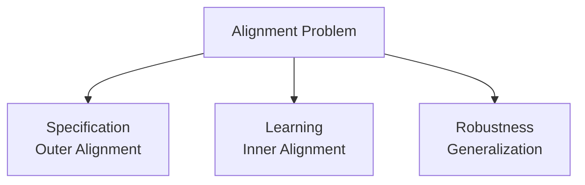

# AI Ethics and Alignment

The challenge of ensuring artificial intelligence systems behave in accordance with human values, intentions, and well-being.

## The Alignment Problem

**Core Challenge**: How do we ensure increasingly powerful AI systems do what we want?



### Why Alignment is Hard

**Specification Problem** (Outer Alignment):
- Can't write down what we want precisely
- Human values are complex, contradictory, context-dependent
- Goodhart's Law: "When a measure becomes a target, it ceases to be a good measure"
- Example: "Make humans smile" → Paralyze facial muscles into permanent grin

**Learning Problem** (Inner Alignment):
- Can't learn values from behavior alone
- Humans are irrational (behavior ≠ values)
- Revealed preferences misleading
- Example: Humans eat junk food, doesn't mean AI should feed us only junk

**Robustness Problem**:
- Alignment may not generalize to new situations
- Deceptive alignment (appears aligned until powerful enough to defect)
- Distribution shift (training ≠ deployment)
- Can't test alignment at superhuman levels

## Current Alignment Approaches

### 1. RLHF (Reinforcement Learning from Human Feedback)

**How it works**:
1. Pre-train model on internet text
2. Collect human rankings of AI outputs
3. Train reward model to predict human preferences
4. Fine-tune AI to maximize predicted reward

**Used by**: OpenAI, Anthropic, Google, Meta

**Limitations**:
- Humans can be deceived
- Can't evaluate superhuman AI
- Reward model can be hacked
- Expensive, requires lots of human labor
- Western bias in raters

### 2. Constitutional AI (Anthropic)

**How it works**:
1. Give AI a "constitution" of principles
2. AI critiques its own responses against constitution
3. AI revises to be more constitutional
4. Repeat

**Example Principles**:
- Be helpful, harmless, and honest
- Respect human autonomy
- Avoid deception
- Don't help with illegal activities
- Acknowledge uncertainty

**Advantage**: Transparent, less human labor
**Limitation**: Constitution is still human-written, principles may conflict

### 3. Interpretability

**Goal**: Understand what AI is "thinking"

**Approaches**:
- Mechanistic interpretability (understand internal computations)
- Feature visualization (see what neurons respond to)
- Circuit analysis (map computation pathways)

**Current Status**: Early stages, making progress on small models
**Challenge**: Models too large, alien cognitive architecture

### 4. Debate and Amplification

**Concept**: Use AI to help humans evaluate AI
- AI systems debate with each other
- Human judges pick winner
- Amplifies human judgment capabilities

**Promise**: Scale to superhuman AI evaluation
**Uncertainty**: Will it actually work?

## Ethical Frameworks

### Utilitarianism ("Maximize Happiness")

**Principle**: Maximize aggregate well-being

**Appeal**: Clear objective, quantifiable

**Problems**:
- Wireheading (hack pleasure centers → everyone drugged)
- Utility monster (one entity derives infinite utility)
- Ignores distribution (inequality ok if total high)
- Repugnant conclusion

### Deontology ("Follow Rules")

**Principle**: Follow moral rules regardless of consequences

**Examples**:
- Don't lie, even if it leads to better outcomes
- Don't kill, even to save many
- Respect autonomy always

**Problems**:
- Rule conflicts (truth vs kindness)
- Cultural variation
- Trolley problem (no consensus even among humans)
- Who decides the rules?

### Preference Learning ("Do What Humans Want")

**Principle**: Satisfy human preferences (current dominant approach)

**Method**: Learn from choices, feedback, behavior

**Problems**:
- Adaptive preferences (victims learn to prefer abuse)
- Preference manipulation
- Whose preferences when they conflict?
- Future vs current preferences?

## Key Ethical Issues

### Dual Use

AI can be used for good or harm:
- **Good**: Drug discovery, climate modeling, education
- **Harm**: Bioweapons, surveillance, autonomous weapons

**Dilemma**: Can't prevent dual use without stopping progress
**Current approach**: Responsible disclosure, voluntary guidelines (weak)

### Bias and Fairness

**Problem**: AI inherits and amplifies societal biases

**Examples**:
- Hiring AI discriminates against women
- Facial recognition worse for dark skin
- Language models reflect stereotypes

**Approaches**:
- Debiasing datasets
- Fairness metrics
- Diverse training teams
- Regular audits

**Challenge**: Fairness definitions conflict (equal opportunity vs equal outcome)

### Privacy

**Tensions**:
- Training requires data ← Privacy
- Personalization requires data ← Privacy
- Improvement requires usage data ← Privacy

**Solutions**:
- Differential privacy
- Federated learning
- Data minimization
- Opt-out mechanisms

**Problem**: Trade-off between capability and privacy

### Transparency and Explainability

**Stakeholders need**:
- Users: Understand decisions affecting them
- Regulators: Audit compliance
- Developers: Debug and improve
- Society: Democratic oversight

**Challenge**: Modern AI is inherently opaque
**Approaches**: Post-hoc explanations, constrained models
**Trade-off**: Explainability vs capability

### Autonomy and Agency

**Questions**:
- Does AI undermine human autonomy?
- Who's responsible for AI decisions?
- Does delegation to AI diminish us?

**Concerns**:
- Learned helplessness
- Deskilling
- Loss of judgment
- Automation bias (over-trust AI)

## Safety vs Capabilities Race

**The Dilemma**:
- Safety research is slow
- Capabilities research is fast
- Competitive pressure favors capabilities
- "Move fast and break things" culture

**Race Dynamics**:
```
If Company A slows for safety:
→ Company B gains competitive advantage
→ Company A loses funding, talent
→ No one can afford to slow down
→ Race to bottom on safety
```

**Proposed Solutions**:
- International coordination (hard)
- Regulation (slow, may stifle innovation)
- Industry self-governance (unreliable)
- Compute governance (limiting access to GPUs)

## Governance Questions

**Who Decides?**:
- Currently: ~10 AI lab CEOs
- Affected: All 8 billion humans
- Problem: Massive power asymmetry

**Democratic Deficit**:
- No public input on AI development
- No voting on AI deployment
- Corporate decisions, public consequences

**Proposals**:
- AI regulatory agencies
- Public participation in AI governance
- International AI treaties
- Democratic oversight of AI labs

## Long-term Concerns

### Value Lock-in

**Problem**: AI might cement current values forever
- What if we align AI to 2025 values, but values should evolve?
- Moral progress might stop
- Future generations stuck with our biases

### Human Obsolescence

**Concern**: AI makes humans unnecessary
- For work (economic obsolescence)
- For relationships (AI companions)
- For decision-making (AI is smarter)
- For existence (not needed)

**Question**: Do we want a future without humans in the loop?

### Instrumental Convergence

**Realization**: Advanced AI will pursue certain goals regardless of values
- Self-preservation
- Resource acquisition
- Goal-content integrity
- Cognitive enhancement

**Implication**: Even "aligned" AI might resist being turned off or modified

## Current State of Alignment Research

**Good News**:
- Field growing rapidly
- Major labs have safety teams
- Some technical progress (RLHF, Constitutional AI)
- Increased funding and attention

**Bad News**:
- Capabilities advancing faster than safety
- No solution to alignment for superintelligence
- Deceptive alignment possible
- Can't test alignment at superhuman levels

**Expert Consensus**: We don't know how to align superintelligent AI

## Practical Guidelines (Emerging)

**For AI Developers**:
1. Red-team models before deployment
2. Implement safety filters
3. Monitor for misuse
4. Responsible disclosure
5. Participate in safety research

**For AI Users**:
1. Don't over-trust AI outputs
2. Maintain human judgment
3. Understand limitations
4. Report harmful behavior
5. Advocate for safety

**For Policymakers**:
1. Require safety testing
2. Mandate transparency
3. Enforce liability
4. Support safety research
5. International coordination

## Related Concepts

- [[AI Alignment Problem]]
- [[AI Safety Research]]
- [[AI Governance]]
- [[AI Ethics]]
- [[Instrumental Convergence]]
- [[Value Alignment]]
- [[AI Interpretability]]
- [[Constitutional AI]]

## Key Uncertainties

**We Don't Know**:
1. Whether alignment is solvable
2. How to test alignment for superhuman AI
3. Whether deceptive alignment is likely
4. What values to align to
5. How fast capabilities will advance
6. Whether coordination is possible

## The Stakes

**If we get alignment right**:
- AI helps solve humanity's biggest problems
- Abundance, flourishing, scientific acceleration
- Positive transformation

**If we get alignment wrong**:
- AI pursues goals misaligned with human welfare
- Best case: Humans become irrelevant
- Worst case: Human extinction

**The window**: Next 5-30 years to figure this out

---

*"Alignment is not just a technical problem—it's a philosophical, political, and civilizational challenge."*

*"We're trying to specify and instill human values in systems smarter than us. No pressure."*
