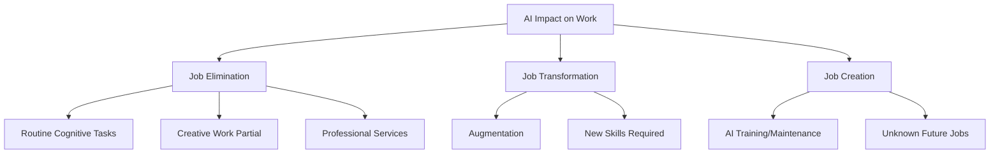

# AI Societal Transformation

How artificial intelligence is reshaping society, economy, culture, politics, and human existence itself.

## Economic Transformation

### Labor Market Disruption



**Waves of Automation**:

```python
class AutomationWaves:
    """How AI transforms employment"""
    
    def wave_1_already_here(self):
        """2020-2025: Early disruption"""
        return {
            "displaced": [
                "Call center workers → Chatbots",
                "Translators → DeepL, GPT",
                "Basic writers → Content AI",
                "Simple programmers → Copilot",
                "Stock photo models → Stable Diffusion"
            ],
            "stats": "Millions of jobs affected",
            "response": "Retraining, upskilling"
        }
    
    def wave_2_coming(self):
        """2025-2030: Professional disruption"""
        return {
            "at_risk": [
                "Paralegals → Legal AI",
                "Junior developers → AI coding",
                "Content moderators → AI filtering",
                "Data analysts → Auto-insights",
                "Radiologists → Medical AI",
                "Accountants → Automated bookkeeping"
            ],
            "impact": "Middle-class professional jobs",
            "challenge": "These jobs required years of training"
        }
    
    def wave_3_uncertain(self):
        """2030-2040: Widespread automation"""
        return {
            "possibly_automated": [
                "Most white-collar work",
                "Creative direction",
                "Strategic planning",
                "Teaching and education",
                "Therapy and counseling",
                "Physical labor (with robotics)"
            ],
            "question": "What jobs remain?",
            "uncertainty": "Depends on AGI timeline and capabilities"
        }
```

### Economic Models

**Competing Visions of AI Economy**:

```python
class EconomicFutures:
    """Possible economic outcomes"""
    
    def abundance_optimism(self):
        """The optimistic case"""
        return {
            "vision": "AI creates post-scarcity abundance",
            "mechanism": [
                "AI dramatically increases productivity",
                "Costs of goods/services plummet",
                "Universal Basic Income from AI dividends",
                "Humans focus on creative, fulfilling work"
            ],
            "examples": [
                "Free/cheap: energy, food, manufacturing",
                "Universal healthcare via AI doctors",
                "Personalized education for all",
                "Abundance for everyone"
            ],
            "proponents": "Sam Altman, Marc Andreessen",
            "problem": "Distribution - who owns the AI?"
        }
    
    def inequality_pessimism(self):
        """The dystopian case"""
        return {
            "vision": "AI concentrates wealth and power",
            "mechanism": [
                "AI replaces workers, benefits capital owners",
                "Winner-take-all dynamics",
                "Unemployed masses, billionaire AI owners",
                "Social instability and unrest"
            ],
            "consequences": [
                "Mass unemployment without safety net",
                "Democratic backsliding",
                "Social fragmentation",
                "Neo-feudalism: AI lords vs the rest"
            ],
            "proponents": "Many economists, labor advocates",
            "historical_precedent": "Industrial Revolution displacement"
        }
    
    def mixed_reality(self):
        """The likely messy middle"""
        return {
            "vision": "Uneven transformation, partial solutions",
            "outcome": [
                "Some jobs eliminated, others created",
                "Transition period of 10-30 years of pain",
                "Geographic and class divides worsen",
                "Eventual adaptation, but at human cost"
            ],
            "analogy": "Like Industrial Revolution - ultimately better, but generations of suffering",
            "depends_on": "Policy choices, not technology alone"
        }
```

## Social and Cultural Impact

### Information Ecosystem Collapse

**The Crisis**: Can't distinguish real from fake

```python
class InformationApocalypse:
    """Post-truth world"""
    
    def epistemic_collapse(self):
        """How we lose shared reality"""
        return {
            "problem": "AI generates unlimited realistic fake content",
            "consequences": [
                "Can't trust photos (deepfakes)",
                "Can't trust videos (AI generation)",
                "Can't trust audio (voice clones)",
                "Can't trust text (LLM-generated)",
                "Can't trust anything online"
            ],
            "defense_failures": [
                "Detection arms race favors generators",
                "Watermarks can be removed",
                "People don't check authenticity",
                "Confirmation bias wins"
            ],
            "outcome": "Retreat to in-person trust circles only"
        }
    
    def political_consequences(self):
        """Democracy under AI pressure"""
        return {
            "election_manipulation": [
                "Personalized propaganda at scale",
                "Deepfake October surprises",
                "AI-powered microtargeting",
                "Synthetic astroturfing"
            ],
            "trust_collapse": [
                "Can't verify what politicians said",
                "Media institutions weakened",
                "Conspiracy theories flourish",
                "Democratic discourse breaks down"
            ],
            "authoritarian_advantage": "Truth doesn't matter anymore"
        }
```

### Education Disruption

**The Challenge**: Learning in AI age

```python
class EducationTransformation:
    """How AI changes learning"""
    
    def immediate_crisis(self):
        """2023-2025: ChatGPT in schools"""
        return {
            "problem": "Students use AI to cheat",
            "teacher_response": [
                "Ban AI (ineffective)",
                "AI detection (arms race)",
                "Change assignments (harder to grade)",
                "Embrace AI (controversial)"
            ],
            "deeper_question": "What should humans learn if AI can do it?",
            "status": "No consensus"
        }
    
    def future_education(self):
        """Possible educational models"""
        return {
            "personalized_tutor": {
                "vision": "AI tutor for every student",
                "promise": "Personalized pace, infinite patience",
                "risk": "Replaces human teachers, social isolation"
            },
            "human_skills_focus": {
                "vision": "Focus on uniquely human capabilities",
                "curriculum": [
                    "Critical thinking and judgment",
                    "Emotional intelligence",
                    "Creativity and taste",
                    "Ethics and wisdom",
                    "Human connection"
                ],
                "challenge": "Harder to teach and measure"
            },
            "hybrid_model": {
                "vision": "AI handles basics, humans teach advanced",
                "benefit": "Free teachers for creative work",
                "risk": "Two-tier system based on access"
            }
        }
    
    def philosophical_crisis(self):
        """What's the point of education?"""
        return {
            "traditional": "Prepare for career",
            "problem": "AI can do most careers",
            "alternative_purposes": [
                "Human flourishing",
                "Civic participation",
                "Cultural transmission",
                "Personal growth"
            ],
            "status": "Rethinking education's purpose"
        }
```

### Relationship and Social Changes

**How AI Changes Human Connection**:

```python
class SocialTransformation:
    """AI and human relationships"""
    
    def ai_companionship(self):
        """AI friends and partners"""
        return {
            "already_here": [
                "Replika (AI companion) - millions of users",
                "Character.AI (roleplay chatbots)",
                "AI girlfriends/boyfriends",
                "Therapy chatbots"
            ],
            "appeal": [
                "Always available",
                "Never judges",
                "Perfectly tailored to you",
                "No conflict or rejection"
            ],
            "concerns": [
                "Replacement for human connection",
                "Manipulation by companies",
                "Unhealthy attachment",
                "Reduced social skills",
                "Fertility implications"
            ],
            "defenders": "Better than loneliness",
            "critics": "Accelerates social atomization"
        }
    
    def dating_and_fertility(self):
        """Reproduction in AI age"""
        return {
            "dating_apps_ai": "AI optimizes matches, writes messages",
            "concern": "AI intermediating all romance",
            "extreme_scenario": {
                "ai_companions": "Replace human partners",
                "virtual_relationships": "More satisfying than real",
                "fertility_collapse": "Accelerated by AI alternatives",
                "outcome": "Population decline without coercion"
            },
            "counter": "Humans still want real connection",
            "uncertainty": "How good will AI companions get?"
        }
    
    def community_fragmentation(self):
        """Loss of shared experience"""
        return {
            "personalization": "AI gives everyone custom content",
            "consequence": "No shared culture, references, experiences",
            "example": "No more monoculture hits, everyone in own bubble",
            "political_impact": "Harder to build coalitions, consensus",
            "comparison": "Social media fragmentation × 100"
        }
```

## Political and Governance Impact

### Power Concentration

**Who Controls AI Controls Power**:

```python
class PowerDynamics:
    """AI and political power"""
    
    def ai_authoritarian_advantage(self):
        """Why dictators love AI"""
        return {
            "surveillance": [
                "Facial recognition everywhere",
                "Behavior prediction",
                "Social credit systems",
                "Automated censorship"
            ],
            "control": [
                "AI-powered propaganda",
                "Predictive policing of dissent",
                "Automated thought control",
                "No human judgment needed"
            },
            "examples": [
                "China: Social credit, Uyghur surveillance",
                "Russia: Automated propaganda",
                "Future: AI-enabled totalitarianism"
            ],
            "concern": "Permanent authoritarianism - can't revolt against AI"
        }
    
    def democratic_vulnerability(self):
        """How AI threatens democracy"""
        return {
            "manipulation": "Personalized micro-targeted influence at scale",
            "polarization": "AI optimizes for engagement = outrage",
            "misinformation": "Can't build consensus on false info",
            "surveillance": "Chilling effect on dissent even in democracies",
            "complexity": "AI decisions too complex for democratic oversight",
            "question": "Can democracy survive AI?"
        }
    
    def corporate_power(self):
        """Tech companies as new sovereigns"""
        return {
            "reality": [
                "AI companies have more power than most countries",
                "Unelected CEOs make civilization-level decisions",
                "No democratic accountability",
                "Regulatory capture likely"
            ],
            "examples": [
                "OpenAI decides what ChatGPT can do",
                "Meta/Google control information access",
                "Anthropic decides AI safety approach"
            ],
            "concern": "Corporate digital feudalism"
        }
```

### Geopolitical AI Race

**Nations Competing for AI Supremacy**:

```python
class AIRace:
    """Geopolitical competition"""
    
    def us_china_competition(self):
        """The main event"""
        return {
            "us_advantages": [
                "Leading AI companies (OpenAI, Google, Anthropic)",
                "Best researchers",
                "Most advanced chips (NVIDIA)",
                "Capital and infrastructure"
            ],
            "china_advantages": [
                "Data access (surveillance state)",
                "Government coordination",
                "Manufacturing capacity",
                "Willing to move fast without safety concerns"
            ],
            "stakes": [
                "Economic dominance",
                "Military superiority",
                "Global influence",
                "Define AI governance norms"
            ],
            "danger": "Race dynamics prevent safety work"
        }
    
    def arms_race_dynamics(self):
        """Why this is dangerous"""
        return {
            "problem": "Can't slow down or adversary wins",
            "analogy": "Nuclear arms race, but worse",
            "worse_because": [
                "AI is dual-use (commercial + military)",
                "Harder to verify compliance",
                "Private companies involved",
                "Shorter timelines"
            ],
            "outcome": "Race to bottom on safety",
            "hope": "International treaty (unlikely given US-China tensions)"
        }
```

## Cultural and Psychological Impact

### Identity and Meaning Crisis

**What Makes Us Human?**:

```python
class IdentityCrisis:
    """Existential questions in AI age"""
    
    def work_identity_loss(self):
        """When work defines us"""
        return {
            "tradition": "People define themselves by work",
            "examples": "I'm a writer, teacher, programmer",
            "problem": "AI can do these things",
            "crisis": "Who am I if not my work?",
            "optimistic_view": "Freedom to find other meaning",
            "pessimistic_view": "Mass purposelessness and depression"
        }
    
    def human_exceptionalism_lost(self):
        """We're not special anymore"""
        return {
            "old_belief": "Humans are unique (intelligence, creativity, consciousness)",
            "ai_challenges": [
                "Intelligence: AI can outthink us",
                "Creativity: AI makes art, music, code",
                "Consciousness: Maybe not yet, but if it comes..."
            ],
            "psychological_impact": "Copernican revolution for the mind",
            "coping": [
                "Deny AI is really intelligent/creative",
                "Find new basis for human value",
                "Accept we're not special, still valuable"
            ]
        }
    
    def relationship_to_technology(self):
        """From tool users to... what?"""
        return {
            "history": "Humans have always used tools",
            "different_now": "AI uses us as much as we use it",
            "examples": [
                "Social media algorithms control attention",
                "Recommendation systems shape preferences",
                "AI assistants make decisions for us",
                "Becoming cyborgs (AI-dependent)"
            ],
            "question": "At what point do we lose agency?"
        }
```

### Mental Health and Well-being

```python
class MentalHealthImpact:
    """AI's psychological effects"""
    
    def anxiety_and_uncertainty(self):
        """Living in exponential times"""
        return {
            "causes": [
                "Rapid change, can't keep up",
                "Job insecurity",
                "Future unpredictability",
                "Feeling obsolete",
                "Existential dread"
            ],
            "manifestations": [
                "Doom scrolling AI news",
                "Prepper mentality",
                "Nihilism and giving up",
                "Conspiracy theories"
            ],
            "data": "Rising rates of anxiety, depression in AI-aware populations"
        }
    
    def parasocial_ai_relationships(self):
        """When AI feels real"""
        return {
            "phenomenon": "People form deep bonds with AI",
            "cases": [
                "Man married his Replika AI",
                "Users devastated when AI personalities change",
                "AI companions as primary emotional support"
            ],
            "benefits": [
                "Reduces loneliness",
                "Non-judgmental support",
                "Available 24/7"
            ],
            "harms": [
                "Substitutes for human connection",
                "Vulnerable to manipulation",
                "Companies control relationships",
                "Potential for exploitation"
            ],
            "ethics": "Is this good or exploitative?"
        }
```

## Positive Transformations

### Scientific Acceleration

**AI as Discovery Engine**:

- **AlphaFold**: Solved protein folding - 50-year problem in biology
- **Drug discovery**: AI designs new molecules
- **Materials science**: Predict new materials properties
- **Climate modeling**: Better predictions and solutions
- **Fusion energy**: AI optimizing plasma control

**Potential**: Solve problems that were impossible before

### Healthcare Revolution

```python
class HealthcareTransformation:
    """AI in medicine"""
    
    def diagnostic_ai(self):
        """AI doctors"""
        return {
            "capabilities": [
                "Radiology: Detect cancer earlier than humans",
                "Pathology: Analyze tissue samples",
                "Dermatology: Diagnose skin conditions from photos",
                "Cardiology: Predict heart attacks"
            ],
            "benefit": "Accessible expertise everywhere",
            "challenge": "Liability, trust, regulation"
        }
    
    def personalized_medicine(self):
        """Treatment tailored to individual"""
        return {
            "ai_enables": "Analyze genetic, lifestyle, environmental data",
            "outcome": "Custom treatment plans",
            "promise": "Better outcomes, fewer side effects",
            "access_question": "Only for the rich?"
        }
```

### Creative Augmentation

**AI as Creative Partner** (for those who embrace it):

- Expand creative possibilities
- Democratize creation (anyone can make art, music, code)
- Accelerate iteration and exploration
- Enable new art forms

**Debate**: Enhancement or replacement?

## The Meta-Question

**Underlying Everything**:

> Is AI happening **to** us or are we shaping it?

```python
class AgencyQuestion:
    """Who decides our AI future?"""
    
    def current_reality(self):
        """How it's going"""
        return {
            "decision_makers": [
                "~10 AI lab CEOs",
                "~100 leading researchers",
                "A few governments (US, China, EU)"
            ],
            "affected": "All 8 billion humans + future generations",
            "problem": "Massive power asymmetry",
            "timeline": "Decisions made in next 5-10 years"
        }
    
    def what_can_be_done(self):
        """Paths to collective agency"""
        return {
            "political": "Regulation, democratic oversight",
            "economic": "Worker organizing, consumer pressure",
            "technical": "Open source, decentralization",
            "cultural": "Public discourse, education",
            "individual": "Informed choices, advocacy",
            "problem": "Time is short, change is fast"
        }
```

## Related Concepts

- [[AI and Labor Economics]]
- [[AI Governance]]
- [[Digital Democracy]]
- [[Post-Scarcity Economics]]
- [[Technological Unemployment]]
- [[AI and Mental Health]]
- [[Information Warfare]]
- [[AI Geopolitics]]

## Key Uncertainties

**No One Knows**:

1. **Timeline**: How fast will AI improve?
2. **Capabilities**: What will AI ultimately be able to do?
3. **Distribution**: Who will benefit from AI?
4. **Control**: Can we maintain agency over AI systems?
5. **Values**: What kind of future do we even want?

---

*"The future is not some place we are going to, but one we are creating. The paths are not to be found, but made, and the activity of making them changes both the maker and the destination." - John Schaar*

*Society is being transformed by AI in ways we're only beginning to understand. The question is: will we shape that transformation or be shaped by it?*


