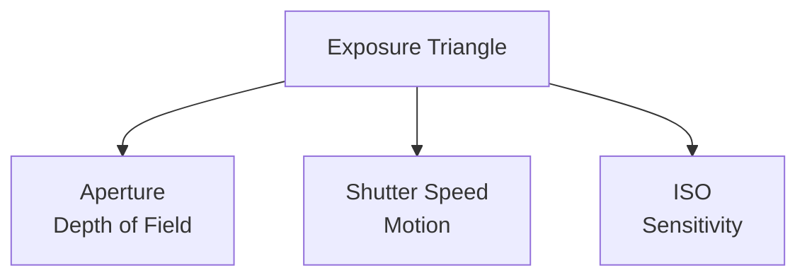
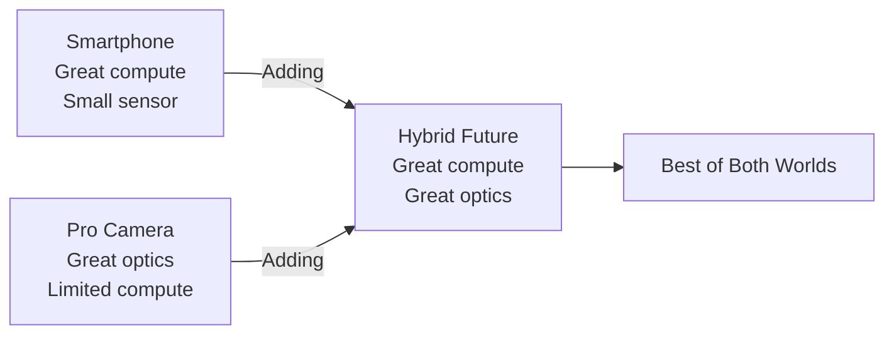

# Photography Fundamentals

Photography is the art and science of capturing light to create images.

## The Exposure Triangle



### Aperture (f-stop)
- [definition] Size of lens opening that lets light in
- [measurement] f/1.4, f/2.8, f/5.6, f/11, f/16
- [effect] Controls depth of field (background blur)

**Rules:**
- **Lower f-number** (f/1.4): Large aperture, shallow depth of field, blurry background
- **Higher f-number** (f/16): Small aperture, deep depth of field, sharp throughout

### Shutter Speed
- [definition] How long the sensor is exposed to light
- [measurement] 1/1000s, 1/250s, 1/60s, 1/15s, 1s
- [effect] Controls motion blur

**Rules:**
- **Fast shutter** (1/1000s): Freeze action
- **Slow shutter** (1/15s): Motion blur, light trails

### ISO
- [definition] Sensor sensitivity to light
- [measurement] 100, 200, 400, 800, 1600, 3200, 6400
- [effect] Controls image brightness and noise

**Rules:**
- **Low ISO** (100-400): Clean image, less noise, needs more light
- **High ISO** (1600+): Brighter in low light, more noise/grain

## Composition Rules

### Rule of Thirds
```
Grid:
 +---+---+---+
 | . | . | . |
 +---+---+---+
 | . | X | . |   X = Point of interest
 +---+---+---+
 | . | . | . |
 +---+---+---+
```

- [rule] Place subject at intersection points
- [benefit] More dynamic than center composition
- [application] Landscapes, portraits, any subject

### Leading Lines
- [technique] Use natural lines to guide eye to subject
- [examples] Roads, rivers, fences, buildings
- [benefit] Creates depth and draws attention

### Framing
- [technique] Use environmental elements to frame subject
- [examples] Doorways, windows, tree branches
- [benefit] Focuses attention and adds context

## Camera Modes

### Manual (M)
Full control over aperture, shutter, ISO.
- [use] When you need precise control
- [learning] Best mode to understand photography

### Aperture Priority (A/Av)
You set aperture, camera sets shutter speed.
- [use] Control depth of field
- [example] Portraits (shallow), landscapes (deep)

### Shutter Priority (S/Tv)
You set shutter speed, camera sets aperture.
- [use] Control motion
- [example] Sports (fast), waterfalls (slow)

### Auto (A+)
Camera controls everything.
- [use] Quick snapshots
- [limitation] Limited creative control

## Lighting Basics

### Natural Light
- **Golden Hour**: Hour after sunrise/before sunset (warm, soft)
- **Blue Hour**: Twilight (cool, moody)
- **Midday**: Harsh shadows (challenging)

### Direction of Light
- **Front Light**: Even, flat (least dramatic)
- **Side Light**: Texture and dimension
- **Back Light**: Silhouettes and rim light
- **Rembrandt Light**: 45° creates triangle under eye

## Computational Photography: The "Little Glass, Lots of Compute" Revolution

### The Paradigm Shift

**Traditional photography** (1839-2010):
- Better images = Bigger lens, better glass, larger sensor
- Physics determines quality (aperture, focal length, sensor size)
- Post-processing limited to darkroom/Photoshop

**Computational photography** (2010-present):
- Better images = More processing power, better algorithms, AI
- Software compensates for hardware limitations
- Multi-frame capture, AI enhancement, scene understanding

**The trend**: "Little glass, lots of compute" - smartphones with tiny lenses producing DSLR-quality images through computational magic.

---

### Core Technologies

**Multi-Frame Processing**:
- [technique] Capture 10+ frames, merge computationally
- [examples] HDR (High Dynamic Range), Night Mode, Super Resolution
- [benefit] Overcomes single-frame limitations
- [iPhone] Deep Fusion (merges 9 exposures in 1 second)
- [Pixel] Night Sight (merges 15+ frames for low-light)

**AI-Powered Enhancement**:
- [capability] Scene recognition (food, landscape, portrait, etc.)
- [capability] Subject detection and tracking
- [capability] Automatic optimization per scene type
- [capability] Style transfer and artistic filters
- [capability] Object removal, sky replacement, background blur

**Computational Bokeh**:
- [technology] Software-generated background blur (fake depth of field)
- [method] Dual cameras or depth sensors map scene
- [result] Portrait mode without f/1.4 lens!
- [limitation] Edge detection can fail (hair, glasses, complex backgrounds)

**Smart HDR**:
- [process] Capture multiple exposures, merge highlights and shadows
- [benefit] Preserve detail in bright skies AND dark shadows
- [comparison] Single exposure must choose (blown highlights or crushed blacks)

---

### What Computational Photography Can Do

**Overcome Physics** (partially):
- ✅ Low-light performance (Night Mode stacks frames)
- ✅ Extended dynamic range (HDR merging)
- ✅ Shallow depth of field (computational bokeh)
- ✅ Zoom enhancement (super resolution algorithms)
- ✅ Noise reduction (AI-powered)

**New Capabilities Impossible with Optical-Only**:
- ✅ **Live HDR Preview**: See HDR before capture
- ✅ **Portrait Lighting**: Change lighting after capture
- ✅ **Focus Stacking**: Sharp foreground AND background
- ✅ **Long Exposure Simulation**: 30s exposure handheld!
- ✅ **Astrophotography**: Smartphone captures stars (Google Pixel)
- ✅ **Instant Sharing**: Seamless social media integration
- ✅ **AI Editing**: One-tap professional edits
- ✅ **Object Detection**: "Find all photos with dog"

---

### Limitations (Physics Still Matters!)

**What Computational Photography CANNOT Do** (yet):
- ❌ **True bokeh**: Software blur ≠ optical blur (artifacts on edges)
- ❌ **Extreme low-light**: Can't create light that isn't there
- ❌ **True telephoto**: Digital zoom = crop + interpolation (quality loss)
- ❌ **Fast action**: Multi-frame processing needs stable scene
- ❌ **Large prints**: Small sensors = limited resolution for wall-sized prints
- ❌ **Manual control**: Heavily automated, less creative control
- ❌ **RAW flexibility**: Compressed computational output vs true RAW

**The Physics Wall**:
- Sensor size still matters (larger = better light gathering)
- Lens quality still matters (resolving power, distortion)
- No algorithm can recover detail that wasn't captured
- Motion blur in subject can't be removed (only camera shake)

---

### Classical Rules Made Obsolete

**What's changing**:

| Classical Rule | Computational Workaround | Status |
|----------------|--------------------------|--------|
| "Need f/1.4 for bokeh" | Portrait mode (software blur) | ⚠️ Good enough (95% cases) |
| "Avoid high ISO" | AI noise reduction | ⚠️ Usable to ISO 6400+ |
| "Use tripod at night" | Night mode (frame stacking) | ⚠️ 5s handheld = 30s tripod |
| "Large sensor for quality" | Computational super resolution | ⚠️ Diminishing returns |
| "Shoot RAW for flexibility" | Smart HDR captures detail | ⚠️ Auto HDR = 90% of RAW |
| "Fast lens for low light" | Multi-frame brightening | ⚠️ Good for static subjects |

**Still relevant**:
- ✅ Composition (Rule of Thirds, Leading Lines) - **software can't fix bad composition!**
- ✅ Timing and moment - **algorithms can't predict decisive moment**
- ✅ Storytelling and perspective - **AI can't create artistic vision**
- ✅ Light direction - **computational can't replace good natural light**

---

### The Smartphone Question: Do High-End Phones Replace Pro Cameras?

**Where smartphones WIN** (90% of use cases):
- ✅ Convenience (always with you)
- ✅ Instant sharing (social media integration)
- ✅ Computational features (Night Mode, Portrait Mode, HDR)
- ✅ Good enough for web/social (Instagram, Facebook)
- ✅ AI auto-enhancement (one-tap professional look)
- ✅ Cost (included with phone you already own)
- ✅ "Best camera is the one you have with you"

**Where pro cameras STILL WIN**:
- ✅ **Extreme low-light**: f/1.2 lens + full-frame sensor > any algorithm
- ✅ **Fast action**: 20 fps burst, instant autofocus, no computational delay
- ✅ **Telephoto reach**: 200mm, 400mm, 600mm (optical zoom matters!)
- ✅ **Large prints**: 45MP+ sensors for wall-sized prints
- ✅ **Manual control**: Full creative control over every parameter
- ✅ **RAW workflow**: Maximum post-processing flexibility
- ✅ **Professional work**: Weddings, sports, wildlife, commercial
- ✅ **True bokeh**: Optical blur quality (creamy, natural)
- ✅ **Ergonomics**: Physical controls, viewfinder, lens ecosystem

**The verdict**: **Context-dependent!**
- **Social media, travel, everyday**: Smartphone wins (convenience + "good enough")
- **Professional, print, creative control**: Pro camera wins (quality + flexibility)
- **Enthusiast photography**: Hybrid approach (smartphone + mirrorless for special occasions)

---

### AI-Powered Photography: The New Frontier

**Current AI Capabilities** (2024-2025):
- [generation] **Generative Fill**: Adobe Firefly, Photoshop - extend images, remove objects
- [enhancement] **AI Upscaling**: Topaz Gigapixel - 2x-4x resolution increase
- [restoration] **Photo Restoration**: Repair old photos, colorize black & white
- [style] **Style Transfer**: Turn photo into painting, sketch, or artistic style
- [editing] **One-Click Edits**: "Make this photo cinematic" (AI understands intent)
- [subject] **Subject Selection**: AI automatically masks people, objects, sky
- [relighting] **AI Relighting**: Change lighting direction after capture
- [focus] **AI Focus Stacking**: Merge multiple focal planes perfectly

**Emerging Capabilities** (2025+):
- [generation] **Text-to-Image Integration**: "Add sunset to this photo"
- [3d] **3D Scene Reconstruction**: Single 2D photo → 3D model
- [motion] **Motion Prediction**: Remove motion blur by predicting movement
- [synthesis] **View Synthesis**: Generate new viewing angles from one photo
- [enhancement] **Beyond Resolution**: Add detail that wasn't captured (AI hallucination)

**Ethical Concerns**:
- ⚠️ **Reality vs fabrication**: Is heavily AI-edited photo still "photography"?
- ⚠️ **Deepfakes**: AI can create photorealistic fake images
- ⚠️ **Authenticity**: Journalism, documentary require "unedited" photos
- ⚠️ **Over-reliance**: Losing fundamental photography skills?

**The Balance**:
- Use AI to **enhance** your vision, not replace it
- Understand fundamentals (even if AI automates)
- Disclose AI edits in professional/journalistic work
- AI is a tool, not a substitute for artistic vision

---

### Integration: Photography Everywhere

**Computational photography enables**:

**1. Seamless App Integration**
- [Instagram] One-tap filters powered by computational HDR
- [Snapchat] Real-time AR filters using computational depth mapping
- [TikTok] Instant beauty modes, background replacement
- [Adobe Lightroom Mobile] Professional editing on smartphone

**2. Web Integration**
- [Google Photos] Automatic organization, face recognition, search
- [iCloud Photos] Seamless sync across devices
- [Unsplash] Instant upload from smartphone to stock photography
- [Portfolio sites] Mobile-first photography workflows

**3. Social Media Revolution**
- [quality] Smartphone photos good enough for professional social media
- [speed] Capture → edit → post in seconds
- [trend] "Shot on iPhone" campaigns by Apple
- [influence] Instagram photographers with only smartphones

**4. Accessibility**
- [entry barrier] Photography accessible to billions (smartphone owners)
- [learning] Instant feedback, computational assists help beginners
- [democratization] Great photos no longer require expensive equipment
- [creativity] Focus on vision, not technical barriers

---

### The Future: AI + Computational + Optical

**The ideal** (emerging):
- **High-end smartphones** (2025+): Computational + multi-camera systems
  - iPhone Pro: 48MP main + telephoto + ultra-wide + LiDAR
  - Pixel: Computational photography pioneer + Google AI
  - Sony Xperia: Computational + Sony's camera sensor expertise

- **Hybrid cameras** (2025+): DSLRs/mirrorless with computational features
  - Sony A1: Full-frame sensor + AI autofocus + computational HDR
  - Canon R5: 45MP + AI subject detection + in-camera upscaling
  - Computational features come to pro cameras!

**The convergence**:


**Prediction**:
- Smartphones will continue improving (better computational algorithms)
- Pro cameras will add computational features (catching up)
- Gap narrows but doesn't disappear (physics still matters)
- **Your choice depends on use case**, not "which is better"

---

### Practical Recommendations

**For Social Media / Web**:
- ✅ High-end smartphone is sufficient (iPhone Pro, Pixel Pro, Samsung Ultra)
- ✅ Computational features handle 95% of scenarios
- ✅ Convenience wins (always with you)

**For Professional Work**:
- ✅ Dedicated camera still recommended (full-frame mirrorless or DSLR)
- ✅ Interchangeable lenses critical (zoom range, specialty lenses)
- ✅ Manual control essential (creative vision)

**For Enthusiasts**:
- ✅ Hybrid approach: Smartphone for everyday, camera for special occasions
- ✅ Learn fundamentals on either platform (principles apply)
- ✅ Invest in learning, not just gear

**Key insight**: **Gear matters less than ever** - computational photography democratized quality. But **vision, timing, and composition** still require human creativity!

---

## Relations
- enables [[Portrait Photography]]
- enables [[Landscape Photography]]
- related_to [[Image Editing]]
- related_to [[Computational Photography]]
- relates_to [[AI in Creative Work]]
- uses [[Composition Techniques]]
- builds_on [[Visual Arts]]
- implements [[Digital Photography]]
- contrasts_with [[Film Photography]]

## Practice Exercises

1. **Exposure Triangle**: Shoot same scene with different settings
2. **Rule of Thirds**: Compose 10 photos using the grid
3. **Lighting**: Same subject, different times of day
4. **Modes**: Compare manual vs auto mode results

*Photography is painting with light - master exposure and composition to tell visual stories.*
