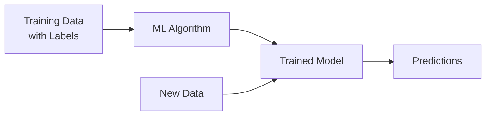
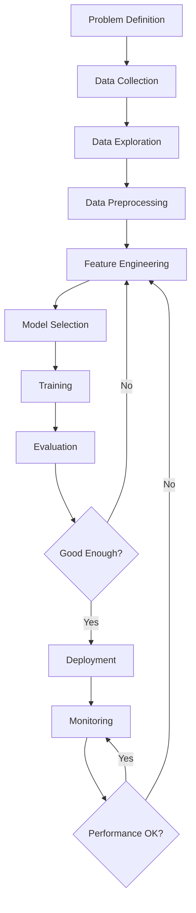

# Machine Learning Fundamentals

Machine Learning enables computers to learn from data without being explicitly programmed.

## Core Concepts

- [definition] **Machine Learning**: Algorithms that improve automatically through experience
- [definition] **Training**: Process of learning patterns from data
- [definition] **Model**: Mathematical representation learned from data

## Types of Machine Learning

### Supervised Learning
Learning from labeled data to predict outcomes.



**Examples:**
- Classification: Email spam detection
- Regression: House price prediction

```python
from sklearn.linear_model import LogisticRegression

# Training
X_train = [[feature1, feature2], ...]  # Features
y_train = [0, 1, 0, ...]  # Labels

model = LogisticRegression()
model.fit(X_train, y_train)

# Prediction
y_pred = model.predict(X_test)
```

### Unsupervised Learning
Finding patterns in unlabeled data.

**Examples:**
- Clustering: Customer segmentation
- Dimensionality Reduction: Feature compression

```python
from sklearn.cluster import KMeans

# Clustering
kmeans = KMeans(n_clusters=3)
clusters = kmeans.fit_predict(X)
```

### Reinforcement Learning
Learning through trial and error with rewards.

- [concept] Agent takes actions in environment
- [concept] Receives rewards or penalties
- [goal] Maximize cumulative reward

## ML Workflow



## Key Algorithms

### Linear Regression
```python
from sklearn.linear_model import LinearRegression

model = LinearRegression()
model.fit(X_train, y_train)
predictions = model.predict(X_test)
```

- [use-case] Predicting continuous values
- [example] Sales forecasting, price estimation

### Decision Trees
```python
from sklearn.tree import DecisionTreeClassifier

model = DecisionTreeClassifier(max_depth=5)
model.fit(X_train, y_train)
```

- [use-case] Classification and regression
- [benefit] Easy to interpret and visualize
- [drawback] Prone to overfitting

### Random Forest
```python
from sklearn.ensemble import RandomForestClassifier

model = RandomForestClassifier(n_estimators=100)
model.fit(X_train, y_train)
```

- [concept] Ensemble of decision trees
- [benefit] Reduces overfitting
- [benefit] Handles missing data well

## Evaluation Metrics

### Classification
- **Accuracy**: (TP + TN) / Total
- **Precision**: TP / (TP + FP)
- **Recall**: TP / (TP + FN)
- **F1-Score**: Harmonic mean of precision and recall

### Regression
- **MAE**: Mean Absolute Error
- **MSE**: Mean Squared Error
- **RMSE**: Root Mean Squared Error
- **R²**: Coefficient of determination

## Common Pitfalls

1. **Overfitting**: Model performs well on training but poorly on new data
   - Solution: Cross-validation, regularization

2. **Underfitting**: Model too simple to capture patterns
   - Solution: More complex model, more features

3. **Data Leakage**: Test data influences training
   - Solution: Proper train/test split

4. **Imbalanced Data**: Unequal class distribution
   - Solution: Resampling, class weights

## Relations
- enables [[Deep Learning]]
- uses [[Statistics Fundamentals]]
- uses [[Python for Data Science]]
- related_to [[Feature Engineering]]
- related_to [[Model Deployment]]

*Machine learning is pattern recognition at scale - understand the fundamentals before diving deep.*
