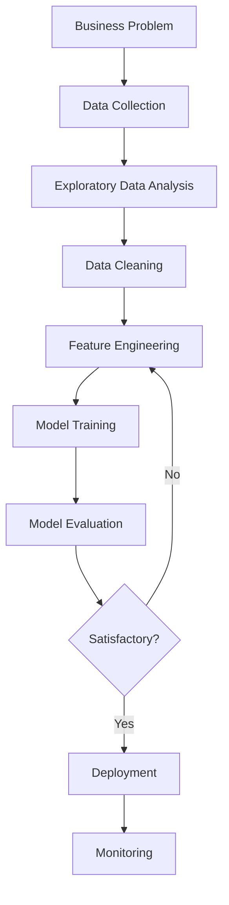

# Python for Data Science

Python is the dominant language for data science, with rich libraries for analysis, visualization, and machine learning.

## Essential Libraries

### NumPy - Numerical Computing
```python
import numpy as np

# Create arrays
arr = np.array([1, 2, 3, 4, 5])
matrix = np.array([[1, 2], [3, 4]])

# Operations
mean = np.mean(arr)
std = np.std(arr)
sum_axis = matrix.sum(axis=0)  # Column sums

# Broadcasting
result = arr * 2  # [2, 4, 6, 8, 10]
```

- [definition] NumPy: Foundation for numerical computing in Python
- [feature] Fast array operations (C-optimized)
- [feature] Broadcasting for element-wise operations

### Pandas - Data Manipulation
```python
import pandas as pd

# Create DataFrame
df = pd.DataFrame({
    'name': ['Alice', 'Bob', 'Charlie'],
    'age': [25, 30, 35],
    'salary': [50000, 60000, 70000]
})

# Data operations
filtered = df[df['age'] > 28]
grouped = df.groupby('department')['salary'].mean()
sorted_df = df.sort_values('salary', ascending=False)

# Handle missing data
df.fillna(0)
df.dropna()
```

- [definition] Pandas: Data manipulation and analysis library
- [structure] DataFrame: 2D labeled data structure
- [feature] SQL-like operations on data

### Matplotlib - Visualization
```python
import matplotlib.pyplot as plt

# Line plot
plt.plot(x, y)
plt.xlabel('Time')
plt.ylabel('Value')
plt.title('My Plot')
plt.show()

# Subplots
fig, (ax1, ax2) = plt.subplots(1, 2, figsize=(12, 4))
ax1.plot(x, y1)
ax2.scatter(x, y2)
```

### Seaborn - Statistical Visualization
```python
import seaborn as sns

# Distribution plot
sns.histplot(data=df, x='age', bins=20)

# Relationship plot
sns.scatterplot(data=df, x='age', y='salary', hue='department')

# Correlation heatmap
correlation_matrix = df.corr()
sns.heatmap(correlation_matrix, annot=True)
```

### Scikit-learn - Machine Learning
```python
from sklearn.model_selection import train_test_split
from sklearn.preprocessing import StandardScaler
from sklearn.linear_model import LogisticRegression
from sklearn.metrics import accuracy_score

# Split data
X_train, X_test, y_train, y_test = train_test_split(
    X, y, test_size=0.2, random_state=42
)

# Scale features
scaler = StandardScaler()
X_train_scaled = scaler.fit_transform(X_train)
X_test_scaled = scaler.transform(X_test)

# Train model
model = LogisticRegression()
model.fit(X_train_scaled, y_train)

# Evaluate
y_pred = model.predict(X_test_scaled)
accuracy = accuracy_score(y_test, y_pred)
```

## Data Science Workflow



## Common Patterns

### Data Loading
```python
# CSV
df = pd.read_csv('data.csv')

# Excel
df = pd.read_excel('data.xlsx', sheet_name='Sheet1')

# SQL Database
import sqlalchemy as sa
engine = sa.create_engine('postgresql://localhost/db')
df = pd.read_sql('SELECT * FROM users', engine)

# JSON
df = pd.read_json('data.json')
```

### Data Cleaning
```python
# Handle missing values
df.isnull().sum()  # Count nulls
df.fillna(df.mean())  # Fill with mean
df.dropna()  # Drop rows with nulls

# Remove duplicates
df.drop_duplicates()

# Convert types
df['date'] = pd.to_datetime(df['date'])
df['category'] = df['category'].astype('category')

# Handle outliers
Q1 = df['value'].quantile(0.25)
Q3 = df['value'].quantile(0.75)
IQR = Q3 - Q1
df_clean = df[(df['value'] >= Q1 - 1.5*IQR) & (df['value'] <= Q3 + 1.5*IQR)]
```

### Feature Engineering
```python
# Create new features
df['age_group'] = pd.cut(df['age'], bins=[0, 18, 30, 50, 100])
df['total_spend'] = df['price'] * df['quantity']

# Encoding categorical variables
df_encoded = pd.get_dummies(df, columns=['category'])

# Date features
df['year'] = df['date'].dt.year
df['month'] = df['date'].dt.month
df['day_of_week'] = df['date'].dt.dayofweek
```

## Relations
- builds_on [[Python Fundamentals]]
- uses [[NumPy]]
- uses [[Pandas]]
- uses [[Scikit-learn]]
- enables [[Machine Learning Fundamentals]]
- enables [[Data Visualization]]

## Best Practices

1. **Exploratory Data Analysis (EDA) First**
   - Understand data distribution
   - Identify correlations
   - Spot outliers and anomalies

2. **Reproducibility**
   - Set random seeds
   - Version data and code
   - Document preprocessing steps

3. **Efficiency**
   - Use vectorized operations (avoid loops)
   - Sample large datasets for exploration
   - Use appropriate data types

4. **Validation**
   - Always use train/test split
   - Cross-validation for robust estimates
   - Hold-out set for final evaluation

*Python's data science ecosystem is unmatched - master these libraries to unlock data insights.*
