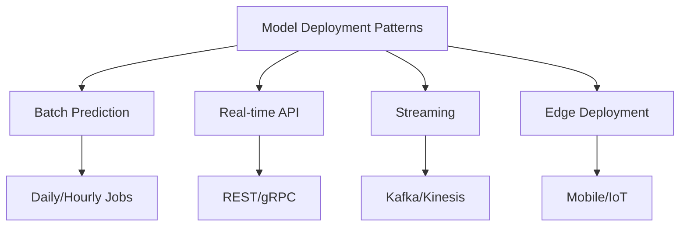

# ML Model Deployment

Model deployment is the process of integrating a machine learning model into a production environment where it can make predictions on real data. This requires considering scalability, latency, monitoring, and model versioning.

## Deployment Patterns



## Model Serving with FastAPI

### Basic Model Server
```python
from fastapi import FastAPI, HTTPException
from pydantic import BaseModel
import joblib
import numpy as np
from typing import List

app = FastAPI(title="ML Model API")

class PredictionRequest(BaseModel):
    """Input features for prediction"""
    features: List[float]

class PredictionResponse(BaseModel):
    """Prediction result"""
    prediction: float
    model_version: str
    confidence: float

class ModelServer:
    """Serve ML model via REST API"""
    
    def __init__(self, model_path: str):
        self.model = joblib.load(model_path)
        self.model_version = "1.0.0"
    
    def predict(self, features: np.ndarray) -> dict:
        """Make prediction"""
        try:
            # Get prediction
            prediction = self.model.predict(features.reshape(1, -1))[0]
            
            # Get confidence if model supports it
            confidence = 0.95
            if hasattr(self.model, 'predict_proba'):
                probas = self.model.predict_proba(features.reshape(1, -1))[0]
                confidence = np.max(probas)
            
            return {
                'prediction': float(prediction),
                'model_version': self.model_version,
                'confidence': float(confidence)
            }
        except Exception as e:
            raise HTTPException(status_code=500, detail=f"Prediction failed: {str(e)}")

# Initialize model server
model_server = ModelServer("models/model.pkl")

@app.post("/predict", response_model=PredictionResponse)
async def predict(request: PredictionRequest):
    """Prediction endpoint"""
    features = np.array(request.features)
    result = model_server.predict(features)
    return result

@app.get("/health")
async def health_check():
    """Health check endpoint"""
    return {"status": "healthy", "model_version": model_server.model_version}
```

### Advanced Model Server with Preprocessing
```python
from sklearn.preprocessing import StandardScaler
import pandas as pd

class AdvancedModelServer:
    """Production model server with preprocessing"""
    
    def __init__(self, model_path: str, scaler_path: str = None):
        self.model = joblib.load(model_path)
        self.scaler = joblib.load(scaler_path) if scaler_path else None
        self.feature_names = ['feature1', 'feature2', 'feature3', 'feature4']
    
    def preprocess(self, features: dict) -> np.ndarray:
        """Preprocess input features"""
        # Convert to DataFrame
        df = pd.DataFrame([features])
        
        # Ensure correct feature order
        df = df[self.feature_names]
        
        # Handle missing values
        df = df.fillna(df.median())
        
        # Scale features
        if self.scaler:
            features_scaled = self.scaler.transform(df)
        else:
            features_scaled = df.values
        
        return features_scaled
    
    def predict(self, features: dict) -> dict:
        """Make prediction with preprocessing"""
        # Preprocess
        processed_features = self.preprocess(features)
        
        # Predict
        prediction = self.model.predict(processed_features)[0]
        
        # Get feature importance
        if hasattr(self.model, 'feature_importances_'):
            feature_importance = dict(zip(
                self.feature_names,
                self.model.feature_importances_
            ))
        else:
            feature_importance = {}
        
        return {
            'prediction': float(prediction),
            'feature_importance': feature_importance
        }

class InputFeatures(BaseModel):
    """Structured input features"""
    feature1: float
    feature2: float
    feature3: float
    feature4: float

@app.post("/predict/v2")
async def predict_v2(features: InputFeatures):
    """Prediction with structured input"""
    result = model_server.predict(features.dict())
    return result
```

## Batch Prediction

### Batch Inference Pipeline
```python
import pandas as pd
from typing import Iterator

class BatchPredictor:
    """Batch prediction for large datasets"""
    
    def __init__(self, model_path: str, batch_size: int = 1000):
        self.model = joblib.load(model_path)
        self.batch_size = batch_size
    
    def predict_csv(self, input_path: str, output_path: str):
        """Predict on CSV file"""
        # Read in chunks
        chunks = pd.read_csv(input_path, chunksize=self.batch_size)
        
        first_chunk = True
        for chunk in chunks:
            # Preprocess
            X = self._preprocess(chunk)
            
            # Predict
            predictions = self.model.predict(X)
            
            # Add predictions to DataFrame
            chunk['prediction'] = predictions
            
            # Write to output
            if first_chunk:
                chunk.to_csv(output_path, index=False)
                first_chunk = False
            else:
                chunk.to_csv(output_path, mode='a', header=False, index=False)
    
    def predict_stream(self, data_iterator: Iterator[pd.DataFrame]) -> Iterator[dict]:
        """Predict on data stream"""
        for batch in data_iterator:
            X = self._preprocess(batch)
            predictions = self.model.predict(X)
            
            for idx, pred in enumerate(predictions):
                yield {
                    'id': batch.iloc[idx]['id'],
                    'prediction': pred
                }
    
    def _preprocess(self, df: pd.DataFrame) -> np.ndarray:
        """Preprocess batch"""
        # Handle missing values
        df = df.fillna(0)
        
        # Select features
        feature_cols = ['feature1', 'feature2', 'feature3', 'feature4']
        X = df[feature_cols].values
        
        return X

# Usage
predictor = BatchPredictor('models/model.pkl')
predictor.predict_csv('data/input.csv', 'data/predictions.csv')
```

## Model Versioning

### Model Registry
```python
import mlflow
from datetime import datetime

class ModelRegistry:
    """Manage model versions"""
    
    def __init__(self, registry_uri: str):
        mlflow.set_tracking_uri(registry_uri)
        self.client = mlflow.tracking.MlflowClient()
    
    def register_model(self, model, model_name: str, metadata: dict):
        """Register new model version"""
        with mlflow.start_run():
            # Log model
            mlflow.sklearn.log_model(model, "model")
            
            # Log metrics
            mlflow.log_metrics(metadata.get('metrics', {}))
            
            # Log parameters
            mlflow.log_params(metadata.get('params', {}))
            
            # Register model
            model_uri = f"runs:/{mlflow.active_run().info.run_id}/model"
            mv = mlflow.register_model(model_uri, model_name)
            
            return mv.version
    
    def promote_to_production(self, model_name: str, version: int):
        """Promote model version to production"""
        self.client.transition_model_version_stage(
            name=model_name,
            version=version,
            stage="Production"
        )
    
    def load_production_model(self, model_name: str):
        """Load current production model"""
        model_uri = f"models:/{model_name}/Production"
        model = mlflow.sklearn.load_model(model_uri)
        return model
    
    def get_model_versions(self, model_name: str) -> list:
        """Get all versions of a model"""
        versions = self.client.search_model_versions(f"name='{model_name}'")
        return [
            {
                'version': v.version,
                'stage': v.current_stage,
                'created_at': v.creation_timestamp
            }
            for v in versions
        ]
```

### A/B Testing
```python
import random

class ABTestingServer:
    """Serve multiple model versions for A/B testing"""
    
    def __init__(self, model_a_path: str, model_b_path: str, split_ratio: float = 0.5):
        self.model_a = joblib.load(model_a_path)
        self.model_b = joblib.load(model_b_path)
        self.split_ratio = split_ratio
        self.version_metrics = {'a': [], 'b': []}
    
    def predict(self, features: np.ndarray, user_id: str = None) -> dict:
        """Predict with A/B testing"""
        # Deterministic assignment based on user_id
        if user_id:
            version = 'a' if hash(user_id) % 100 < self.split_ratio * 100 else 'b'
        else:
            version = 'a' if random.random() < self.split_ratio else 'b'
        
        # Select model
        model = self.model_a if version == 'a' else self.model_b
        
        # Predict
        prediction = model.predict(features.reshape(1, -1))[0]
        
        return {
            'prediction': float(prediction),
            'model_version': version,
            'user_id': user_id
        }
    
    def record_feedback(self, user_id: str, prediction: float, actual: float):
        """Record prediction feedback"""
        # Determine which model was used
        version = 'a' if hash(user_id) % 100 < self.split_ratio * 100 else 'b'
        
        # Calculate error
        error = abs(prediction - actual)
        self.version_metrics[version].append(error)
    
    def get_metrics(self) -> dict:
        """Get A/B testing metrics"""
        return {
            'model_a': {
                'predictions': len(self.version_metrics['a']),
                'mean_error': np.mean(self.version_metrics['a']) if self.version_metrics['a'] else 0
            },
            'model_b': {
                'predictions': len(self.version_metrics['b']),
                'mean_error': np.mean(self.version_metrics['b']) if self.version_metrics['b'] else 0
            }
        }
```

## Monitoring & Observability

### Model Performance Monitoring
```python
from prometheus_client import Counter, Histogram, Gauge
import time

# Prometheus metrics
prediction_counter = Counter('predictions_total', 'Total predictions made')
prediction_latency = Histogram('prediction_latency_seconds', 'Prediction latency')
feature_drift_gauge = Gauge('feature_drift_score', 'Feature drift score')

class MonitoredModelServer:
    """Model server with monitoring"""
    
    def __init__(self, model_path: str):
        self.model = joblib.load(model_path)
        self.reference_data = None  # For drift detection
    
    def predict(self, features: np.ndarray) -> dict:
        """Predict with monitoring"""
        start_time = time.time()
        
        try:
            # Make prediction
            prediction = self.model.predict(features.reshape(1, -1))[0]
            
            # Record metrics
            prediction_counter.inc()
            prediction_latency.observe(time.time() - start_time)
            
            # Check for feature drift
            if self.reference_data is not None:
                drift_score = self._calculate_drift(features)
                feature_drift_gauge.set(drift_score)
            
            return {
                'prediction': float(prediction),
                'latency_ms': (time.time() - start_time) * 1000
            }
        except Exception as e:
            # Record error
            prediction_counter.inc()
            raise
    
    def _calculate_drift(self, features: np.ndarray) -> float:
        """Calculate feature drift score"""
        # Simple drift detection using KL divergence
        from scipy.stats import entropy
        
        # Calculate distributions
        ref_mean = np.mean(self.reference_data, axis=0)
        ref_std = np.std(self.reference_data, axis=0)
        
        curr_mean = features[0]
        
        # Calculate drift
        drift = np.mean(np.abs((curr_mean - ref_mean) / (ref_std + 1e-10)))
        
        return float(drift)

@app.get("/metrics")
async def metrics():
    """Expose Prometheus metrics"""
    from prometheus_client import generate_latest
    return Response(content=generate_latest(), media_type="text/plain")
```

### Data Quality Checks
```python
from pydantic import BaseModel, validator

class ValidatedFeatures(BaseModel):
    """Features with validation"""
    age: float
    income: float
    credit_score: float
    
    @validator('age')
    def validate_age(cls, v):
        if v < 0 or v > 120:
            raise ValueError('Age must be between 0 and 120')
        return v
    
    @validator('income')
    def validate_income(cls, v):
        if v < 0:
            raise ValueError('Income must be positive')
        return v
    
    @validator('credit_score')
    def validate_credit_score(cls, v):
        if v < 300 or v > 850:
            raise ValueError('Credit score must be between 300 and 850')
        return v

@app.post("/predict/validated")
async def predict_validated(features: ValidatedFeatures):
    """Prediction with input validation"""
    features_array = np.array([features.age, features.income, features.credit_score])
    result = model_server.predict(features_array)
    return result
```

## Containerization

### Docker Deployment
```dockerfile
FROM python:3.10-slim

WORKDIR /app

# Install dependencies
COPY requirements.txt .
RUN pip install --no-cache-dir -r requirements.txt

# Copy model and code
COPY models/ ./models/
COPY app.py .

# Expose port
EXPOSE 8000

# Health check
HEALTHCHECK --interval=30s --timeout=3s --start-period=5s --retries=3 \
    CMD curl -f http://localhost:8000/health || exit 1

# Run server
CMD ["uvicorn", "app:app", "--host", "0.0.0.0", "--port", "8000"]
```

### Kubernetes Deployment
```yaml
apiVersion: apps/v1
kind: Deployment
metadata:
  name: ml-model-server
spec:
  replicas: 3
  selector:
    matchLabels:
      app: ml-model
  template:
    metadata:
      labels:
        app: ml-model
    spec:
      containers:
      - name: model-server
        image: ml-model:1.0.0
        ports:
        - containerPort: 8000
        resources:
          requests:
            cpu: "500m"
            memory: "1Gi"
          limits:
            cpu: "1000m"
            memory: "2Gi"
        livenessProbe:
          httpGet:
            path: /health
            port: 8000
          initialDelaySeconds: 30
          periodSeconds: 10
        readinessProbe:
          httpGet:
            path: /ready
            port: 8000
          initialDelaySeconds: 5
          periodSeconds: 5
---
apiVersion: v1
kind: Service
metadata:
  name: ml-model-service
spec:
  selector:
    app: ml-model
  ports:
  - port: 80
    targetPort: 8000
  type: LoadBalancer
```

## Best Practices

### Model Caching
```python
from functools import lru_cache

class CachedModelServer:
    """Model server with prediction caching"""
    
    def __init__(self, model_path: str):
        self.model = joblib.load(model_path)
    
    @lru_cache(maxsize=1000)
    def predict_cached(self, features_tuple: tuple) -> float:
        """Cached predictions for identical inputs"""
        features = np.array(features_tuple)
        return float(self.model.predict(features.reshape(1, -1))[0])
    
    def predict(self, features: np.ndarray) -> float:
        """Convert array to tuple for caching"""
        features_tuple = tuple(features)
        return self.predict_cached(features_tuple)
```

### Graceful Shutdown
```python
import signal
import sys

class GracefulModelServer:
    """Handle graceful shutdown"""
    
    def __init__(self):
        self.is_shutting_down = False
        signal.signal(signal.SIGTERM, self.shutdown_handler)
        signal.signal(signal.SIGINT, self.shutdown_handler)
    
    def shutdown_handler(self, signum, frame):
        """Handle shutdown signal"""
        print("Shutting down gracefully...")
        self.is_shutting_down = True
        
        # Wait for ongoing requests
        time.sleep(5)
        
        # Cleanup
        self.cleanup()
        
        sys.exit(0)
    
    def cleanup(self):
        """Cleanup resources"""
        # Close database connections
        # Flush metrics
        # Save state
        pass
```

## Related Concepts

- [[MLOps Pipeline]]
- [[Model Monitoring]]
- [[Feature Engineering]]
- [[Model Training]]
- [[A/B Testing]]
- [[Continuous Deployment]]
- [[Kubernetes]]
- [[REST API Design]]

## Common Challenges

### Model Size
- Large models increase latency
- Use model compression
- Quantization techniques

### Latency Requirements
- Use model caching
- Batch predictions
- GPU acceleration

### Versioning
- Track model lineage
- Use model registry
- Semantic versioning

### Monitoring
- Track prediction quality
- Detect data drift
- Alert on anomalies

---

*Deploying a model is not the end—it's the beginning of the ML lifecycle.*


