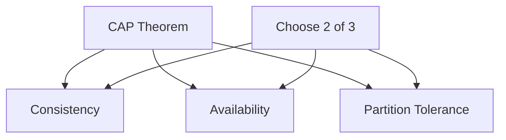
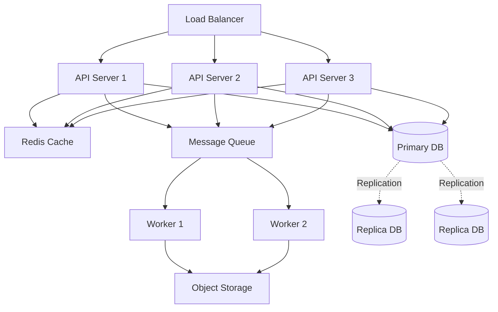

# Distributed Systems

A distributed system is a collection of independent computers that appear to users as a single coherent system. These systems enable scaling, fault tolerance, and geographic distribution.

## Core Concepts

### CAP Theorem


**Trade-offs:**
- **CA Systems**: Traditional RDBMS (sacrifice partition tolerance)
- **CP Systems**: MongoDB, HBase (sacrifice availability during partition)
- **AP Systems**: Cassandra, DynamoDB (sacrifice consistency)

### Data Consistency Models

**Strong Consistency:**
```python
# All reads reflect the most recent write
class StrongConsistency:
    def write(self, key, value):
        # Wait for all replicas to acknowledge
        for replica in self.replicas:
            replica.write(key, value)
        return True
    
    def read(self, key):
        # Read from master or latest replica
        return self.master.read(key)
```

**Eventual Consistency:**
```python
# Reads may return stale data, but eventually consistent
class EventualConsistency:
    def write(self, key, value):
        # Asynchronous replication
        self.master.write(key, value)
        asyncio.create_task(self.replicate(key, value))
        return True
    
    async def replicate(self, key, value):
        for replica in self.replicas:
            await replica.write(key, value)
```

## Distributed Patterns

### Leader Election
```python
from kazoo.client import KazooClient

class LeaderElection:
    """Leader election using ZooKeeper"""
    
    def __init__(self, zk_hosts, election_path):
        self.zk = KazooClient(hosts=zk_hosts)
        self.election_path = election_path
        self.is_leader = False
    
    def run_for_leader(self):
        """Compete to become leader"""
        election = self.zk.Election(self.election_path, "node-id")
        
        # This blocks until this node becomes leader
        election.run(self.on_elected)
    
    def on_elected(self):
        """Called when this node becomes leader"""
        self.is_leader = True
        print("I am the leader!")
        # Perform leader duties
```

### Distributed Locking
```python
from redis import Redis
from redis.lock import Lock

class DistributedLock:
    """Distributed lock using Redis"""
    
    def __init__(self, redis_client):
        self.redis = redis_client
    
    def acquire_lock(self, resource_name, timeout=10):
        """Acquire distributed lock"""
        lock = self.redis.lock(
            name=f"lock:{resource_name}",
            timeout=timeout,
            blocking_timeout=5
        )
        
        if lock.acquire():
            try:
                # Critical section
                yield lock
            finally:
                lock.release()

# Usage
redis = Redis(host='localhost', port=6379)
lock_manager = DistributedLock(redis)

with lock_manager.acquire_lock("user:123"):
    # Only one process can execute this at a time
    process_user_transaction(123)
```

### Message Queues
```python
import pika

class RabbitMQClient:
    """Asynchronous message processing"""
    
    def __init__(self, host='localhost'):
        self.connection = pika.BlockingConnection(
            pika.ConnectionParameters(host=host)
        )
        self.channel = self.connection.channel()
    
    def publish(self, queue_name, message):
        """Publish message to queue"""
        self.channel.queue_declare(queue=queue_name, durable=True)
        self.channel.basic_publish(
            exchange='',
            routing_key=queue_name,
            body=message,
            properties=pika.BasicProperties(
                delivery_mode=2,  # Make message persistent
            )
        )
    
    def consume(self, queue_name, callback):
        """Consume messages from queue"""
        self.channel.queue_declare(queue=queue_name, durable=True)
        self.channel.basic_qos(prefetch_count=1)
        self.channel.basic_consume(
            queue=queue_name,
            on_message_callback=callback
        )
        self.channel.start_consuming()
```

## Distributed Data Patterns

### Sharding
```python
class ConsistentHashing:
    """Consistent hashing for distributed data"""
    
    def __init__(self, nodes, replicas=150):
        self.replicas = replicas
        self.ring = {}
        self.sorted_keys = []
        
        for node in nodes:
            self.add_node(node)
    
    def add_node(self, node):
        """Add node to the ring"""
        for i in range(self.replicas):
            key = self._hash(f"{node}:{i}")
            self.ring[key] = node
            self.sorted_keys.append(key)
        self.sorted_keys.sort()
    
    def get_node(self, key):
        """Find the node responsible for this key"""
        if not self.ring:
            return None
        
        hash_key = self._hash(key)
        
        # Find first node >= hash_key
        for node_key in self.sorted_keys:
            if node_key >= hash_key:
                return self.ring[node_key]
        
        # Wrap around to first node
        return self.ring[self.sorted_keys[0]]
    
    def _hash(self, key):
        """Hash function"""
        import hashlib
        return int(hashlib.md5(key.encode()).hexdigest(), 16)
```

### Replication
```python
class ReplicationManager:
    """Manage data replication across nodes"""
    
    def __init__(self, replicas):
        self.replicas = replicas
        self.replication_factor = 3
    
    async def write_with_replication(self, key, value):
        """Write to master and replicas"""
        # Write to master
        await self.replicas[0].write(key, value)
        
        # Asynchronous replication to followers
        replication_tasks = [
            replica.write(key, value) 
            for replica in self.replicas[1:self.replication_factor]
        ]
        
        # Wait for quorum
        results = await asyncio.gather(*replication_tasks, return_exceptions=True)
        
        successful = sum(1 for r in results if not isinstance(r, Exception))
        
        if successful >= len(self.replicas) // 2:
            return True
        else:
            raise Exception("Failed to achieve replication quorum")
```

## System Architecture Example



## Best Practices

### Idempotency
```python
class IdempotentOperation:
    """Ensure operations can be retried safely"""
    
    def __init__(self, redis_client):
        self.redis = redis_client
    
    def process_payment(self, payment_id, amount):
        """Process payment idempotently"""
        # Check if already processed
        if self.redis.exists(f"payment:{payment_id}"):
            return {"status": "already_processed"}
        
        try:
            # Process payment
            result = self._charge_card(amount)
            
            # Mark as processed (TTL for cleanup)
            self.redis.setex(
                f"payment:{payment_id}",
                time=86400,  # 24 hours
                value="processed"
            )
            
            return result
        except Exception as e:
            # Safe to retry
            raise
```

### Circuit Breaker
```python
from datetime import datetime, timedelta

class CircuitBreaker:
    """Prevent cascading failures"""
    
    def __init__(self, failure_threshold=5, timeout=60):
        self.failure_threshold = failure_threshold
        self.timeout = timeout
        self.failures = 0
        self.last_failure_time = None
        self.state = "CLOSED"  # CLOSED, OPEN, HALF_OPEN
    
    def call(self, func, *args, **kwargs):
        """Execute function with circuit breaker"""
        if self.state == "OPEN":
            if datetime.now() - self.last_failure_time > timedelta(seconds=self.timeout):
                self.state = "HALF_OPEN"
            else:
                raise Exception("Circuit breaker is OPEN")
        
        try:
            result = func(*args, **kwargs)
            self._on_success()
            return result
        except Exception as e:
            self._on_failure()
            raise
    
    def _on_success(self):
        """Reset on success"""
        self.failures = 0
        self.state = "CLOSED"
    
    def _on_failure(self):
        """Track failures"""
        self.failures += 1
        self.last_failure_time = datetime.now()
        
        if self.failures >= self.failure_threshold:
            self.state = "OPEN"
```

## Related Concepts

- [[Microservices Architecture]]
- [[Event-Driven Architecture]]
- [[Database Sharding]]
- [[Load Balancing]]
- [[Service Mesh]]
- [[Distributed Tracing]]
- [[Consensus Algorithms]]
- [[Data Replication Strategies]]

## Common Challenges

### Split Brain Problem
- Multiple nodes think they're the leader
- Solution: Use odd number of nodes for quorum
- Implement fencing mechanisms

### Network Partitions
- Network splits cluster into isolated groups
- Solution: Detect partitions quickly, use heartbeats
- Implement partition-aware routing

### Clock Synchronization
- Different system clocks drift
- Solution: Use NTP, logical clocks (Lamport timestamps)
- Use vector clocks for causality

### Cascading Failures
- One service failure triggers others
- Solution: Circuit breakers, bulkheads, timeouts
- Implement graceful degradation

---

*Distributed systems are complex—start simple, add complexity only when needed.*


