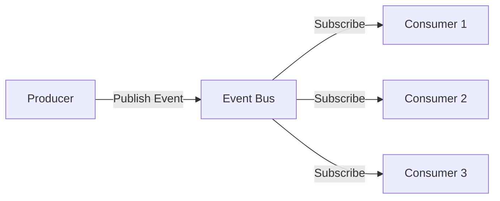

# Event-Driven Architecture

Event-Driven Architecture (EDA) is a design pattern where services communicate through events - significant changes in state. This enables loose coupling, scalability, and real-time processing.

## Core Concepts



### Event Types

**Domain Events:**
```python
from dataclasses import dataclass
from datetime import datetime
from typing import Optional

@dataclass
class DomainEvent:
    """Base class for domain events"""
    event_id: str
    event_type: str
    timestamp: datetime
    aggregate_id: str
    version: int

@dataclass
class OrderCreated(DomainEvent):
    """Order creation event"""
    order_id: str
    user_id: str
    items: list
    total_amount: float
    
@dataclass
class PaymentProcessed(DomainEvent):
    """Payment processing event"""
    payment_id: str
    order_id: str
    amount: float
    status: str

@dataclass
class InventoryReserved(DomainEvent):
    """Inventory reservation event"""
    reservation_id: str
    order_id: str
    items: list
```

## Event Sourcing

Store all changes as a sequence of events instead of just current state:

```python
from typing import List
import json

class EventStore:
    """Store and retrieve events"""
    
    def __init__(self, db):
        self.db = db
    
    async def append_event(self, stream_id: str, event: DomainEvent):
        """Append event to stream"""
        await self.db.events.insert_one({
            'stream_id': stream_id,
            'event_id': event.event_id,
            'event_type': event.event_type,
            'data': event.__dict__,
            'timestamp': event.timestamp,
            'version': event.version
        })
    
    async def get_events(self, stream_id: str, from_version: int = 0) -> List[DomainEvent]:
        """Get all events for stream"""
        events = await self.db.events.find({
            'stream_id': stream_id,
            'version': {'$gte': from_version}
        }).sort('version', 1).to_list(None)
        
        return [self._deserialize_event(e) for e in events]
    
    def _deserialize_event(self, event_data: dict) -> DomainEvent:
        """Deserialize event from storage"""
        event_type = event_data['event_type']
        # Map event_type to event class
        event_class = globals()[event_type]
        return event_class(**event_data['data'])

class Order:
    """Aggregate built from events"""
    
    def __init__(self, order_id: str):
        self.order_id = order_id
        self.user_id = None
        self.items = []
        self.status = "pending"
        self.total_amount = 0
        self.version = 0
        self.uncommitted_events = []
    
    @classmethod
    async def load(cls, order_id: str, event_store: EventStore):
        """Load order from event stream"""
        order = cls(order_id)
        events = await event_store.get_events(f"order-{order_id}")
        
        for event in events:
            order._apply_event(event)
        
        return order
    
    def create_order(self, user_id: str, items: list, total_amount: float):
        """Create new order"""
        event = OrderCreated(
            event_id=generate_id(),
            event_type='OrderCreated',
            timestamp=datetime.now(),
            aggregate_id=self.order_id,
            version=self.version + 1,
            order_id=self.order_id,
            user_id=user_id,
            items=items,
            total_amount=total_amount
        )
        self._apply_event(event)
        self.uncommitted_events.append(event)
    
    def _apply_event(self, event: DomainEvent):
        """Apply event to state"""
        if isinstance(event, OrderCreated):
            self.user_id = event.user_id
            self.items = event.items
            self.total_amount = event.total_amount
            self.status = "created"
            self.version = event.version
        # Handle other event types...
    
    async def save(self, event_store: EventStore):
        """Save uncommitted events"""
        for event in self.uncommitted_events:
            await event_store.append_event(f"order-{self.order_id}", event)
        self.uncommitted_events = []
```

## CQRS (Command Query Responsibility Segregation)

Separate reads and writes for different models:

```python
from abc import ABC, abstractmethod

# Command side
class Command(ABC):
    """Base command"""
    pass

class CreateOrderCommand(Command):
    def __init__(self, order_id: str, user_id: str, items: list):
        self.order_id = order_id
        self.user_id = user_id
        self.items = items

class CommandHandler(ABC):
    """Handle commands"""
    
    @abstractmethod
    async def handle(self, command: Command):
        pass

class CreateOrderHandler(CommandHandler):
    """Handle order creation"""
    
    def __init__(self, event_store: EventStore, event_bus: EventBus):
        self.event_store = event_store
        self.event_bus = event_bus
    
    async def handle(self, command: CreateOrderCommand):
        """Create order and publish events"""
        # Create order aggregate
        order = Order(command.order_id)
        order.create_order(
            user_id=command.user_id,
            items=command.items,
            total_amount=calculate_total(command.items)
        )
        
        # Save events
        await order.save(self.event_store)
        
        # Publish events
        for event in order.uncommitted_events:
            await self.event_bus.publish(event)

# Query side
class OrderReadModel:
    """Denormalized read model"""
    
    def __init__(self, db):
        self.db = db
    
    async def get_order(self, order_id: str):
        """Get order from read model"""
        return await self.db.order_views.find_one({'order_id': order_id})
    
    async def get_user_orders(self, user_id: str):
        """Get all orders for user"""
        return await self.db.order_views.find({'user_id': user_id}).to_list(None)

class OrderProjection:
    """Update read model from events"""
    
    def __init__(self, read_model: OrderReadModel):
        self.read_model = read_model
    
    async def handle_order_created(self, event: OrderCreated):
        """Update read model when order is created"""
        await self.read_model.db.order_views.insert_one({
            'order_id': event.order_id,
            'user_id': event.user_id,
            'items': event.items,
            'total_amount': event.total_amount,
            'status': 'created',
            'created_at': event.timestamp
        })
    
    async def handle_payment_processed(self, event: PaymentProcessed):
        """Update read model when payment is processed"""
        await self.read_model.db.order_views.update_one(
            {'order_id': event.order_id},
            {'$set': {'status': 'paid', 'payment_id': event.payment_id}}
        )
```

## Event Bus Implementation

### Apache Kafka
```python
from kafka import KafkaProducer, KafkaConsumer
import json

class KafkaEventBus:
    """Event bus using Kafka"""
    
    def __init__(self, bootstrap_servers: list):
        self.producer = KafkaProducer(
            bootstrap_servers=bootstrap_servers,
            value_serializer=lambda v: json.dumps(v).encode('utf-8'),
            acks='all',  # Wait for all replicas
            retries=3
        )
    
    async def publish(self, event: DomainEvent):
        """Publish event to Kafka"""
        topic = f"events.{event.event_type.lower()}"
        
        self.producer.send(
            topic,
            key=event.aggregate_id.encode('utf-8'),
            value=event.__dict__
        )
        self.producer.flush()
    
    def subscribe(self, topics: list, group_id: str, handler):
        """Subscribe to events"""
        consumer = KafkaConsumer(
            *topics,
            bootstrap_servers=self.bootstrap_servers,
            group_id=group_id,
            value_deserializer=lambda v: json.loads(v.decode('utf-8')),
            enable_auto_commit=False,
            max_poll_records=100
        )
        
        for message in consumer:
            try:
                event = self._deserialize_event(message.value)
                handler(event)
                consumer.commit()
            except Exception as e:
                print(f"Error handling event: {e}")
                # Send to dead letter queue
                self._send_to_dlq(message)
```

### RabbitMQ
```python
import pika
import json

class RabbitMQEventBus:
    """Event bus using RabbitMQ"""
    
    def __init__(self, host: str, exchange_name: str = 'events'):
        self.connection = pika.BlockingConnection(
            pika.ConnectionParameters(host=host)
        )
        self.channel = self.connection.channel()
        self.exchange = exchange_name
        
        # Declare topic exchange
        self.channel.exchange_declare(
            exchange=self.exchange,
            exchange_type='topic',
            durable=True
        )
    
    def publish(self, event: DomainEvent):
        """Publish event to exchange"""
        routing_key = f"events.{event.event_type.lower()}.{event.aggregate_id}"
        
        self.channel.basic_publish(
            exchange=self.exchange,
            routing_key=routing_key,
            body=json.dumps(event.__dict__),
            properties=pika.BasicProperties(
                delivery_mode=2,  # Persistent
                content_type='application/json'
            )
        )
    
    def subscribe(self, routing_pattern: str, callback):
        """Subscribe to events with routing pattern"""
        # Create queue
        queue_result = self.channel.queue_declare('', exclusive=True)
        queue_name = queue_result.method.queue
        
        # Bind queue to exchange with pattern
        self.channel.queue_bind(
            exchange=self.exchange,
            queue=queue_name,
            routing_key=routing_pattern
        )
        
        # Consume messages
        def on_message(ch, method, properties, body):
            event_data = json.loads(body)
            callback(event_data)
            ch.basic_ack(delivery_tag=method.delivery_tag)
        
        self.channel.basic_consume(
            queue=queue_name,
            on_message_callback=on_message
        )
        
        self.channel.start_consuming()
```

## Event Processing Patterns

### Saga Pattern
```python
class OrderSaga:
    """Coordinate distributed transaction with events"""
    
    def __init__(self, event_bus: EventBus):
        self.event_bus = event_bus
        self.state = {}
    
    async def on_order_created(self, event: OrderCreated):
        """Step 1: Reserve inventory"""
        self.state[event.order_id] = {'step': 'inventory'}
        
        await self.event_bus.publish(ReserveInventory(
            order_id=event.order_id,
            items=event.items
        ))
    
    async def on_inventory_reserved(self, event: InventoryReserved):
        """Step 2: Process payment"""
        order_id = event.order_id
        self.state[order_id]['step'] = 'payment'
        
        await self.event_bus.publish(ProcessPayment(
            order_id=order_id,
            amount=self.state[order_id]['amount']
        ))
    
    async def on_payment_processed(self, event: PaymentProcessed):
        """Step 3: Complete order"""
        order_id = event.order_id
        self.state[order_id]['step'] = 'completed'
        
        await self.event_bus.publish(CompleteOrder(
            order_id=order_id
        ))
    
    async def on_payment_failed(self, event: PaymentFailed):
        """Compensation: Release inventory"""
        order_id = event.order_id
        
        await self.event_bus.publish(ReleaseInventory(
            order_id=order_id
        ))
    
    async def on_inventory_failed(self, event: InventoryFailed):
        """Compensation: Cancel order"""
        await self.event_bus.publish(CancelOrder(
            order_id=event.order_id
        ))
```

### Event Replay
```python
class EventReplayer:
    """Replay events to rebuild state"""
    
    def __init__(self, event_store: EventStore):
        self.event_store = event_store
    
    async def rebuild_read_model(self, projection):
        """Rebuild entire read model"""
        # Get all events
        all_events = await self.event_store.get_all_events()
        
        # Clear read model
        await projection.clear()
        
        # Replay events
        for event in all_events:
            await projection.handle(event)
    
    async def replay_from_date(self, from_date: datetime, projection):
        """Replay events from specific date"""
        events = await self.event_store.get_events_since(from_date)
        
        for event in events:
            await projection.handle(event)
```

## Best Practices

### Event Schema Versioning
```python
@dataclass
class OrderCreatedV1(DomainEvent):
    """Version 1 of OrderCreated"""
    order_id: str
    user_id: str
    items: list

@dataclass
class OrderCreatedV2(DomainEvent):
    """Version 2 with additional fields"""
    order_id: str
    user_id: str
    items: list
    shipping_address: dict  # New field
    
    @classmethod
    def from_v1(cls, v1_event: OrderCreatedV1):
        """Upgrade from V1"""
        return cls(
            event_id=v1_event.event_id,
            event_type='OrderCreatedV2',
            timestamp=v1_event.timestamp,
            aggregate_id=v1_event.aggregate_id,
            version=v1_event.version,
            order_id=v1_event.order_id,
            user_id=v1_event.user_id,
            items=v1_event.items,
            shipping_address={}  # Default for old events
        )
```

### Idempotent Event Handlers
```python
class IdempotentEventHandler:
    """Process events exactly once"""
    
    def __init__(self, db):
        self.db = db
    
    async def handle(self, event: DomainEvent):
        """Handle event idempotently"""
        # Check if already processed
        if await self.db.processed_events.find_one({'event_id': event.event_id}):
            return  # Already processed
        
        try:
            # Process event
            await self._process(event)
            
            # Mark as processed
            await self.db.processed_events.insert_one({
                'event_id': event.event_id,
                'timestamp': datetime.now()
            })
        except Exception as e:
            # Log error but don't mark as processed
            print(f"Error processing event {event.event_id}: {e}")
            raise
```

### Dead Letter Queue
```python
class DeadLetterQueue:
    """Handle failed events"""
    
    def __init__(self, db):
        self.db = db
    
    async def add_failed_event(self, event: DomainEvent, error: str):
        """Add event to DLQ"""
        await self.db.dead_letters.insert_one({
            'event': event.__dict__,
            'error': error,
            'timestamp': datetime.now(),
            'retry_count': 0
        })
    
    async def retry_failed_events(self, max_retries: int = 3):
        """Retry events in DLQ"""
        failed_events = await self.db.dead_letters.find({
            'retry_count': {'$lt': max_retries}
        }).to_list(None)
        
        for failed in failed_events:
            try:
                event = self._deserialize_event(failed['event'])
                await self.process_event(event)
                
                # Remove from DLQ
                await self.db.dead_letters.delete_one({'_id': failed['_id']})
            except Exception as e:
                # Increment retry count
                await self.db.dead_letters.update_one(
                    {'_id': failed['_id']},
                    {'$inc': {'retry_count': 1}}
                )
```

## Related Concepts

- [[Microservices Architecture]]
- [[Message Queues]]
- [[Domain-Driven Design]]
- [[CQRS Pattern]]
- [[Event Sourcing]]
- [[Saga Pattern]]
- [[Eventually Consistent Systems]]
- [[Distributed Tracing]]

## Common Pitfalls

### Event Ordering
- Events may arrive out of order
- Use sequence numbers or timestamps
- Consider event causality

### Event Loss
- Ensure at-least-once delivery
- Implement retry logic
- Use persistent event stores

### Event Explosion
- Too many fine-grained events
- Batch related changes
- Use event aggregation

### Schema Evolution
- Events are immutable
- Support multiple versions
- Use upcasting for old events

---

*Events should represent business facts that have happened—not commands or intentions.*


