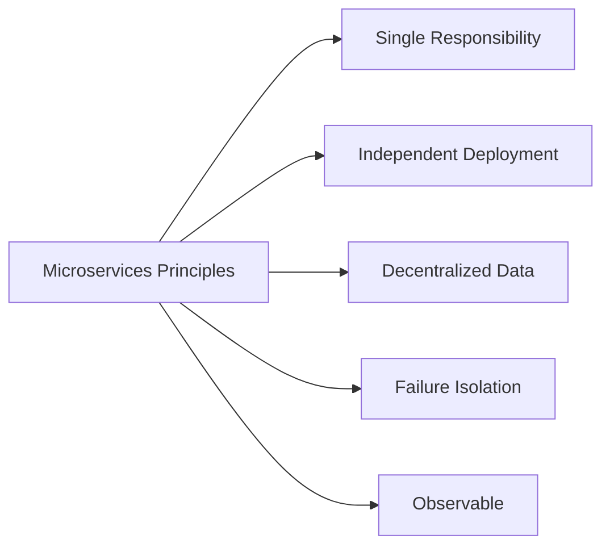
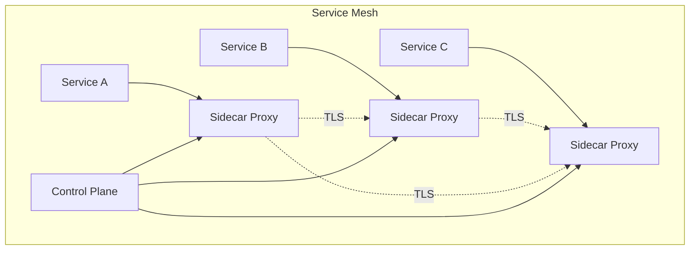

# Microservices Architecture

Microservices is an architectural style where applications are composed of small, independent services that communicate over well-defined APIs. Each service is owned by a small team and can be developed, deployed, and scaled independently.

## Core Principles



### Service Design

**Good Microservice:**
```python
# User Service - Single Responsibility
from fastapi import FastAPI, HTTPException
from pydantic import BaseModel

app = FastAPI()

class User(BaseModel):
    id: int
    username: str
    email: str

class UserService:
    """Handles user management only"""

    def __init__(self, db):
        self.db = db

    @app.post("/users")
    async def create_user(self, user: User):
        """Create new user"""
        return await self.db.users.insert_one(user.dict())

    @app.get("/users/{user_id}")
    async def get_user(self, user_id: int):
        """Get user by ID"""
        user = await self.db.users.find_one({"id": user_id})
        if not user:
            raise HTTPException(status_code=404)
        return user

    @app.put("/users/{user_id}")
    async def update_user(self, user_id: int, user: User):
        """Update user"""
        return await self.db.users.update_one(
            {"id": user_id},
            {"$set": user.dict()}
        )
```

## Service Communication

### Synchronous (REST)
```python
import httpx
from fastapi import FastAPI

app = FastAPI()

class OrderService:
    """Order service communicates with other services"""

    def __init__(self):
        self.user_service_url = "http://user-service:8000"
        self.inventory_service_url = "http://inventory-service:8000"
        self.client = httpx.AsyncClient()

    async def create_order(self, user_id: int, items: list):
        """Create order with service orchestration"""
        # 1. Verify user exists
        try:
            user = await self.client.get(
                f"{self.user_service_url}/users/{user_id}",
                timeout=5.0
            )
            user.raise_for_status()
        except httpx.HTTPError:
            raise HTTPException(status_code=400, detail="Invalid user")

        # 2. Check inventory
        for item in items:
            try:
                inventory = await self.client.get(
                    f"{self.inventory_service_url}/inventory/{item['id']}",
                    timeout=5.0
                )
                inventory.raise_for_status()

                if inventory.json()['quantity'] < item['quantity']:
                    raise HTTPException(
                        status_code=400,
                        detail=f"Insufficient inventory for {item['id']}"
                    )
            except httpx.HTTPError:
                raise HTTPException(status_code=500, detail="Inventory check failed")

        # 3. Reserve inventory
        for item in items:
            await self.client.post(
                f"{self.inventory_service_url}/inventory/{item['id']}/reserve",
                json={"quantity": item['quantity']},
                timeout=5.0
            )

        # 4. Create order
        order = {
            "user_id": user_id,
            "items": items,
            "status": "pending"
        }

        return order
```

### Asynchronous (Events)
```python
import json
from kafka import KafkaProducer, KafkaConsumer

class EventPublisher:
    """Publish domain events"""

    def __init__(self, bootstrap_servers):
        self.producer = KafkaProducer(
            bootstrap_servers=bootstrap_servers,
            value_serializer=lambda v: json.dumps(v).encode('utf-8')
        )

    def publish_event(self, topic: str, event: dict):
        """Publish event to topic"""
        self.producer.send(topic, event)
        self.producer.flush()

class EventSubscriber:
    """Subscribe to domain events"""

    def __init__(self, bootstrap_servers, group_id):
        self.consumer = KafkaConsumer(
            bootstrap_servers=bootstrap_servers,
            group_id=group_id,
            value_deserializer=lambda v: json.loads(v.decode('utf-8'))
        )

    def subscribe(self, topics: list, callback):
        """Subscribe to topics"""
        self.consumer.subscribe(topics)

        for message in self.consumer:
            callback(message.value)

# Usage - Event-driven order processing
class OrderEventHandler:
    """Handle order events"""

    def __init__(self, publisher):
        self.publisher = publisher

    def on_order_created(self, order):
        """When order is created, publish event"""
        self.publisher.publish_event('orders.created', {
            'order_id': order['id'],
            'user_id': order['user_id'],
            'amount': order['total']
        })

# Inventory service listens for orders
class InventoryEventHandler:
    """Inventory service handles order events"""

    def handle_order_created(self, event):
        """Reserve inventory when order is created"""
        order_id = event['order_id']
        # Reserve inventory logic
        print(f"Reserving inventory for order {order_id}")
```

## API Gateway Pattern

```python
from fastapi import FastAPI, Request
import httpx

app = FastAPI()

class APIGateway:
    """Single entry point for all services"""

    def __init__(self):
        self.services = {
            'users': 'http://user-service:8000',
            'orders': 'http://order-service:8000',
            'inventory': 'http://inventory-service:8000',
            'payments': 'http://payment-service:8000'
        }
        self.client = httpx.AsyncClient()

    async def route_request(self, service: str, path: str, request: Request):
        """Route request to appropriate service"""
        service_url = self.services.get(service)
        if not service_url:
            raise HTTPException(status_code=404)

        # Forward request
        url = f"{service_url}{path}"

        response = await self.client.request(
            method=request.method,
            url=url,
            headers=dict(request.headers),
            content=await request.body()
        )

        return response.json()

gateway = APIGateway()

@app.api_route("/{service}/{path:path}", methods=["GET", "POST", "PUT", "DELETE"])
async def gateway_route(service: str, path: str, request: Request):
    """Gateway endpoint"""
    return await gateway.route_request(service, path, request)
```

## Service Discovery

```python
import consul

class ServiceRegistry:
    """Service discovery using Consul"""

    def __init__(self, consul_host='localhost', consul_port=8500):
        self.consul = consul.Consul(host=consul_host, port=consul_port)

    def register_service(self, name: str, host: str, port: int, health_check_url: str):
        """Register service with discovery"""
        self.consul.agent.service.register(
            name=name,
            service_id=f"{name}-{host}-{port}",
            address=host,
            port=port,
            check=consul.Check.http(
                url=health_check_url,
                interval='10s',
                timeout='5s'
            )
        )

    def discover_service(self, name: str):
        """Discover healthy instances of service"""
        _, services = self.consul.health.service(name, passing=True)

        instances = [
            {
                'host': service['Service']['Address'],
                'port': service['Service']['Port']
            }
            for service in services
        ]

        return instances

    def deregister_service(self, service_id: str):
        """Deregister service"""
        self.consul.agent.service.deregister(service_id)

# Usage
registry = ServiceRegistry()

# On service startup
registry.register_service(
    name='user-service',
    host='192.168.1.100',
    port=8000,
    health_check_url='http://192.168.1.100:8000/health'
)

# When calling another service
user_service_instances = registry.discover_service('user-service')
# Use load balancer to select instance
```

## Service Mesh Architecture



## Data Management

### Database per Service
```python
# User Service has its own database
class UserService:
    def __init__(self):
        self.db = PostgreSQL('user-db')

    async def get_user(self, user_id):
        return await self.db.query("SELECT * FROM users WHERE id = $1", user_id)

# Order Service has its own database
class OrderService:
    def __init__(self):
        self.db = MongoDB('order-db')

    async def get_order(self, order_id):
        return await self.db.orders.find_one({"id": order_id})
```

### Saga Pattern (Distributed Transactions)
```python
class OrderSaga:
    """Manage distributed transaction across services"""

    def __init__(self):
        self.user_service = UserService()
        self.inventory_service = InventoryService()
        self.payment_service = PaymentService()

    async def create_order(self, order_data):
        """Execute saga with compensation"""
        # Step 1: Reserve inventory
        reservation = None
        payment = None

        try:
            reservation = await self.inventory_service.reserve(
                order_data['items']
            )

            # Step 2: Process payment
            payment = await self.payment_service.charge(
                order_data['user_id'],
                order_data['amount']
            )

            # Step 3: Create order
            order = await self.create_order_record(order_data)

            return order

        except Exception as e:
            # Compensation: Rollback in reverse order
            if payment:
                await self.payment_service.refund(payment['id'])

            if reservation:
                await self.inventory_service.release(reservation['id'])

            raise Exception(f"Order creation failed: {e}")
```

## Observability

### Distributed Tracing
```python
from opentelemetry import trace
from opentelemetry.exporter.jaeger import JaegerExporter
from opentelemetry.sdk.trace import TracerProvider
from opentelemetry.sdk.trace.export import BatchSpanProcessor

# Setup tracing
trace.set_tracer_provider(TracerProvider())
jaeger_exporter = JaegerExporter(
    agent_host_name='localhost',
    agent_port=6831,
)
trace.get_tracer_provider().add_span_processor(
    BatchSpanProcessor(jaeger_exporter)
)

tracer = trace.get_tracer(__name__)

class TracedService:
    """Service with distributed tracing"""

    async def process_order(self, order_id):
        """Trace order processing across services"""
        with tracer.start_as_current_span("process-order") as span:
            span.set_attribute("order.id", order_id)

            # Call user service
            with tracer.start_as_current_span("get-user"):
                user = await self.get_user()

            # Call inventory service
            with tracer.start_as_current_span("check-inventory"):
                available = await self.check_inventory()

            # Call payment service
            with tracer.start_as_current_span("process-payment"):
                payment = await self.process_payment()

            return {"status": "completed"}
```

## Best Practices

### Health Checks
```python
from fastapi import FastAPI

app = FastAPI()

@app.get("/health")
async def health_check():
    """Health check endpoint"""
    return {
        "status": "healthy",
        "service": "user-service",
        "version": "1.0.0"
    }

@app.get("/ready")
async def readiness_check():
    """Readiness check endpoint"""
    # Check database connection
    try:
        await db.ping()
        return {"status": "ready"}
    except:
        raise HTTPException(status_code=503, detail="Not ready")
```

### Circuit Breakers
Use libraries like `pybreaker` to prevent cascading failures

### Rate Limiting
Implement per-service rate limits to prevent abuse

### Versioning
Version your APIs to allow independent deployment

## Related Concepts

- [[Distributed Systems]]
- [[Event-Driven Architecture]]
- [[API Design]]
- [[Service Mesh]]
- [[Container Orchestration]]
- [[Database Sharding]]
- [[Cloud Native Applications]]
- [[DevOps Practices]]

## Common Pitfalls

### Too Fine-Grained Services
- Don't create a service for every entity
- Start with larger services, split when needed

### Distributed Monolith
- Services too tightly coupled
- Should be independently deployable

### Data Consistency
- Managing transactions across services is complex
- Use sagas or eventual consistency

### Network Overhead
- Too many inter-service calls
- Consider caching and denormalization

---

*Microservices add complexity—only use when benefits outweigh costs.*
