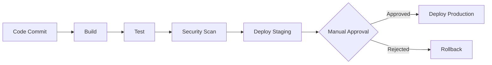

# CI/CD Fundamentals

Continuous Integration and Continuous Delivery/Deployment automate software delivery pipelines.

## Definitions

- [definition] **Continuous Integration (CI)**: Automatically build and test code changes
- [definition] **Continuous Delivery (CD)**: Automatically deploy to staging/pre-production
- [definition] **Continuous Deployment (CD)**: Automatically deploy to production

## CI/CD Pipeline Stages



### 1. Build Stage
- Compile code
- Create artifacts
- Build Docker images

### 2. Test Stage
- Unit tests
- Integration tests
- End-to-end tests
- Code quality checks (linting, formatting)

### 3. Security Stage
- Dependency scanning
- Container image scanning
- SAST (Static Application Security Testing)
- License compliance

### 4. Deploy Stage
- Deploy to environments (dev, staging, production)
- Database migrations
- Configuration management

## Popular CI/CD Tools

### GitHub Actions
```yaml
name: CI/CD Pipeline

on:
  push:
    branches: [ main ]
  pull_request:
    branches: [ main ]

jobs:
  build-and-test:
    runs-on: ubuntu-latest

    steps:
    - uses: actions/checkout@v4

    - name: Set up Python
      uses: actions/setup-python@v5
      with:
        python-version: '3.12'

    - name: Install dependencies
      run: |
        pip install -r requirements.txt

    - name: Run tests
      run: |
        pytest

    - name: Build Docker image
      run: |
        docker build -t myapp:${{ github.sha }} .

    - name: Deploy
      if: github.ref == 'refs/heads/main'
      run: |
        # Deploy to production
        kubectl apply -f k8s/
```

### GitLab CI
```yaml
stages:
  - build
  - test
  - deploy

build:
  stage: build
  script:
    - docker build -t $CI_REGISTRY_IMAGE:$CI_COMMIT_SHA .
    - docker push $CI_REGISTRY_IMAGE:$CI_COMMIT_SHA

test:
  stage: test
  script:
    - pytest

deploy:
  stage: deploy
  script:
    - kubectl apply -f k8s/
  only:
    - main
```

## Best Practices

### 1. Fast Feedback
- Keep builds under 10 minutes
- Run fast tests first
- Parallelize test execution

### 2. Build Once, Deploy Many
- Build artifacts once, deploy to all environments
- Use same Docker image across environments
- Environment-specific configuration via env vars

### 3. Security in Pipeline
- Scan dependencies for vulnerabilities
- Scan Docker images
- Enforce code signing
- No secrets in code

### 4. Immutable Artifacts
- Tag builds with version/commit SHA
- Store artifacts in registry
- Never modify artifacts after build

### 5. Automated Testing
- Unit tests: Fast, isolated
- Integration tests: Multiple components
- E2E tests: Full user workflows
- Minimum 80% code coverage

## Deployment Strategies

### Blue-Green Deployment
- [strategy] Run two identical production environments
- [benefit] Zero downtime, instant rollback
- [process] Switch traffic from blue to green

### Canary Deployment
- [strategy] Gradually roll out to subset of users
- [benefit] Test in production with limited risk
- [process] Monitor metrics, increase traffic if healthy

### Rolling Deployment
- [strategy] Gradually replace old version with new
- [benefit] No downtime, controlled rollout
- [process] Update pods one at a time

## Relations
- enables [[Continuous Integration]]
- enables [[Continuous Deployment]]
- uses [[Docker Fundamentals]]
- uses [[Kubernetes Basics]]
- related_to [[DevOps Culture]]

## Metrics to Track

- **Build Success Rate**: % of builds that pass
- **Build Duration**: Time from commit to deployable artifact
- **Deployment Frequency**: How often deploying to production
- **Lead Time**: Time from commit to production
- **MTTR**: Mean time to recovery from failures
- **Change Failure Rate**: % of deployments causing incidents

*CI/CD is the backbone of modern software delivery - automate everything!*
