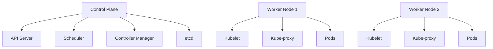

# Kubernetes Basics

Kubernetes (K8s) is an open-source container orchestration platform for automating deployment, scaling, and management of containerized applications.

## Core Concepts

### Cluster Architecture



- [definition] Control Plane: Manages the Kubernetes cluster
- [definition] Worker Nodes: Run containerized applications
- [component] API Server: Frontend for K8s control plane
- [component] Scheduler: Assigns pods to nodes
- [component] etcd: Distributed key-value store for cluster data

### Pods

Smallest deployable unit in Kubernetes - one or more containers that share network and storage.

```yaml
apiVersion: v1
kind: Pod
metadata:
  name: nginx-pod
  labels:
    app: nginx
spec:
  containers:
  - name: nginx
    image: nginx:1.25
    ports:
    - containerPort: 80
```

- [definition] Pod: Wrapper around one or more containers
- [characteristic] Pods are ephemeral and replaceable
- [pattern] Usually one container per pod (sidecar pattern for multiple)

### Deployments

Manage replica sets and provide declarative updates for Pods.

```yaml
apiVersion: apps/v1
kind: Deployment
metadata:
  name: nginx-deployment
spec:
  replicas: 3
  selector:
    matchLabels:
      app: nginx
  template:
    metadata:
      labels:
        app: nginx
    spec:
      containers:
      - name: nginx
        image: nginx:1.25
        ports:
        - containerPort: 80
```

- [benefit] Automatic scaling and self-healing
- [feature] Rolling updates with zero downtime
- [feature] Rollback capabilities

### Services

Expose applications running in Pods to network traffic.

```yaml
apiVersion: v1
kind: Service
metadata:
  name: nginx-service
spec:
  type: LoadBalancer
  selector:
    app: nginx
  ports:
  - port: 80
    targetPort: 80
```

Service Types:
- **ClusterIP**: Internal cluster access only (default)
- **NodePort**: Exposes on each Node's IP at a static port
- **LoadBalancer**: Cloud load balancer
- **ExternalName**: Maps service to DNS name

## Essential kubectl Commands

```bash
# Get resources
kubectl get pods
kubectl get deployments
kubectl get services

# Describe resource
kubectl describe pod pod-name

# View logs
kubectl logs pod-name

# Execute command in pod
kubectl exec -it pod-name -- /bin/bash

# Apply configuration
kubectl apply -f deployment.yaml

# Delete resources
kubectl delete -f deployment.yaml

# Port forwarding
kubectl port-forward pod-name 8080:80
```

## Relations
- builds_on [[Docker Fundamentals]]
- enables [[Container Orchestration]]
- related_to [[Helm Package Manager]]
- used_with [[CI/CD Pipelines]]

## Key Benefits

1. **Self-healing**: Automatically restarts failed containers
2. **Horizontal scaling**: Scale up/down based on demand
3. **Load balancing**: Distribute traffic across pods
4. **Rolling updates**: Deploy without downtime
5. **Service discovery**: Automatic DNS for services

*Kubernetes is complex but essential for modern cloud-native applications.*
