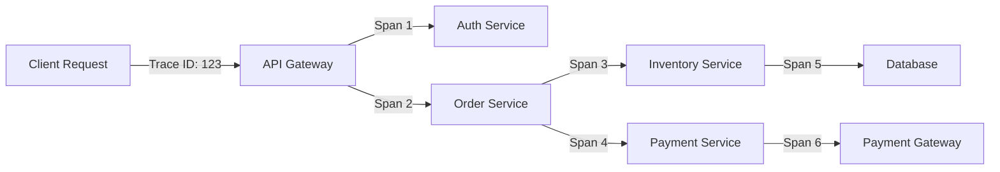

# Distributed Tracing

Distributed tracing tracks requests as they flow through microservices, providing visibility into performance bottlenecks, failures, and dependencies in distributed systems.

## Core Concepts



### Trace Structure
- **Trace**: End-to-end request journey (unique Trace ID)
- **Span**: Individual operation within a trace
- **Parent-Child Relationships**: Spans form a tree structure
- **Tags**: Metadata (HTTP method, status code, error flag)
- **Logs**: Timestamped events within a span

## OpenTelemetry Implementation

### Setup Tracing
```python
from opentelemetry import trace
from opentelemetry.sdk.trace import TracerProvider
from opentelemetry.sdk.trace.export import BatchSpanProcessor
from opentelemetry.exporter.jaeger.thrift import JaegerExporter
from opentelemetry.sdk.resources import Resource

def setup_tracing(service_name: str):
    """Initialize distributed tracing"""
    # Create resource with service information
    resource = Resource(attributes={
        "service.name": service_name,
        "service.version": "1.0.0",
        "deployment.environment": "production"
    })
    
    # Create tracer provider
    provider = TracerProvider(resource=resource)
    
    # Configure Jaeger exporter
    jaeger_exporter = JaegerExporter(
        agent_host_name="localhost",
        agent_port=6831,
    )
    
    # Add span processor
    provider.add_span_processor(
        BatchSpanProcessor(jaeger_exporter)
    )
    
    # Set global tracer provider
    trace.set_tracer_provider(provider)
    
    return trace.get_tracer(__name__)

tracer = setup_tracing("order-service")
```

### Creating Spans
```python
from opentelemetry import trace
from opentelemetry.trace import Status, StatusCode
import time

class OrderService:
    """Order service with distributed tracing"""
    
    def __init__(self, tracer):
        self.tracer = tracer
    
    async def create_order(self, user_id: int, items: list):
        """Create order with full tracing"""
        # Start root span
        with self.tracer.start_as_current_span(
            "create_order",
            kind=trace.SpanKind.SERVER
        ) as span:
            # Add attributes
            span.set_attribute("user.id", user_id)
            span.set_attribute("order.item_count", len(items))
            
            try:
                # Validate user
                user = await self._validate_user(user_id)
                
                # Check inventory
                available = await self._check_inventory(items)
                
                if not available:
                    span.set_status(Status(StatusCode.ERROR, "Insufficient inventory"))
                    span.set_attribute("error", True)
                    raise Exception("Insufficient inventory")
                
                # Process payment
                payment_result = await self._process_payment(user, items)
                
                # Create order record
                order = await self._save_order(user_id, items, payment_result)
                
                # Add success attributes
                span.set_attribute("order.id", order['id'])
                span.set_attribute("order.total", order['total'])
                span.set_status(Status(StatusCode.OK))
                
                return order
                
            except Exception as e:
                # Record exception
                span.record_exception(e)
                span.set_status(Status(StatusCode.ERROR, str(e)))
                raise
    
    async def _validate_user(self, user_id: int):
        """Validate user - creates child span"""
        with self.tracer.start_as_current_span(
            "validate_user",
            kind=trace.SpanKind.CLIENT
        ) as span:
            span.set_attribute("user.id", user_id)
            
            # Simulate external call
            async with httpx.AsyncClient() as client:
                response = await client.get(
                    f"http://user-service/users/{user_id}"
                )
                
                span.set_attribute("http.method", "GET")
                span.set_attribute("http.url", response.url)
                span.set_attribute("http.status_code", response.status_code)
                
                if response.status_code == 200:
                    return response.json()
                else:
                    raise Exception("User not found")
    
    async def _check_inventory(self, items: list):
        """Check inventory availability"""
        with self.tracer.start_as_current_span("check_inventory") as span:
            span.set_attribute("items.count", len(items))
            
            # Add event
            span.add_event("Checking inventory for items", {
                "item_ids": [item['id'] for item in items]
            })
            
            # Simulate inventory check
            await asyncio.sleep(0.1)
            
            available = all(item['quantity'] <= 100 for item in items)
            span.set_attribute("inventory.available", available)
            
            return available
    
    async def _process_payment(self, user: dict, items: list):
        """Process payment"""
        with self.tracer.start_as_current_span(
            "process_payment",
            kind=trace.SpanKind.CLIENT
        ) as span:
            total = sum(item['price'] * item['quantity'] for item in items)
            
            span.set_attribute("payment.amount", total)
            span.set_attribute("payment.currency", "USD")
            span.set_attribute("payment.method", user.get('payment_method', 'card'))
            
            # Simulate payment processing
            start_time = time.time()
            await asyncio.sleep(0.2)
            duration = time.time() - start_time
            
            span.set_attribute("payment.processing_time_ms", duration * 1000)
            
            return {
                'payment_id': 'pay_123',
                'status': 'completed',
                'amount': total
            }
    
    async def _save_order(self, user_id: int, items: list, payment: dict):
        """Save order to database"""
        with self.tracer.start_as_current_span(
            "save_order",
            kind=trace.SpanKind.INTERNAL
        ) as span:
            span.set_attribute("db.system", "postgresql")
            span.set_attribute("db.operation", "INSERT")
            span.set_attribute("db.table", "orders")
            
            # Simulate database write
            await asyncio.sleep(0.05)
            
            order = {
                'id': 'order_123',
                'user_id': user_id,
                'items': items,
                'total': payment['amount'],
                'status': 'completed'
            }
            
            return order
```

### FastAPI Integration
```python
from fastapi import FastAPI, Request
from opentelemetry.instrumentation.fastapi import FastAPIInstrumentor
from opentelemetry.instrumentation.httpx import HTTPXClientInstrumentor

app = FastAPI()

# Instrument FastAPI
FastAPIInstrumentor.instrument_app(app)

# Instrument HTTP client
HTTPXClientInstrumentor().instrument()

@app.middleware("http")
async def add_trace_context(request: Request, call_next):
    """Add tracing context to requests"""
    # Extract trace context from headers
    from opentelemetry.propagate import extract
    
    context = extract(request.headers)
    
    # Process request with context
    with tracer.start_as_current_span(
        f"{request.method} {request.url.path}",
        context=context,
        kind=trace.SpanKind.SERVER
    ) as span:
        # Add request attributes
        span.set_attribute("http.method", request.method)
        span.set_attribute("http.url", str(request.url))
        span.set_attribute("http.host", request.client.host)
        
        response = await call_next(request)
        
        # Add response attributes
        span.set_attribute("http.status_code", response.status_code)
        
        return response
```

## Context Propagation

### W3C Trace Context
```python
from opentelemetry.propagate import inject, extract

class TracePropagation:
    """Propagate trace context across services"""
    
    @staticmethod
    def inject_context(headers: dict) -> dict:
        """Inject trace context into HTTP headers"""
        inject(headers)
        return headers
    
    @staticmethod
    def extract_context(headers: dict):
        """Extract trace context from HTTP headers"""
        return extract(headers)

# Usage in HTTP client
async def call_external_service():
    """Call external service with trace context"""
    headers = {}
    TracePropagation.inject_context(headers)
    
    async with httpx.AsyncClient() as client:
        response = await client.get(
            "http://external-service/api",
            headers=headers
        )
    
    return response

# Usage in HTTP server
@app.post("/api/orders")
async def create_order(request: Request):
    """Receive request with trace context"""
    context = TracePropagation.extract_context(request.headers)
    
    with tracer.start_as_current_span("create_order", context=context):
        # Process order with trace context
        pass
```

## Sampling Strategies

### Adaptive Sampling
```python
from opentelemetry.sdk.trace.sampling import Sampler, Decision, SamplingResult

class AdaptiveSampler(Sampler):
    """Sample traces based on criteria"""
    
    def __init__(self, default_rate=0.1, error_rate=1.0):
        self.default_rate = default_rate  # 10% of normal requests
        self.error_rate = error_rate      # 100% of errors
    
    def should_sample(self, context, trace_id, name, kind, attributes, links):
        """Decide whether to sample this trace"""
        # Always sample errors
        if attributes and attributes.get("error") is True:
            return SamplingResult(Decision.RECORD_AND_SAMPLE)
        
        # Always sample slow requests (>1s)
        if attributes and attributes.get("http.duration_ms", 0) > 1000:
            return SamplingResult(Decision.RECORD_AND_SAMPLE)
        
        # Sample important endpoints at higher rate
        if attributes and attributes.get("http.route") in ["/api/checkout", "/api/payment"]:
            return SamplingResult(
                Decision.RECORD_AND_SAMPLE if random.random() < 0.5 else Decision.DROP
            )
        
        # Default sampling
        decision = (
            Decision.RECORD_AND_SAMPLE 
            if random.random() < self.default_rate 
            else Decision.DROP
        )
        
        return SamplingResult(decision)
    
    def get_description(self):
        return "AdaptiveSampler"
```

## Trace Analysis

### Performance Analysis
```python
class TraceAnalyzer:
    """Analyze trace data for insights"""
    
    def __init__(self, jaeger_client):
        self.client = jaeger_client
    
    def find_slow_traces(self, service: str, duration_threshold_ms: int = 1000):
        """Find traces exceeding duration threshold"""
        traces = self.client.search_traces(
            service=service,
            min_duration=f"{duration_threshold_ms}ms"
        )
        
        return [
            {
                'trace_id': trace.trace_id,
                'duration_ms': trace.duration / 1000,
                'spans': len(trace.spans),
                'errors': sum(1 for span in trace.spans if span.has_error)
            }
            for trace in traces
        ]
    
    def find_error_traces(self, service: str, time_range_hours: int = 24):
        """Find traces with errors"""
        traces = self.client.search_traces(
            service=service,
            tags={"error": "true"},
            lookback=f"{time_range_hours}h"
        )
        
        return traces
    
    def analyze_critical_path(self, trace_id: str):
        """Analyze critical path in trace"""
        trace = self.client.get_trace(trace_id)
        
        # Find longest path from root to leaf
        critical_path = []
        max_duration = 0
        
        for span in trace.spans:
            if span.parent_id is None:  # Root span
                path, duration = self._find_longest_path(trace, span)
                if duration > max_duration:
                    critical_path = path
                    max_duration = duration
        
        return {
            'critical_path': [span.operation_name for span in critical_path],
            'total_duration_ms': max_duration / 1000,
            'bottleneck': critical_path[-1].operation_name
        }
    
    def _find_longest_path(self, trace, span, current_path=None, current_duration=0):
        """Recursively find longest path"""
        if current_path is None:
            current_path = []
        
        current_path.append(span)
        current_duration += span.duration
        
        # Find child spans
        children = [s for s in trace.spans if s.parent_id == span.span_id]
        
        if not children:
            return current_path, current_duration
        
        # Recursively check all children
        longest_path = current_path
        longest_duration = current_duration
        
        for child in children:
            path, duration = self._find_longest_path(
                trace, child, current_path.copy(), current_duration
            )
            
            if duration > longest_duration:
                longest_path = path
                longest_duration = duration
        
        return longest_path, longest_duration
```

## Visualization

### Jaeger UI
- **Trace view**: Waterfall chart of spans
- **Span details**: Tags, logs, timing
- **Service dependencies**: Dependency graph
- **Performance**: Latency percentiles

### Custom Dashboards
```python
import matplotlib.pyplot as plt

class TraceVisualizer:
    """Visualize trace data"""
    
    def plot_trace_waterfall(self, trace):
        """Create waterfall chart"""
        fig, ax = plt.subplots(figsize=(12, 6))
        
        # Sort spans by start time
        spans = sorted(trace.spans, key=lambda s: s.start_time)
        
        for i, span in enumerate(spans):
            start = span.start_time - trace.start_time
            duration = span.duration
            
            color = 'red' if span.has_error else 'blue'
            ax.barh(i, duration, left=start, color=color, alpha=0.6)
            ax.text(start, i, span.operation_name, va='center')
        
        ax.set_xlabel('Time (ms)')
        ax.set_ylabel('Span')
        ax.set_title(f'Trace {trace.trace_id}')
        plt.tight_layout()
        plt.show()
    
    def plot_latency_distribution(self, traces):
        """Plot latency distribution"""
        latencies = [trace.duration / 1000 for trace in traces]
        
        plt.hist(latencies, bins=50, alpha=0.7)
        plt.xlabel('Latency (ms)')
        plt.ylabel('Count')
        plt.title('Trace Latency Distribution')
        plt.axvline(np.percentile(latencies, 95), color='r', linestyle='--', label='p95')
        plt.axvline(np.percentile(latencies, 99), color='orange', linestyle='--', label='p99')
        plt.legend()
        plt.show()
```

## Best Practices

### Span Naming
```python
# Good: Descriptive operation names
with tracer.start_as_current_span("GET /api/orders/{id}"):
    pass

# Bad: Generic names
with tracer.start_as_current_span("handler"):
    pass
```

### Adding Context
```python
# Add relevant attributes
span.set_attribute("user.id", user_id)
span.set_attribute("order.total", total)
span.set_attribute("db.query_time_ms", query_time)

# Add events for important moments
span.add_event("Payment processing started")
span.add_event("Inventory reserved", {
    "items": len(items),
    "warehouse": "US-WEST"
})
```

### Error Handling
```python
try:
    result = process_payment()
except Exception as e:
    # Record exception with full stack trace
    span.record_exception(e)
    span.set_status(Status(StatusCode.ERROR, str(e)))
    raise
```

## Related Concepts

- [[Observability]]
- [[Metrics Collection]]
- [[Log Aggregation]]
- [[Service Mesh]]
- [[Performance Optimization]]
- [[Microservices Architecture]]
- [[OpenTelemetry]]
- [[Prometheus Monitoring]]

## Common Issues

### High Cardinality Tags
- Avoid user IDs in span names
- Use attributes instead
- Limit unique tag values

### Sampling Bias
- Sample errors at 100%
- Sample slow requests higher
- Use adaptive sampling

### Context Loss
- Always propagate context
- Use context managers
- Check parent span exists

### Performance Overhead
- Use batch span processors
- Sample appropriately
- Async export spans

---

*Distributed tracing reveals what metrics and logs alone cannot—the full story of a request's journey.*


