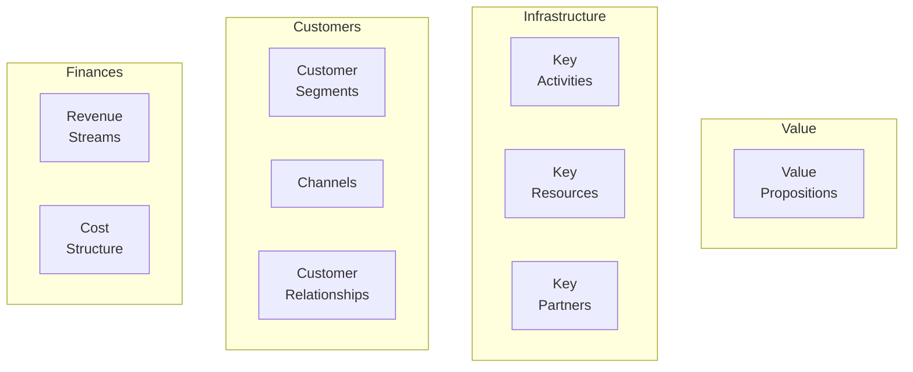

# Business Model Canvas

The Business Model Canvas is a strategic tool for developing and documenting business models.

## Nine Building Blocks



### 1. Customer Segments
Who are you creating value for?

- [examples] Mass market, niche, segmented, diversified
- [question] Who are our most important customers?
- [validation] Can we reach them cost-effectively?

### 2. Value Propositions
What value do you deliver?

**Components:**
- Newness (innovation)
- Performance improvement
- Customization
- "Getting the job done"
- Design
- Brand/status
- Price
- Cost reduction
- Risk reduction
- Accessibility
- Convenience/usability

- [question] What problem are we solving?
- [question] Which customer needs are we satisfying?

### 3. Channels
How do you reach customers?

**Phases:**
1. **Awareness**: How do customers learn about us?
2. **Evaluation**: How do customers evaluate our value?
3. **Purchase**: How can customers buy?
4. **Delivery**: How do we deliver value?
5. **After-sales**: How do we provide support?

### 4. Customer Relationships
What relationships do customers expect?

- Personal assistance
- Dedicated personal assistance
- Self-service
- Automated services
- Communities
- Co-creation

### 5. Revenue Streams
How does the business earn money?

**Types:**
- **Asset sale**: Selling physical products
- **Usage fee**: Pay per use
- **Subscription**: Recurring payment
- **Lending/Renting/Leasing**: Temporary access
- **Licensing**: Permission to use IP
- **Brokerage fees**: Intermediation services
- **Advertising**: Selling ad space

### 6. Key Resources
What assets are required?

- **Physical**: Buildings, vehicles, machines
- **Intellectual**: Brand, patents, data
- **Human**: People and expertise
- **Financial**: Cash, credit lines

### 7. Key Activities
What must you do to deliver value?

- Production
- Problem solving
- Platform/network maintenance

### 8. Key Partners
Who can help you?

**Types:**
- Strategic alliances
- Joint ventures
- Buyer-supplier relationships

**Reasons:**
- Optimization and economy of scale
- Reduction of risk and uncertainty
- Acquisition of resources and activities

### 9. Cost Structure
What are the major costs?

**Types:**
- **Cost-driven**: Minimize costs everywhere
- **Value-driven**: Focus on value creation

**Characteristics:**
- Fixed costs (salaries, rent)
- Variable costs (materials, commissions)
- Economies of scale
- Economies of scope

## Example: Spotify

```markdown
Customer Segments: Music listeners, artists, advertisers
Value Proposition: Unlimited music access, personalized playlists
Channels: Mobile app, web app, smart speakers
Customer Relationships: Automated recommendations, self-service
Revenue Streams: Premium subscriptions, advertising
Key Resources: Music catalog, recommendation algorithms, brand
Key Activities: Platform maintenance, licensing, content curation
Key Partners: Record labels, artists, podcast creators
Cost Structure: Licensing fees, infrastructure, R&D
```

## Relations
- builds_on [[Business Strategy]]
- enables [[Startup Planning]]
- informs [[Revenue Strategy]]
- related_to [[Lean Startup]]
- uses [[Value Proposition Canvas]]

## Practical Application

1. **Start with customer segments**: Who are you serving?
2. **Define value proposition**: What problem do you solve?
3. **Map revenue streams**: How will you make money?
4. **Identify key resources**: What do you need?
5. **Calculate costs**: What will it cost?
6. **Iterate**: Canvas is a living document

*The Business Model Canvas makes strategy tangible - use it to test and iterate your business model.*
