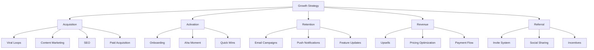

# Growth Hacking

Growth hacking is a data-driven approach to rapidly scaling a business through creative, low-cost strategies that prioritize growth above all else. It combines marketing, data analytics, and product development to achieve exponential user and revenue growth.

## Growth Framework



## Viral Growth

### Viral Coefficient (K-Factor)

The viral coefficient (K) measures how many new users each existing user brings:

```
K = (Number of invitations sent per user) × (Conversion rate of invitations)
```

**Growth outcomes:**
- **K > 1**: Exponential growth (viral)
- **K = 1**: Linear growth
- **K < 1**: Requires paid acquisition

### Implementing Viral Loops

```python
class ViralLoop:
    """Track and optimize viral growth"""

    def __init__(self, db):
        self.db = db

    def calculate_viral_coefficient(self, cohort_date, period_days=30):
        """Calculate K-factor for cohort"""
        users = self.db.get_users_joined_on(cohort_date)

        total_invites = 0
        total_conversions = 0

        for user in users:
            invites = self.db.count_invites_sent(
                user['id'],
                within_days=period_days
            )
            conversions = self.db.count_invite_conversions(
                user['id'],
                within_days=period_days
            )

            total_invites += invites
            total_conversions += conversions

        invites_per_user = total_invites / len(users)
        conversion_rate = total_conversions / total_invites if total_invites > 0 else 0

        k_factor = invites_per_user * conversion_rate

        return {
            'cohort_date': cohort_date,
            'cohort_size': len(users),
            'invites_per_user': invites_per_user,
            'conversion_rate': conversion_rate,
            'k_factor': k_factor,
            'interpretation': self._interpret_k_factor(k_factor)
        }

    def _interpret_k_factor(self, k):
        """Interpret viral coefficient"""
        if k > 1:
            return "Viral! Exponential growth"
        elif k > 0.7:
            return "Strong viral potential"
        elif k > 0.3:
            return "Some viral growth"
        else:
            return "Not viral - focus on optimization"

    def calculate_viral_cycle_time(self, user_id):
        """Time from signup to first successful referral"""
        signup_date = self.db.get_user_signup_date(user_id)
        first_conversion = self.db.get_first_referral_conversion(user_id)

        if first_conversion:
            cycle_time = (first_conversion['date'] - signup_date).days
            return cycle_time
        return None

    def optimize_viral_loop(self):
        """Strategies to optimize viral coefficient"""
        return {
            'increase_invites_per_user': [
                'Add prominent invite CTA',
                'Incentivize invitations (both sender and recipient)',
                'Make inviting frictionless (email, SMS, social)',
                'Trigger invite prompts at high-engagement moments',
                'Show social proof (X friends have joined)'
            ],
            'increase_conversion_rate': [
                'Personalize invitation message',
                'Show value proposition clearly',
                'Reduce friction in signup',
                'Add urgency (limited offer, countdown)',
                'Optimize landing page for conversions'
            ],
            'reduce_cycle_time': [
                'Get users to aha moment faster',
                'Prompt invites earlier in journey',
                'Automate invitation suggestions',
                'Batch invite functionality'
            ]
        }
```

### Famous Viral Loops

**Hotmail (1996):**
```python
# Simple footer: "PS: I love you. Get your free email at Hotmail"
class HotmailGrowthHack:
    """Every email was a marketing message"""

    def add_signature(self, email_content):
        signature = "\n\nPS: I love you. Get your free email at Hotmail"
        return email_content + signature

# Result: 12 million users in 18 months
```

**Dropbox:**
```python
class DropboxReferralProgram:
    """Give storage to both referrer and referee"""

    REFERRAL_BONUS_GB = 0.5
    MAX_REFERRAL_BONUS_GB = 16

    def process_referral(self, referrer_id, referee_email):
        """Process referral signup"""
        # Send invite
        self.send_invite(referee_email, referrer_id)

        # When referee signs up
        def on_referee_signup(referee_id):
            # Give both users bonus storage
            self.add_storage(referrer_id, self.REFERRAL_BONUS_GB)
            self.add_storage(referee_id, self.REFERRAL_BONUS_GB)

            self.notify_referrer(referrer_id, "Your friend joined! +500MB")

        return on_referee_signup

# Result: 35% of daily signups from referrals
```

**Airbnb:**
```python
class AirbnbGrowthHacks:
    """Multiple growth hacks"""

    def craigslist_integration(self, listing):
        """Cross-post to Craigslist automatically"""
        # Let users post their Airbnb listings to Craigslist
        # Include link back to Airbnb listing
        # Result: Massive traffic from Craigslist
        pass

    def professional_photography(self, host_id):
        """Offer free professional photos"""
        # High-quality photos increase bookings
        # Result: 2-3x increase in bookings for photographed listings
        pass

    def email_optimization(self):
        """Personalized, well-timed emails"""
        # Beautiful email templates
        # Personalized recommendations
        # Result: High engagement rates
        pass
```

## Content Marketing for Growth

### SEO-Driven Growth
```python
class SEOGrowthStrategy:
    """Programmatic SEO for scale"""

    def generate_location_pages(self, business_type, locations):
        """Generate thousands of location-specific pages"""
        # Example: Yelp, TripAdvisor, Zillow

        pages = []
        for location in locations:
            page = {
                'url': f'/{business_type}-in-{location["city"]}-{location["state"]}',
                'title': f'Best {business_type} in {location["city"]}, {location["state"]}',
                'content': self._generate_content(business_type, location),
                'schema_markup': self._generate_schema(business_type, location)
            }
            pages.append(page)

        return pages

    def _generate_content(self, business_type, location):
        """Generate unique content for each location"""
        # Use templates + local data
        # Include user reviews, photos, descriptions
        # Add local statistics and information
        return f"Looking for {business_type} in {location['city']}? Here are..."

    def content_hub_strategy(self, topic):
        """Create content hub around topic"""
        return {
            'pillar_page': f'/ultimate-guide-to-{topic}',
            'cluster_pages': [
                f'/{topic}-for-beginners',
                f'/{topic}-advanced-techniques',
                f'/{topic}-tools',
                f'/{topic}-case-studies',
                f'/{topic}-vs-alternatives'
            ],
            'internal_linking': 'All cluster pages link to pillar'
        }
```

### Content Flywheel
```python
class ContentFlywheel:
    """Self-reinforcing content engine"""

    def create_content_loop(self):
        """Create content that generates more content"""
        return {
            'user_generated_content': {
                'examples': ['Reviews', 'Forum posts', 'Q&A', 'User stories'],
                'benefits': ['Scales without cost', 'Fresh content', 'SEO gold'],
                'companies': ['Stack Overflow', 'Reddit', 'Quora', 'YouTube']
            },
            'programmatic_content': {
                'examples': ['Location pages', 'Product comparison pages', 'Category pages'],
                'benefits': ['Target long-tail keywords', 'Scale to millions of pages'],
                'companies': ['Yelp', 'Zillow', 'TripAdvisor']
            },
            'content_aggregation': {
                'examples': ['Best-of lists', 'Roundups', 'Curated resources'],
                'benefits': ['High value', 'Low effort', 'Backlink magnet'],
                'companies': ['Product Hunt', 'Hacker News']
            }
        }
```

## Activation Optimization

### Onboarding Flow
```python
class OnboardingOptimization:
    """Optimize user activation"""

    def __init__(self):
        self.steps = []
        self.aha_moment = None

    def design_onboarding(self, product_type):
        """Design onboarding for product type"""
        frameworks = {
            'saas': self._saas_onboarding(),
            'marketplace': self._marketplace_onboarding(),
            'social': self._social_onboarding(),
            'ecommerce': self._ecommerce_onboarding()
        }

        return frameworks.get(product_type)

    def _saas_onboarding(self):
        """SaaS onboarding best practices"""
        return {
            'goal': 'Get to aha moment fast',
            'steps': [
                {
                    'step': 1,
                    'name': 'Welcome',
                    'action': 'Show value proposition',
                    'time': '30 seconds'
                },
                {
                    'step': 2,
                    'name': 'Quick Setup',
                    'action': 'Minimum required info only',
                    'time': '2 minutes'
                },
                {
                    'step': 3,
                    'name': 'First Success',
                    'action': 'Help user achieve quick win',
                    'time': '5 minutes'
                },
                {
                    'step': 4,
                    'name': 'Aha Moment',
                    'action': 'Experience core value',
                    'time': '10 minutes'
                }
            ],
            'principles': [
                'Progressive disclosure (don't overwhelm)',
                'Use defaults and templates',
                'Show progress indicators',
                'Celebrate small wins',
                'Provide contextual help'
            ]
        }

    def calculate_activation_rate(self, cohort):
        """Measure onboarding effectiveness"""
        activated = sum(1 for user in cohort if user['completed_onboarding'])
        activation_rate = (activated / len(cohort)) * 100

        # Analyze dropoff points
        dropoff_analysis = self._analyze_dropoffs(cohort)

        return {
            'activation_rate': activation_rate,
            'dropoff_points': dropoff_analysis,
            'recommendations': self._generate_recommendations(dropoff_analysis)
        }

    def _analyze_dropoffs(self, cohort):
        """Find where users drop off"""
        steps = ['signup', 'profile_setup', 'first_action', 'aha_moment']
        dropoffs = {}

        for i, step in enumerate(steps):
            if i == 0:
                reached = len(cohort)
            else:
                reached = sum(1 for u in cohort if u.get(step))

            if i > 0:
                prev_reached = sum(1 for u in cohort if u.get(steps[i-1]))
                dropoff = ((prev_reached - reached) / prev_reached) * 100
                dropoffs[step] = dropoff

        return dropoffs
```

## Retention & Engagement

### Email Reengagement
```python
class EmailReengagement:
    """Win back inactive users"""

    def design_winback_campaign(self):
        """Multi-touch winback campaign"""
        return [
            {
                'day': 3,
                'subject': "We miss you! Here's what's new",
                'content': 'Show new features and updates',
                'cta': 'See What\'s New'
            },
            {
                'day': 7,
                'subject': "Your account is getting lonely",
                'content': 'Personal tone, remind of value',
                'cta': 'Pick Up Where You Left Off'
            },
            {
                'day': 14,
                'subject': "We want you back - special offer inside",
                'content': 'Incentive (discount, free month, etc.)',
                'cta': 'Claim Your Offer'
            },
            {
                'day': 30,
                'subject': "One last thing before you go",
                'content': 'Survey to understand why they left',
                'cta': 'Tell Us Why'
            }
        ]

    def personalize_email(self, user):
        """Personalize based on user behavior"""
        if user['last_feature_used']:
            return f"Come back to {user['last_feature_used']}"
        elif user['incomplete_actions']:
            return f"You have {len(user['incomplete_actions'])} items waiting"
        else:
            return "We've made improvements you'll love"
```

## Revenue Optimization

### Pricing Psychology
```python
class PricingOptimization:
    """Psychological pricing strategies"""

    def apply_pricing_strategies(self, base_price):
        """Apply proven pricing tactics"""
        return {
            'charm_pricing': {
                'price': base_price - 0.01,  # $99 instead of $100
                'lift': '20-30% increase in conversion'
            },
            'anchoring': {
                'strategy': 'Show higher-priced option first',
                'effect': 'Makes lower tiers seem like better value'
            },
            'decoy_pricing': {
                'strategy': 'Add middle tier to make target tier look better',
                'example': '$10, $25 (decoy), $20 (target)'
            },
            'bundling': {
                'strategy': 'Bundle features for higher perceived value',
                'effect': 'Increase average order value'
            },
            'tiering': {
                'strategy': '3 tiers is optimal',
                'recommendation': 'Good, Better, Best naming'
            }
        }

    def calculate_price_elasticity(self, price_changes, demand_changes):
        """Measure price sensitivity"""
        elasticity = (demand_changes / price_changes)

        interpretation = {
            'elastic': elasticity < -1,  # Demand highly sensitive to price
            'unit_elastic': elasticity == -1,
            'inelastic': elasticity > -1  # Demand not sensitive to price
        }

        return {
            'elasticity': elasticity,
            'interpretation': interpretation,
            'recommendation': self._pricing_recommendation(elasticity)
        }

    def _pricing_recommendation(self, elasticity):
        """Pricing strategy based on elasticity"""
        if elasticity < -1:
            return "Lower prices to increase total revenue"
        elif elasticity > -1:
            return "Raise prices to increase total revenue"
        else:
            return "Price changes won't significantly impact revenue"
```

## Growth Experiments

### A/B Testing Framework
```python
class GrowthExperiment:
    """Run growth experiments"""

    def __init__(self, name, hypothesis):
        self.name = name
        self.hypothesis = hypothesis
        self.variants = []
        self.results = None

    def design_experiment(self, metric, sample_size):
        """Design statistically valid experiment"""
        return {
            'primary_metric': metric,
            'sample_size': sample_size,
            'minimum_detectable_effect': 0.05,  # 5% improvement
            'statistical_significance': 0.95,    # 95% confidence
            'test_duration_days': self._calculate_duration(sample_size),
            'variants': [
                {'name': 'Control', 'percentage': 50},
                {'name': 'Variant A', 'percentage': 50}
            ]
        }

    def _calculate_duration(self, sample_size):
        """Calculate how long to run test"""
        # Assuming 1000 visitors per day
        daily_visitors = 1000
        return (sample_size / daily_visitors)

    def analyze_results(self, control_data, variant_data):
        """Analyze experiment results"""
        from scipy import stats

        # Perform t-test
        t_stat, p_value = stats.ttest_ind(control_data, variant_data)

        control_mean = np.mean(control_data)
        variant_mean = np.mean(variant_data)

        improvement = ((variant_mean - control_mean) / control_mean) * 100

        return {
            'control_mean': control_mean,
            'variant_mean': variant_mean,
            'improvement': improvement,
            'p_value': p_value,
            'significant': p_value < 0.05,
            'recommendation': self._make_recommendation(p_value, improvement)
        }

    def _make_recommendation(self, p_value, improvement):
        """Make decision recommendation"""
        if p_value < 0.05 and improvement > 0:
            return "Ship variant - statistically significant improvement"
        elif p_value < 0.05 and improvement < 0:
            return "Keep control - variant performed worse"
        else:
            return "Inconclusive - need more data or redesign test"
```

## Related Concepts

- [[Product-Market Fit]]
- [[Viral Marketing]]
- [[Conversion Optimization]]
- [[User Acquisition]]
- [[Retention Strategies]]
- [[A/B Testing]]
- [[Analytics and Metrics]]
- [[Landing Page Optimization]]

## Growth Hacking Examples

### LinkedIn (2003)
- **Hack**: Public profiles indexed by Google
- **Result**: Massive SEO traffic

### Twitter (2009)
- **Hack**: "Who to follow" recommendations
- **Result**: 30% increase in new user retention

### Pinterest (2010)
- **Hack**: Email invites with beautiful images
- **Result**: 70% of traffic from email

### Slack (2014)
- **Hack**: Freemium + team invitations
- **Result**: Fastest-growing SaaS ever

---

*"Growth hacking is about doing more with less by focusing on what actually drives growth."*
