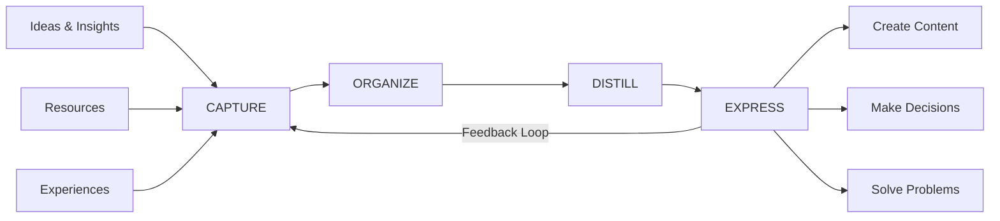

# Building a Second Brain

A Second Brain is a personal knowledge management system that extends your biological brain's capabilities. It's a digital repository where you capture, organize, and retrieve information, freeing your mind to focus on creative thinking and problem-solving.

## The CODE Method

Developed by Tiago Forte, CODE is a systematic approach to knowledge management:



### Capture

Capture anything that resonates with you:

```python
class CaptureSystem:
    """Systematic approach to capturing information"""
    
    def __init__(self):
        self.capture_criteria = {
            'inspiring': 'Does it inspire me?',
            'useful': 'Will I use this?',
            'surprising': 'Does it challenge my thinking?',
            'personal': 'Does it resonate personally?'
        }
    
    def should_capture(self, information):
        """Decide if information is worth capturing"""
        # At least one criterion should be met
        return any([
            self._is_inspiring(information),
            self._is_useful(information),
            self._is_surprising(information),
            self._is_personal(information)
        ])
    
    def capture_workflow(self, source_type):
        """Capture workflow by source type"""
        workflows = {
            'article': {
                'tool': 'Read-it-later app (Pocket, Instapaper)',
                'action': 'Save article + highlight key passages',
                'metadata': ['url', 'author', 'date', 'tags']
            },
            'book': {
                'tool': 'E-reader highlights or physical notes',
                'action': 'Highlight + write margin notes',
                'metadata': ['title', 'author', 'chapter', 'page']
            },
            'conversation': {
                'tool': 'Voice notes or quick capture app',
                'action': 'Record key insights immediately',
                'metadata': ['person', 'date', 'context']
            },
            'idea': {
                'tool': 'Inbox note or capture app',
                'action': 'Write thought with context',
                'metadata': ['date', 'source', 'related_topics']
            },
            'media': {
                'tool': 'Screenshot + annotation tool',
                'action': 'Capture visual + add notes',
                'metadata': ['source', 'date', 'why_important']
            }
        }
        
        return workflows.get(source_type)
    
    def capture_best_practices(self):
        """Best practices for effective capture"""
        return {
            'speed': 'Capture fast, process later',
            'context': 'Always include why you captured it',
            'trusted_system': 'Use consistent tools you trust',
            'friction': 'Minimize steps to capture',
            'review': 'Schedule regular inbox processing'
        }
```

### Organize: PARA Method

**PARA** stands for Projects, Areas, Resources, Archives:

```python
class PARASystem:
    """PARA organizational method"""
    
    def __init__(self):
        self.structure = {
            'Projects': {
                'definition': 'Short-term efforts with deadline',
                'examples': [
                    'Launch product feature',
                    'Write research paper',
                    'Plan conference talk',
                    'Organize team offsite'
                ],
                'timeframe': '2 weeks to 6 months',
                'active': True
            },
            'Areas': {
                'definition': 'Ongoing responsibilities to maintain',
                'examples': [
                    'Health & Fitness',
                    'Finances',
                    'Professional Development',
                    'Family',
                    'Product Management'
                ],
                'timeframe': 'Indefinite',
                'active': True
            },
            'Resources': {
                'definition': 'Topics of ongoing interest',
                'examples': [
                    'Machine Learning',
                    'Product Design',
                    'Cooking',
                    'Photography',
                    'Writing'
                ],
                'timeframe': 'Indefinite',
                'active': False  # Reference, not active work
            },
            'Archives': {
                'definition': 'Inactive items from other categories',
                'examples': [
                    'Completed projects',
                    'Former areas of responsibility',
                    'Resources no longer interested in'
                ],
                'timeframe': 'Indefinite',
                'active': False
            }
        }
    
    def classify_note(self, note):
        """Classify note into PARA category"""
        questions = {
            'is_project': 'Does this relate to a specific outcome with a deadline?',
            'is_area': 'Is this an ongoing responsibility I need to maintain?',
            'is_resource': 'Is this reference material for a topic of interest?',
            'is_archive': 'Is this no longer active but worth keeping?'
        }
        
        # Projects take precedence
        if self._has_deadline(note) and self._has_specific_outcome(note):
            return 'Projects'
        
        # Then areas
        if self._is_ongoing_responsibility(note):
            return 'Areas'
        
        # Then resources
        if self._is_reference_material(note):
            return 'Resources'
        
        # Finally archives
        return 'Archives'
    
    def organize_folder_structure(self):
        """Recommended folder structure"""
        return {
            '1-Projects/': [
                'Project-A/',
                'Project-B/',
                'Project-C/'
            ],
            '2-Areas/': [
                'Health/',
                'Finances/',
                'Career/',
                'Relationships/'
            ],
            '3-Resources/': [
                'Machine-Learning/',
                'Product-Design/',
                'Writing/',
                'Leadership/'
            ],
            '4-Archives/': [
                'Completed-Projects/',
                'Old-Areas/',
                'Past-Resources/'
            ]
        }
```

### Distill: Progressive Summarization

Progressively highlight and summarize notes in layers:

```markdown
# Progressive Summarization Example

## Layer 0: Original Content
The most important principle in note-taking is to write notes
in your own words. This forces you to think deeply about the
content and makes it easier to remember and use later. When you
simply copy and paste, you miss the opportunity for deep processing.

## Layer 1: Bold the Important Parts
The most important principle in note-taking is **to write notes
in your own words**. This forces you to **think deeply about the
content** and makes it **easier to remember and use later**. When you
simply copy and paste, you miss the opportunity for deep processing.

## Layer 2: Highlight the Essential
The most important principle in note-taking is ==**to write notes
in your own words**==. This forces you to **think deeply about the
content** and makes it ==**easier to remember and use later**==. When you
simply copy and paste, you miss the opportunity for deep processing.

## Layer 3: Executive Summary
**Key insight**: Writing notes in your own words enhances memory
and usability. Avoid copy-paste.

## Layer 4: Remix (your own interpretation)
Transform information into understanding by reprocessing it in
your own words. This creates deeper connections and makes recall
effortless.
```

```python
class ProgressiveSummarization:
    """Implement progressive summarization"""
    
    def __init__(self):
        self.layers = [
            'original_content',
            'bold_key_points',
            'highlight_essential',
            'executive_summary',
            'personal_remix'
        ]
    
    def distill_note(self, note_content, current_layer=0):
        """Apply next layer of summarization"""
        if current_layer >= len(self.layers):
            return note_content
        
        next_layer = self.layers[current_layer + 1]
        
        strategies = {
            'bold_key_points': self._apply_bold,
            'highlight_essential': self._apply_highlights,
            'executive_summary': self._create_summary,
            'personal_remix': self._create_remix
        }
        
        return strategies[next_layer](note_content)
    
    def when_to_distill(self, note):
        """Progressive summarization is just-in-time"""
        return {
            'layer_1': 'When you first capture',
            'layer_2': 'When you review and see it again',
            'layer_3': 'When you need to use it',
            'layer_4': 'When you express/create with it',
            'principle': 'Only distill when you need to use it'
        }
    
    def distillation_guidelines(self):
        """Guidelines for effective distillation"""
        return {
            'bold': {
                'target': '10-20% of original',
                'criteria': 'Most important ideas',
                'ask': 'What would I want my future self to see?'
            },
            'highlight': {
                'target': '2-5% of original',
                'criteria': 'The absolute essence',
                'ask': 'What is the core insight?'
            },
            'summary': {
                'target': '1-3 sentences',
                'criteria': 'Can stand alone',
                'ask': 'What is the one key takeaway?'
            },
            'remix': {
                'target': 'Your own words',
                'criteria': 'Connected to your knowledge',
                'ask': 'What does this mean for me?'
            }
        }
```

### Express: Create from Your Knowledge

The ultimate goal is to create and share:

```python
class KnowledgeExpression:
    """Turn knowledge into creative output"""
    
    def __init__(self, second_brain):
        self.second_brain = second_brain
    
    def intermediate_packets(self):
        """Break work into reusable components"""
        return {
            'concept': 'Work in small, reusable units',
            'examples': [
                'Email templates',
                'Presentation slides',
                'Code snippets',
                'Writing outlines',
                'Research summaries',
                'Data analyses'
            ],
            'benefits': [
                'Reuse across projects',
                'Easier to start (no blank page)',
                'Build library of components',
                'Reduce cognitive load'
            ],
            'implementation': {
                'create': 'As you work, save reusable parts',
                'organize': 'Tag and categorize packets',
                'reuse': 'Search and remix for new projects'
            }
        }
    
    def creative_workflow(self, project_type):
        """Workflow for different creative projects"""
        workflows = {
            'blog_post': [
                'Search Second Brain for topic',
                'Gather related notes',
                'Create outline from notes',
                'Fill in gaps with research',
                'Write first draft',
                'Revise and publish'
            ],
            'presentation': [
                'Define key message',
                'Search for supporting evidence',
                'Gather visuals and examples',
                'Structure with storytelling',
                'Create slides from packets',
                'Practice and refine'
            ],
            'product_decision': [
                'Frame the decision',
                'Search for past learnings',
                'Gather data and research',
                'List options with pros/cons',
                'Make decision',
                'Document for future reference'
            ],
            'research_paper': [
                'Review literature notes',
                'Identify gaps and questions',
                'Synthesize findings',
                'Create argument structure',
                'Write from your notes',
                'Add new research as needed'
            ]
        }
        
        return workflows.get(project_type)
    
    def knowledge_garden(self):
        """Cultivate your knowledge like a garden"""
        return {
            'evergreen_notes': {
                'concept': 'Notes that grow and evolve',
                'characteristics': [
                    'Atomic (one idea per note)',
                    'Concept-oriented (not source-oriented)',
                    'Densely linked',
                    'Written in your own words'
                ]
            },
            'gardening_practices': {
                'plant': 'Capture new ideas',
                'tend': 'Review and refine regularly',
                'connect': 'Link related ideas',
                'prune': 'Remove or archive outdated',
                'harvest': 'Create from your knowledge'
            },
            'emergent_properties': [
                'Unexpected connections appear',
                'Ideas compound over time',
                'Your thinking becomes clearer',
                'Creativity flows naturally'
            ]
        }
```

## Digital Tools for Second Brain

### Recommended Setup
```python
class SecondBrainTools:
    """Tool recommendations for Second Brain"""
    
    def __init__(self):
        self.tools = {
            'capture': {
                'read_later': ['Pocket', 'Instapaper', 'Matter'],
                'quick_capture': ['Drafts', 'Apple Notes', 'Google Keep'],
                'web_clipper': ['Notion Web Clipper', 'Obsidian Web Clipper'],
                'voice_notes': ['Apple Voice Memos', 'Otter.ai']
            },
            'organize': {
                'note_taking': ['Obsidian', 'Notion', 'Roam Research', 'Logseq'],
                'advanced_memory': ['Advanced Memory MCP'],
                'file_management': ['Finder', 'Explorer', 'Spotlight']
            },
            'distill': {
                'highlighting': ['Readwise', 'Hypothesis'],
                'annotation': ['LiquidText', 'MarginNote'],
                'summarization': ['ChatGPT', 'Claude']
            },
            'express': {
                'writing': ['iA Writer', 'Ulysses', 'Scrivener'],
                'presentation': ['Keynote', 'PowerPoint', 'Figma'],
                'publishing': ['Substack', 'Medium', 'Ghost']
            }
        }
    
    def choose_tools(self, priorities):
        """Choose tools based on priorities"""
        if 'simplicity' in priorities:
            return {
                'note_app': 'Obsidian (markdown files)',
                'capture': 'Drafts (quick and simple)',
                'publishing': 'Substack (built-in audience)'
            }
        elif 'power' in priorities:
            return {
                'note_app': 'Obsidian + Advanced Memory',
                'capture': 'Readwise + multiple sources',
                'publishing': 'Custom static site'
            }
        elif 'collaboration' in priorities:
            return {
                'note_app': 'Notion (team workspaces)',
                'capture': 'Notion Web Clipper',
                'publishing': 'Notion sites'
            }
```

## Building Habits

### Weekly Review
```markdown
# Weekly Review Checklist

## Clear Inboxes (15 minutes)
- [ ] Process capture inbox
- [ ] Review read-later queue
- [ ] Clear downloads folder
- [ ] Archive completed items

## Review Projects (15 minutes)
- [ ] Update project status
- [ ] Identify next actions
- [ ] Move completed to archive
- [ ] Create new projects if needed

## Review Areas (10 minutes)
- [ ] Check area health metrics
- [ ] Update area notes
- [ ] Identify items needing attention

## Review Resources (10 minutes)
- [ ] Browse recent captures
- [ ] Connect related ideas
- [ ] Apply progressive summarization
- [ ] Create intermediate packets

## Plan Next Week (10 minutes)
- [ ] Review calendar
- [ ] Set weekly intentions
- [ ] Identify key projects
- [ ] Schedule deep work blocks
```

### Daily Habits
```python
class DailySecondBrainHabits:
    """Daily routines for Second Brain maintenance"""
    
    def morning_routine(self):
        """Start day with Second Brain"""
        return [
            {
                'duration': '5 minutes',
                'activity': 'Review today\'s notes',
                'purpose': 'Remember what you learned yesterday'
            },
            {
                'duration': '5 minutes',
                'activity': 'Check project dashboards',
                'purpose': 'See what needs attention today'
            },
            {
                'duration': '5 minutes',
                'activity': 'Quick capture of morning thoughts',
                'purpose': 'Capture fresh ideas'
            }
        ]
    
    def evening_routine(self):
        """End day with Second Brain"""
        return [
            {
                'duration': '10 minutes',
                'activity': 'Process capture inbox',
                'purpose': 'Don\'t let backlog build up'
            },
            {
                'duration': '5 minutes',
                'activity': 'Reflect on day',
                'purpose': 'Capture learnings and insights'
            },
            {
                'duration': '5 minutes',
                'activity': 'Plan tomorrow',
                'purpose': 'Wake up ready to work'
            }
        ]
```

## Common Mistakes

### Over-Organizing
```python
# Bad: Spending more time organizing than creating
time_spent = {
    'capturing': 0.1,
    'organizing': 0.7,  # Too much!
    'creating': 0.2
}

# Good: Bias toward action
time_spent = {
    'capturing': 0.2,
    'organizing': 0.3,
    'creating': 0.5  # Most time on output
}
```

### Perfectionism
- Don't polish notes before using them
- Capture imperfectly, refine just-in-time
- "Done is better than perfect"

### Hoarding
- Capture selectively, not everything
- Archive aggressively
- Trust that you'll find it again

## Related Concepts

- [[Zettelkasten Method]]
- [[Personal Knowledge Management]]
- [[PARA Method]]
- [[Progressive Summarization]]
- [[Evergreen Notes]]
- [[Intermediate Packets]]
- [[Digital Garden]]
- [[Information Architecture]]

## Key Principles

### Note-Taking ≠ Note-Making
- Taking: Passive recording
- Making: Active transformation

### Just-in-Time Processing
- Don't organize for its own sake
- Organize when you need to use

### Action-Oriented
- Your Second Brain is for doing, not storing
- Measure success by what you create

### Trust Your System
- If captured, it will be found
- Free your mind to think

---

*"Your mind is for having ideas, not holding them." - David Allen*


