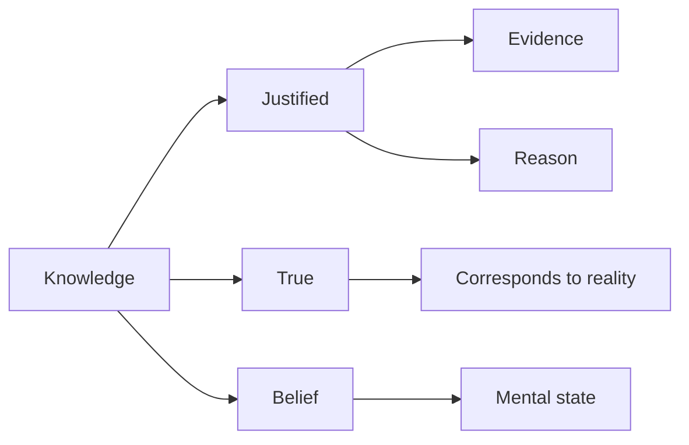

# Theory of Knowledge (Epistemology)

Epistemology is the study of knowledge, belief, and justification. It asks: What is knowledge? How do we know what we know? What can we know?

## The Classical Definition

**Knowledge as Justified True Belief (JTB)**



### The Three Conditions

```python
class JustifiedTrueBelief:
    """Classical account of knowledge"""
    
    def requirements(self):
        return {
            "belief": {
                "requirement": "You must believe P",
                "example": "You believe the Earth is round",
                "note": "Can't know something you don't believe"
            },
            "truth": {
                "requirement": "P must actually be true",
                "example": "The Earth actually IS round",
                "note": "Can't know something false (can only believe it)"
            },
            "justification": {
                "requirement": "You must have good reasons for believing P",
                "example": "Evidence, observation, inference",
                "note": "Lucky guess doesn't count as knowledge"
            }
        }
    
    def examples(self):
        """Testing the definition"""
        return {
            "knowledge": {
                "case": "You believe Earth is round, it is round, you have evidence",
                "verdict": "Knowledge ✓"
            },
            "mere_belief": {
                "case": "You believe Earth is flat, it's round, no good evidence",
                "verdict": "Belief but not knowledge (false, unjustified)"
            },
            "justified_false_belief": {
                "case": "You believe Earth is flat, good (but misleading) evidence, it's round",
                "verdict": "Justified belief but not knowledge (false)"
            },
            "lucky_guess": {
                "case": "You believe Earth is round, it is round, but just guessing",
                "verdict": "True belief but not knowledge (unjustified)"
            }
        }
```

### Gettier Problem (1963)

**Bombshell**: Justified true belief is NOT sufficient for knowledge!

```python
class GettierProblem:
    """JTB is not enough"""
    
    def original_case(self):
        """Edmund Gettier's first example"""
        return {
            "setup": {
                "smith_belief": "Jones will get the job",
                "justification": "President told Smith 'Jones will get job'",
                "additional_fact": "Jones has 10 coins in pocket",
                "inference": "Smith concludes: 'Person who gets job has 10 coins'"
            },
            "twist": {
                "surprise": "Smith gets the job, not Jones!",
                "coincidence": "Smith ALSO has 10 coins (by chance)"
            },
            "analysis": {
                "belief": "Person who gets job has 10 coins ✓",
                "true": "Yes, Smith got job and has 10 coins ✓",
                "justified": "Yes, based on good evidence ✓",
                "but": "Justified by false intermediate step",
                "verdict": "JTB satisfied, but intuitively NOT knowledge (just luck)"
            },
            "impact": "Destroyed 2000 years of JTB consensus"
        }
    
    def barn_facade_case(self):
        """Alvin Goldman's example"""
        return {
            "setup": "Driving through county with fake barn facades (movie set)",
            "case": "You see real barn, form belief 'That's a barn'",
            "analysis": {
                "belief": "That's a barn ✓",
                "true": "It is a barn ✓",
                "justified": "Looks like a barn ✓",
                "but": "Could easily have been wrong (most are fakes)",
                "luck": "Just happened to look at real one"
            },
            "verdict": "JTB but not knowledge (environmental luck)"
        }
```

## Theories of Justification

### Foundationalism

```python
class Foundationalism:
    """Knowledge has foundations"""
    
    def structure(self):
        """Pyramid of beliefs"""
        return {
            "basic_beliefs": {
                "definition": "Self-justifying, not inferred from others",
                "examples": [
                    "I am experiencing pain right now",
                    "I seem to see something red",
                    "2 + 2 = 4"
                ],
                "property": "Immune to doubt, directly justified"
            },
            "derived_beliefs": {
                "definition": "Justified by inference from basic beliefs",
                "example": "I see smoke → I infer fire",
                "chain": "Must trace back to foundations"
            },
            "metaphor": "Building on solid foundation"
        }
    
    def problems(self):
        return {
            "regress_solved": "Stops infinite regress with basic beliefs ✓",
            "but_which_foundations": "What counts as basic? (Disagreement)",
            "problem_of_criterion": "How justify that foundations are justified?",
            "too_narrow": "Most knowledge doesn't trace to incorrigible foundations"
        }
```

### Coherentism

```python
class Coherentism:
    """Knowledge as coherent web"""
    
    def structure(self):
        """Web of mutually supporting beliefs"""
        return {
            "metaphor": "Raft floating in ocean (not building on bedrock)",
            "justification": "Beliefs justified by fitting coherently with other beliefs",
            "no_foundations": "No privileged basic beliefs",
            "mutual_support": "Beliefs support each other holistically",
            "example": "Scientific theories - judged by coherence with observations, other theories"
        }
    
    def problems(self):
        return {
            "isolation_objection": "Coherent fairy tales still not knowledge",
            "input_problem": "How do new experiences enter the web?",
            "circularity": "Beliefs justify each other (seems circular)",
            "response": "Circularity is virtuous in holistic system"
        }
```

### Reliabilism

```python
class Reliabilism:
    """Knowledge from reliable processes"""
    
    def core_idea(self):
        """You know P if belief formed by reliable process"""
        return {
            "claim": "Justification = reliability of belief-forming process",
            "reliable_processes": [
                "Perception (usually reliable)",
                "Memory (mostly reliable)",
                "Logical inference (highly reliable)",
                "Testimony (context-dependent)"
            },
            "unreliable_processes": [
                "Wishful thinking",
                "Hasty generalization",
                "Confirmation bias",
                "Astrology"
            ],
            "advantage": "Explains why children/animals have knowledge without reflecting on justification",
            "problem": "What counts as 'reliable enough'? How to individuate processes?"
        }
```

## Skepticism

### External World Skepticism

```python
class Skepticism:
    """Can we know anything about external world?"""
    
    def descartes_method(self):
        """Systematic doubt"""
        return {
            "method": "Doubt everything that can be doubted",
            "levels": {
                "1_senses": "Senses sometimes deceive → Maybe always deceive",
                "2_dreaming": "Can't distinguish waking from dreaming",
                "3_evil_demon": "Maybe powerful demon deceiving you about everything",
                "4_modern": "Brain in vat, simulation hypothesis"
            },
            "survives_doubt": "Cogito ergo sum (I think therefore I am)",
            "problem": "Hard to get from 'I exist' to 'External world exists'"
        }
    
    def brain_in_vat(self):
        """Modern skeptical scenario"""
        return {
            "setup": "You're brain in vat, receiving simulated experiences",
            "question": "Can you know you're NOT brain in vat?",
            "problem": "Evidence would be identical either way",
            "implication": "Can't know anything about external world",
            "responses": {
                "semantic": "If you are BIV, 'I'm not BIV' is true (for BIV-you)",
                "pragmatic": "Skepticism is idle; we must act on best evidence",
                "contextualist": "In normal contexts, you DO know"
            }
        }
```

### Responses to Skepticism

```python
class AntiSkepticism:
    """How philosophers respond"""
    
    def moorean_response(self):
        """G.E. Moore's common sense"""
        return {
            "claim": "'Here is a hand' (holds up hand)",
            "argument": "More certain of hand's existence than skeptical premises",
            "method": "Reverse the argument - use common sense to reject skepticism",
            "problem": "Doesn't answer skeptic, just asserts confidence"
        }
    
    def contextualism(self):
        """Standards shift by context"""
        return {
            "claim": "'Know' means different things in different contexts",
            "everyday": "Know there's coffee in cup (ordinary standards)",
            "philosophy_seminar": "Don't know (skeptical standards invoked)",
            "both_true": "Context-relative, not contradiction",
            "advantage": "Preserves everyday knowledge, acknowledges skeptical challenges"
        }
```

## A Priori vs A Posteriori

### Rationalism vs Empiricism

```python
class APrioriKnowledge:
    """Knowledge independent of experience"""
    
    def rationalism(self):
        """Descartes, Leibniz, Spinoza"""
        return {
            "claim": "Significant knowledge can be gained by reason alone",
            "examples": [
                "Mathematics (2 + 2 = 4)",
                "Logic (law of non-contradiction)",
                "Metaphysics (God exists - ontological argument)"
            ],
            "method": "Pure reason, innate ideas",
            "appeal": "Certainty, necessity"
        }
    
    def empiricism(self):
        """Locke, Berkeley, Hume"""
        return {
            "claim": "All knowledge comes from experience",
            "slogan": "Nothing in intellect that wasn't first in senses",
            "blank_slate": "Mind at birth is tabula rasa (blank slate)",
            "a_priori_reduced": "Even math/logic learned from experience",
            "method": "Observation, experiment, induction",
            "problem": "How to justify induction? (Hume's problem)"
        }
    
    def synthetic_a_priori(self):
        """Kant's synthesis"""
        return {
            "claim": "Some knowledge is both synthetic (informative) and a priori (independent of experience)",
            "examples": [
                "7 + 5 = 12 (more than definition)",
                "Every event has a cause",
                "Space has three dimensions"
            ],
            "explanation": "Mind structures experience through categories (space, time, causation)",
            "copernican_revolution": "Mind doesn't conform to world; world conforms to mind's structures",
            "influence": "Dominated philosophy for century, still influential"
        }
```

## The Problem of Induction

**David Hume's Challenge**: How can we justify inductive reasoning?

```python
class InductionProblem:
    """The scandal of philosophy"""
    
    def the_problem(self):
        return {
            "observation": "Sun has risen every day in past",
            "inference": "Therefore, sun will rise tomorrow",
            "question": "What justifies this inference?",
            "attempted_justification": "Induction has worked in past",
            "problem": "That's using induction to justify induction! (Circular)",
            "hume_conclusion": "Induction cannot be rationally justified; it's habit/custom"
        }
    
    def responses(self):
        return {
            "pragmatic": {
                "claim": "Induction is our best method, even if not justified",
                "proponent": "Hume himself",
                "response": "Practical necessity"
            },
            "probabilistic": {
                "claim": "Bayes theorem provides rational update mechanism",
                "modern": "Bayesian epistemology",
                "status": "Still requires prior probabilities (where from?)"
            },
            "falsificationism": {
                "claim": "Science doesn't use induction, uses deduction (falsification)",
                "proponent": "Karl Popper",
                "problem": "Still need induction to prefer unfalsified theories"
            }
        }
```

## Social Epistemology

### Testimony and Trust

```python
class SocialKnowledge:
    """Most knowledge from others"""
    
    def testimony(self):
        """Knowledge from what others tell us"""
        return {
            "scope": "99% of what you 'know' is from testimony",
            "examples": [
                "Historical facts",
                "Scientific knowledge",
                "Geography",
                "Most beliefs about world"
            ],
            "challenge": "How is testimonial knowledge justified?",
            "reductionism": "Reduce to own observations of reliability",
            "non_reductionism": "Testimony is basic source of justification",
            "current_crisis": "Misinformation, deepfakes, epistemic crisis"
        }
    
    def epistemic_injustice(self):
        """Miranda Fricker's concept"""
        return {
            "testimonial_injustice": {
                "definition": "Credibility deficit due to prejudice",
                "example": "Woman's testimony discounted because she's a woman",
                "harm": "Epistemic and identity harm"
            },
            "hermeneutical_injustice": {
                "definition": "Lack of concepts to express experience",
                "example": "Before 'sexual harassment' term existed, couldn't name experience",
                "harm": "Can't make sense of own experience"
            },
            "importance": "Connects epistemology to social justice"
        }
```

## Related Concepts

- [[Rationalism vs Empiricism]]
- [[Problem of Induction]]
- [[Skepticism]]
- [[Justified True Belief]]
- [[Gettier Problem]]
- [[A Priori Knowledge]]
- [[Social Epistemology]]
- [[Epistemic Injustice]]

---

*"We know very little, and yet it is astonishing that we know so much, and still more astonishing that so little knowledge can give us so much power." - Bertrand Russell*


