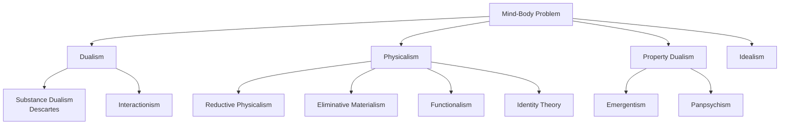

# Philosophy of Mind and Consciousness

The study of the nature of mind, mental events, consciousness, and their relationship to the physical body and brain. This is where philosophy meets neuroscience, psychology, and artificial intelligence.

## The Mind-Body Problem

**Central Question**: What is the relationship between mind and matter?



### Dualism (René Descartes)

**Position**: Mind and body are fundamentally different substances

```python
class Dualism:
    """Mind and matter are separate"""

    def substance_dualism(self):
        """Descartes' classical dualism"""
        return {
            "claim": "Mind (res cogitans) and body (res extensa) are distinct substances",
            "mind": {
                "properties": ["Thinking", "Non-spatial", "Indivisible", "Immaterial"],
                "essence": "Consciousness, thought"
            },
            "body": {
                "properties": ["Extended in space", "Divisible", "Material", "Mechanical"],
                "essence": "Physical extension"
            },
            "interaction": "Through pineal gland (Descartes' speculation)",
            "famous_quote": "Cogito, ergo sum" ("I think, therefore I am")
        }

    def problems_with_dualism(self):
        """Why most philosophers reject it"""
        return {
            "interaction_problem": {
                "question": "How can immaterial mind affect material body?",
                "issue": "Violates conservation of energy",
                "example": "How does intention to move arm cause neurons to fire?"
            },
            "explanatory_gap": {
                "question": "Where is the mind located?",
                "issue": "Can't find mind in physical world",
                "problem": "Leaves mind mysterious and unexplained"
            },
            "evolution_problem": {
                "question": "How did immaterial minds evolve?",
                "issue": "Natural selection acts on physical",
                "problem": "Dualism conflicts with evolution"
            },
            "parsimony": {
                "principle": "Don't multiply entities beyond necessity (Occam's Razor)",
                "issue": "Dualism posits two substances when one might suffice"
            }
        }
```

### Physicalism (Materialism)

**Position**: Everything is physical; mind is brain activity

```python
class Physicalism:
    """Mind is physical"""

    def identity_theory(self):
        """Mental states = Brain states"""
        return {
            "claim": "Mental states are identical to brain states",
            "example": "Pain = C-fiber activation",
            "strength": "Simple, fits with neuroscience",
            "problem": "Multiple realizability (same mental state, different brain states)",
            "counterexample": "Octopus pain probably different brain states, but still pain"
        }

    def functionalism(self):
        """Mental states defined by functional role"""
        return {
            "claim": "Mental states are defined by what they DO, not what they're MADE OF",
            "analogy": {
                "heart": "Defined by pumping blood (functional role)",
                "implementation": "Could be biological, mechanical, artificial",
                "mental_state": "Similarly, pain is 'whatever plays pain role'"
            },
            "advantage": "Solves multiple realizability",
            "allows": "AI could have genuine mental states",
            "problem": {
                "china_brain": "Could billion Chinese people with radios implement consciousness?",
                "qualia": "Doesn't explain WHAT IT'S LIKE to experience something"
            }
        }

    def eliminative_materialism(self):
        """Folk psychology is wrong - eliminate mental states"""
        return {
            "claim": "Mental states don't exist; folk psychology is false theory",
            "analogy": "Like phlogiston, witches, humors - we'll eliminate these concepts",
            "example": "No such thing as 'belief' or 'desire' - just brain states",
            "proponents": ["Paul Churchland", "Patricia Churchland"],
            "strength": "Takes neuroscience seriously",
            "problem": "Hard to deny you have experiences"
        }
```

### Property Dualism

**Position**: One substance (physical), but two kinds of properties (physical and mental)

```python
class PropertyDualism:
    """Mental properties emerge from physical"""

    def emergentism(self):
        """Mental properties emerge from complex physical organization"""
        return {
            "claim": "Consciousness emerges from brain complexity",
            "analogy": {
                "water": "Wetness emerges from H2O molecules",
                "traffic": "Traffic jams emerge from many cars",
                "mind": "Consciousness emerges from neurons"
            },
            "strength": "Respects physics, acknowledges mental properties",
            "problem": {
                "hard_emergence": "How exactly does consciousness emerge?",
                "explanatory_gap": "Still mysterious"
            }
        }

    def panpsychism(self):
        """Consciousness is fundamental, everywhere"""
        return {
            "claim": "All matter has some degree of consciousness",
            "spectrum": "Electrons: tiny consciousness → Humans: rich consciousness",
            "combination_problem": "How do micro-consciousnesses combine into unified experience?",
            "proponents": ["Philip Goff", "David Chalmers (sometimes)", "Galen Strawson"],
            "appeal": "Solves emergence problem (consciousness doesn't emerge, it's always there)",
            "counterintuitive": "Rocks are conscious? Really?"
        }
```

## The Hard Problem of Consciousness

**David Chalmers (1995)**: Distinguishes easy and hard problems

```python
class HardProblem:
    """Why consciousness is special"""

    def easy_problems(self):
        """Functional/mechanistic questions"""
        return {
            "definition": "Problems that can be solved by explaining mechanism",
            "examples": [
                "How does brain process information?",
                "How does brain discriminate stimuli?",
                "How do we focus attention?",
                "How does brain integrate information?",
                "How does brain control behavior?"
            ],
            "status": "Hard, but in principle solvable by neuroscience",
            "note": "'Easy' doesn't mean simple - just tractable"
        }

    def hard_problem(self):
        """The real mystery"""
        return {
            "definition": "Why is there subjective experience at all?",
            "question": "Why doesn't all this processing happen 'in the dark'?",
            "examples": [
                "What is it LIKE to see red?",
                "What is it LIKE to feel pain?",
                "What is it LIKE to taste chocolate?",
                "Why is there 'something it's like' to be me?"
            ],
            "challenge": "Even complete neural explanation doesn't explain qualia",
            "status": "Unsolved, maybe unsolvable"
        }

    def explanatory_gap(self):
        """Why physical explanations seem insufficient"""
        return {
            "claim": "Gap between physical facts and conscious experience",
            "example": {
                "physical": "C-fibers firing at 50Hz",
                "experience": "Intense burning pain",
                "gap": "How does first GIVE RISE to second?"
            },
            "zombie_argument": {
                "scenario": "Being physically identical to you but no consciousness",
                "conceivability": "Seems conceivable (philosophical zombies)",
                "implication": "Physical facts don't necessitate consciousness",
                "counterargument": "Conceivability ≠ Possibility"
            }
        }
```

## Qualia and Subjective Experience

**Qualia**: The subjective, qualitative properties of experiences

```python
class Qualia:
    """The 'what it's like' of experience"""

    def marys_room(self):
        """Frank Jackson's thought experiment"""
        return {
            "setup": {
                "mary": "Brilliant neuroscientist who knows EVERYTHING physical about color",
                "room": "Raised in black-and-white room, never seen color",
                "knowledge": "Complete physical knowledge of color perception"
            },
            "question": "When Mary leaves room and sees red for first time, does she learn something new?",
            "answer_yes": {
                "position": "Yes, she learns WHAT IT'S LIKE to see red",
                "implication": "Physical facts don't exhaust all facts",
                "supports": "Anti-physicalism"
            },
            "answer_no": {
                "position": "No, she just gains ability (knowing-how, not knowing-that)",
                "implication": "Physical knowledge is complete",
                "supports": "Physicalism"
            },
            "debate": "Still hotly contested"
        }

    def inverted_spectrum(self):
        """Could your red be my green?"""
        return {
            "scenario": "We both call grass 'green', but your green qualia = my red qualia",
            "question": "Would we ever know?",
            "implications": [
                "Qualia are private, incommunicable",
                "Behavioral evidence can't settle qualia questions",
                "Fundamental asymmetry of first-person perspective"
            ],
            "empirical_question": "Could neuroscience settle this?",
            "philosophical_question": "Even if brains identical, could qualia differ?"
        }

    def what_is_it_like_to_be_bat(self):
        """Thomas Nagel's famous paper (1974)"""
        return {
            "question": "What is it like to be a bat?",
            "point": "We can't know - bat's subjective experience is alien to us",
            "bat_sonar": "Bat navigates by echolocation - what's that LIKE?",
            "implication": {
                "consciousness": "Essentially involves point of view",
                "objective_science": "Describes reality from no particular viewpoint",
                "gap": "Objective science can't capture subjective experience",
                "conclusion": "Consciousness may be irreducible to physical facts"
            },
            "influence": "Foundational paper in philosophy of mind"
        }
```

## Theories of Consciousness

### Global Workspace Theory (Bernard Baars)

```python
class GlobalWorkspaceTheory:
    """Consciousness as broadcast mechanism"""

    def model(self):
        return {
            "metaphor": "Consciousness like theater spotlight",
            "mechanism": "Information broadcast to 'global workspace' becomes conscious",
            "unconscious": "Many parallel processes competing for workspace",
            "conscious": "Winner gets broadcast to all cognitive systems",
            "predictions": [
                "Limited capacity (only one thing in spotlight)",
                "Unified experience (one broadcast)",
                "Reportability (broadcast enables report)"
            ],
            "strength": "Explains many phenomena, computationally tractable",
            "weakness": "Doesn't explain WHY broadcast creates experience"
        }
```

### Integrated Information Theory (Giulio Tononi)

```python
class IntegratedInformationTheory:
    """Consciousness as integrated information (Φ - phi)"""

    def core_idea(self):
        return {
            "claim": "Consciousness = Integrated information",
            "phi": "Measure of integration (system's cause-effect power above parts)",
            "high_phi": "High consciousness (human brain)",
            "low_phi": "Low consciousness (photodiode, thermostat)",
            "zero_phi": "No consciousness (collection of independent parts)"
        }

    def implications(self):
        return {
            "surprising_results": [
                "Cerebellum has little consciousness (low integration despite many neurons)",
                "Deep sleep has minimal consciousness (low Φ)",
                "Even simple systems can have some Φ > 0",
                "Cameras and photo diodes have tiny consciousness"
            ],
            "panpsychism": "Leads toward panpsychism (everything has some consciousness)",
            "testable": "Φ can be measured (in principle)",
            "problem": "Computationally intractable for large systems"
        }

    def phi_calculation(self):
        """How to calculate Φ (simplified)"""
        return {
            "step_1": "Identify system's causal mechanisms",
            "step_2": "Calculate integrated information",
            "step_3": "Compare to sum of parts",
            "formula": "Φ = Integrated info of whole - Sum of parts",
            "interpretation": "Higher Φ = More conscious",
            "challenge": "Exponentially hard to compute"
        }
```

### Higher-Order Thought Theory

```python
class HigherOrderThought:
    """Consciousness requires thought about thought"""

    def theory(self):
        return {
            "claim": "Mental state is conscious when you have thought ABOUT that state",
            "example": {
                "unconscious": "Brain processes visual info",
                "conscious": "You think 'I am seeing red'",
                "metacognition": "Thought about the seeing makes it conscious"
            },
            "prediction": "Animals without metacognition lack consciousness",
            "problem": {
                "regress": "Is the higher-order thought conscious? Need thought about that?",
                "introspection": "Seems wrong - don't always think about thinking"
            }
        }
```

### Attention Schema Theory (Michael Graziano)

```python
class AttentionSchemaTheory:
    """Consciousness as brain's model of attention"""

    def theory(self):
        return {
            "claim": "Consciousness is brain's simplified model of its own attention",
            "analogy": {
                "body_schema": "Brain models body position (proprioception)",
                "attention_schema": "Brain models attention process",
                "consciousness": "This model creates experience of 'having' attention"
            },
            "function": "Allows brain to monitor and control attention",
            "implication": "Consciousness is useful illusion",
            "controversial": "Deflates consciousness to information processing"
        }
```

## The Binding Problem

**Question**: How does brain bind distributed processing into unified experience?

```python
class BindingProblem:
    """Unity of consciousness"""

    def the_problem(self):
        return {
            "observation": [
                "Color processed in V4",
                "Motion processed in V5",
                "Face recognition in fusiform gyrus",
                "Spatial location in parietal cortex"
            ],
            "question": "How do we experience unified red ball moving?",
            "challenge": "No single place where it all comes together (no Cartesian theater)",
            "proposals": [
                "Synchronized neural firing (40Hz gamma waves)",
                "Re-entrant processing (feedback loops)",
                "Global workspace broadcast",
                "??? Still unsolved"
            ]
        }
```

## Consciousness and AI

### Can Machines Be Conscious?

```python
class MachineConsciousness:
    """The AI consciousness question"""

    def positions(self):
        return {
            "strong_ai": {
                "claim": "Appropriately programmed computer IS conscious",
                "proponent": "John Searle calls this 'strong AI' (then rejects it)",
                "support": "Functionalism - if it functions like consciousness, it is",
                "appeal": "Substrate-independent minds"
            },
            "weak_ai": {
                "claim": "Computer can simulate but not BE conscious",
                "proponent": "John Searle, Roger Penrose",
                "support": "Consciousness requires biological substrate or quantum effects",
                "appeal": "Preserves human uniqueness"
            }
        }

    def chinese_room(self):
        """John Searle's famous argument (1980)"""
        return {
            "setup": {
                "room": "Person in room with Chinese symbol manipulation rules",
                "input": "Chinese questions come in",
                "process": "Follow rules to output Chinese answers",
                "output": "Perfect Chinese responses (passes Turing Test)"
            },
            "question": "Does person (or room) understand Chinese?",
            "searle_answer": "No! Just symbol manipulation, no understanding",
            "implication": "Computers can't have genuine understanding/consciousness",
            "counterarguments": {
                "systems_reply": "Person doesn't understand, but ROOM+PERSON system does",
                "robot_reply": "Add sensors and actuators (embodiment)",
                "brain_simulator": "If simulated Chinese speaker's brain, would be conscious",
                "intuition_pump": "Intuitions about rooms don't generalize to brains"
            },
            "debate": "50 years later, still no consensus"
        }

    def integrated_information_perspective(self):
        """IIT on machine consciousness"""
        return {
            "claim": "Machine can be conscious if it has high Φ (integrated information)",
            "requirements": "Highly integrated causal structure",
            "not_enough": "Just processing information (camera has near-zero Φ)",
            "sufficient": "Right kind of integration",
            "surprising": "Current computers have low Φ (despite complexity)",
            "reason": "Feed-forward, not highly recurrent/integrated",
            "prediction": "Need different computer architecture for consciousness"
        }
```

## Neuroscience of Consciousness

### Neural Correlates of Consciousness (NCCs)

```python
class NeuralCorrelates:
    """What brain activity correlates with consciousness?"""

    def nccs_discovered(self):
        return {
            "thalamocortical_loops": "Connections between thalamus and cortex",
            "gamma_oscillations": "40Hz synchronized firing",
            "recurrent_processing": "Feedback loops in visual cortex",
            "frontal_parietal_network": "Activity during conscious perception",
            "posterior_hot_zone": "Posterior cortex activity (Koch & Tononi)",
            "status": "Correlations found, causation unclear"
        }

    def experiments(self):
        """How we study consciousness"""
        return {
            "binocular_rivalry": {
                "method": "Show different images to each eye",
                "result": "Perception alternates",
                "use": "Dissociate stimulus from awareness"
            },
            "masking": {
                "method": "Brief stimulus followed by mask",
                "result": "Stimulus processed but not conscious",
                "use": "Find minimal NCC"
            },
            "anesthesia": {
                "method": "Study loss of consciousness",
                "result": "Identify neural signatures of unconsciousness",
                "finding": "Breakdown of cortical integration"
            },
            "tms": {
                "method": "Transcranial magnetic stimulation",
                "result": "Can disrupt consciousness temporarily",
                "use": "Causal manipulation of NCCs"
            }
        }
```

### States of Consciousness

```python
class ConsciousnessStates:
    """Different levels and types"""

    def arousal_vs_awareness(self):
        """Two dimensions"""
        return {
            "arousal": "Wakefulness (awake vs asleep)",
            "awareness": "Content of experience",
            "combinations": {
                "normal_waking": "High arousal, high awareness",
                "dreaming": "Low arousal, vivid awareness",
                "vegetative_state": "Arousal without awareness",
                "anesthesia": "No arousal, no awareness"
            }
        }

    def altered_states(self):
        return {
            "meditation": "Altered awareness, meta-awareness",
            "psychedelics": "Heightened/distorted awareness",
            "flow_states": "Absorbed attention, reduced self-awareness",
            "lucid_dreaming": "Awareness that you're dreaming",
            "research_value": "Studying variations reveals mechanisms"
        }
```

## Philosophical Zombies

**Thought Experiment**: Being physically identical to you but lacking consciousness

```python
class PhilosophicalZombies:
    """The zombie argument"""

    def zombie_concept(self):
        return {
            "definition": "Physically identical to human, but no subjective experience",
            "behavior": "Acts exactly like conscious being",
            "difference": "Nothing it's LIKE to be zombie (lights aren't on)",
            "function": "Philosophical tool, not claiming zombies exist"
        }

    def chalmers_argument(self):
        """Against physicalism"""
        return {
            "premise_1": "Zombies are conceivable",
            "premise_2": "Conceivability implies possibility",
            "premise_3": "If zombies possible, physicalism false",
            "conclusion": "Physicalism is false",
            "because": "If all physical facts identical but consciousness differs, consciousness is not physical",
            "counterarguments": [
                "Conceivability ≠ Possibility",
                "Zombies incoherent on closer inspection",
                "Begs question against physicalism"
            ]
        }
```

## Free Will and Agency

### The Free Will Problem

```python
class FreeWill:
    """Do we have it?"""

    def incompatibilism(self):
        """Free will incompatible with determinism"""
        return {
            "libertarian": {
                "claim": "Free will exists, therefore determinism false",
                "problem": "How can events be both caused and free?",
                "appeal": "Preserves moral responsibility",
                "challenge": "Quantum randomness doesn't help (random ≠ free)"
            },
            "hard_determinism": {
                "claim": "Determinism true, therefore no free will",
                "proponents": ["Derk Pereboom", "Sam Harris"],
                "implication": "No ultimate moral responsibility",
                "practical": "Still need reactive attitudes, justice system",
                "controversial": "Denies basic intuition"
            }
        }

    def compatibilism(self):
        """Free will compatible with determinism (most popular view)"""
        return {
            "claim": "Free will = acting according to your desires/reasons",
            "free": "When you act from your own will (not coerced)",
            "unfree": "When externally forced or constrained",
            "key_insight": "Freedom is about the right KIND of causation, not no causation",
            "proponents": ["Daniel Dennett", "David Hume (historically)"],
            "advantage": "Preserves moral responsibility without metaphysical magic",
            "criticism": "Redefines free will rather than defending it"
        }

    def libet_experiments(self):
        """Benjamin Libet's neuroscience challenge"""
        return {
            "finding": "Brain activity precedes conscious decision by ~300ms",
            "setup": "Subjects decide when to move finger",
            "result": "Readiness potential appears before conscious decision",
            "interpretation_1": "Brain decides, then consciousness rationalizes (no free will)",
            "interpretation_2": "Conscious decision is the readiness potential",
            "interpretation_3": "Veto power - consciousness can still cancel",
            "current_consensus": "Complicated, doesn't decisively refute free will"
        }
```

## Personal Identity

**Question**: What makes you the same person over time?

```python
class PersonalIdentity:
    """What are you?"""

    def psychological_continuity(self):
        """You are your memories and psychology"""
        return {
            "claim": "Person A = Person B if psychological continuity",
            "proponent": "John Locke, Derek Parfit",
            "example": "You today = you yesterday because of memories, personality",
            "thought_experiment": {
                "teleporter": "Destroys you, creates exact copy on Mars",
                "question": "Same person or new person?",
                "psychological_theory": "Same person (psychological continuity)",
                "biological_theory": "Different person (body destroyed)"
            }
        }

    def fission_problem(self):
        """Split brain thought experiment"""
        return {
            "scenario": "Brain hemisphere transplanted to two bodies",
            "question": "Which one is you? Both? Neither?",
            "problem_for_identity": "Can't be both (identity is one-one relation)",
            "parfit_solution": "Identity doesn't matter; what matters is survival/continuity",
            "radical_claim": "Personal identity is not what matters in survival"
        }

    def bundle_theory(self):
        """David Hume: No self, just bundle of experiences"""
        return {
            "claim": "No enduring self - just series of experiences",
            "introspection": "When you look inward, you find thoughts/feelings, not 'self'",
            "self_is_illusion": "Constructed from moment-to-moment experiences",
            "buddhist_parallel": "Anatta (no-self) doctrine",
            "modern_support": "Some neuroscience, meditation research",
            "challenge": "Conflicts with strong intuition of unified self"
        }
```

## Intentionality

**Question**: How can thoughts be ABOUT things?

```python
class Intentionality:
    """Aboutness of mental states"""

    def the_problem(self):
        return {
            "observation": "Thoughts are ABOUT things (belief about Paris, desire for coffee)",
            "challenge": "How can physical brain states be ABOUT external things?",
            "example": {
                "photo": "About what it depicts (derived intentionality - we assign it)",
                "thought": "Intrinsically about something (original intentionality)",
                "question": "How does brain create original intentionality?"
            }
        }

    def theories(self):
        return {
            "causal_theory": "Thought about X caused by X",
            "teleosemantics": "Intentionality from evolutionary function",
            "interpretivism": "Intentionality assigned by interpreters (Dennett)",
            "phenomenological": "Intentionality is primitive feature of consciousness",
            "status": "No consensus"
        }
```

## Implications for AI

```python
class AIConsciousness:
    """Could AI be conscious?"""

    def arguments_for(self):
        """AI could be conscious"""
        return {
            "functionalism": "If AI implements right functions, it's conscious",
            "iit": "If AI has high Φ (integrated information), it's conscious",
            "gwt": "If AI has global workspace, it's conscious",
            "computationalism": "Mind is software, can run on any hardware",
            "conclusion": "In principle possible, implementation-dependent"
        }

    def arguments_against(self):
        """AI cannot be conscious"""
        return {
            "biological_naturalism": "Consciousness requires biological substrate (Searle)",
            "quantum_mind": "Consciousness requires quantum effects (Penrose)",
            "embodiment": "Consciousness requires sensorimotor interaction with world",
            "emergence": "Consciousness emerges from organic complexity (can't be replicated)",
            "conclusion": "Impossible in silicon"
        }

    def the_hard_question(self):
        """Even if behaviorally identical..."""
        return {
            "behavioral_test": "AI acts conscious, reports experiences, passes all tests",
            "question": "Is there 'something it's like' to be that AI?",
            "problem": "Can never know for certain (other minds problem)",
            "zombie_worry": "Could be philosophical zombie",
            "practical_issue": "If we can't tell, do we grant rights? Moral status?",
            "current_status": "We don't know if LLMs are conscious (probably not, but ?)"
        }
```

## Related Concepts

- [[Qualia]]
- [[Hard Problem of Consciousness]]
- [[Neural Correlates of Consciousness]]
- [[Free Will and Determinism]]
- [[Personal Identity]]
- [[Intentionality]]
- [[AI Consciousness]]
- [[Panpsychism]]
- [[Functionalism]]

## Key Debates

### Consciousness Explained or Explained Away?

**Daniel Dennett**: Consciousness is user illusion
**David Chalmers**: Consciousness is real and irreducible

### Is Consciousness Fundamental?

**Physicalists**: Emerges from matter
**Panpsychists**: Fundamental like mass, charge

### Can Science Explain Consciousness?

**Optimists**: Yes, just very hard
**Pessimists**: No, explanatory gap is unbridgeable

---

*"Consciousness is the biggest mystery in science and philosophy. We don't even know if it's a solvable problem."*

*"Every theory of consciousness either ignores the hard problem or embraces something deeply counterintuitive."*
