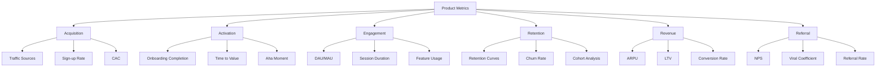

# Product Analytics

Product analytics is the practice of collecting, analyzing, and acting on data about how users interact with your product. It helps product managers make data-driven decisions about features, user experience, and product strategy.

## Key Metrics Framework



## North Star Metric

The North Star Metric is the single metric that best captures the core value you deliver to customers.

### Examples by Product Type

**Social Networks:**
- Facebook: Daily Active Users (DAU)
- Twitter: Weekly Active Users posting tweets
- Instagram: Daily Stories posted

**E-commerce:**
- Amazon: Number of purchases per month
- Shopify: Gross Merchandise Volume (GMV)
- Etsy: Active sellers making sales

**SaaS:**
- Slack: Messages sent per day
- Zoom: Meeting minutes hosted
- Notion: Workspaces with weekly activity

**Marketplace:**
- Airbnb: Nights booked
- Uber: Rides completed
- DoorDash: Orders delivered

### Selecting Your North Star
```python
class NorthStarMetric:
    """Framework for defining North Star Metric"""
    
    def __init__(self, name: str):
        self.name = name
        self.criteria = self._evaluate_criteria()
    
    def _evaluate_criteria(self) -> dict:
        """Evaluate if metric meets North Star criteria"""
        return {
            'expresses_value': self._expresses_core_value(),
            'measures_customer_value': self._measures_customer_value(),
            'predicts_success': self._predicts_business_success(),
            'actionable': self._is_actionable(),
            'understandable': self._is_understandable(),
            'measurable': self._is_measurable(),
            'real_time': self._is_real_time(),
        }
    
    def _expresses_core_value(self) -> bool:
        """Does it express the value you deliver?"""
        # Example: Spotify - Hours of music streamed
        # Expresses value: listening to music
        return True
    
    def _measures_customer_value(self) -> bool:
        """Does it measure value to customers, not just revenue?"""
        # Revenue is lagging indicator
        # Customer value is leading indicator
        return True
    
    def _predicts_business_success(self) -> bool:
        """Does it correlate with long-term business success?"""
        return True
    
    def _is_actionable(self) -> bool:
        """Can teams take action to move the metric?"""
        return True
    
    def _is_understandable(self) -> bool:
        """Can everyone in the company understand it?"""
        return True
    
    def _is_measurable(self) -> bool:
        """Can you measure it accurately and consistently?"""
        return True
    
    def _is_real_time(self) -> bool:
        """Can you track it in real-time or near real-time?"""
        return True

# Example usage
north_star = NorthStarMetric("Weekly Active Users completing a task")
print(north_star.criteria)
```

## AARRR Framework (Pirate Metrics)

### Acquisition
```python
import pandas as pd
from datetime import datetime, timedelta

class AcquisitionAnalytics:
    """Track user acquisition metrics"""
    
    def __init__(self, analytics_db):
        self.db = analytics_db
    
    def calculate_acquisition_metrics(self, start_date, end_date):
        """Calculate acquisition metrics"""
        data = self.db.get_user_signups(start_date, end_date)
        
        metrics = {
            'total_signups': len(data),
            'signups_by_channel': self._signups_by_channel(data),
            'conversion_by_channel': self._conversion_by_channel(data),
            'cac_by_channel': self._cac_by_channel(data),
            'organic_vs_paid': self._organic_vs_paid(data),
        }
        
        return metrics
    
    def _signups_by_channel(self, data):
        """Group signups by channel"""
        return data.groupby('channel')['user_id'].count().to_dict()
    
    def _conversion_by_channel(self, data):
        """Calculate conversion rate by channel"""
        conversions = data.groupby('channel').agg({
            'visited': 'sum',
            'signed_up': 'sum'
        })
        conversions['rate'] = conversions['signed_up'] / conversions['visited']
        return conversions.to_dict()
    
    def _cac_by_channel(self, data):
        """Calculate Customer Acquisition Cost by channel"""
        costs = self.db.get_marketing_spend()
        signups = data.groupby('channel')['user_id'].count()
        
        cac = costs / signups
        return cac.to_dict()
    
    def _organic_vs_paid(self, data):
        """Compare organic vs paid acquisition"""
        organic = data[data['channel'].isin(['organic', 'referral', 'direct'])]
        paid = data[data['channel'].isin(['paid_search', 'paid_social', 'display'])]
        
        return {
            'organic_count': len(organic),
            'paid_count': len(paid),
            'organic_percentage': len(organic) / len(data) * 100,
            'paid_percentage': len(paid) / len(data) * 100,
        }
```

### Activation
```python
class ActivationAnalytics:
    """Track user activation (aha moment)"""
    
    def __init__(self, analytics_db):
        self.db = analytics_db
        self.activation_events = [
            'completed_onboarding',
            'created_first_project',
            'invited_team_member',
            'completed_first_task',
        ]
    
    def calculate_activation_rate(self, cohort_start_date, days=7):
        """Calculate activation rate for cohort"""
        users = self.db.get_users_joined_on(cohort_start_date)
        
        activated_users = 0
        for user in users:
            if self._is_activated(user, days):
                activated_users += 1
        
        return {
            'total_users': len(users),
            'activated_users': activated_users,
            'activation_rate': activated_users / len(users) * 100,
            'time_to_activation': self._avg_time_to_activation(users),
        }
    
    def _is_activated(self, user, within_days):
        """Check if user completed activation events"""
        events = self.db.get_user_events(
            user['id'],
            within_days=within_days
        )
        
        # User must complete all activation events
        return all(
            any(e['name'] == event for e in events)
            for event in self.activation_events
        )
    
    def _avg_time_to_activation(self, users):
        """Average time from signup to activation"""
        times = []
        
        for user in users:
            signup_time = user['created_at']
            activation_time = self._get_activation_time(user)
            
            if activation_time:
                delta = (activation_time - signup_time).total_seconds() / 3600
                times.append(delta)
        
        return sum(times) / len(times) if times else None
    
    def _get_activation_time(self, user):
        """Get timestamp of user's activation"""
        events = self.db.get_user_events(user['id'])
        
        activation_event = next(
            (e for e in events if e['name'] in self.activation_events),
            None
        )
        
        return activation_event['timestamp'] if activation_event else None
```

### Retention
```python
import numpy as np
import matplotlib.pyplot as plt

class RetentionAnalytics:
    """Track user retention"""
    
    def __init__(self, analytics_db):
        self.db = analytics_db
    
    def calculate_retention_curve(self, cohort_date, periods=12):
        """Calculate retention curve for cohort"""
        users = self.db.get_users_joined_on(cohort_date)
        cohort_size = len(users)
        
        retention_data = []
        
        for period in range(periods):
            active_users = self._count_active_users(
                users,
                cohort_date,
                period
            )
            
            retention_rate = active_users / cohort_size * 100
            
            retention_data.append({
                'period': period,
                'active_users': active_users,
                'retention_rate': retention_rate
            })
        
        return retention_data
    
    def _count_active_users(self, users, cohort_date, period):
        """Count users active in specific period"""
        period_start = cohort_date + timedelta(weeks=period)
        period_end = period_start + timedelta(weeks=1)
        
        active_count = 0
        for user in users:
            if self.db.was_active_between(user['id'], period_start, period_end):
                active_count += 1
        
        return active_count
    
    def cohort_analysis(self, start_date, end_date, by='week'):
        """Create cohort retention table"""
        cohorts = self._get_cohorts(start_date, end_date, by)
        
        retention_table = []
        
        for cohort_date in cohorts:
            retention_curve = self.calculate_retention_curve(cohort_date)
            retention_table.append({
                'cohort': cohort_date,
                'size': len(self.db.get_users_joined_on(cohort_date)),
                'retention': [r['retention_rate'] for r in retention_curve]
            })
        
        return pd.DataFrame(retention_table)
    
    def plot_retention_curves(self, cohort_data):
        """Plot retention curves for multiple cohorts"""
        plt.figure(figsize=(12, 6))
        
        for cohort in cohort_data:
            plt.plot(
                range(len(cohort['retention'])),
                cohort['retention'],
                label=cohort['cohort'].strftime('%Y-%m-%d'),
                marker='o'
            )
        
        plt.xlabel('Weeks Since Signup')
        plt.ylabel('Retention Rate (%)')
        plt.title('Retention Curves by Cohort')
        plt.legend()
        plt.grid(True, alpha=0.3)
        plt.show()
    
    def calculate_churn_rate(self, period_start, period_end):
        """Calculate churn rate for period"""
        users_start = self.db.get_active_users_on(period_start)
        users_end = self.db.get_active_users_on(period_end)
        
        churned = set(users_start) - set(users_end)
        
        churn_rate = len(churned) / len(users_start) * 100
        
        return {
            'churned_users': len(churned),
            'churn_rate': churn_rate,
            'retention_rate': 100 - churn_rate
        }
```

## Product Engagement

### DAU/MAU Ratio (Stickiness)
```python
class EngagementAnalytics:
    """Track product engagement"""
    
    def __init__(self, analytics_db):
        self.db = analytics_db
    
    def calculate_stickiness(self, date):
        """Calculate DAU/MAU ratio"""
        dau = self.db.count_active_users(date, date)
        
        month_start = date.replace(day=1)
        mau = self.db.count_active_users(month_start, date)
        
        stickiness = (dau / mau) * 100 if mau > 0 else 0
        
        return {
            'date': date,
            'dau': dau,
            'mau': mau,
            'stickiness': stickiness,
            'interpretation': self._interpret_stickiness(stickiness)
        }
    
    def _interpret_stickiness(self, stickiness):
        """Interpret stickiness score"""
        if stickiness >= 60:
            return "Excellent - Highly sticky product"
        elif stickiness >= 40:
            return "Good - Users come back frequently"
        elif stickiness >= 20:
            return "Average - Room for improvement"
        else:
            return "Poor - Low engagement"
    
    def feature_usage_analysis(self, start_date, end_date):
        """Analyze feature usage"""
        events = self.db.get_events_between(start_date, end_date)
        
        feature_stats = {}
        
        for event in events:
            feature = event['feature']
            
            if feature not in feature_stats:
                feature_stats[feature] = {
                    'total_uses': 0,
                    'unique_users': set(),
                    'avg_per_user': 0
                }
            
            feature_stats[feature]['total_uses'] += 1
            feature_stats[feature]['unique_users'].add(event['user_id'])
        
        # Calculate averages
        for feature, stats in feature_stats.items():
            unique_count = len(stats['unique_users'])
            stats['unique_users'] = unique_count
            stats['avg_per_user'] = stats['total_uses'] / unique_count
        
        return feature_stats
    
    def session_analysis(self, date):
        """Analyze user sessions"""
        sessions = self.db.get_sessions(date)
        
        durations = [s['duration'] for s in sessions]
        pages_per_session = [s['page_views'] for s in sessions]
        
        return {
            'total_sessions': len(sessions),
            'avg_duration_seconds': np.mean(durations),
            'median_duration_seconds': np.median(durations),
            'avg_pages_per_session': np.mean(pages_per_session),
            'bounce_rate': self._calculate_bounce_rate(sessions)
        }
    
    def _calculate_bounce_rate(self, sessions):
        """Calculate bounce rate (single page sessions)"""
        bounces = sum(1 for s in sessions if s['page_views'] == 1)
        return (bounces / len(sessions)) * 100 if sessions else 0
```

## Funnel Analysis

```python
class FunnelAnalytics:
    """Analyze conversion funnels"""
    
    def __init__(self, analytics_db):
        self.db = analytics_db
    
    def analyze_funnel(self, funnel_steps, start_date, end_date):
        """Analyze conversion funnel"""
        funnel_data = []
        
        for i, step in enumerate(funnel_steps):
            users_at_step = self.db.get_users_completing_step(
                step,
                start_date,
                end_date
            )
            
            if i == 0:
                total_users = len(users_at_step)
                conversion_rate = 100.0
            else:
                conversion_rate = (len(users_at_step) / total_users) * 100
            
            dropoff_rate = 100 - conversion_rate if i > 0 else 0
            
            funnel_data.append({
                'step': step,
                'users': len(users_at_step),
                'conversion_rate': conversion_rate,
                'dropoff_rate': dropoff_rate,
                'dropoff_from_previous': self._dropoff_from_previous(
                    funnel_data, len(users_at_step)
                ) if i > 0 else 0
            })
        
        return funnel_data
    
    def _dropoff_from_previous(self, funnel_data, current_users):
        """Calculate dropoff from previous step"""
        previous_users = funnel_data[-1]['users']
        dropoff = ((previous_users - current_users) / previous_users) * 100
        return dropoff
    
    def identify_bottlenecks(self, funnel_data, threshold=30):
        """Identify steps with high dropoff"""
        bottlenecks = [
            step for step in funnel_data
            if step['dropoff_from_previous'] > threshold
        ]
        
        return bottlenecks
```

## Best Practices

### Event Tracking
```javascript
// Good: Descriptive event names
analytics.track('Button Clicked', {
  button_name: 'Sign Up',
  page: 'Landing Page',
  experiment: 'Hero CTA Test'
});

// Good: Include context
analytics.track('Feature Used', {
  feature_name: 'Document Export',
  export_format: 'PDF',
  document_size_kb: 150,
  user_plan: 'Pro'
});

// Bad: Generic events
analytics.track('Click');
```

### Segmentation
```python
segments = {
    'power_users': {
        'usage': '> 20 sessions/month',
        'features_used': '> 5',
        'plan': 'Pro or Enterprise'
    },
    'at_risk': {
        'last_active': '> 14 days ago',
        'sessions_last_month': '< 2',
        'plan': 'Paid'
    },
    'champions': {
        'nps_score': '> 9',
        'tenure': '> 6 months',
        'referrals': '> 0'
    }
}
```

## Related Concepts

- [[A/B Testing]]
- [[Product-Market Fit]]
- [[User Research]]
- [[Feature Prioritization]]
- [[Growth Hacking]]
- [[Data Visualization]]
- [[SQL for Analytics]]
- [[Statistical Significance]]

## Common Pitfalls

### Vanity Metrics
- Focus on actionable metrics
- Avoid metrics that look good but don't drive decisions
- Example: Total registered users vs DAU

### Analysis Paralysis
- Don't track everything
- Focus on key metrics
- Make decisions with imperfect data

### Ignoring Segments
- Averages hide important patterns
- Segment by user type, cohort, channel
- Power users vs casual users behave differently

### Short-term Thinking
- Balance short-term gains with long-term health
- Watch for metric gaming
- Consider second-order effects

---

*"In God we trust. All others must bring data." - W. Edwards Deming*


