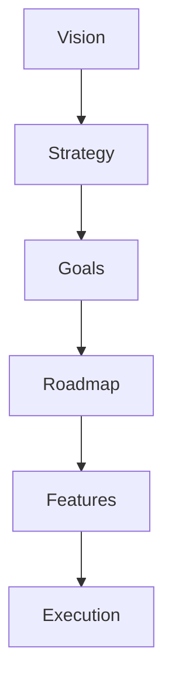

# Product Strategy Fundamentals

Product strategy defines the vision, goals, and roadmap for a product to achieve business objectives.

## Strategy Framework



- [definition] Vision: Long-term aspiration for the product
- [definition] Strategy: High-level plan to achieve vision
- [definition] Goals: Measurable objectives
- [definition] Roadmap: Timeline of initiatives

## Product Vision

**Good Vision Statement:**
> "Enable every person and organization to achieve more" - Microsoft

**Components:**
- Target audience
- Problem being solved
- Unique value proposition
- Long-term aspiration

- [principle] Vision inspires and guides decisions
- [characteristic] Ambitious but achievable
- [timeframe] 3-5 year horizon

## OKRs (Objectives and Key Results)

```markdown
**Objective:** Increase user engagement

Key Results:
1. Increase DAU/MAU ratio from 0.25 to 0.35
2. Increase avg session duration from 8min to 12min
3. Reduce churn rate from 5% to 3%

Timeline: Q1 2025
Owner: Product Team
```

- [framework] OKRs align team around measurable goals
- [structure] Objective (qualitative) + Key Results (quantitative)
- [cadence] Set quarterly, review monthly

## Product-Market Fit

Signs of Product-Market Fit:
- Users are actively using product regularly
- Growth is organic (word-of-mouth)
- Hard to keep up with demand
- High Net Promoter Score (40+)

- [definition] PMF: Product satisfies strong market demand
- [validation] 40% of users would be "very disappointed" if product disappeared
- [importance] Achieve PMF before scaling

## Prioritization Frameworks

### RICE Scoring
```
Score = (Reach × Impact × Confidence) / Effort

Reach: How many users affected?
Impact: How much will it help? (0.25, 0.5, 1, 2, 3)
Confidence: How sure are you? (50%, 80%, 100%)
Effort: Person-months required

Example:
Feature: User dashboard
  Reach: 10,000 users/quarter
  Impact: 2 (High)
  Confidence: 80%
  Effort: 2 person-months

  Score = (10000 × 2 × 0.8) / 2 = 8,000
```

### MoSCoW Method
- **Must Have**: Critical for release
- **Should Have**: Important but not critical
- **Could Have**: Nice to have
- **Won't Have**: Not this release

### Value vs Effort Matrix
```
         High Value
         ↑
    Quick Wins | Big Bets
    --------+----------
    Time Sinks | Money Pits
         ↓
      High Effort →
```

## Relations
- enables [[Product Roadmap]]
- uses [[OKRs]]
- informs [[Feature Prioritization]]
- builds_on [[Market Research]]
- related_to [[Business Strategy]]

## Key Responsibilities

1. **Vision & Strategy**: Define where product is going
2. **Prioritization**: Decide what to build when
3. **Stakeholder Management**: Align team and executives
4. **User Advocacy**: Represent user needs
5. **Metrics & Analysis**: Measure success

*Product strategy is the bridge between business goals and user needs.*
