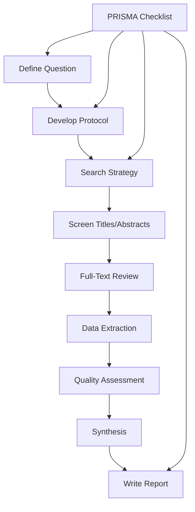

# Systematic Literature Review

A systematic literature review is a rigorous, transparent, and reproducible method for identifying, evaluating, and synthesizing existing research on a specific topic. It follows a structured protocol to minimize bias and provide comprehensive coverage of the literature.

## Review Process



## Research Question: PICO Framework

**PICO** helps formulate a clear research question:
- **P**opulation: Who is the study about?
- **I**ntervention: What is being studied?
- **C**omparison: What is it being compared to?
- **O**utcome: What are you measuring?

```python
class ResearchQuestion:
    """Structure research question using PICO"""
    
    def __init__(self, population, intervention, comparison, outcome):
        self.population = population
        self.intervention = intervention
        self.comparison = comparison
        self.outcome = outcome
    
    def formulate_question(self):
        """Create research question"""
        return f"In {self.population}, does {self.intervention} compared to {self.comparison} affect {self.outcome}?"
    
    def generate_keywords(self):
        """Generate search keywords from PICO"""
        keywords = {
            'population_terms': self._extract_keywords(self.population),
            'intervention_terms': self._extract_keywords(self.intervention),
            'comparison_terms': self._extract_keywords(self.comparison),
            'outcome_terms': self._extract_keywords(self.outcome)
        }
        
        return keywords
    
    def example_medical(self):
        """Example: Medical research question"""
        return {
            'P': 'Adults with type 2 diabetes',
            'I': 'Metformin therapy',
            'C': 'Placebo',
            'O': 'HbA1c levels',
            'question': 'In adults with type 2 diabetes, does metformin therapy compared to placebo reduce HbA1c levels?'
        }
    
    def example_tech(self):
        """Example: Technology research question"""
        return {
            'P': 'Software development teams',
            'I': 'Test-driven development',
            'C': 'Traditional development',
            'O': 'Code quality and defect rate',
            'question': 'In software development teams, does test-driven development compared to traditional development improve code quality?'
        }
```

## Search Strategy

### Database Selection
```python
class DatabaseSearch:
    """Systematic database searching"""
    
    def __init__(self):
        self.databases = {
            'general': {
                'Google Scholar': {'coverage': 'Broad', 'access': 'Free'},
                'Web of Science': {'coverage': 'Broad', 'access': 'Subscription'},
                'Scopus': {'coverage': 'Broad', 'access': 'Subscription'}
            },
            'medical': {
                'PubMed/MEDLINE': {'coverage': 'Biomedical', 'access': 'Free'},
                'Embase': {'coverage': 'Biomedical', 'access': 'Subscription'},
                'Cochrane Library': {'coverage': 'Clinical trials', 'access': 'Mixed'}
            },
            'social_sciences': {
                'PsycINFO': {'coverage': 'Psychology', 'access': 'Subscription'},
                'ERIC': {'coverage': 'Education', 'access': 'Free'},
                'Sociological Abstracts': {'coverage': 'Sociology', 'access': 'Subscription'}
            },
            'computer_science': {
                'IEEE Xplore': {'coverage': 'Engineering', 'access': 'Subscription'},
                'ACM Digital Library': {'coverage': 'Computing', 'access': 'Subscription'},
                'arXiv': {'coverage': 'Preprints', 'access': 'Free'}
            }
        }
    
    def build_search_string(self, keywords, operators='AND'):
        """Build Boolean search string"""
        # Example keywords structure:
        # {
        #     'population': ['diabetes', 'diabetic patients'],
        #     'intervention': ['metformin', 'glucophage'],
        #     'outcome': ['HbA1c', 'glycemic control']
        # }
        
        # Build OR clauses within each concept
        concept_strings = []
        for concept, terms in keywords.items():
            or_string = ' OR '.join([f'"{term}"' for term in terms])
            concept_strings.append(f'({or_string})')
        
        # Combine concepts with AND
        search_string = f' {operators} '.join(concept_strings)
        
        return search_string
    
    def example_search_string(self):
        """Example PubMed search"""
        return '''
        ("diabetes mellitus, type 2"[MeSH] OR "type 2 diabetes" OR "T2DM")
        AND
        ("metformin"[MeSH] OR "metformin" OR "glucophage")
        AND
        ("glycated hemoglobin"[MeSH] OR "HbA1c" OR "glycemic control")
        AND
        ("randomized controlled trial"[Publication Type] OR "clinical trial")
        '''
    
    def advanced_techniques(self):
        """Advanced search techniques"""
        return {
            'wildcards': {
                'example': 'diabet* (finds diabetes, diabetic, diabetics)',
                'use': 'Capture word variations'
            },
            'proximity_operators': {
                'example': 'machine NEAR/5 learning',
                'use': 'Find terms within N words'
            },
            'field_searching': {
                'example': 'TITLE-ABS-KEY("machine learning")',
                'use': 'Search specific fields only'
            },
            'date_limits': {
                'example': 'AND (2020:2024[pdat])',
                'use': 'Limit to date range'
            },
            'citation_searching': {
                'forward': 'Papers that cite key study',
                'backward': 'References in key study',
                'use': 'Snowball sampling'
            }
        }
```

## PRISMA Flow Diagram

```python
class PRISMAFlow:
    """Track screening process using PRISMA"""
    
    def __init__(self):
        self.identification = {
            'database_results': 0,
            'other_sources': 0,
            'duplicates_removed': 0
        }
        self.screening = {
            'titles_screened': 0,
            'excluded_at_title': 0
        }
        self.eligibility = {
            'full_text_assessed': 0,
            'excluded_reasons': {}
        }
        self.included = {
            'studies_included': 0
        }
    
    def calculate_prisma_numbers(self):
        """Calculate PRISMA flow numbers"""
        total_identified = (
            self.identification['database_results'] +
            self.identification['other_sources']
        )
        
        after_dedup = (
            total_identified -
            self.identification['duplicates_removed']
        )
        
        after_screening = (
            self.screening['titles_screened'] -
            self.screening['excluded_at_title']
        )
        
        after_eligibility = (
            self.eligibility['full_text_assessed'] -
            sum(self.eligibility['excluded_reasons'].values())
        )
        
        return {
            'identification': total_identified,
            'after_deduplication': after_dedup,
            'screened': self.screening['titles_screened'],
            'full_text_reviewed': self.eligibility['full_text_assessed'],
            'included': self.included['studies_included']
        }
    
    def exclusion_reasons(self):
        """Common exclusion reasons"""
        return {
            'wrong_population': 'Study population did not match criteria',
            'wrong_intervention': 'Intervention not relevant',
            'wrong_outcome': 'Outcomes not measured',
            'wrong_study_design': 'Not RCT, not peer-reviewed, etc.',
            'language': 'Not in English (or target language)',
            'full_text_unavailable': 'Could not access full text',
            'duplicate': 'Same study published elsewhere'
        }
```

## Screening Process

### Title and Abstract Screening
```python
class ScreeningManager:
    """Manage systematic screening"""
    
    def __init__(self, inclusion_criteria, exclusion_criteria):
        self.inclusion_criteria = inclusion_criteria
        self.exclusion_criteria = exclusion_criteria
        self.screened_papers = []
    
    def screen_paper(self, paper):
        """Screen a single paper"""
        decision = {
            'paper_id': paper['id'],
            'title': paper['title'],
            'decision': None,
            'reason': None,
            'screener': 'Reviewer 1'
        }
        
        # Check exclusion criteria first (faster)
        for criterion in self.exclusion_criteria:
            if self._meets_exclusion(paper, criterion):
                decision['decision'] = 'Exclude'
                decision['reason'] = criterion
                return decision
        
        # Check inclusion criteria
        meets_all = all(
            self._meets_inclusion(paper, criterion)
            for criterion in self.inclusion_criteria
        )
        
        if meets_all:
            decision['decision'] = 'Include'
        else:
            decision['decision'] = 'Exclude'
            decision['reason'] = 'Does not meet inclusion criteria'
        
        return decision
    
    def dual_screening(self, paper, reviewer1, reviewer2):
        """Two reviewers screen independently"""
        r1_decision = reviewer1.screen_paper(paper)
        r2_decision = reviewer2.screen_paper(paper)
        
        if r1_decision['decision'] == r2_decision['decision']:
            # Agreement
            return {
                'decision': r1_decision['decision'],
                'agreement': True,
                'kappa': None  # Calculate inter-rater reliability
            }
        else:
            # Disagreement - needs third reviewer or discussion
            return {
                'decision': 'Needs resolution',
                'agreement': False,
                'r1_decision': r1_decision['decision'],
                'r2_decision': r2_decision['decision']
            }
    
    def calculate_inter_rater_reliability(self, decisions_r1, decisions_r2):
        """Calculate Cohen's Kappa"""
        from sklearn.metrics import cohen_kappa_score
        
        kappa = cohen_kappa_score(decisions_r1, decisions_r2)
        
        interpretation = {
            'kappa': kappa,
            'agreement_level': self._interpret_kappa(kappa)
        }
        
        return interpretation
    
    def _interpret_kappa(self, kappa):
        """Interpret Cohen's Kappa value"""
        if kappa > 0.8:
            return "Almost perfect agreement"
        elif kappa > 0.6:
            return "Substantial agreement"
        elif kappa > 0.4:
            return "Moderate agreement"
        elif kappa > 0.2:
            return "Fair agreement"
        else:
            return "Slight agreement"
```

## Data Extraction

```python
class DataExtraction:
    """Extract data from included studies"""
    
    def __init__(self):
        self.extraction_form = {
            'study_details': [
                'author',
                'year',
                'title',
                'journal',
                'doi',
                'country'
            ],
            'population': [
                'sample_size',
                'age_range',
                'gender_distribution',
                'inclusion_criteria',
                'exclusion_criteria'
            ],
            'methodology': [
                'study_design',
                'intervention_description',
                'control_description',
                'duration',
                'randomization_method'
            ],
            'outcomes': [
                'primary_outcome',
                'secondary_outcomes',
                'measurement_tools',
                'timepoints'
            ],
            'results': [
                'primary_outcome_results',
                'effect_size',
                'confidence_intervals',
                'p_values',
                'adverse_events'
            ]
        }
    
    def extract_data(self, paper):
        """Extract data from paper"""
        data = {}
        
        for category, fields in self.extraction_form.items():
            data[category] = {}
            for field in fields:
                # Extract field from paper
                data[category][field] = self._extract_field(paper, field)
        
        return data
    
    def validate_extraction(self, extracted_data):
        """Validate extracted data"""
        issues = []
        
        # Check for missing critical fields
        critical_fields = ['sample_size', 'study_design', 'primary_outcome_results']
        for field in critical_fields:
            if not self._find_field(extracted_data, field):
                issues.append(f"Missing critical field: {field}")
        
        # Check for inconsistencies
        if extracted_data.get('results', {}).get('p_values'):
            p_value = float(extracted_data['results']['p_values'])
            if p_value < 0.05:
                # Should have effect size
                if not extracted_data.get('results', {}).get('effect_size'):
                    issues.append("Significant result but missing effect size")
        
        return {
            'valid': len(issues) == 0,
            'issues': issues
        }
```

## Quality Assessment

```python
class QualityAssessment:
    """Assess study quality and risk of bias"""
    
    def __init__(self):
        # Risk of Bias tools
        self.rob_tools = {
            'RCT': 'Cochrane Risk of Bias Tool',
            'Observational': 'Newcastle-Ottawa Scale',
            'Diagnostic': 'QUADAS-2',
            'Qualitative': 'CASP Qualitative Checklist'
        }
    
    def cochrane_rob_assessment(self, study):
        """Cochrane Risk of Bias 2.0"""
        domains = {
            'randomization': {
                'question': 'Was randomization adequate?',
                'rating': None,  # Low, Some concerns, High
                'support': None
            },
            'deviation_interventions': {
                'question': 'Were deviations from intended interventions addressed?',
                'rating': None,
                'support': None
            },
            'missing_data': {
                'question': 'Was missing outcome data addressed?',
                'rating': None,
                'support': None
            },
            'outcome_measurement': {
                'question': 'Was outcome measurement appropriate?',
                'rating': None,
                'support': None
            },
            'selective_reporting': {
                'question': 'Was there selective reporting of results?',
                'rating': None,
                'support': None
            }
        }
        
        # Assess each domain
        for domain, criteria in domains.items():
            rating = self._assess_domain(study, domain)
            domains[domain]['rating'] = rating
        
        # Overall risk of bias
        overall = self._calculate_overall_rob(domains)
        
        return {
            'domains': domains,
            'overall_rob': overall
        }
    
    def _calculate_overall_rob(self, domains):
        """Calculate overall risk of bias"""
        ratings = [d['rating'] for d in domains.values()]
        
        if any(r == 'High' for r in ratings):
            return 'High'
        elif all(r == 'Low' for r in ratings):
            return 'Low'
        else:
            return 'Some concerns'
    
    def grade_evidence(self, body_of_evidence):
        """GRADE evidence quality assessment"""
        # Starting point: RCTs = High, Observational = Low
        
        factors = {
            'downgrade': {
                'risk_of_bias': 'Study limitations',
                'inconsistency': 'Unexplained heterogeneity',
                'indirectness': 'Indirect evidence',
                'imprecision': 'Wide confidence intervals',
                'publication_bias': 'Suspected publication bias'
            },
            'upgrade': {
                'large_effect': 'Large magnitude of effect',
                'dose_response': 'Dose-response gradient',
                'confounders': 'All plausible confounders reduce effect'
            }
        }
        
        # Start with High for RCTs
        quality = 'High'
        
        # Apply downgrades
        downgrades = 0
        for factor in factors['downgrade']:
            if self._has_concern(body_of_evidence, factor):
                downgrades += 1
        
        # Apply upgrades (for observational studies)
        upgrades = 0
        for factor in factors['upgrade']:
            if self._has_upgrade(body_of_evidence, factor):
                upgrades += 1
        
        levels = ['Very Low', 'Low', 'Moderate', 'High']
        final_level = max(0, min(3, 3 - downgrades + upgrades))
        
        return {
            'quality': levels[final_level],
            'downgrades': downgrades,
            'upgrades': upgrades
        }
```

## Synthesis and Meta-Analysis

```python
import numpy as np
from scipy import stats

class MetaAnalysis:
    """Statistical synthesis of studies"""
    
    def __init__(self, studies):
        self.studies = studies
    
    def fixed_effect_meta_analysis(self, effect_sizes, standard_errors):
        """Fixed-effect meta-analysis"""
        # Calculate weights (inverse variance)
        variances = np.array(standard_errors) ** 2
        weights = 1 / variances
        
        # Pooled effect size
        pooled_effect = np.sum(weights * effect_sizes) / np.sum(weights)
        
        # Standard error of pooled effect
        pooled_se = np.sqrt(1 / np.sum(weights))
        
        # 95% confidence interval
        ci_lower = pooled_effect - 1.96 * pooled_se
        ci_upper = pooled_effect + 1.96 * pooled_se
        
        # Z-test
        z_score = pooled_effect / pooled_se
        p_value = 2 * (1 - stats.norm.cdf(abs(z_score)))
        
        return {
            'pooled_effect': pooled_effect,
            'se': pooled_se,
            '95_ci': (ci_lower, ci_upper),
            'z_score': z_score,
            'p_value': p_value
        }
    
    def heterogeneity_test(self, effect_sizes, standard_errors, weights):
        """Test for heterogeneity (I² statistic)"""
        k = len(effect_sizes)  # Number of studies
        
        # Q statistic
        pooled_effect = np.sum(weights * effect_sizes) / np.sum(weights)
        Q = np.sum(weights * (effect_sizes - pooled_effect) ** 2)
        
        # I² statistic
        df = k - 1
        I_squared = max(0, ((Q - df) / Q) * 100)
        
        interpretation = {
            'I_squared': I_squared,
            'heterogeneity': self._interpret_heterogeneity(I_squared)
        }
        
        return interpretation
    
    def _interpret_heterogeneity(self, i_squared):
        """Interpret I² statistic"""
        if i_squared < 25:
            return "Low heterogeneity"
        elif i_squared < 50:
            return "Moderate heterogeneity"
        elif i_squared < 75:
            return "Substantial heterogeneity"
        else:
            return "Considerable heterogeneity"
```

## Writing the Review

```python
class ReviewManuscript:
    """Structure systematic review manuscript"""
    
    def __init__(self):
        self.structure = {
            'title': 'Clear, specific title indicating systematic review',
            'abstract': {
                'background': 'Rationale and objectives',
                'methods': 'PICO, databases, dates, analysis',
                'results': 'Number of studies, key findings',
                'conclusions': 'Main takeaways and implications'
            },
            'introduction': {
                'background': 'Context and importance',
                'objectives': 'Specific research question (PICO)',
                'rationale': 'Why review is needed'
            },
            'methods': {
                'protocol': 'Pre-specified protocol (PROSPERO)',
                'eligibility': 'Inclusion/exclusion criteria',
                'search': 'Databases, search strings, dates',
                'selection': 'Screening process, agreement',
                'data_collection': 'Extraction form, validation',
                'quality': 'Risk of bias assessment',
                'synthesis': 'Meta-analysis methods'
            },
            'results': {
                'study_selection': 'PRISMA flow diagram',
                'study_characteristics': 'Table of included studies',
                'risk_of_bias': 'Quality assessment results',
                'synthesis': 'Narrative or quantitative synthesis',
                'additional_analyses': 'Subgroups, sensitivity'
            },
            'discussion': {
                'summary': 'Main findings',
                'limitations': 'Review limitations',
                'implications': 'For practice and research'
            }
        }
```

## Related Concepts

- [[Research Methodology]]
- [[Critical Appraisal]]
- [[Meta-Analysis]]
- [[Evidence-Based Practice]]
- [[Academic Writing]]
- [[Citation Management]]
- [[Research Ethics]]
- [[Publication Process]]

## Best Practices

### Reduce Bias
- Pre-register protocol (PROSPERO)
- Use two independent reviewers
- Blind reviewers to author/journal
- Document all decisions

### Ensure Transparency
- Report according to PRISMA
- Provide full search strings
- List excluded studies with reasons
- Share data extraction forms

### Quality Over Quantity
- Don't include low-quality studies just to increase numbers
- Better to have fewer high-quality studies
- Acknowledge limitations honestly

---

*"The plural of anecdote is not data, but a systematic review comes close."*


