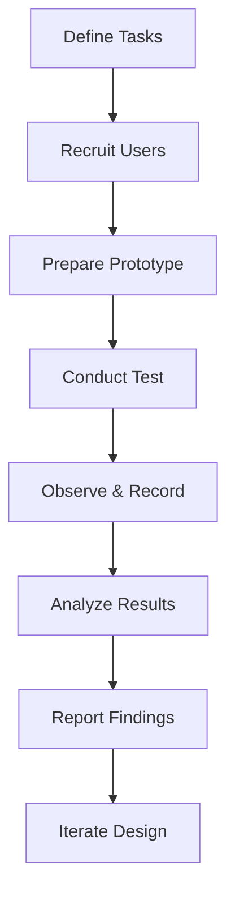

# User Research Methods

User research helps understand user needs, behaviors, and motivations through observation and feedback.

## Types of Research

### Qualitative Research
Understanding the "why" behind behaviors.

**Methods:**
1. **User Interviews**: One-on-one conversations
2. **Focus Groups**: Group discussions
3. **Usability Testing**: Observe users completing tasks
4. **Field Studies**: Observe in natural environment

- [goal] Understand motivations, frustrations, mental models
- [output] Insights, quotes, behavioral patterns

### Quantitative Research
Measuring and counting behaviors.

**Methods:**
1. **Surveys**: Structured questionnaires
2. **Analytics**: User behavior metrics
3. **A/B Testing**: Compare design variants
4. **Card Sorting**: Information architecture validation

- [goal] Measure trends, validate assumptions with data
- [output] Numbers, statistics, conversion rates

## User Interview Guide

### Before Interview
```markdown
**Goals:**
- Understand user's workflow
- Identify pain points
- Discover unmet needs

**Participants:**
- 5-8 users from target audience
- Mix of experience levels
- Diverse backgrounds

**Questions Prepared:**
- Open-ended ("Tell me about...")
- Avoid leading questions
- Follow-up probes ready
```

### During Interview
- **Listen more than talk** (80/20 rule)
- **Ask "why" five times** to get to root cause
- **Note exact quotes** for insights
- **Observe body language** and tone

### After Interview
- Transcribe within 24 hours
- Identify themes and patterns
- Create affinity diagrams
- Share insights with team

## Usability Testing Protocol



### Task Design
```markdown
**Task 1:** Find and purchase a blue t-shirt in size medium
- Success criteria: User completes checkout
- Time limit: 5 minutes
- Difficulty: Easy

**Metrics to Track:**
- Task success rate
- Time to completion
- Number of errors
- User satisfaction (1-5)
```

### Think-Aloud Protocol
- Ask users to verbalize their thoughts
- Don't interrupt or guide
- Note confusion points
- Record exact quotes

## User Personas

```markdown
**Sarah - The Busy Professional**

**Demographics:**
- Age: 32
- Occupation: Marketing Manager
- Tech savviness: Medium

**Goals:**
- Quickly find reliable information
- Accomplish tasks efficiently
- Minimize time spent learning new tools

**Pain Points:**
- Overwhelmed by complex interfaces
- Frustrated by slow loading times
- Needs mobile-friendly experiences

**Quote:** "I don't have time to figure out complicated systems."
```

- [tool] Personas represent user archetypes
- [benefit] Keep user needs front of mind
- [warning] Based on research, not assumptions

## Journey Mapping

```
Awareness → Consideration → Decision → Purchase → Post-Purchase

Example: Online Shopping Journey
1. See ad on social media (Awareness)
2. Visit website, browse products (Consideration)
3. Read reviews, compare prices (Decision)
4. Add to cart, checkout (Purchase)
5. Track delivery, leave review (Post-Purchase)

Touchpoints: Ads, Website, Email, Support
Emotions: 😊 → 🤔 → 😟 → 😃 → 😊
Pain Points: Slow site, unclear sizing, shipping cost surprise
```

- [tool] Journey map visualizes user experience over time
- [reveals] Emotional highs and lows
- [identifies] Optimization opportunities

## Research Planning

### When to Use What

| Method | Best For | Time Required | Users Needed |
|--------|----------|---------------|--------------|
| Interviews | Deep insights | 1-2 hours each | 5-8 |
| Surveys | Quantitative validation | 10-15 mins | 100+ |
| Usability Testing | Interface validation | 30-60 mins | 5-8 |
| Analytics | Behavior patterns | Ongoing | All users |
| A/B Testing | Design decisions | 1-2 weeks | 1000+ |

## Relations
- informs [[Design Decisions]]
- creates [[User Personas]]
- enables [[User-Centered Design]]
- related_to [[Usability Testing]]
- builds_on [[Research Methods]]

## Best Practices

1. **Start with qualitative** to understand, then quantitative to validate
2. **Recruit diverse users** to avoid bias
3. **Test early and often** throughout design process
4. **Involve stakeholders** in research observations
5. **Document everything** for future reference
6. **Act on findings** - research without action is waste

*Design without research is just guessing - validate your assumptions with real users.*
