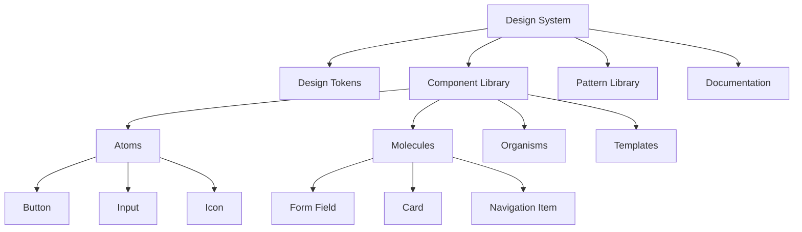

# Component Library

A component library is a collection of reusable UI components with standardized design and behavior. It ensures consistency, speeds up development, and maintains design quality across products.

## Component Architecture



## Design Tokens

Design tokens are the visual design atoms of the design system—specifically, they are named entities that store visual design attributes.

### Token Structure
```css
/* colors.css */
:root {
  /* Brand Colors */
  --color-primary-50: #e3f2fd;
  --color-primary-100: #bbdefb;
  --color-primary-200: #90caf9;
  --color-primary-500: #2196f3;
  --color-primary-700: #1976d2;
  --color-primary-900: #0d47a1;
  
  /* Semantic Colors */
  --color-success: #4caf50;
  --color-warning: #ff9800;
  --color-error: #f44336;
  --color-info: #2196f3;
  
  /* Neutral Colors */
  --color-gray-50: #fafafa;
  --color-gray-100: #f5f5f5;
  --color-gray-200: #eeeeee;
  --color-gray-500: #9e9e9e;
  --color-gray-700: #616161;
  --color-gray-900: #212121;
  
  /* Typography */
  --font-family-sans: 'Inter', -apple-system, sans-serif;
  --font-family-mono: 'JetBrains Mono', monospace;
  
  --font-size-xs: 0.75rem;    /* 12px */
  --font-size-sm: 0.875rem;   /* 14px */
  --font-size-base: 1rem;     /* 16px */
  --font-size-lg: 1.125rem;   /* 18px */
  --font-size-xl: 1.25rem;    /* 20px */
  --font-size-2xl: 1.5rem;    /* 24px */
  --font-size-3xl: 1.875rem;  /* 30px */
  --font-size-4xl: 2.25rem;   /* 36px */
  
  --font-weight-normal: 400;
  --font-weight-medium: 500;
  --font-weight-semibold: 600;
  --font-weight-bold: 700;
  
  --line-height-tight: 1.25;
  --line-height-normal: 1.5;
  --line-height-relaxed: 1.75;
  
  /* Spacing */
  --spacing-1: 0.25rem;   /* 4px */
  --spacing-2: 0.5rem;    /* 8px */
  --spacing-3: 0.75rem;   /* 12px */
  --spacing-4: 1rem;      /* 16px */
  --spacing-5: 1.25rem;   /* 20px */
  --spacing-6: 1.5rem;    /* 24px */
  --spacing-8: 2rem;      /* 32px */
  --spacing-10: 2.5rem;   /* 40px */
  --spacing-12: 3rem;     /* 48px */
  --spacing-16: 4rem;     /* 64px */
  
  /* Border Radius */
  --radius-sm: 0.125rem;  /* 2px */
  --radius-base: 0.25rem; /* 4px */
  --radius-md: 0.375rem;  /* 6px */
  --radius-lg: 0.5rem;    /* 8px */
  --radius-xl: 0.75rem;   /* 12px */
  --radius-2xl: 1rem;     /* 16px */
  --radius-full: 9999px;
  
  /* Shadows */
  --shadow-sm: 0 1px 2px 0 rgba(0, 0, 0, 0.05);
  --shadow-base: 0 1px 3px 0 rgba(0, 0, 0, 0.1), 0 1px 2px 0 rgba(0, 0, 0, 0.06);
  --shadow-md: 0 4px 6px -1px rgba(0, 0, 0, 0.1), 0 2px 4px -1px rgba(0, 0, 0, 0.06);
  --shadow-lg: 0 10px 15px -3px rgba(0, 0, 0, 0.1), 0 4px 6px -2px rgba(0, 0, 0, 0.05);
  --shadow-xl: 0 20px 25px -5px rgba(0, 0, 0, 0.1), 0 10px 10px -5px rgba(0, 0, 0, 0.04);
  
  /* Animation */
  --transition-fast: 150ms cubic-bezier(0.4, 0, 0.2, 1);
  --transition-base: 300ms cubic-bezier(0.4, 0, 0.2, 1);
  --transition-slow: 500ms cubic-bezier(0.4, 0, 0.2, 1);
}
```

## Atomic Design Components

### Atoms: Button
```tsx
import React from 'react';
import './Button.css';

export interface ButtonProps {
  /** Button variant */
  variant?: 'primary' | 'secondary' | 'outline' | 'ghost' | 'danger';
  /** Button size */
  size?: 'xs' | 'sm' | 'md' | 'lg' | 'xl';
  /** Full width button */
  fullWidth?: boolean;
  /** Disabled state */
  disabled?: boolean;
  /** Loading state */
  loading?: boolean;
  /** Click handler */
  onClick?: () => void;
  /** Button children */
  children: React.ReactNode;
}

export const Button: React.FC<ButtonProps> = ({
  variant = 'primary',
  size = 'md',
  fullWidth = false,
  disabled = false,
  loading = false,
  onClick,
  children,
}) => {
  const classes = [
    'button',
    `button--${variant}`,
    `button--${size}`,
    fullWidth && 'button--full-width',
    loading && 'button--loading',
  ].filter(Boolean).join(' ');
  
  return (
    <button
      className={classes}
      disabled={disabled || loading}
      onClick={onClick}
      type="button"
    >
      {loading ? (
        <>
          <span className="button__spinner" />
          <span className="button__text">{children}</span>
        </>
      ) : (
        children
      )}
    </button>
  );
};
```

```css
/* Button.css */
.button {
  display: inline-flex;
  align-items: center;
  justify-content: center;
  font-family: var(--font-family-sans);
  font-weight: var(--font-weight-medium);
  border-radius: var(--radius-md);
  transition: all var(--transition-fast);
  cursor: pointer;
  border: 1px solid transparent;
  white-space: nowrap;
}

/* Sizes */
.button--xs {
  height: 28px;
  padding: 0 var(--spacing-2);
  font-size: var(--font-size-xs);
  gap: var(--spacing-1);
}

.button--sm {
  height: 32px;
  padding: 0 var(--spacing-3);
  font-size: var(--font-size-sm);
  gap: var(--spacing-2);
}

.button--md {
  height: 40px;
  padding: 0 var(--spacing-4);
  font-size: var(--font-size-base);
  gap: var(--spacing-2);
}

.button--lg {
  height: 48px;
  padding: 0 var(--spacing-6);
  font-size: var(--font-size-lg);
  gap: var(--spacing-3);
}

.button--xl {
  height: 56px;
  padding: 0 var(--spacing-8);
  font-size: var(--font-size-xl);
  gap: var(--spacing-3);
}

/* Variants */
.button--primary {
  background-color: var(--color-primary-500);
  color: white;
}

.button--primary:hover:not(:disabled) {
  background-color: var(--color-primary-700);
  box-shadow: var(--shadow-md);
}

.button--secondary {
  background-color: var(--color-gray-200);
  color: var(--color-gray-900);
}

.button--secondary:hover:not(:disabled) {
  background-color: var(--color-gray-300);
}

.button--outline {
  background-color: transparent;
  border-color: var(--color-primary-500);
  color: var(--color-primary-500);
}

.button--outline:hover:not(:disabled) {
  background-color: var(--color-primary-50);
}

.button--ghost {
  background-color: transparent;
  color: var(--color-primary-500);
}

.button--ghost:hover:not(:disabled) {
  background-color: var(--color-primary-50);
}

.button--danger {
  background-color: var(--color-error);
  color: white;
}

.button--danger:hover:not(:disabled) {
  background-color: #d32f2f;
}

/* States */
.button:disabled {
  opacity: 0.5;
  cursor: not-allowed;
}

.button--full-width {
  width: 100%;
}

.button--loading {
  position: relative;
  color: transparent;
}

.button__spinner {
  position: absolute;
  width: 1em;
  height: 1em;
  border: 2px solid currentColor;
  border-right-color: transparent;
  border-radius: 50%;
  animation: spin 0.75s linear infinite;
}

@keyframes spin {
  from { transform: rotate(0deg); }
  to { transform: rotate(360deg); }
}
```

### Atoms: Input
```tsx
import React, { forwardRef } from 'react';
import './Input.css';

export interface InputProps extends React.InputHTMLAttributes<HTMLInputElement> {
  /** Input size */
  size?: 'sm' | 'md' | 'lg';
  /** Error state */
  error?: boolean;
  /** Success state */
  success?: boolean;
  /** Leading icon */
  leadingIcon?: React.ReactNode;
  /** Trailing icon */
  trailingIcon?: React.ReactNode;
}

export const Input = forwardRef<HTMLInputElement, InputProps>(
  ({ size = 'md', error, success, leadingIcon, trailingIcon, className, ...props }, ref) => {
    const classes = [
      'input-wrapper',
      `input-wrapper--${size}`,
      error && 'input-wrapper--error',
      success && 'input-wrapper--success',
      leadingIcon && 'input-wrapper--has-leading',
      trailingIcon && 'input-wrapper--has-trailing',
      className,
    ].filter(Boolean).join(' ');
    
    return (
      <div className={classes}>
        {leadingIcon && (
          <div className="input__icon input__icon--leading">
            {leadingIcon}
          </div>
        )}
        
        <input
          ref={ref}
          className="input"
          {...props}
        />
        
        {trailingIcon && (
          <div className="input__icon input__icon--trailing">
            {trailingIcon}
          </div>
        )}
      </div>
    );
  }
);

Input.displayName = 'Input';
```

```css
/* Input.css */
.input-wrapper {
  position: relative;
  display: inline-flex;
  align-items: center;
  width: 100%;
}

.input {
  width: 100%;
  font-family: var(--font-family-sans);
  border: 1px solid var(--color-gray-200);
  border-radius: var(--radius-md);
  background-color: white;
  transition: all var(--transition-fast);
}

.input:focus {
  outline: none;
  border-color: var(--color-primary-500);
  box-shadow: 0 0 0 3px rgba(33, 150, 243, 0.1);
}

/* Sizes */
.input-wrapper--sm .input {
  height: 32px;
  padding: 0 var(--spacing-3);
  font-size: var(--font-size-sm);
}

.input-wrapper--md .input {
  height: 40px;
  padding: 0 var(--spacing-4);
  font-size: var(--font-size-base);
}

.input-wrapper--lg .input {
  height: 48px;
  padding: 0 var(--spacing-5);
  font-size: var(--font-size-lg);
}

/* With icons */
.input-wrapper--has-leading .input {
  padding-left: calc(var(--spacing-4) + 24px);
}

.input-wrapper--has-trailing .input {
  padding-right: calc(var(--spacing-4) + 24px);
}

.input__icon {
  position: absolute;
  display: flex;
  align-items: center;
  justify-content: center;
  color: var(--color-gray-500);
}

.input__icon--leading {
  left: var(--spacing-3);
}

.input__icon--trailing {
  right: var(--spacing-3);
}

/* States */
.input-wrapper--error .input {
  border-color: var(--color-error);
}

.input-wrapper--error .input:focus {
  box-shadow: 0 0 0 3px rgba(244, 67, 54, 0.1);
}

.input-wrapper--success .input {
  border-color: var(--color-success);
}

.input:disabled {
  background-color: var(--color-gray-50);
  cursor: not-allowed;
  opacity: 0.6;
}
```

### Molecules: Form Field
```tsx
import React from 'react';
import { Input, InputProps } from '../atoms/Input';
import './FormField.css';

export interface FormFieldProps extends InputProps {
  /** Field label */
  label?: string;
  /** Helper text */
  helperText?: string;
  /** Error message */
  errorMessage?: string;
  /** Success message */
  successMessage?: string;
  /** Required field indicator */
  required?: boolean;
}

export const FormField: React.FC<FormFieldProps> = ({
  label,
  helperText,
  errorMessage,
  successMessage,
  required,
  id,
  ...inputProps
}) => {
  const fieldId = id || `field-${Math.random().toString(36).substr(2, 9)}`;
  const error = Boolean(errorMessage);
  const success = Boolean(successMessage);
  
  return (
    <div className="form-field">
      {label && (
        <label htmlFor={fieldId} className="form-field__label">
          {label}
          {required && <span className="form-field__required">*</span>}
        </label>
      )}
      
      <Input
        id={fieldId}
        error={error}
        success={success}
        {...inputProps}
      />
      
      {helperText && !errorMessage && !successMessage && (
        <div className="form-field__helper-text">
          {helperText}
        </div>
      )}
      
      {errorMessage && (
        <div className="form-field__error-message">
          {errorMessage}
        </div>
      )}
      
      {successMessage && (
        <div className="form-field__success-message">
          {successMessage}
        </div>
      )}
    </div>
  );
};
```

### Organisms: Form
```tsx
import React from 'react';
import { FormField, FormFieldProps } from '../molecules/FormField';
import { Button } from '../atoms/Button';
import './Form.css';

export interface FormProps {
  /** Form title */
  title?: string;
  /** Form description */
  description?: string;
  /** Form fields */
  fields: FormFieldProps[];
  /** Submit button text */
  submitText?: string;
  /** Cancel button text */
  cancelText?: string;
  /** Submit handler */
  onSubmit: (data: Record<string, any>) => void;
  /** Cancel handler */
  onCancel?: () => void;
  /** Loading state */
  loading?: boolean;
}

export const Form: React.FC<FormProps> = ({
  title,
  description,
  fields,
  submitText = 'Submit',
  cancelText = 'Cancel',
  onSubmit,
  onCancel,
  loading = false,
}) => {
  const handleSubmit = (e: React.FormEvent<HTMLFormElement>) => {
    e.preventDefault();
    const formData = new FormData(e.currentTarget);
    const data = Object.fromEntries(formData.entries());
    onSubmit(data);
  };
  
  return (
    <form className="form" onSubmit={handleSubmit}>
      {title && <h2 className="form__title">{title}</h2>}
      {description && <p className="form__description">{description}</p>}
      
      <div className="form__fields">
        {fields.map((field, index) => (
          <FormField key={index} {...field} />
        ))}
      </div>
      
      <div className="form__actions">
        {onCancel && (
          <Button
            variant="outline"
            onClick={onCancel}
            disabled={loading}
          >
            {cancelText}
          </Button>
        )}
        
        <Button
          type="submit"
          loading={loading}
          disabled={loading}
        >
          {submitText}
        </Button>
      </div>
    </form>
  );
};
```

## Documentation

### Component Documentation
```tsx
import { Meta, StoryObj } from '@storybook/react';
import { Button } from './Button';

const meta: Meta<typeof Button> = {
  title: 'Atoms/Button',
  component: Button,
  tags: ['autodocs'],
  argTypes: {
    variant: {
      control: 'select',
      options: ['primary', 'secondary', 'outline', 'ghost', 'danger'],
      description: 'Visual style of the button',
    },
    size: {
      control: 'select',
      options: ['xs', 'sm', 'md', 'lg', 'xl'],
      description: 'Size of the button',
    },
    disabled: {
      control: 'boolean',
      description: 'Disabled state',
    },
    loading: {
      control: 'boolean',
      description: 'Loading state with spinner',
    },
  },
};

export default meta;
type Story = StoryObj<typeof Button>;

export const Primary: Story = {
  args: {
    children: 'Primary Button',
    variant: 'primary',
    size: 'md',
  },
};

export const AllVariants: Story = {
  render: () => (
    <div style={{ display: 'flex', gap: '1rem', flexWrap: 'wrap' }}>
      <Button variant="primary">Primary</Button>
      <Button variant="secondary">Secondary</Button>
      <Button variant="outline">Outline</Button>
      <Button variant="ghost">Ghost</Button>
      <Button variant="danger">Danger</Button>
    </div>
  ),
};

export const AllSizes: Story = {
  render: () => (
    <div style={{ display: 'flex', gap: '1rem', alignItems: 'center' }}>
      <Button size="xs">Extra Small</Button>
      <Button size="sm">Small</Button>
      <Button size="md">Medium</Button>
      <Button size="lg">Large</Button>
      <Button size="xl">Extra Large</Button>
    </div>
  ),
};
```

## Best Practices

### Accessibility
```tsx
// Good: Proper ARIA labels
<Button aria-label="Close dialog">
  <CloseIcon />
</Button>

// Good: Focus management
<Dialog
  onClose={onClose}
  initialFocus={buttonRef}
>
  <Button ref={buttonRef}>Confirm</Button>
</Dialog>

// Good: Keyboard navigation
<Menu>
  <MenuItem onKeyDown={handleKeyDown}>Item 1</MenuItem>
  <MenuItem onKeyDown={handleKeyDown}>Item 2</MenuItem>
</Menu>
```

### Performance
```tsx
// Good: Memoize expensive components
export const ExpensiveComponent = React.memo(({ data }) => {
  return <div>{/* Complex rendering */}</div>;
});

// Good: Use CSS for animations
.button {
  transition: transform var(--transition-fast);
}

.button:active {
  transform: scale(0.95);
}
```

### Composition
```tsx
// Good: Compose components
<Card>
  <CardHeader>
    <CardTitle>Title</CardTitle>
    <CardDescription>Description</CardDescription>
  </CardHeader>
  <CardContent>
    Content here
  </CardContent>
  <CardFooter>
    <Button>Action</Button>
  </CardFooter>
</Card>
```

## Related Concepts

- [[Design Systems]]
- [[Design Tokens]]
- [[Accessibility Guidelines]]
- [[Component Testing]]
- [[Storybook Documentation]]
- [[Figma Design Specs]]
- [[CSS Architecture]]
- [[React Patterns]]

## Common Patterns

### Compound Components
```tsx
const Tabs = ({ children }) => {
  const [activeTab, setActiveTab] = useState(0);
  
  return (
    <TabsContext.Provider value={{ activeTab, setActiveTab }}>
      {children}
    </TabsContext.Provider>
  );
};

Tabs.List = TabsList;
Tabs.Tab = Tab;
Tabs.Panel = TabPanel;

// Usage
<Tabs>
  <Tabs.List>
    <Tabs.Tab>Tab 1</Tabs.Tab>
    <Tabs.Tab>Tab 2</Tabs.Tab>
  </Tabs.List>
  <Tabs.Panel>Content 1</Tabs.Panel>
  <Tabs.Panel>Content 2</Tabs.Panel>
</Tabs>
```

### Render Props
```tsx
<DataFetcher url="/api/data">
  {({ data, loading, error }) => (
    loading ? <Spinner /> :
    error ? <Error message={error} /> :
    <DataDisplay data={data} />
  )}
</DataFetcher>
```

---

*A component library is only as good as its documentation and ease of use.*


